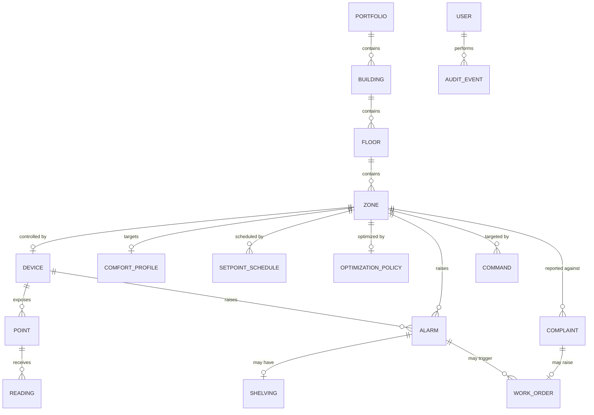

# Capstone Project Requirements: HVAC Fleet Optimization & Air-Quality Platform ("ZoneIQ")

## Honeywell Software Engineering Teams — Capstone Brief

---

## Document Revision

| Version | Date | Notes |
|---|---|---|
| 1.0 | 2026-09-03 | Initial full-stack capstone requirements. 
|

---

## Table of Contents

1. [Overview](#1-overview)
2. [Scenario](#2-scenario)
3. [Relationship to the Embedded-Track Capstone](#3-relationship-to-the-embedded-track-capstone)
4. [Learning Objectives](#4-learning-objectives)
5. [System Architecture](#5-system-architecture)
6. [Domain Model](#6-domain-model)
7. [Functional Requirements](#7-functional-requirements)
8. [Non-Functional Constraints](#8-non-functional-constraints)
9. [External Interface Contracts](#9-external-interface-contracts)
10. [Acceptance Criteria](#10-acceptance-criteria)
11. [Test Strategy Requirements](#11-test-strategy-requirements)
12. [Agentic / MCP Requirement](#12-agentic--mcp-requirement)
13. [SDLC Deliverables & Repository Structure](#13-sdlc-deliverables--repository-structure)
14. [Module Build Map](#14-module-build-map)
15. [Grading Rubric / Definition of Done](#15-grading-rubric--definition-of-done)
16. [Stretch Goals (Optional)](#16-stretch-goals-optional)
17. [Dependencies and References](#17-dependencies-and-references)

---

## 1. Overview

This capstone brings together everything practiced across the 12-module AI Champions
Programme — GitHub Copilot fluency, prompt and context engineering, spec-driven
development, the complete SDLC (greenfield **and** brownfield), test strategy with
Testcontainers and end-to-end validation, MCP-enabled agentic workflows, PR-quality
automation with LLM-as-Judge, studio-style workflows for non-technical roles, Agent
Prism observability, and token economics / ROI — and applies it to a single,
coherent, full-stack system: a **BMS supervisory and fleet-optimization platform**
for commercial-building HVAC, built as a REST API + relational database + web
frontend.

Where the embedded-track capstone builds the *edge controller* for one HVAC zone,
this capstone builds the *platform above the fleet of them*: it ingests telemetry
from many zone controllers across many buildings, stores recent history, evaluates
comfort and air-quality conditions, generates alarms, runs building-scale
optimization (setpoint scheduling, demand-controlled ventilation), pushes supervisory
commands back down, and exposes the whole picture to facilities teams through
dashboards and an override console.

Like the programme's running lab application, this is a **host-runnable** system —
PostgreSQL in a container, one backend (.NET / Python / Java) behind a shared REST
contract, and a React frontend. No real building, BMS network, or field hardware is
required: device telemetry arrives from a deterministic **simulated device feed**,
and the field-protocol adapter is exercised against a **simulated Modbus/BACnet
master**, the same way the lab application's integrations are tested.

This document is the capstone's top-level specification. It is deliberately more
complete than the `spec.md` for a single module — but every functional requirement in
Section 7 must still be decomposed into its own `spec.md → plan.md → tasks.md` chain
before implementation, exactly as practiced in Modules 04 and 05.

---

## 2. Scenario

> **ZONEIQ-CAPSTONE** — A facilities-management organization operates HVAC across a
> portfolio of commercial buildings. Each building has dozens of zones (rooms, floors,
> AHU-served areas); each zone has an intelligent edge controller (the device built in
> the embedded-track capstone, or an equivalent third-party controller) that drives
> local temperature, humidity, and ventilation and speaks a field protocol
> (Modbus / BACnet).
>
> Today the facilities team's only portfolio-wide view is per-building temperature.
> They cannot see air quality across zones, cannot tell which controllers are in a
> degraded or fault state without a site visit, cannot schedule setpoints centrally,
> and have no evidence of the comfort-versus-energy tradeoff they are making. Occupant
> comfort complaints arrive by email and are triaged from memory.
>
> You are building **ZoneIQ**: the platform that gives the facilities team a live
> portfolio view, ingests and retains recent telemetry from every zone controller,
> raises and manages alarms on comfort and air-quality excursions, runs supervisory
> optimization (centralized setpoint schedules, demand-controlled ventilation
> policies), dispatches commands back to controllers through a governed approval flow,
> turns comfort complaints into work orders, and produces the KPIs that show whether
> the buildings are comfortable, healthy, and efficient.

This is deliberately under-specified in the same way the lab features were: it names
the problem and the constraints, not the design. Framing the problem, modelling the
domain, designing the API and the optimization policy — that is the capstone work,
not a given.

---

## 3. Relationship to the Embedded-Track Capstone

The embedded-track capstone (`HVAC_Edge_Air_Quality_Optimizer_Requirements.md`) and
this one are **two halves of one system**. They can be run independently, but the
contract between them is real and is a graded deliverable here.

| Concern | Embedded capstone (device) | This capstone (platform) |
|---|---|---|
| Scope | One HVAC zone, one controller | A portfolio: many buildings × many zones × many controllers |
| Language / stack | C, `gcc`/`make`, no `malloc` | .NET / Python / Java + React + PostgreSQL |
| Architecture | HAL → Driver → Control → Telemetry | Controller/Router → Service → Repository; React `components → pages → services` |
| Optimization | Real-time single-zone comfort + IAQ control loop | Supervisory: setpoint schedules, fleet DCV policy, pre-cool/pre-heat |
| Field protocol | Implements a Modbus **server** with a register map | Implements a device **adapter** that *consumes* that register map |
| Faults | Local fault codes + fault registers | Fleet alarm & event management, MTTA, bad-actor analysis |
| Persistence | In-memory, caller-owned structs | PostgreSQL: registry, readings, schedules, commands, alarms, audit |

**The shared artifact:** the embedded capstone's **Modbus register map** (its Section
7) is the input contract for this capstone's device adapter (Section 9.2). A team that
did both tracks reuses their own register map; a team that did only this track is
given a reference register map to build the adapter against. Section 11 requires
contract tests that pin the adapter to that register map, versioned and tracked in
the traceability matrix — the same way Module 04 treats an interface-contract change.

---

## 4. Learning Objectives

By the end of the capstone, you will have demonstrated, on one system:

1. **Copilot Enterprise fluency** (Module 02) — chat, inline, explanation, refactor,
   test generation, debugging, agent mode, and the repository-customization layer
   (`.github/` instructions, prompts, chat modes, skills) applied to real feature
   work.
2. **Context engineering** (Module 03) — deliberately selected, layered, compressed,
   task-scoped context, with token usage recorded and inflation anti-patterns
   avoided.
3. **Spec-driven development at system scale** (Module 04) — decomposing one
   capstone-level problem into multiple module-level `spec.md → plan.md → tasks.md`
   chains, each independently implementable, testable, and traceable, and absorbing a
   requirement change through the spec first.
4. **The complete SDLC, greenfield and brownfield** (Module 05) — problem framing,
   architecture and API design, implementation, CI quality gates, and release
   readiness for greenfield features; plus repository archaeology, change-impact
   analysis, and minimal-change / regression-safe evolution for a brownfield change.
5. **A real test strategy** (Module 06) — specification-to-test traceability, unit +
   integration + contract + boundary/negative + E2E tests, **Testcontainers** for the
   database and the simulated device feed, and a deliberately injected defect proven
   caught.
6. **MCP-enabled agentic engineering** (Module 07) — at least one governed
   MCP-connected workflow and one packaged reusable skill used to build, test, or
   operate this platform, with tool permissions, context boundaries, approvals, and
   failure handling designed, not just its output.
7. **PR-quality automation** (Module 08) — spec-compliance, standards, security,
   test-evidence and regression-risk checks plus an LLM-as-Judge rubric and a
   human-escalation gate, applied to a safety-relevant change.
8. **Studio-style workflow authoring** (Module 09) — a non-technical role authoring an
   agent-assisted workflow in Atlassian Rovo Studio, grounded on Jira / Confluence,
   with an approval flow and permission boundaries, handed to engineering.
9. **Observability of agent behaviour** (Module 10) — Agent Prism traces, failure
   patterns, drift, and token/cost signals for this platform's assistant agents,
   related to product KPIs.
10. **Token economics and ROI** (Module 11) — a before/after model against the Module
    01 baseline, with a governance decision rule.
11. **Adoption judgment** (Module 12) — a 30/60/90-day roadmap for taking this way of
    working to other Honeywell engineering teams, plus an honest release-readiness
    self-audit.

---

## 5. System Architecture

Follow the programme-wide layered model used throughout the lab application, extended
with an ingestion layer:

```
┌─────────────────────────────────────────────────────────────────────┐
│  React Frontend                                                       │
│  components/ (presentational) → pages/ (state + fetch) → services/    │
│  (all HTTP in one place)                                              │
└───────────────────────────────┬─────────────────────────────────────┘
                                │  REST (JSON)
┌───────────────────────────────▼─────────────────────────────────────┐
│  Controller / Router Layer                                            │
│  translate HTTP <-> domain, map errors to status codes                │
└───────────────────────────────┬─────────────────────────────────────┘
┌───────────────────────────────▼─────────────────────────────────────┐
│  Service Layer                                                        │
│  validation, business rules: comfort/IAQ evaluation, alarm engine,    │
│  optimization policy, command dispatch, access control                │
└──────────────┬─────────────────────────────────┬────────────────────┘
               │                                 │
┌──────────────▼──────────────┐   ┌──────────────▼────────────────────┐
│  Repository Layer            │   │  Ingestion / Device-Adapter Layer │
│  ALL database access         │   │  telemetry ingest endpoint;       │
│                              │   │  Modbus/BACnet adapter mapping a  │
│                              │   │  device register map <-> platform │
│                              │   │  points; command encode/dispatch  │
└──────────────┬──────────────┘   └──────────────┬────────────────────┘
               │                                 │
┌──────────────▼─────────────────────────────────▼────────────────────┐
│  PostgreSQL   +   simulated device feed / simulated Modbus master    │
│  schema owned once in database/schema.sql                            │
└─────────────────────────────────────────────────────────────────────┘
```

### Layering rules (same spirit as the embedded capstone's Section 4)

1. **Repository is the only place SQL lives.** Controllers and the adapter layer
   never touch the database directly.
2. **The optimization policy and the alarm engine live in the Service layer and know
   nothing about HTTP or transport.** They operate on domain objects (a zone snapshot,
   a schedule, an alarm) — no Modbus framing, no request objects.
3. **The device adapter does not mutate domain state directly.** It translates
   inbound register values into a validated telemetry snapshot and hands it to the
   Service layer; it translates outbound *approved* commands into register writes.
   This is the same separation the embedded capstone's telemetry bridge maintains
   between `modbus_server` and `hvac_optimizer`.
4. **The telemetry ingestion contract and the device register-map mapping are
   documented contracts** (Section 9), not side effects of the implementation.
5. **Alarms are a cross-cutting concern** with their own code ranges for comfort,
   air-quality, device-health, and comms categories — mirroring the embedded
   capstone's `diag_formatter` range convention.

Decide, and defend in your architecture doc, whether device telemetry is **pushed**
by the device feed to an ingestion endpoint, **pulled** by a platform poller from a
simulated master, or both behind a common adapter interface. An undefended choice is
not acceptable.

---

## 6. Domain Model

Entities and their load-bearing fields — intent, not DDL. The schema is authored once
in `database/schema.sql`; schema changes are new numbered files under
`database/migrations/`.

| Entity | Key fields | Notes |
|---|---|---|
| **Portfolio → Building → Floor → Zone** | name, code, parent, address (Building), area/occupancy (Zone) | The spatial hierarchy. A Zone is the smallest controllable space. |
| **Device (zone controller)** | serial, model, protocol (modbus-rtu / modbus-tcp / bacnet), firmware version, parent Zone, commissioning state, last-seen | One Device per Zone in the base build; multi-device per zone is a stretch. |
| **Point** | device, key (e.g. `zone_temp`, `zone_rh`, `co2_ppm`, `heat_cool_stage`, `damper_pct`, `mode`, `fault_code`), engineering unit, data type + scaling, direction (telemetry / command), register mapping | The platform-side representation of a device register-map row. Built spec-first in Module 04. |
| **Reading** | Point, value, quality (good / uncertain / bad), source timestamp, received timestamp | Bulk-ingested from the simulated device feed. Short retention. A non-good reading is stored but does not drive alarms or optimization. |
| **ComfortProfile** | Zone (or Building default), temp band, RH band, CO₂ threshold, PM2.5 threshold, occupied hours | The target envelope. ASHRAE 55 / 62.1 / RESET Air informed. |
| **SetpointSchedule** | Zone, day-type, time blocks → {temp setpoint, ventilation minimum} | Supervisory schedule the platform pushes to devices. |
| **OptimizationPolicy** | scope (zone / building), strategy params: DCV enable + CO₂ target, pre-cool/pre-heat lead time, comfort-vs-energy weighting, deadband/hysteresis | The server-side "optimizer". Base policy must remain independently testable from any adaptive extension. |
| **Alarm** | Zone / Device, category (comfort / air-quality / device-health / comms), rule, priority (critical / high / medium / low), state, raised-at, acked-at + by, cleared-at, current value | State machine mirrors the embedded fault model, escalated to a fleet alarm. |
| **Shelving** | Alarm, reason (mandatory), shelved-at + by, expires-at, approved-by (if extended) | ISA-18.2 shelving; auto-expires. |
| **Command** | Device / Zone, type (setpoint / mode-override / return-to-auto / schedule-push), payload, requested-by, state (draft / approved / dispatched / confirmed / failed), approved-by, dispatched-at | Supervisory write path. Out-of-envelope payloads are rejected or clamped. |
| **WorkOrder** | title, description, priority, status, assigned team, linked Zone, linked Alarm / Complaint, raised-by, closed-at | Created from an alarm, a complaint, or directly. |
| **Complaint** | Zone, reporter, text, received-at, status, linked WorkOrder | Occupant comfort-complaint intake (FR feeds Module 09 workflow). |
| **AuditEvent** | actor, action, entity type + id, before / after snapshot, timestamp | Immutable. Every command, every alarm transition, every policy / schedule / profile change. |
| **User / Role** | name, role | Role drives access control. No external IdP in the base build. |

### Alarm state machine (indicative — Module 05 pins the exact set)

```
             excursion (past on-delay)
 (no alarm) ─────────────────────────▶  ACTIVE / UNACKED
     ▲                                    │        │
     │ clear (back in band − deadband,    │ ack    │ shelve (reason + expiry)
     │        held past off-delay)        ▼        ▼
CLEARED / ACKED ◀─ ack ─ CLEARED / UNACKED   SHELVED ──(expiry / manual)──▶ ACTIVE/…
```

### Entity relationships



---

## 7. Functional Requirements

Each requirement becomes its own `spec.md` before implementation. IDs are for
traceability; extend the numbering as sub-requirements emerge. The parenthetical
`↔ HVACOPT-nn` notes the embedded-capstone requirement this mirrors or consumes.

### HFP-01 — Portfolio & Asset Model
Keep the spatial hierarchy and device inventory current.
- CRUD Portfolio / Building / Floor / Zone / Device; a Device belongs to exactly one
  Zone; a Zone belongs to exactly one Floor.
- List and filter zones and devices by building, floor, protocol, commissioning
  state, and health.
- Deleting a Building or Floor with children is refused.

### HFP-02 — Point Catalogue *(↔ HVACOPT-04 register map)*
Model each device's telemetry and command points on the platform side.
- CRUD Point rows under a Device: key, engineering unit, data type + scaling,
  direction (telemetry / command), and the register mapping (type, address).
- Point keys are drawn from a controlled vocabulary; a point is unique per (device,
  key).
- The point set for a device must be consistent with a declared **device profile**
  (a named register-map version) — reject a catalogue that omits a required point or
  contradicts the profile's scaling.

### HFP-03 — Telemetry Ingestion *(↔ HVACOPT-01)*
Accept readings from the simulated device feed.
- Bulk `POST` of readings keyed by device serial + point key: `{ value, quality,
  timestamp }`.
- Reject a reading for an unknown device or point, and a reading older than a
  configured staleness window.
- Store `quality`; only `good` readings drive alarm evaluation and optimization.
- Retain only recent readings per point (bounded window); older readings are purged.
- Update the device `last-seen`; absence of readings past a threshold raises a
  device-comms alarm (HFP-06).

### HFP-04 — Comfort & Air-Quality Evaluation *(↔ HVACOPT-02)*
Turn zone snapshots into comfort / IAQ status.
- On each fresh good snapshot for a zone, compute status against the zone's
  ComfortProfile: temperature in/out of band, RH in/out of band, CO₂ and PM2.5
  above/below threshold.
- Air quality is a first-class output, not a footnote: expose a distinct
  `air_quality_status` even when temperature is comfortable.
- Apply deadband / hysteresis so status does not flap on values hovering at a
  threshold — state and justify the thresholds.

### HFP-05 — Supervisory Optimization Policy *(↔ HVACOPT-02)*
Compute the supervisory intent for a zone: the setpoint and ventilation minimum the
platform wants the device to honour.
- Given the zone snapshot, ComfortProfile, active SetpointSchedule, and
  OptimizationPolicy, produce a `zone target` = {temp setpoint, ventilation minimum,
  mode}.
- **Demand-controlled ventilation:** when air quality is out of band but temperature
  is in band, raise the ventilation minimum even at a conditioning-energy cost;
  document the tradeoff the policy makes.
- Pre-cool / pre-heat: shift setpoints ahead of a scheduled occupancy block by a
  configured lead time.
- The **base policy** must be pure and independently unit-testable; any adaptive /
  learning extension (stretch) is layered on top and separately toggled.

### HFP-06 — Fleet Alarm & Event Management *(↔ HVACOPT-05)*
Raise, route, and work alarms across the fleet.
- Alarm categories with distinct priority rules: comfort excursion, air-quality
  excursion, device-health (device-reported fault code), comms (no telemetry).
- Raise only after an excursion persists past an on-delay; clear only after return
  in-band past an off-delay; no duplicate active alarm per (zone, rule).
- List / filter active alarms by building, zone, category, priority, state; sort by
  raised-at or priority.
- Acknowledge single or batch; shelve with a **mandatory reason + expiry**;
  auto-unshelve on expiry; shelving beyond a max duration needs Supervisor approval.
- Alarm analytics: alarm rate per 10-minute window per building and fleet-wide, bad
  actors (top zones/points by alarm count), standing alarms, currently-shelved list,
  MTTA.

### HFP-07 — Command Dispatch *(↔ HVACOPT-04 supervisory writes)*
Push supervisory changes to devices through a governed flow.
- Command types: setpoint change, mode override, return-to-auto, schedule push.
- A command is created as a **draft**, validated against a documented safe envelope
  (reject or clamp out-of-envelope values), **approved** by an authorized role, then
  **dispatched** through the device adapter, then marked **confirmed** or **failed**
  based on the device's echoed state.
- The adapter never dispatches an unapproved command. Every state transition is
  audited.
- A failed dispatch raises a device-health alarm and leaves the zone on its
  last-known-good target.

### HFP-08 — Setpoint Schedules & Comfort Profiles
Let controls engineers manage the target envelope centrally.
- CRUD ComfortProfile per zone (or a building default a zone inherits) and
  SetpointSchedule per zone with day-type time blocks.
- Enforce sane bounds (setpoint within the safe envelope; ventilation minimum ≥ 0);
  reject contradictory or overlapping schedule blocks.
- A profile or schedule change is a safety-relevant action: audited, and it takes
  effect on the next optimization cycle, not retroactively.

### HFP-09 — Occupant Complaint Intake
Turn comfort complaints into tracked work.
- Capture a Complaint against a zone: reporter, free text, received-at.
- Show the zone's recent comfort / IAQ status and active alarms alongside the
  complaint to support triage.
- Convert a Complaint to a WorkOrder pre-filled with the zone and a status summary.
- (The triage-to-work-order flow is authored as a studio workflow in Module 09.)

### HFP-10 — Work Order Management
Close the loop to maintenance.
- Create a WorkOrder from an Alarm, a Complaint, or a Device directly; carry the
  linked zone, alarm, and complaint.
- Fields: title, description, priority, assigned team, status (open → in-progress →
  done / cancelled); record who closed it and when.
- List / filter by building, zone, team, status, priority.

### HFP-11 — Portfolio Dashboards & KPIs
Give facilities the portfolio-wide view they lack today.
- Portfolio overview: buildings with zone counts, current comfort compliance %, open
  alarms by priority, devices offline.
- Zone view: live temperature / RH / CO₂ / PM2.5 with short trend, current target vs
  actual, active alarms, recent commands.
- KPI reports: ASHRAE 55 comfort-compliance % over a period, CO₂ / PM2.5 exceedance
  hours, ventilation effectiveness, an energy-vs-comfort indicator, alarm MTTA,
  complaint resolution time.

### HFP-12 — Audit, Access Control & Traceability
Nothing safety-relevant happens without a record, and roles gate the risky actions.
- Append an AuditEvent for every Command transition, Alarm transition,
  shelve/unshelve, and ComfortProfile / SetpointSchedule / OptimizationPolicy change.
- Query the audit trail by zone, device, alarm, command, user, action type, time
  range. Audit events are never edited or deleted through the API.
- Roles: Facilities Manager, Controls Engineer, Field Technician, Energy Analyst,
  Tenant-Experience, Viewer. Viewer is strictly read-only.
- Safety-relevant actions (command approval, envelope override, profile/schedule
  edits, extended shelving) are allowed only for the owning role; extended shelving
  and envelope override additionally require Supervisor (Facilities Manager)
  approval. Every denied action is audited.

### HFP-13 — Assistant Agents *(↔ HVACOPT-07 agentic requirement)*
The AI features the programme observes and governs.
- **IAQ-triage assistant** — given an air-quality alarm, pulls the point's short
  trend, checks the zone's ComfortProfile and recent commands, checks outdoor
  conditions (weather MCP), summarises likely cause and urgency, and drafts a
  WorkOrder or a ventilation-override Command **for human approval**. It never
  acknowledges, shelves, approves, or dispatches anything itself.
- **Complaint-triage assistant** — given a Complaint, correlates it with the zone's
  comfort / IAQ history and open alarms, and drafts a triage summary + WorkOrder for
  review.
- "Good behaviour" for both: grounded only in real platform data, cites the point /
  alarm / document it used, stays within its tool permissions, and hands every state
  change to a human. These are the agents monitored in Module 10.

---

## 8. Non-Functional Constraints

Fixed for the whole programme — see `.github/copilot-instructions.md` and
`guides/foundation-phase-modules-01-04.md`.

- **Three layers, no skipping:** Controller/Router → Service → Repository (no business
  rules or SQL in controllers; no HTTP or SQL in services; no validation in
  repositories). React: `components/` → `pages/` → `services/`.
- **Schema owned once**, in `database/schema.sql`. No EF migrations, no
  `create_all()`, no `ddl-auto` other than `none`. Schema changes are new numbered
  files under `database/migrations/`.
- **Error contract:** `404` for a missing id; `422` for an invalid request body
  (missing required field, unknown enum, out-of-envelope value that cannot be
  clamped, contradictory schedule). No other invented codes on CRUD.
- **Timestamps** (`created_at` / `updated_at`, `received_at`) are database-set, never
  client-set. A reading's `source timestamp` is client-supplied by design.
- **Cross-backend parity:** the .NET, Python, and Java backends expose every feature
  identically and return byte-identical JSON for the same request (timestamp key
  casing aside).
- **Tests-first:** every new endpoint gets a test in the same layer before it is
  "done".
- **Determinism:** the simulated device feed and the simulated Modbus/BACnet master
  must be fully deterministic — no wall-clock or real-network dependence in test
  runs.
- **`.env` discipline:** no direct reading of `.env` / secrets; use the framework
  config system. `.env` is git-ignored; copying `.env.example` is a deliberate step.
- **Measured every module** against: implementation cycle time, quality / regression
  risk, PR review time, testing effort, token usage, AI cost.

---

## 9. External Interface Contracts

Design and document your own concrete contracts as part of the architecture
deliverable. The tables below are **starting skeletons**, not answer keys. A contract
change is versioned and reflected in the traceability matrix, exactly as Module 04
treats an interface-contract change.

### 9.1 Telemetry ingestion API (device feed → platform)

`POST /api/ingest/readings` — JSON, bulk.

```jsonc
{
  "deviceSerial": "ZC-0417",
  "readings": [
    { "pointKey": "zone_temp", "value": 22.4, "quality": "good", "timestamp": "2026-09-03T10:15:02Z" },
    { "pointKey": "co2_ppm",   "value": 1180,  "quality": "good", "timestamp": "2026-09-03T10:15:02Z" }
  ]
}
```

| Response | Meaning |
|---|---|
| `202 Accepted` + per-reading result list | batch received; some readings may be individually rejected (unknown point, stale) with a reason |
| `404` | unknown `deviceSerial` |
| `422` | malformed body, empty `readings`, unknown `quality` value |

### 9.2 Device register-map mapping (platform adapter ↔ device)

The adapter maps a device profile's register map to platform Point keys. This is the
**shared contract with the embedded capstone** — its Section 7 register map is the
canonical source for the `hvac-zone-controller-v1` profile.

| Point key | Register type | Data / scaling | Direction | Envelope (command only) |
|---|---|---|---|---|
| `zone_temp` | Input Register | int16 ×0.1 °C | telemetry | — |
| `zone_rh` | Input Register | uint16 ×0.1 %RH | telemetry | — |
| `co2_ppm` | Input Register | uint16 raw ppm | telemetry | — |
| `heat_cool_stage` | Holding Register | enum | telemetry + command | one of the documented stages |
| `damper_pct` | Holding Register | uint16 0–100 | telemetry + command | 0–100 |
| `temp_setpoint` | Holding Register | int16 ×0.1 °C | command | clamp to safe envelope (e.g. 16.0–28.0 °C) |
| `mode` | Holding Register | enum | telemetry + command | write triggers a device state transition, not a silent flag |
| `fault_code` | Input Register | uint16 | telemetry | — |
| `fault_flags` | Discrete Input | bitfield | telemetry | — |

### 9.3 Command dispatch (platform → device)

`POST /api/zones/{id}/commands` creates a **draft**; `POST
/api/commands/{id}/approve` and `/dispatch` move it forward. An out-of-envelope
payload is rejected (`422`) at draft creation, or clamped with the clamp recorded on
the command and in the audit event.

---

## 10. Acceptance Criteria

- [ ] A documented top-level architecture (layer diagram + module responsibility
      table + the three contracts in Section 9) exists **before** implementation
      began.
- [ ] Each functional requirement in Section 7 has its own `spec.md`, reviewed
      `plan.md`, and ordered `tasks.md`, written before its implementation existed.
- [ ] The full system builds and its test suites run green across the chosen
      backend(s) and the frontend, in CI, with warnings/lint treated as blocking.
- [ ] The optimization policy demonstrably raises ventilation in response to
      air-quality input **alone** (temperature in-band, air quality out-of-band) —
      proven by a test, not claimed.
- [ ] The device adapter round-trips every point in the `hvac-zone-controller-v1`
      profile against a simulated master, and a **contract test** fails if the
      mapping drifts from the documented register map.
- [ ] A command with an out-of-envelope setpoint is rejected or clamped, proven by a
      boundary test; an unapproved command is never dispatched, proven by a test.
- [ ] A simulated device fault (fault code, stuck reading, comms timeout) is detected,
      raises the correct alarm category and priority, is visible on the dashboard, and
      leaves the zone on its last-known-good target.
- [ ] The brownfield change (Module 05) is delivered with an archaeology note,
      change-impact analysis, and a regression report showing the pre-existing test
      suite still green and unmodified.
- [ ] A specification-to-test traceability matrix exists; every functional
      requirement maps to at least one test.
- [ ] At least one MCP tool / reusable skill / agent-assisted workflow was used in
      building or operating the platform, documented with its permission and context
      boundary (Section 12).
- [ ] An LLM-as-Judge PR gate ran on the safety-relevant change, with captured
      evidence and a human-escalation decision recorded (Module 08).
- [ ] Agent Prism monitoring exists for at least one assistant agent, with traces and
      a token/cost view related to a product KPI (Module 10).
- [ ] A completed release-readiness self-audit and a 30/60/90-day adoption roadmap
      exist (Module 12).

---

## 11. Test Strategy Requirements

Following Module 06, the test strategy document must cover:

1. **Traceability matrix** — every requirement ID from Section 7 mapped to the
   test(s) that prove it.
2. **Unit tests** — comfort/IAQ evaluation, the base optimization policy, alarm
   raise/clear logic, register-map encode/decode, envelope clamping — each in
   isolation, with the database and adapter mocked.
3. **Integration tests on Testcontainers** — real PostgreSQL: ingestion →
   evaluation → alarm raised → acknowledged → cleared; schedule push → command draft
   → approve → dispatch → confirm.
4. **Contract tests** — the device adapter pinned to the `hvac-zone-controller-v1`
   register map; the telemetry ingestion API pinned to its documented request/response
   shape; cross-backend response parity.
5. **Boundary & negative tests** — out-of-range readings, stale timestamps, unknown
   device/point, out-of-envelope and unapproved commands, contradictory schedules,
   malformed ingestion payloads, comms-timeout — each with a dedicated test.
6. **End-to-end** — a browser-level (or API-level) walkthrough of the primary
   journeys: telemetry in → alarm on the dashboard → acknowledge → work order;
   complaint in → triage → work order.
7. **Regression protection** — the brownfield change must leave every pre-existing
   test green and unmodified (Module 05 discipline); an injected defect in the
   deadband / DCV logic must be caught by the suite and the catch demonstrated.

---

## 12. Agentic / MCP Requirement

Per Module 07, incorporate at least one governed MCP-connected workflow **and** one
packaged reusable skill, and document what you used, what it did, and where you drew
the permission / context boundary:

- **MCP servers / tools** connected to resources relevant to this platform — e.g. a
  weather/outdoor-air source (read), a CMMS / work-order system (read-write behind
  approval), a building-documents / SOP store (read), a register-map linter, or the
  test runner exposed as a tool.
- **A reusable skill** in the style of the programme's skill templates — e.g. a
  "register-map ↔ point-catalogue consistency checker", a "traceability-matrix
  auditor", or a "spec-compliance PR reviewer".
- The **IAQ-triage** and **complaint-triage** assistants (HFP-13) must be built as
  governed agents: explicit tool allow-list, read-only access to platform data, a
  hard stop before any state change, and defined failure handling.

"I used Copilot" is not sufficient — name the tool access, permissions, approval
points, and failure handling you configured, and why.

---

## 13. SDLC Deliverables & Repository Structure

Walk the complete SDLC once per functional-requirement group and once at the system
level for integration:

| Stage | System-level artifact |
|---|---|
| Problem framing | Section 2, refined with your own written framing |
| Architecture & interfaces | Layer diagram, module responsibility table, the three contracts (Section 9), domain model |
| Specification | Per-requirement `spec.md` / `plan.md` / `tasks.md` |
| Implementation | Backend (`src/…` per layer) + React app + `database/schema.sql` (+ numbered migrations) |
| Test & analysis | `tests/` (unit, integration, contract, boundary, E2E), traceability matrix, coverage report |
| Build & CI/CD | CI pipeline: build, lint, all test suites, schema load, secret scan |
| Release readiness | Release-readiness self-audit signed against Section 10 |

Suggested repository layout (mirrors `labs/module-01/`):

```
capstone/zoneiq/
├── database/
│   ├── schema.sql          # authoritative
│   ├── seed.sql
│   └── migrations/
├── backend-<dotnet|python|java>/
│   └── (controllers/routers, services, repositories, ingestion adapter, tests)
├── frontend/
│   └── src/ (components/, pages/, services/, constants.js)
├── device-sim/             # deterministic device feed + simulated Modbus/BACnet master
├── specs/
│   ├── HFP-01-portfolio-model/{spec,plan,tasks}.md
│   ├── HFP-02-point-catalogue/{spec,plan,tasks}.md
│   └── ...                 # one folder per requirement
├── docs/
│   ├── ARCHITECTURE.md
│   ├── CONTRACTS.md        # ingestion API, register-map mapping, command dispatch
│   ├── TRACEABILITY.md
│   └── RELEASE_READINESS.md
└── .github/                # instructions, prompts, chat modes, skills, CI
```

---

## 14. Module Build Map

The 12-module incremental sequence — which thin vertical slice each module adds to the
same codebase — is maintained separately in
[`HVAC_Fleet_Platform_Build_Map.md`](./HVAC_Fleet_Platform_Build_Map.md). In brief:

- **01** portfolio + zone + device registry (full-stack skeleton)
- **02** Copilot customization layer; small feature on the zone/device list
- **03** context engineering; `GET /api/buildings/{id}/stats` aggregation
- **04** Point catalogue, spec-first, with a controlled-vocabulary change-control step
- **05a** telemetry ingestion + comfort/IAQ evaluation + alarm generation → release
- **05b** brownfield: add demand-controlled ventilation to an existing
  temperature-only optimization policy without breaking comfort control
- **06** Testcontainers, register-map contract tests, negative scenarios, E2E,
  injected deadband/DCV defect
- **07** MCP: weather + CMMS + SOP; IAQ-triage workflow → drafts command/work order
  for approval; a reusable consistency-checker skill
- **08** flawed PR on the DCV / tradeoff logic + LLM-as-Judge + safety-file escalation
- **09** Rovo Studio: Tenant-Experience role authors the complaint → triage → work
  order workflow
- **10** Agent Prism on the IAQ-triage assistant, tied to IAQ / comfort KPIs
- **11** ROI: energy + comfort + avoided truck-rolls vs the Module 01 baseline
- **12** capstone integration + 30/60/90-day adoption roadmap

---

## 15. Grading Rubric / Definition of Done

| Dimension | Evidence expected |
|---|---|
| Spec-driven discipline | Every requirement has a spec/plan/tasks chain written *before* its implementation existed; one requirement change absorbed through the spec |
| Architecture integrity | No layering-rule violation in the final codebase; contracts documented before implementation |
| Functional completeness | All of Section 7 implemented and demonstrable through the UI or API |
| Contract correctness | Device adapter matches the register map exactly; contract tests fail on drift; boundary writes proven rejected/clamped |
| Test rigor | Traceability matrix complete; unit + integration (Testcontainers) + contract + boundary/negative + E2E all green |
| Brownfield discipline | Archaeology note, change-impact analysis, regression report; pre-existing tests green and unmodified |
| PR quality | LLM-as-Judge gate run on the safety-relevant change with evidence and an escalation decision |
| Agentic practice | MCP/skill/agent usage documented with explicit permission, context, and failure-handling reasoning |
| Observability | Agent Prism traces + token/cost view for an assistant agent, related to a KPI |
| ROI & adoption judgment | Honest before/after model and 30/60/90-day roadmap; release-readiness self-audit including known gaps |

A capstone that is functionally complete but skips the spec/plan/tasks trail, the
traceability matrix, the brownfield evidence, or the release-readiness self-audit is
**not** done — process evidence is graded as seriously as working code.

---

## 16. Stretch Goals (Optional)

- **Multi-device zones** — more than one controller per zone, aggregated to a single
  zone status.
- **Second ingestion transport** — an MQTT bridge alongside the REST ingestion
  endpoint, sharing the same adapter abstraction, proving transport-agnostic design.
- **Adaptive optimization** — an occupancy-pattern-driven adjustment to the
  comfort-vs-energy weighting, cleanly separated from the base policy so the base
  remains independently testable.
- **Real-time push to the UI** — server-sent events / WebSocket for the live zone
  view, with the polling fallback kept.
- **Security hardening** — auth on the ingestion endpoint, command rate limiting,
  source-allowlisting for the device feed, with a documented threat model.
- **Energy model** — a first-order kWh estimate per zone from stage/damper commands,
  feeding a real energy-vs-comfort KPI rather than an indicator.

---

## 17. Dependencies and References

- `capstone/HVAC_Edge_Air_Quality_Optimizer_Requirements.md` — the embedded-track
  capstone; source of the `hvac-zone-controller-v1` register map this platform's
  adapter consumes.
- `capstone/PlantWatch_Asset_Alarm_Platform_Requirements.md` /
  `capstone/PlantWatch_Asset_Alarm_Platform_Build_Map.md` — the alternative
  "PlantWatch" process-automation use case and its build map; structurally parallel to
  this document.
- `labs/module-01/` — the lab application whose architecture, layering, schema
  discipline, and `.github/` customization conventions this capstone extends.
- `guides/foundation-phase-modules-01-04.md` — spec/plan/tasks templates, the
  maturity ladder, traceability and change-control conventions.
- `guides/build-validate-phase-modules-05-08.md` — complete SDLC, brownfield
  archaeology, test strategy, MCP, PR quality.
- `courseOutline/NIIT_Honeywell_AI_Champions_GitHub_AgentPrism (Software_Engineering).pdf`
  — the authoritative 12-module course design.
- External: ASHRAE 55 (thermal comfort), ASHRAE 62.1 (ventilation), RESET Air / WELL
  (indoor air quality), ANSI/ISA-18.2 (alarm management), Project Haystack / Brick
  Schema (equipment tagging), Modbus and BACnet/IP specifications.
