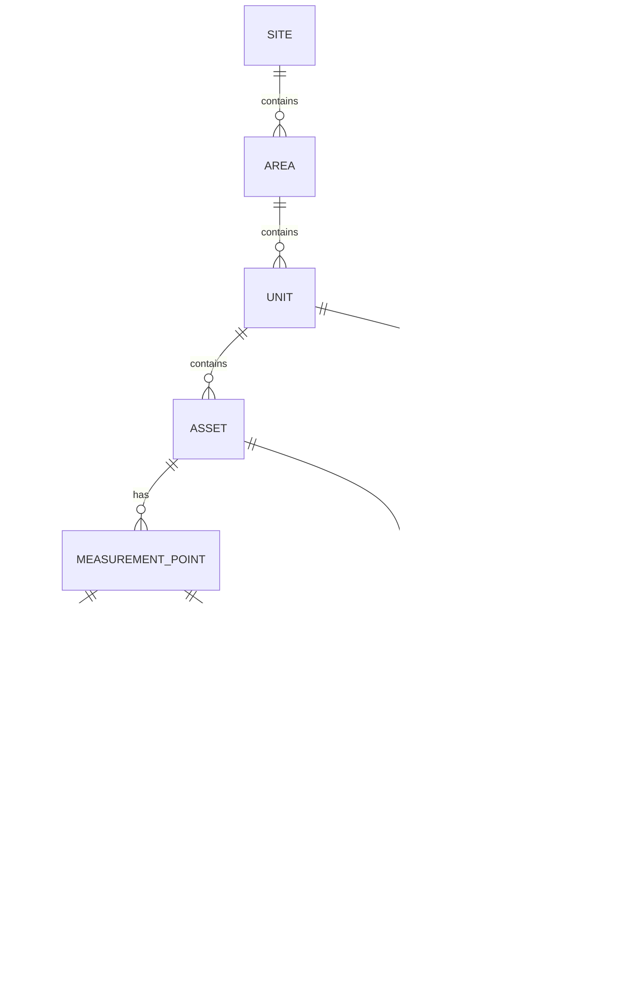

# Capstone Project Requirements: Plant Asset & Alarm Management Platform ("PlantWatch")

## Honeywell Software Engineering Teams — Capstone Brief

---

## Document Revision

| Version | Date | Notes |
|---|---|---|
| 1.0 | 2026-09-03 | Initial full-stack capstone requirements. 
|

---

## Table of Contents

1. [Overview](#1-overview)
2. [Scenario](#2-scenario)
3. [Relationship to Real Plant Systems](#3-relationship-to-real-plant-systems)
4. [Learning Objectives](#4-learning-objectives)
5. [System Architecture](#5-system-architecture)
6. [Domain Model](#6-domain-model)
7. [Functional Requirements](#7-functional-requirements)
8. [Non-Functional Constraints](#8-non-functional-constraints)
9. [External Interface Contracts](#9-external-interface-contracts)
10. [Acceptance Criteria](#10-acceptance-criteria)
11. [Test Strategy Requirements](#11-test-strategy-requirements)
12. [Agentic / MCP Requirement](#12-agentic--mcp-requirement)
13. [SDLC Deliverables & Repository Structure](#13-sdlc-deliverables--repository-structure)
14. [Module Build Map](#14-module-build-map)
15. [Grading Rubric / Definition of Done](#15-grading-rubric--definition-of-done)
16. [Stretch Goals (Optional)](#16-stretch-goals-optional)
17. [Dependencies and References](#17-dependencies-and-references)

---

## 1. Overview

This capstone brings together everything practiced across the 12-module AI Champions
Programme — GitHub Copilot fluency, prompt and context engineering, spec-driven
development, the complete SDLC (greenfield **and** brownfield), test strategy with
Testcontainers and end-to-end validation, MCP-enabled agentic workflows, PR-quality
automation with LLM-as-Judge, studio-style workflows for non-technical roles, Agent
Prism observability, and token economics / ROI — and applies it to a single,
coherent, full-stack system: a **plant asset and alarm management platform** for a
process plant, built as a REST API + relational database + web frontend.

**PlantWatch** is a companion application that sits *alongside* an Experion-style
Distributed Control System (DCS). It does not control the process. It keeps the plant
asset register and its measurement-tag list current, ingests process readings from a
historian feed, evaluates them against alarm limits, runs the shift alarm-handling
workflow (acknowledge, shelve per ISA-18.2), turns alarms and inspection findings
into maintenance work orders, runs scheduled operator rounds, and produces the shift
handover — all of which today lives in spreadsheets, email, and the operators' heads.

Like the programme's running lab application, this is a **host-runnable** system —
PostgreSQL in a container, one backend (.NET / Python / Java) behind a shared REST
contract, and a React frontend. No real plant, DCS, or historian is required: process
readings arrive from a deterministic **simulated historian feed**, and the external
systems PlantWatch integrates with (CMMS, SOP store) are exercised through **mock MCP
servers**, the same way the lab application's integrations are tested.

This document is the capstone's top-level specification. It is deliberately more
complete than the `spec.md` for a single module — but every functional requirement in
Section 7 must still be decomposed into its own `spec.md → plan.md → tasks.md` chain
before implementation, exactly as practiced in Modules 04 and 05.

---

## 2. Scenario

> **PLANTWATCH-CAPSTONE** — A large process plant (refinery / petrochemicals / LNG
> train) runs its control on an Experion-style DCS. Around that DCS sits a layer of
> day-to-day operational work with no dedicated system of record: keeping the asset
> register current as equipment is added, swapped, or decommissioned; deciding which
> process measurements should alarm and at what priority (alarm rationalisation);
> working the alarm list during a shift; turning alarms and inspection findings into
> maintenance work orders; running operator rounds; and handing over cleanly to the
> next crew.
>
> Today the alarm list is the DCS's own — hard to analyse for nuisance alarms, floods,
> or bad actors. Shelving decisions are undocumented. Work orders are raised by email.
> There is no evidence trail for who changed an alarm limit or why. The shift handover
> is a whiteboard.
>
> You are building **PlantWatch**: the platform that gives the operations and
> reliability teams a managed asset register and tag catalogue, an ingestion path for
> process readings, an alarm engine with rationalised limits and ISA-18.2 shelving, an
> analytics view that exposes nuisance alarms and floods, a governed work-order flow,
> operator rounds, an auto-generated shift handover, and a complete audit trail of
> every safety-relevant action.

This is deliberately under-specified in the same way the lab features were: it names
the problem and the constraints, not the design. Framing the problem, modelling the
domain, designing the API and the alarm-evaluation logic — that is the capstone work,
not a given.

---

## 3. Relationship to Real Plant Systems

PlantWatch is a **companion system**, not a replacement for any part of the control
stack. Being precise about what it is and is not is part of the architecture
deliverable.

| Concern | Real plant system | PlantWatch |
|---|---|---|
| Process control | DCS (Experion) — loops, setpoints, interlocks | Never writes to the process; read-only consumer of readings |
| Safety trips | Safety Instrumented System (SIL-rated) | Out of scope entirely; PlantWatch alarms are *operational* only |
| Long-term history | Process historian (Uniformance-style) | Stores only recent readings — enough to evaluate alarms and show short trends |
| Maintenance execution | CMMS (spare parts, planning, scheduling) | Creates and tracks work orders; hands them to a CMMS via MCP (Module 07) |
| Alarm system-of-record | DCS alarm subsystem | Rationalised limits, shelving, analytics, and the audit trail live here |

**Standards it is informed by:** ANSI/ISA-18.2 and EEMUA 191 for alarm management and
KPIs; ISA-95 for the Site → Area → Unit → Equipment hierarchy. These inform the model;
the capstone does not claim compliance.

---

## 4. Learning Objectives

By the end of the capstone, you will have demonstrated, on one system:

1. **Copilot Enterprise fluency** (Module 02) — chat, inline, explanation, refactor,
   test generation, debugging, agent mode, and the repository-customization layer
   (`.github/` instructions, prompts, chat modes, skills) applied to real feature
   work.
2. **Context engineering** (Module 03) — deliberately selected, layered, compressed,
   task-scoped context, with token usage recorded and inflation anti-patterns
   avoided.
3. **Spec-driven development at system scale** (Module 04) — decomposing one
   capstone-level problem into multiple module-level `spec.md → plan.md → tasks.md`
   chains, each independently implementable, testable, and traceable, and absorbing a
   requirement change through the spec first.
4. **The complete SDLC, greenfield and brownfield** (Module 05) — problem framing,
   architecture and API design, implementation, CI quality gates, and release
   readiness for greenfield features; plus repository archaeology, change-impact
   analysis, and minimal-change / regression-safe evolution for a brownfield change.
5. **A real test strategy** (Module 06) — specification-to-test traceability, unit +
   integration + contract + boundary/negative + E2E tests, **Testcontainers** for the
   database and the simulated historian feed, and a deliberately injected defect
   proven caught.
6. **MCP-enabled agentic engineering** (Module 07) — at least one governed
   MCP-connected workflow and one packaged reusable skill used to build, test, or
   operate this platform, with tool permissions, context boundaries, approvals, and
   failure handling designed, not just its output.
7. **PR-quality automation** (Module 08) — spec-compliance, standards, security,
   test-evidence and regression-risk checks plus an LLM-as-Judge rubric and a
   human-escalation gate, applied to a safety-relevant change.
8. **Studio-style workflow authoring** (Module 09) — a non-technical role authoring an
   agent-assisted workflow in Atlassian Rovo Studio, grounded on Jira / Confluence,
   with an approval flow and permission boundaries, handed to engineering.
9. **Observability of agent behaviour** (Module 10) — Agent Prism traces, failure
   patterns, drift, and token/cost signals for this platform's assistant agents,
   related to product KPIs.
10. **Token economics and ROI** (Module 11) — a before/after model against the Module
    01 baseline, with a governance decision rule.
11. **Adoption judgment** (Module 12) — a 30/60/90-day roadmap for taking this way of
    working to other Honeywell engineering teams, plus an honest release-readiness
    self-audit.

---

## 5. System Architecture

Follow the programme-wide layered model used throughout the lab application, extended
with an ingestion layer:

```
┌─────────────────────────────────────────────────────────────────────┐
│  React Frontend                                                       │
│  components/ (presentational) → pages/ (state + fetch) → services/    │
│  (all HTTP in one place)                                              │
└───────────────────────────────┬─────────────────────────────────────┘
                                │  REST (JSON)
┌───────────────────────────────▼─────────────────────────────────────┐
│  Controller / Router Layer                                            │
│  translate HTTP <-> domain, map errors to status codes                │
└───────────────────────────────┬─────────────────────────────────────┘
┌───────────────────────────────▼─────────────────────────────────────┐
│  Service Layer                                                        │
│  validation, business rules: alarm-limit validation, alarm engine,    │
│  shelving, analytics, work-order flow, rounds, handover, access ctrl  │
└──────────────┬─────────────────────────────────┬────────────────────┘
               │                                 │
┌──────────────▼──────────────┐   ┌──────────────▼────────────────────┐
│  Repository Layer            │   │  Ingestion / Integration Layer     │
│  ALL database access         │   │  historian-feed ingest endpoint;   │
│                              │   │  outbound MCP surface (CMMS, SOP,  │
│                              │   │  historian trend) behind approval │
└──────────────┬──────────────┘   └──────────────┬────────────────────┘
               │                                 │
┌──────────────▼─────────────────────────────────▼────────────────────┐
│  PostgreSQL   +   simulated historian feed   +   mock MCP servers    │
│  schema owned once in database/schema.sql                            │
└─────────────────────────────────────────────────────────────────────┘
```

### Layering rules

1. **Repository is the only place SQL lives.** Controllers and the integration layer
   never touch the database directly.
2. **The alarm engine and analytics live in the Service layer and know nothing about
   HTTP or transport.** They operate on domain objects (a reading, an alarm limit, an
   alarm) — no request objects, no MCP client calls.
3. **The integration layer does not mutate domain state directly.** Inbound: it
   validates a historian batch into readings and hands them to the Service layer.
   Outbound: it exposes CMMS / SOP / historian-trend calls as small scoped tools that
   the Service layer (or an assistant agent) invokes behind an approval step.
4. **The telemetry ingestion contract and the external-system contracts are
   documented contracts** (Section 9), not side effects of the implementation.
5. **Alarms are a cross-cutting concern** with their own code ranges per category
   (process / instrument / comms), mirroring a `diag_formatter`-style range
   convention.

Decide, and defend in your architecture doc, whether readings are **pushed** by the
historian feed to an ingestion endpoint or **pulled** by a platform poller — or both
behind a common ingestion interface. An undefended choice is not acceptable.

---

## 6. Domain Model

Entities and their load-bearing fields — intent, not DDL. The schema is authored once
in `database/schema.sql`; schema changes are new numbered files under
`database/migrations/`.

| Entity | Key fields | Notes |
|---|---|---|
| **Site → Area → Unit** | name, code, parent | The ISA-95 plant hierarchy. A Unit is the smallest area that owns equipment (e.g. "Crude Unit / Atmospheric Distillation"). |
| **Asset** | tag (e.g. `P-101A`), description, asset type (pump / compressor / exchanger / vessel / transmitter / valve), criticality (A / B / C), operating status (running / standby / down / maintenance), parent Unit | The register kept current in Module 01. |
| **MeasurementPoint (Tag)** | tag name (e.g. `PI-101.PV`), engineering unit (barg, °C, %, m³/h), measurement type (pressure / temperature / flow / level / vibration), source system, parent Asset | Built spec-first in Module 04. Unique per Asset. |
| **Reading** | MeasurementPoint, value, quality (good / uncertain / bad), source timestamp, received timestamp | Bulk-ingested from the simulated historian feed. Short retention. A non-good reading is stored but does not raise or clear alarms. |
| **AlarmLimit** | MeasurementPoint, limit type (HH / H / L / LL), threshold value, deadband, priority (critical / high / medium / low), on-delay / off-delay seconds, enabled | Alarm-rationalisation output. One row per limit type per point. |
| **Alarm** | MeasurementPoint, AlarmLimit, priority, state, raised-at, acknowledged-at + by, cleared-at, current value | State machine (below). Created by the evaluation engine, worked by operators. |
| **Shelving** | Alarm, reason (mandatory), shelved-at + by, expires-at, approved-by (if extended) | ISA-18.2 shelving. Auto-expires (Module 05 brownfield change). |
| **WorkOrder** | title, description, priority, status (open / in-progress / done / cancelled), assigned team, linked Asset, linked Alarm (optional), raised-by, closed-at | Created from an alarm, an asset, or a failed round check. |
| **OperatorRound** | name, schedule (e.g. every shift), Unit, status | Scheduled field walkdown. |
| **CheckItem** | OperatorRound, Asset, prompt (e.g. "seal leak?"), expected result, actual result, pass/fail, note | A failed CheckItem can auto-raise a WorkOrder. |
| **ShiftLog** | shift date + letter, supervisor, generated summary, signed-at | The handover record (Module 05 / 09). |
| **AuditEvent** | actor, action, entity type + id, before / after snapshot, timestamp | Immutable. Every alarm-limit change, every alarm transition, every shelve/unshelve/force-clear, every ShiftLog signature. |
| **User / Role** | name, role | Role drives access control. No external IdP in the base build. |

### Alarm state machine (indicative — Module 05 pins the exact set)

```
                 breach (past on-delay)
   (no alarm) ─────────────────────────▶  ACTIVE / UNACKED
        ▲                                    │        │
        │ clear (past off-delay + deadband)  │ ack    │ shelve (reason + expiry)
        │                                    ▼        ▼
   CLEARED / ACKED ◀── ack ── CLEARED / UNACKED   SHELVED ──(expiry / manual)──▶ back to ACTIVE/…
```

### Entity relationships



---

## 7. Functional Requirements

Each requirement becomes its own `spec.md` before implementation. IDs are for
traceability; extend the numbering as sub-requirements emerge. The parenthetical
`↔ HFP-nn` notes the structurally parallel requirement in the HVAC fleet-platform
use case (`HVAC_Fleet_Platform_Requirements.md`), for teams comparing the two.

### PW-01 — Plant & Asset Model *(↔ HFP-01)*
Keep the plant hierarchy and asset register current.
- CRUD Site / Area / Unit / Asset; an Asset always belongs to a Unit; a Unit belongs
  to an Area; an Area belongs to a Site.
- An Asset carries tag, type, criticality (A/B/C), and operating status.
- List and filter assets by Unit, type, criticality, and status.
- Deleting a Unit (or Area) with children is refused; children must be moved or
  removed first.

### PW-02 — Measurement Point (Tag) Catalogue *(↔ HFP-02)*
Model each asset's process measurements.
- CRUD MeasurementPoint rows under an Asset: tag name, engineering unit, measurement
  type, source system.
- Tag names are unique per Asset; the engineering unit is drawn from an approved
  list (introduced as a change-control exercise in Module 04).
- List points by Asset, Unit, and measurement type.

### PW-03 — Telemetry Ingestion *(↔ HFP-03)*
Accept process readings from the simulated historian feed.
- Bulk `POST` of readings keyed by tag: `{ value, quality, timestamp }`.
- Reject a reading for an unknown tag, and a reading whose timestamp is older than a
  configured staleness window.
- Store `quality` (good / uncertain / bad); only `good` readings drive alarm
  evaluation.
- Retain only recent readings per tag (bounded window); older readings are purged.

### PW-04 — Alarm Limit Configuration (Rationalisation) *(↔ HFP-08)*
Let Reliability Engineers decide what alarms exist.
- CRUD AlarmLimit rows per MeasurementPoint: type (HH/H/L/LL), threshold, deadband,
  priority, on/off delay, enabled flag.
- Enforce ordering (LL ≤ L ≤ H ≤ HH) and reject an inverted or overlapping set.
- Changing a limit or priority is a safety-relevant action: audited, and effective
  only for alarms raised after the change.

### PW-05 — Alarm Evaluation Engine *(↔ HFP-04 / HFP-05)*
Turn readings into alarm events.
- On each good reading, compare against the point's enabled limits.
- Raise an Alarm only after the breach persists past the on-delay; clear it only
  after the value returns inside the threshold *minus deadband* and stays there past
  the off-delay.
- Do not raise a duplicate Alarm for a limit that is already active.
- Alarm priority is taken from the breached limit; if several limits are breached,
  the most severe wins.
- The evaluation function must be pure and independently unit-testable — no HTTP, no
  SQL, no clock reads beyond an injected "now".

### PW-06 — Alarm Handling Workflow *(↔ HFP-06)*
The operator's live working surface.
- List active alarms with filter by priority, Area/Unit, and state; sort by
  raised-at or priority.
- Acknowledge a single alarm or a selected batch; record who and when.
- Shelve an alarm with a **mandatory reason** and an **expiry time**; a shelved alarm
  leaves the active list.
- Auto-unshelve on expiry — the alarm returns to the active list in its current
  state. Shelving beyond a configured maximum duration requires Supervisor approval.
- A Supervisor can force-clear a stuck alarm (audited, reason required).

### PW-07 — Alarm Analytics & KPIs *(↔ HFP-11)*
Show whether the alarm system is healthy (ISA-18.2 / EEMUA 191 style).
- Alarm rate per 10-minute window, per Unit and plant-wide.
- "Bad actors" — the measurement points generating the most alarms over a period.
- Standing alarms — active longer than a threshold.
- Shelved-alarm count and the list of what is currently shelved and until when.
- Mean time to acknowledge (MTTA); count of alarm floods (rate over a threshold).

### PW-08 — Work Order Management *(↔ HFP-10)*
Close the loop from alarm / finding to maintenance.
- Create a WorkOrder from an Alarm, from an Asset directly, or from a failed round
  CheckItem; carry the linked Asset and Alarm.
- Fields: title, description, priority, assigned team, status.
- Track status open → in-progress → done (or cancelled); record who closed it and
  when.
- List / filter by Asset, Unit, team, status, priority.

### PW-09 — Operator Rounds *(↔ HFP-09)*
Scheduled field walkdowns with a checklist.
- Define a Round for a Unit with an ordered list of CheckItems (each tied to an Asset
  with a prompt and an expected result).
- Execute a Round: record actual result and pass/fail per item, plus an optional
  note.
- A failed CheckItem offers to raise a WorkOrder pre-filled with the asset and the
  finding.
- Show round completion history per Unit.

### PW-10 — Shift Handover *(↔ HFP-11 reporting)*
Give the next crew a reliable picture.
- Generate a ShiftLog summary for a shift: new alarms in the period, alarms still
  active, currently shelved alarms (with expiry), work orders opened / closed,
  standing alarms, and failed round items.
- The Supervisor reviews, optionally adds free-text notes, and signs it.
- A signed ShiftLog is immutable and appears in the audit trail.

### PW-11 — Audit, Access Control & Traceability *(↔ HFP-12)*
Nothing safety-relevant happens without a record, and roles gate the risky actions.
- Append an AuditEvent for every AlarmLimit create/update/delete, every alarm state
  transition, every shelve/unshelve/force-clear, and every ShiftLog signature. Each
  event stores actor, action, entity, before/after snapshot, timestamp.
- Query the audit trail by asset, alarm, user, action type, and time range. Audit
  events are never edited or deleted through the API.
- Roles: Console Operator, Shift Supervisor, Maintenance Engineer, Reliability
  Engineer, Viewer. Viewer is strictly read-only.
- Safety-relevant actions (limit / priority edits, shelving, force-clear, ShiftLog
  signature) are allowed only for the owning role; extended shelving and force-clear
  additionally require Shift Supervisor approval. Every denied action is audited.

### PW-12 — External Integrations / MCP Surface *(↔ HFP-07 dispatch / HFP-13 tools)*
The governed connection points for later modules.
- **Historian (read):** fetch the recent value history / short trend for a tag.
- **CMMS (read/write):** create a work order in the external maintenance system and
  read its status back; keep the local WorkOrder in sync.
- **SOP / runbook store (read):** look up the standard operating procedure for an
  asset type or alarm.
- Each integration is exposed as a small, well-scoped tool with explicit inputs, a
  permission boundary, and an approval step before any write.

### PW-13 — Assistant Agents *(↔ HFP-13)*
The AI features the programme observes and governs.
- **Alarm-triage assistant** — given an active alarm, pulls the tag trend
  (historian), checks the relevant SOP, summarises likely cause and urgency, and
  drafts a work order **for human approval**. It never acknowledges, shelves, or
  closes anything itself.
- **Shift-handover assistant** — drafts the ShiftLog summary from the shift's alarms,
  work orders, and round findings for the Supervisor to review and sign.
- "Good behaviour" for both: grounded only in real PlantWatch data, cites the tag /
  SOP it used, stays within its tool permissions, and hands every state change to a
  human. These are the agents monitored in Module 10.

---

## 8. Non-Functional Constraints

Fixed for the whole programme — see `.github/copilot-instructions.md` and
`guides/foundation-phase-modules-01-04.md`.

- **Three layers, no skipping:** Controller/Router → Service → Repository (no business
  rules or SQL in controllers; no HTTP or SQL in services; no validation in
  repositories). React: `components/` → `pages/` → `services/`.
- **Schema owned once**, in `database/schema.sql`. No EF migrations, no
  `create_all()`, no `ddl-auto` other than `none`. Schema changes are new numbered
  files under `database/migrations/`.
- **Error contract:** `404` for a missing id; `422` for an invalid request body
  (missing required field, unknown enum value, inverted limit set, unknown tag on a
  non-ingestion write). No other invented codes on CRUD.
- **Timestamps** (`created_at` / `updated_at`, `received_at`) are database-set, never
  client-set. A reading's `source timestamp` is client-supplied by design.
- **Cross-backend parity:** the .NET, Python, and Java backends expose every feature
  identically and return byte-identical JSON for the same request (timestamp key
  casing aside).
- **Tests-first:** every new endpoint gets a test in the same layer before it is
  "done".
- **Determinism:** the simulated historian feed and the mock MCP servers must be
  fully deterministic — no wall-clock or real-network dependence in test runs.
- **`.env` discipline:** no direct reading of `.env` / secrets; use the framework
  config system. `.env` is git-ignored; copying `.env.example` is a deliberate step.
- **Measured every module** against: implementation cycle time, quality / regression
  risk, PR review time, testing effort, token usage, AI cost.

---

## 9. External Interface Contracts

Design and document your own concrete contracts as part of the architecture
deliverable. The shapes below are **starting skeletons**, not answer keys. A contract
change is versioned and reflected in the traceability matrix, exactly as Module 04
treats an interface-contract change.

### 9.1 Telemetry ingestion API (historian feed → platform)

`POST /api/ingest/readings` — JSON, bulk.

```jsonc
{
  "readings": [
    { "tag": "PI-101.PV", "value": 12.4, "quality": "good", "timestamp": "2026-09-03T10:15:02Z" },
    { "tag": "TI-205.PV", "value": 348.1, "quality": "good", "timestamp": "2026-09-03T10:15:02Z" }
  ]
}
```

| Response | Meaning |
|---|---|
| `202 Accepted` + per-reading result list | batch received; some readings may be individually rejected (unknown tag, stale) with a reason |
| `422` | malformed body, empty `readings`, unknown `quality` value |

### 9.2 CMMS work-order integration (platform ↔ external CMMS, via MCP — Module 07)

- `createWorkOrder({ assetTag, title, description, priority })` → external work-order
  id. Called only after human approval; the returned id is stored on the local
  WorkOrder.
- `getWorkOrderStatus({ externalId })` → status. Polled to keep the local WorkOrder
  in sync.
- Write calls are rate-limited and audited; a failure leaves the local WorkOrder in a
  `sync-pending` state, never lost.

### 9.3 SOP / runbook lookup (read, via MCP — Module 07)

- `lookupSop({ assetType | alarmRule })` → document reference + relevant excerpt.
- Read-only; results are cited by the assistant agents (PW-13), never treated as
  authoritative action.

---

## 10. Acceptance Criteria

- [ ] A documented top-level architecture (layer diagram + module responsibility
      table + the contracts in Section 9 + the domain model) exists **before**
      implementation began.
- [ ] Each functional requirement in Section 7 has its own `spec.md`, reviewed
      `plan.md`, and ordered `tasks.md`, written before its implementation existed.
- [ ] The full system builds and its test suites run green across the chosen
      backend(s) and the frontend, in CI, with warnings/lint treated as blocking.
- [ ] The alarm engine demonstrably respects on-delay, off-delay, and deadband —
      proven by tests that feed a reading sequence and assert raise/clear timing.
- [ ] An inverted or overlapping AlarmLimit set is rejected with `422`, proven by a
      boundary test.
- [ ] Shelving requires a reason and an expiry; a shelved alarm auto-unshelves on
      expiry; extended shelving without Supervisor approval is refused — each proven
      by a test.
- [ ] A stale reading, an unknown tag, and a `bad`-quality reading are each handled
      per PW-03 and proven by tests, not just implemented.
- [ ] The brownfield change (Module 05) is delivered with an archaeology note,
      change-impact analysis, and a regression report showing the pre-existing test
      suite still green and unmodified.
- [ ] A specification-to-test traceability matrix exists; every functional
      requirement maps to at least one test.
- [ ] At least one MCP tool / reusable skill / agent-assisted workflow was used in
      building or operating the platform, documented with its permission and context
      boundary (Section 12).
- [ ] An LLM-as-Judge PR gate ran on the safety-relevant change, with captured
      evidence and a human-escalation decision recorded (Module 08).
- [ ] Agent Prism monitoring exists for at least one assistant agent, with traces and
      a token/cost view related to a product KPI (Module 10).
- [ ] A completed release-readiness self-audit and a 30/60/90-day adoption roadmap
      exist (Module 12).

---

## 11. Test Strategy Requirements

Following Module 06, the test strategy document must cover:

1. **Traceability matrix** — every requirement ID from Section 7 mapped to the
   test(s) that prove it.
2. **Unit tests** — the alarm-evaluation function, alarm-limit validation, shelving
   expiry logic, analytics aggregations — each in isolation, with the database
   mocked.
3. **Integration tests on Testcontainers** — real PostgreSQL: ingestion → evaluation
   → alarm raised → acknowledged → cleared; shelve → auto-unshelve on expiry;
   failed round check → work order.
4. **Contract tests** — the telemetry ingestion API pinned to its documented
   request/response shape; the CMMS and SOP MCP tools pinned to their documented
   signatures; cross-backend response parity.
5. **Boundary & negative tests** — out-of-range readings, stale timestamps, unknown
   tag, `bad` quality, inverted limit sets, shelving without a reason, extended
   shelving without approval, malformed ingestion payloads — each with a dedicated
   test.
6. **End-to-end** — a browser-level (or API-level) walkthrough of the primary
   journeys: reading in → alarm on the list → acknowledge → work order; operator
   round → failed check → work order; shift end → handover generated → signed.
7. **Regression protection** — the brownfield change must leave every pre-existing
   test green and unmodified (Module 05 discipline); an injected defect in the
   deadband / off-delay logic must be caught by the suite and the catch demonstrated.

---

## 12. Agentic / MCP Requirement

Per Module 07, incorporate at least one governed MCP-connected workflow **and** one
packaged reusable skill, and document what you used, what it did, and where you drew
the permission / context boundary:

- **MCP servers / tools** connected to resources relevant to this platform — a
  historian trend source (read), a CMMS / work-order system (read-write behind
  approval), a building/plant-documents / SOP store (read), or the test runner
  exposed as a tool.
- **A reusable skill** in the style of the programme's skill templates — e.g. a
  "spec-to-test traceability-matrix auditor", an "alarm-limit rationalisation
  checker", or a "spec-compliance PR reviewer".
- The **alarm-triage** and **shift-handover** assistants (PW-13) must be built as
  governed agents: explicit tool allow-list, read-only access to platform data, a
  hard stop before any state change, and defined failure handling.

"I used Copilot" is not sufficient — name the tool access, permissions, approval
points, and failure handling you configured, and why.

---

## 13. SDLC Deliverables & Repository Structure

Walk the complete SDLC once per functional-requirement group and once at the system
level for integration:

| Stage | System-level artifact |
|---|---|
| Problem framing | Section 2, refined with your own written framing |
| Architecture & interfaces | Layer diagram, module responsibility table, the contracts (Section 9), domain model |
| Specification | Per-requirement `spec.md` / `plan.md` / `tasks.md` |
| Implementation | Backend (`src/…` per layer) + React app + `database/schema.sql` (+ numbered migrations) |
| Test & analysis | `tests/` (unit, integration, contract, boundary, E2E), traceability matrix, coverage report |
| Build & CI/CD | CI pipeline: build, lint, all test suites, schema load, secret scan |
| Release readiness | Release-readiness self-audit signed against Section 10 |

Suggested repository layout (mirrors `labs/module-01/`):

```
capstone/plantwatch/
├── database/
│   ├── schema.sql          # authoritative
│   ├── seed.sql
│   └── migrations/
├── backend-<dotnet|python|java>/
│   └── (controllers/routers, services, repositories, ingestion adapter, tests)
├── frontend/
│   └── src/ (components/, pages/, services/, constants.js)
├── historian-sim/          # deterministic reading feed + mock MCP servers (CMMS, SOP)
├── specs/
│   ├── PW-01-plant-asset-model/{spec,plan,tasks}.md
│   ├── PW-02-tag-catalogue/{spec,plan,tasks}.md
│   └── ...                 # one folder per requirement
├── docs/
│   ├── ARCHITECTURE.md
│   ├── CONTRACTS.md        # ingestion API, CMMS integration, SOP lookup
│   ├── TRACEABILITY.md
│   └── RELEASE_READINESS.md
└── .github/                # instructions, prompts, chat modes, skills, CI
```

---

## 14. Module Build Map

The 12-module incremental sequence — which thin vertical slice each module adds to the
same codebase — is maintained separately in
[`PlantWatch_Asset_Alarm_Platform_Build_Map.md`](./PlantWatch_Asset_Alarm_Platform_Build_Map.md). In brief:

- **01** Site → Area → Unit hierarchy + Asset register (full-stack skeleton)
- **02** Copilot customization layer; small feature on the asset list
- **03** context engineering; `GET /api/assets/stats` aggregation
- **04** MeasurementPoint (Tag) catalogue, spec-first, with an approved-units
  change-control step
- **05a** telemetry ingestion + alarm limits + alarm evaluation engine + acknowledge
  → release
- **05b** brownfield: add alarm shelving with mandatory reason + expiry + auto-unshelve
  to the existing alarm service without breaking evaluation or acknowledge
- **06** Testcontainers, ingestion contract tests, negative scenarios, E2E, injected
  deadband/off-delay defect
- **07** MCP: historian + CMMS + SOP; alarm-triage workflow → drafts work order for
  approval; a reusable traceability-matrix / rationalisation-checker skill
- **08** flawed PR on alarm priority / deadband logic + LLM-as-Judge + safety-file
  escalation
- **09** Rovo Studio: Shift Supervisor authors the shift-handover summary workflow
- **10** Agent Prism on the alarm-triage assistant, tied to alarm KPIs (MTTA,
  false-alarm rate)
- **11** ROI: saved implementation / review / testing time vs the Module 01 baseline
- **12** capstone integration + 30/60/90-day adoption roadmap

---

## 15. Grading Rubric / Definition of Done

| Dimension | Evidence expected |
|---|---|
| Spec-driven discipline | Every requirement has a spec/plan/tasks chain written *before* its implementation existed; one requirement change absorbed through the spec |
| Architecture integrity | No layering-rule violation in the final codebase; contracts documented before implementation |
| Functional completeness | All of Section 7 implemented and demonstrable through the UI or API |
| Contract correctness | Ingestion API matches its documented shape; contract tests fail on drift; boundary writes proven rejected |
| Test rigor | Traceability matrix complete; unit + integration (Testcontainers) + contract + boundary/negative + E2E all green |
| Brownfield discipline | Archaeology note, change-impact analysis, regression report; pre-existing tests green and unmodified |
| PR quality | LLM-as-Judge gate run on the safety-relevant change with evidence and an escalation decision |
| Agentic practice | MCP/skill/agent usage documented with explicit permission, context, and failure-handling reasoning |
| Observability | Agent Prism traces + token/cost view for an assistant agent, related to a KPI |
| ROI & adoption judgment | Honest before/after model and 30/60/90-day roadmap; release-readiness self-audit including known gaps |

A capstone that is functionally complete but skips the spec/plan/tasks trail, the
traceability matrix, the brownfield evidence, or the release-readiness self-audit is
**not** done — process evidence is graded as seriously as working code.

---

## 16. Stretch Goals (Optional)

- **Multi-site** — genuinely multiple Site rows, with every list endpoint scoped by
  site and a site switcher in the UI.
- **Second ingestion transport** — an MQTT / OPC-UA-style bridge alongside the REST
  ingestion endpoint, sharing the same ingestion abstraction.
- **Alarm rationalisation assistant** — an agent that reviews an AlarmLimit set
  against EEMUA 191 guidance and flags likely nuisance configurations, cleanly
  separated from the evaluation engine.
- **Real-time push to the UI** — server-sent events / WebSocket for the live alarm
  list, with the polling fallback kept.
- **Security hardening** — auth on the ingestion endpoint, write-command rate
  limiting, source-allowlisting for the historian feed, with a documented threat
  model.
- **Alarm flood detection & suppression** — automatic grouping of related alarms
  during a flood, with an operator-visible "related alarms" rollup.

---

## 17. Dependencies and References

- `capstone/HVAC_Fleet_Platform_Requirements.md` / `capstone/HVAC_Fleet_Platform_Build_Map.md`
  — the alternative HVAC fleet-platform use case (software-engineering track) and its
  build map; structurally parallel to this document.
- `capstone/HVAC_Edge_Air_Quality_Optimizer_Requirements.md` — the embedded-track
  (batch 1) capstone the HVAC platform pairs with.
- `labs/module-01/` — the lab application whose architecture, layering, schema
  discipline, and `.github/` customization conventions this capstone extends.
- `guides/foundation-phase-modules-01-04.md` — spec/plan/tasks templates, the
  maturity ladder, traceability and change-control conventions.
- `guides/build-validate-phase-modules-05-08.md` — complete SDLC, brownfield
  archaeology, test strategy, MCP, PR quality.
- `courseOutline/NIIT_Honeywell_AI_Champions_GitHub_AgentPrism (Software_Engineering).pdf`
  — the authoritative 12-module course design.
- External: ANSI/ISA-18.2 (alarm management), EEMUA 191 (alarm system performance),
  ANSI/ISA-95 (enterprise-control integration hierarchy).
