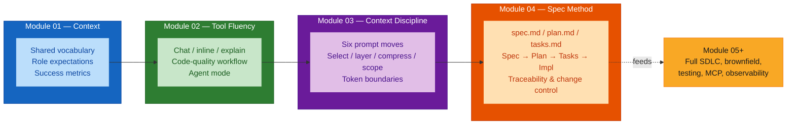
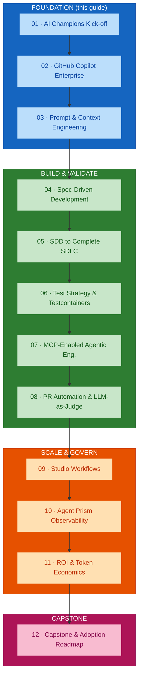
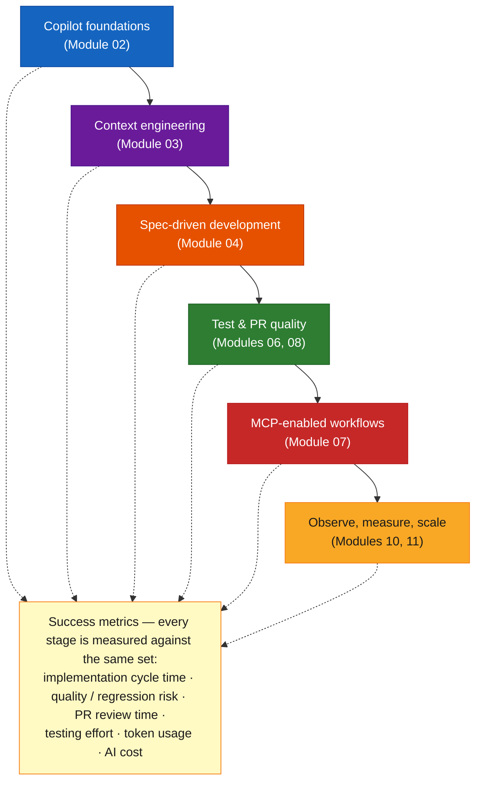
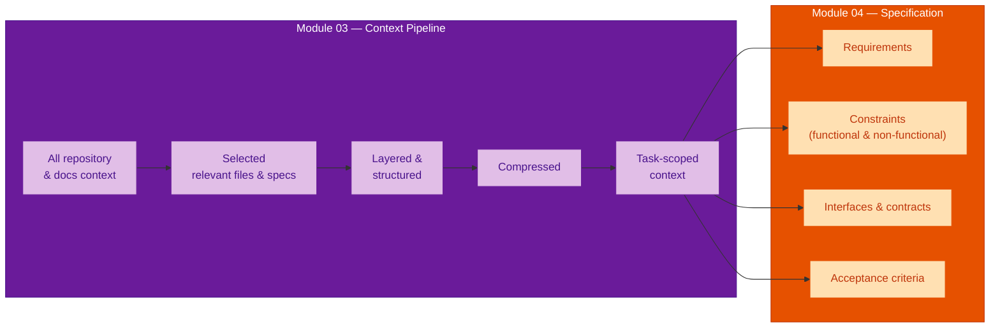
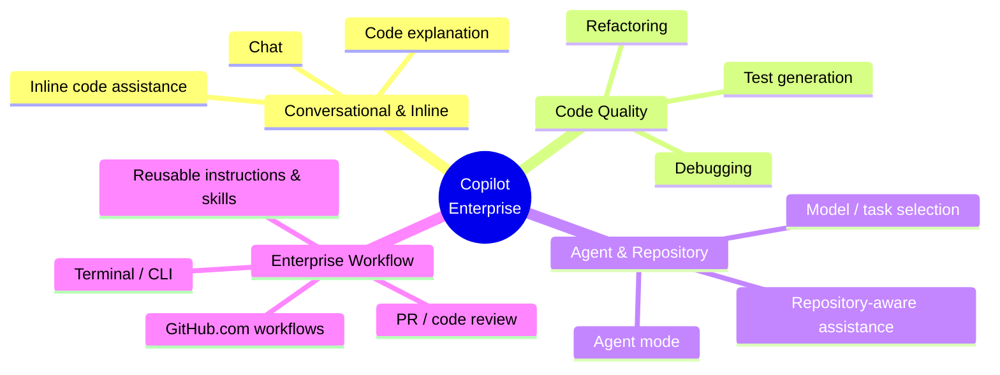
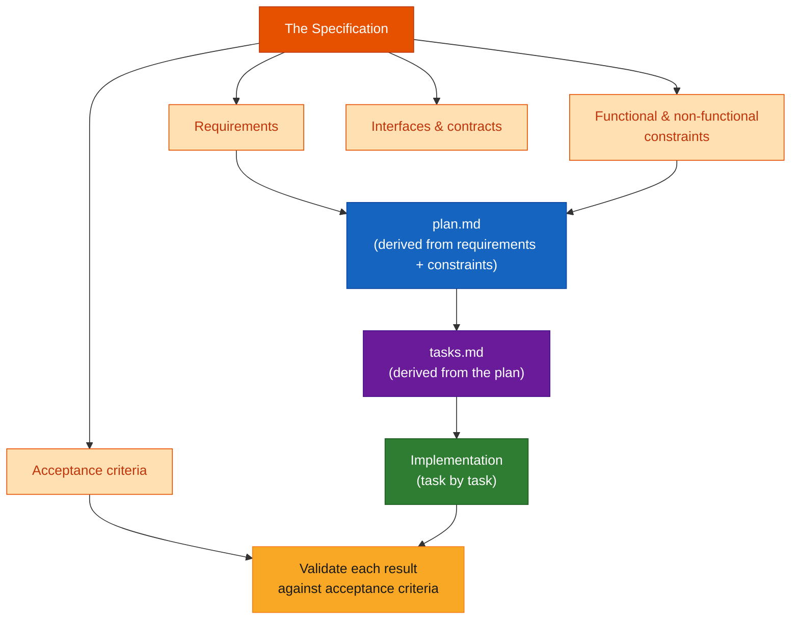

# The AI-Assisted Engineering Foundation — Modules 01–04 Comprehensive Guide

## Overview

This guide is a single synthesis of the **Foundation phase** of the AI Champions Programme — Modules 01 through 04. Read it to see the four modules as one arc rather than four separate topics: the phase takes a team from *"individuals trying Copilot ad hoc"* to *"specification-driven greenfield features, measured against a baseline."*

Each module has its own detailed guide:

- [`module-01-enterprise-context.md`](./module-01-enterprise-context.md) — why AI Champions, role expectations, risks, the lifecycle
- [`module-02-copilot-enterprise.md`](./module-02-copilot-enterprise.md) — Copilot capability map, code-quality workflow, agent mode
- [`module-03-prompt-context-engineering.md`](./module-03-prompt-context-engineering.md) — the six prompt moves, the context engineering pipeline
- [`module-04-spec-driven-development.md`](./module-04-spec-driven-development.md) — specification anatomy, the SDD flow, traceability

**Phase duration:** 4 modules × 2 hours = 8 hours (workshop + hands-on lab)
**Delivered for:** Honeywell Engineering Teams

## Quick Start

The Foundation phase builds one capability on top of another. Skipping a rung leaves the next one unstable.

| Module | The rung it adds | You can now… |
|--------|------------------|--------------|
| **01** | Shared vocabulary, role expectations, success metrics, the lifecycle map | …talk about AI adoption in the same terms, and know what "good" is measured against |
| **02** | Tool fluency — chat, inline assist, code explanation, the code-quality workflow, agent mode | …drive Copilot across a real engineering task, not just first-draft generation |
| **03** | Context discipline — select, layer, compress, and scope what the model sees | …control token cost and output quality by controlling the context, not just the prompt |
| **04** | Specification method — a persistent, versioned spec that drives plan, tasks, and validation | …build a whole greenfield feature traceably, and absorb requirement changes without re-explaining |

The single through-line across Modules 02–04 is a **maturity ladder**:

> prompt-only → structured prompting → context-engineered → spec-driven

Every rung adds **persistence** (the intent survives the chat session) and **traceability** (you can follow a line of code back to the requirement it serves).

## Visual Summary



## Architecture

### The Foundation phase in the 12-module journey



Note the boundary: **Module 04 belongs to the Build & Validate phase** in the programme structure, but it is included here because SDD is where the Foundation habits — vocabulary, tool fluency, context discipline — first combine into a complete engineering method. Module 05 onward reuses that method across a full SDLC.

### Combined phase agenda

| Module | Topic | Time | Format |
|--------|-------|------|--------|
| 01 | Why AI Champions · role by function · risks · the lifecycle · Agent Prism · workshop | 120 min | Workshop |
| 02 | Capability map · chat/inline/explain · refactor/test/debug · agent mode · model selection · manual-vs-Copilot lab | 120 min | Hands-on lab |
| 03 | Six prompt moves · prompt-only→context-engineered · sources map · the pipeline · boundaries · anti-patterns · prompt-vs-context lab | 120 min | Hands-on lab |
| 04 | Prompt-only→spec-driven · spec anatomy & quality · the SDD flow · Spec Kit / OpenSpec · traceability · spec-vs-prompt lab | 120 min | Hands-on lab |
| | **Total** | **8 hours** | |

### The AI-assisted software engineering lifecycle

Module 01 introduces the end-to-end lifecycle the whole programme builds. The Foundation phase covers the first three stages; the arrows never stop feeding the metric set at the bottom.



### How context flows into a specification

The most important architectural link inside this phase: Module 03's context pipeline produces exactly the raw material Module 04's specification is built from. A weak context pipeline produces a weak spec.



### The Foundation capability stack (block diagram)

```
┌──────────────────────────────────────────────────────────────┐
│  MODULE 04 — SPECIFICATION METHOD                             │
│  spec.md → plan.md → tasks.md → implementation → validate     │
│  traceability: requirement → task → PR → acceptance test      │
└──────────────────────────────────────────────────────────────┘
                            ▲ built from
┌──────────────────────────────────────────────────────────────┐
│  MODULE 03 — CONTEXT DISCIPLINE                               │
│  six prompt moves │ select · layer · compress · scope        │
│  context boundaries: enterprise ⊃ repo ⊃ task-scoped         │
└──────────────────────────────────────────────────────────────┘
                            ▲ directs
┌──────────────────────────────────────────────────────────────┐
│  MODULE 02 — TOOL FLUENCY                                     │
│  chat · inline assist · explanation │ refactor · test · debug │
│  agent mode · repository-aware assistance · model selection   │
└──────────────────────────────────────────────────────────────┘
                            ▲ used within
┌──────────────────────────────────────────────────────────────┐
│  MODULE 01 — SHARED CONTEXT                                   │
│  vocabulary │ role expectations │ risk catalogue             │
│  success metrics │ the AI-assisted lifecycle map            │
└──────────────────────────────────────────────────────────────┘
```

## Core Concepts

### 1 · The shift the phase drives

Module 01 names the shift; Modules 02–04 are how it is actually achieved.

| From (today) | To (target) | Delivered by |
|--------------|-------------|--------------|
| Individual engineers try Copilot ad hoc, no shared workflow | A common AI-assisted lifecycle, adopted by role | M01 + M02 |
| Prompt-only development, inconsistent, unverified results | Specification-led development, validated by a test strategy | M03 + M04 |
| No visibility into token usage, AI cost, or output quality | Context deliberately scoped; token cost predictable | M03 |
| Brownfield changes risk violating architecture unnoticed | Change flows through the spec; plan and tasks stay in sync | M04 |
| AI adoption measured by anecdote | Adoption measured against baselined cycle-time and quality metrics | M01 metric set, applied every module |

### 2 · The maturity ladder (analogy)

Think of it like moving from *verbal instructions* to a *blueprint*:

- **Prompt-only** — you tell a contractor what you want out loud. Fine for hanging a picture; a disaster for a kitchen remodel, because every retelling drifts and nothing is written down.
- **Structured prompting** (Module 03's six moves) — you use a consistent checklist when you talk: goal, role, constraints, examples, break it into steps, check the result. More repeatable, still verbal.
- **Context-engineered** (Module 03) — you hand over the *relevant* existing drawings, measurements, and code standards — selected and trimmed, not the whole filing cabinet.
- **Spec-driven** (Module 04) — there is a signed, versioned blueprint. Work is done against it, changes are made *to it first*, and "done" means it matches the blueprint's acceptance checklist.

### 3 · The Copilot Enterprise capability map (Module 02)

Four categories, all practised in the Foundation phase:



> `mindmap` needs mermaid ≥ 9.3. If this guide is exported to PDF or read in an older viewer, treat the list above as the source of truth.

**The key reframe:** Copilot's value is *not* first-draft generation. It is the code-quality workflow that comes after the first version exists — `Generate → Refactor → Generate tests → Debug` — and agent mode's ability to reason across files, dependencies, existing tests, and PR history for a coordinated multi-file change.

### 4 · The six prompt moves (Module 03)

Necessary but **not sufficient** — they shape *how you ask*, and say nothing about *what the model knows about your repository*.

| Move | One-line |
|------|----------|
| Frame the task | State the goal in one sentence — what should exist when it is done |
| Set role & instruction | Tell the model what perspective to take and how to approach it |
| Add constraints | Name the limits — language, style, performance, interfaces |
| Give examples | Show, don't just tell — a short example anchors format and quality |
| Decompose | Break a large task into smaller, independently verifiable steps |
| Iterate & verify | Check output against the goal; refine the prompt, don't accept the first pass |

### 5 · The context engineering pipeline (Module 03)

Raw sources narrow, stage by stage, into exactly what the task needs:

```
All repo & docs context  →  Selected  →  Layered & structured  →  Compressed  →  Task-scoped
   (everything available)    (relevant     (ordered by            (redundancy     (sent to
                              files/specs)   relevance)             removed)        the agent)
```

**Context boundaries** — three nested scopes; everything outside the innermost is available but deliberately not sent:

```
┌─ ENTERPRISE & REPOSITORY STANDARDS ────────────────────┐
│  ┌─ REPOSITORY & DESIGN CONTEXT ──────────────────────┐ │
│  │  ┌─ TASK-SCOPED CONTEXT ───────────────────────┐   │ │
│  │  │  what the agent actually sees for this task  │   │ │
│  │  └─────────────────────────────────────────────┘   │ │
│  └───────────────────────────────────────────────────┘ │
└───────────────────────────────────────────────────────┘
```

**Anti-patterns that inflate token cost without improving quality:** attaching whole files when a few functions are relevant; re-sending the same context every follow-up turn; copying entire specs or issue threads verbatim; letting context accumulate across an unrelated multi-task session; skipping compression because "the model has a big context window."

### 6 · Anatomy and quality of a specification (Module 04)

Four load-bearing parts:



A specification is **"good enough"** when it is:

- **Unambiguous** — one reasonable interpretation, no room for the model or a teammate to guess
- **Testable** — every acceptance criterion checkable mechanically or by a clear, repeatable manual step ("the endpoint should be fast" fails this; "p95 latency under 200 ms at 50 rps" passes)
- **Traceable** — each requirement maps to specific tasks, code, and tests
- **Complete** — functional *and* non-functional constraints captured, not just the happy path

### 7 · Traceability and change control (Module 04)

```
Requirement  →  Task  →  Implementation  →  Acceptance test
  REQ-01        TASK-03      PR #42            AC-01  ✓
```

**Change control rule:** when a requirement changes, the specification is updated **first**. The plan, tasks, and tests are then re-derived from that single source of truth — never edited ad hoc in code or in chat history. This is the discipline that makes the output *traceable*, not just fast.

### 8 · The metric set that threads through all four modules

Introduced in Module 01, applied to every hands-on lab in Modules 02–04, and the baseline for every later module's cost and ROI discussion:

| Metric | Where the Foundation phase touches it |
|--------|--------------------------------------|
| Implementation cycle time | M02 & M04 labs time the same task/feature both ways |
| Quality / regression risk | M02 code-quality workflow; M04 acceptance-criteria validation |
| PR review time | M02 capability map (PR/code review); baseline for M08 |
| Testing effort | M02 test generation; M04 acceptance criteria feed M06's test strategy |
| Token usage | M03 pipeline and anti-patterns; logged on the M03 lab worksheet |
| AI cost | M03 model/context selection; baseline for M11 token economics |

### 9 · Risks the Foundation phase addresses

| Risk (Module 01 catalogue) | Mitigated by |
|----------------------------|--------------|
| **Business:** slow implementation cycles | M02 fluency + M04 traceable flow |
| **Business:** no visibility into AI usage, quality, ROI | M03 token discipline; M01 metric baseline |
| **Business:** inconsistent results from prompts alone | M03 structured prompting + context engineering |
| **Engineering:** AI changes disrupt brownfield architecture | M02 "review agent-mode diffs"; M04 change-impact via the spec |
| **Engineering:** manual, inconsistent PR review | M02 capability map; groundwork for M08 |
| **Engineering:** excessive token consumption | M03 select / compress / scope |

## Key Terminology

| Term | Meaning |
|------|---------|
| **AI Champion** | The person in a team who carries the shared AI-assisted workflow, role expectations, and success metrics into everyday engineering work |
| **Agent mode** | Copilot capability that reasons across multiple files, dependencies, and existing tests to make coordinated multi-file changes; its diffs are reviewed before acceptance |
| **Repository-aware assistance** | Assistance that draws on more than the open file — source files, dependencies, existing tests, GitHub.com / CLI context, PR and review history |
| **Structured prompting** | The six prompt moves applied consistently; more repeatable than ad hoc prompting, but still no persistent view of the repository |
| **Context engineering** | Deliberately selecting, layering, compressing, and scoping the context supplied to AI before the prompt is sent |
| **Context inflation** | Token usage growing without a matching gain in output quality — the failure mode context engineering prevents |
| **Task-scoped context** | The innermost context boundary: only what the agent needs for the current task, with enterprise and repository context deliberately left out |
| **Specification (spec.md)** | A persistent, versioned file capturing requirements, constraints, interfaces/contracts, and acceptance criteria |
| **The SDD flow** | Spec → Plan → Tasks → Implementation, closed by validation against acceptance criteria and a feedback loop back to the spec |
| **Acceptance criteria** | Explicit, written, checkable conditions that define when a requirement is satisfied |
| **Traceability** | The ability to follow a line of code back through its task and requirement to intent, and forward to its acceptance test |
| **GitHub Spec Kit / OpenSpec** | Tooling that carries the SDD workflow through versioned artifacts (`spec.md`, `plan.md`, `tasks.md`) alongside the code |

## Foundation Phase Outcomes

On completing Modules 01–04, an AI Champion can:

1. Frame AI adoption in shared terms and name what "good" is measured against (M01)
2. Map role-based AI Champion expectations for their function (M01)
3. Identify the business and engineering risks of unmanaged AI usage (M01)
4. Use chat, inline assist, and code explanation fluently on real tasks (M02)
5. Run Copilot across a realistic code-quality workflow — refactor, test, debug — not just generation (M02)
6. Use agent mode for repository-aware, multi-file changes and review its diffs (M02)
7. Apply the six prompt moves as a consistent checklist (M03)
8. Select, layer, compress, and scope context — and recognise the inflation anti-patterns (M03)
9. Draw context boundaries task by task to keep token cost predictable (M03)
10. Write a specification that is unambiguous, testable, traceable, and complete (M04)
11. Run the Spec → Plan → Tasks → Implementation flow with `Spec Kit` / `OpenSpec` artifacts (M04)
12. Handle a requirement change through the spec, keeping plan and tasks in sync (M04)

## What comes next

Module 05 (**SDD to Complete Software SDLC**, 4 hours) takes the same `spec → plan → tasks` flow through a full SDLC — greenfield *and* brownfield — adding architecture analysis and change-impact review. Module 06 derives its test strategy directly from the acceptance criteria written in Module 04. From there the Build & Validate and Scale & Govern phases extend the Foundation habits into MCP-enabled agents, automated PR review, observability, and token economics.

## References

### Programme Materials

- Module 01 Presentation: `presentations/Module01_AI_Champions_Kickoff_Enterprise_Context.pdf`
- Module 02 Presentation: `presentations/Module02_GitHub_Copilot_Enterprise_Engineering_Workflows.pdf`
- Module 03 Presentation: `presentations/Module03_Prompt_Context_Engineering.pdf`
- Module 04 Presentation: `presentations/Module04_Spec_Driven_Development.pdf`
- Course Outline: `courseOutline/NIIT_Honeywell_AI_Champions_GitHub_AgentPrism (Software_Engineering).pdf`
- Per-module guides: [`module-01-enterprise-context.md`](./module-01-enterprise-context.md) · [`module-02-copilot-enterprise.md`](./module-02-copilot-enterprise.md) · [`module-03-prompt-context-engineering.md`](./module-03-prompt-context-engineering.md) · [`module-04-spec-driven-development.md`](./module-04-spec-driven-development.md)
- Interactive labs: `labs/module-01/index.html` … `labs/module-04/index.html`

### Further Reading — External References

*Every link below was fetched and confirmed (HTTP 200) on 2026-09-02.*

**The case for disciplined AI adoption (Module 01)**

- [DORA — 2024 Accelerate State of DevOps Report](https://dora.dev/research/2024/dora-report/) — the evidence that AI raises individual throughput but can reduce delivery stability when batch size and testing discipline slip.
- [DORA — Impact of Generative AI on Software Development](https://dora.dev/ai/) — consolidated guidance on measuring and capturing the ROI of AI-assisted development.
- [GitHub — Quantifying GitHub Copilot's impact on developer productivity and happiness](https://github.blog/news-insights/research/research-quantifying-github-copilots-impact-on-developer-productivity-and-happiness/) — the baseline productivity study behind the programme's metric framing.
- [NIST AI Risk Management Framework](https://www.nist.gov/itl/ai-risk-management-framework) — a reference frame for the business and engineering risks catalogued in Module 01.
- [Anthropic — Building Effective Agents](https://www.anthropic.com/engineering/building-effective-agents) — vocabulary for the agentic workflows the later modules depend on.

**Copilot capabilities and safe usage (Module 02)**

- [GitHub Copilot features](https://docs.github.com/en/copilot/get-started/github-copilot-features) — the authoritative, current list of Copilot capabilities by plan.
- [Best practices for using GitHub Copilot](https://docs.github.com/en/copilot/get-started/best-practices) — GitHub's own guidance on where Copilot helps and where to stay cautious.
- [VS Code — Use agent mode in chat](https://code.visualstudio.com/docs/copilot/chat/chat-agent-mode) — running agent mode, reviewing diffs, and approving terminal commands.
- [GitHub Copilot Trust Center](https://copilot.github.trust.page/) — security, privacy, IP, and compliance posture for enterprise adoption.
- [Responsible use of GitHub Copilot features](https://docs.github.com/en/copilot/responsible-use) — per-feature limitations and responsible-use guidance.

**Prompt and context engineering (Module 03)**

- [Prompt engineering for GitHub Copilot Chat](https://docs.github.com/en/copilot/concepts/prompting/prompt-engineering) — GitHub's framing of the goal-first, specifics, examples, decomposition, iteration moves.
- [Anthropic — Effective Context Engineering for AI Agents](https://www.anthropic.com/engineering/effective-context-engineering-for-ai-agents) — the primary reference: context as a finite attention budget to be curated, not filled.
- [Configure custom instructions for GitHub Copilot](https://docs.github.com/en/copilot/how-tos/custom-instructions) — repository instructions, path-scoped instructions, and reusable prompt files that standardise context.

**Spec-driven development (Module 04)**

- [The GitHub Blog — Spec-driven development with AI: get started with a new open-source toolkit](https://github.blog/ai-and-ml/generative-ai/spec-driven-development-with-ai-get-started-with-a-new-open-source-toolkit/) — the SDD approach and a worked example.
- [github/spec-kit](https://github.com/github/spec-kit) — the toolkit: `specify` CLI, templates, and the `/constitution` → `/specify` → `/plan` → `/tasks` → `/implement` flow.
- [Spec Kit documentation](https://github.github.com/spec-kit/) — installation, full command reference, and workflow guidance.
- [Fission-AI/OpenSpec](https://github.com/Fission-AI/OpenSpec) — the lightweight, proposal-folder alternative for AI coding assistants.

**Where the Foundation phase leads**

- [Model Context Protocol](https://modelcontextprotocol.io/) — the open standard for connecting external context sources to agents (Module 07).
- [OpenTelemetry — GenAI semantic conventions](https://opentelemetry.io/docs/specs/semconv/gen-ai/) — the trace schema Agent Prism and similar tools consume (Module 10).
