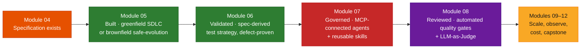
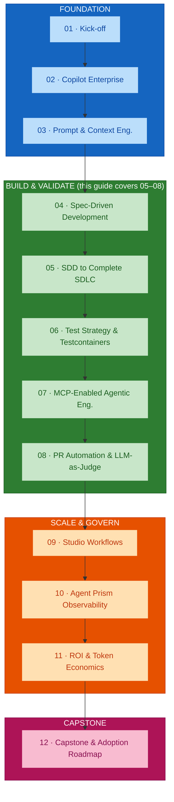
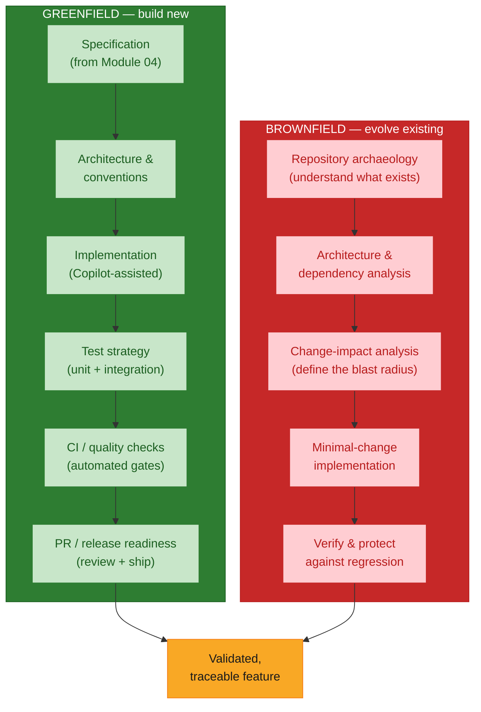
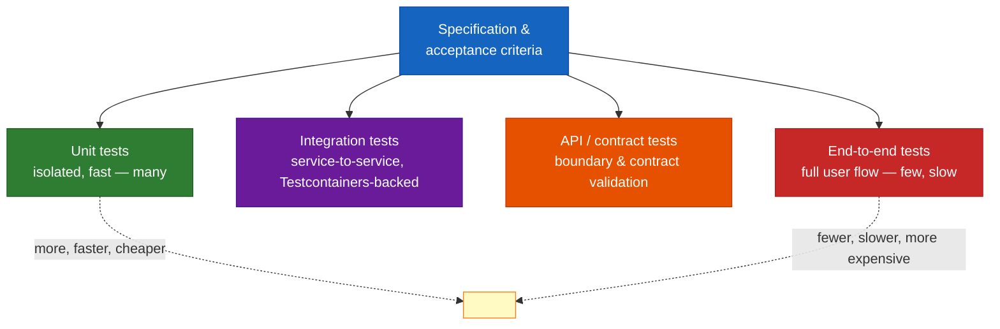
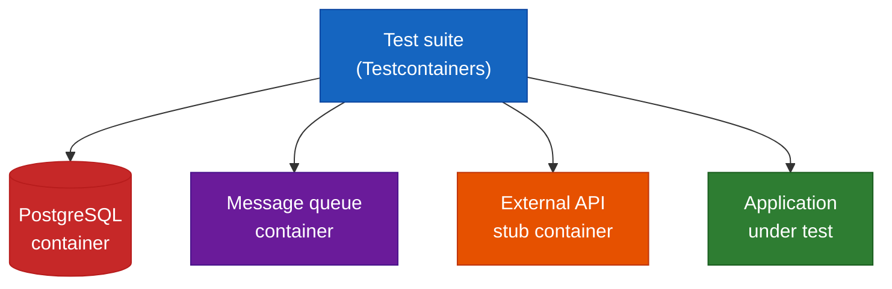
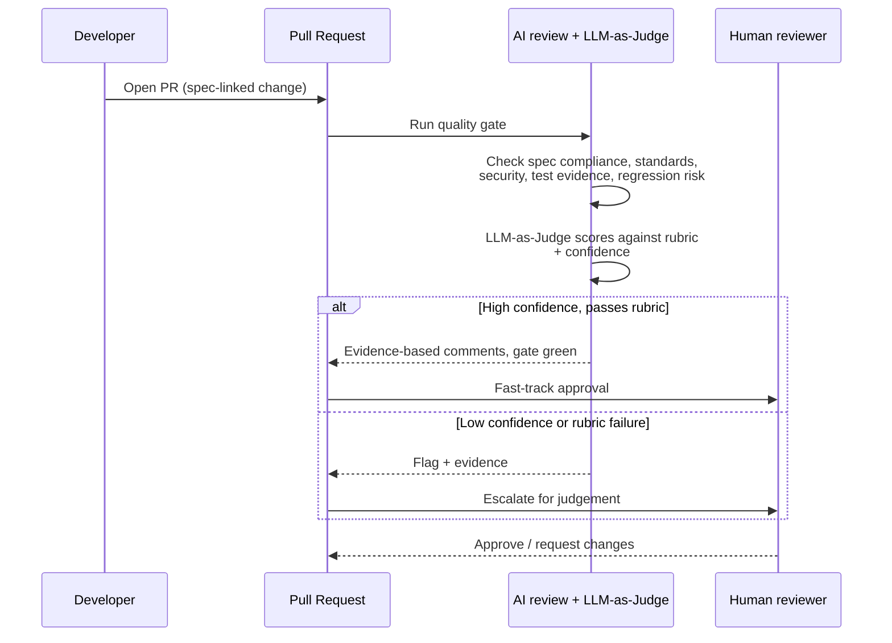

# Build &amp; Validate — Modules 05–08 Comprehensive Guide

## Overview

This guide is a single synthesis of the **Build &amp; Validate phase** of the AI Champions Programme — Modules 05 through 08. It picks up exactly where the [Foundation guide](./foundation-phase-modules-01-04.md) ends: Module 04 leaves you with a *specification*. This phase turns that specification into a **validated, governed, review-passed feature** — greenfield or brownfield.

The phase adds one evidence layer per module:

| Module | Evidence it adds | Hours |
|--------|------------------|-------|
| **05 · SDD to Complete SDLC** | The feature is built through a full SDLC (greenfield) *or* evolved safely inside existing code (brownfield) | 4 |
| **06 · Test Strategy &amp; Testcontainers** | The feature has a spec-derived test strategy, proven against a real injected defect | 2 |
| **07 · MCP-Enabled Agentic Workflows** | The agents doing this work are connected to approved tools under governance, and the patterns are packaged as reusable skills | 2 |
| **08 · PR Automation &amp; LLM-as-Judge** | The pull request carries automated quality-gate evidence, checked by AI + an LLM judge, with human escalation | 1.5 |

**Phase duration:** 9.5 hours.
**Delivered for:** Honeywell Engineering Teams.

> **Source note.** Modules 05 and 06 are grounded in their full presentation decks. Modules 07 and 08 are grounded in the **course outline** (`courseOutline/NIIT_Honeywell_AI_Champions_GitHub_AgentPrism (Software_Engineering).pdf`) — their dedicated decks were not available as readable PDFs when this guide was written, so those two sections stay at the outline's level of detail.

## Quick Start

The through-line for the phase:

> A spec is a *claim*. Build &amp; Validate is where the claim is made true, and then **proven** — with a working feature, a test suite that has caught something, governed agent access, and a PR review backed by evidence rather than opinion.

Two things stay constant from Module 01 and run through every module here:

1. **The same success metric set** — implementation cycle time, quality / regression risk, PR review time, testing effort, token usage, AI cost. Module 06 in particular reframes a defect caught in testing as *cost avoided*, which Module 11's ROI model depends on.
2. **The spec is still the source of truth.** The SDLC flow, the test strategy, the PR quality gate, and the LLM-as-Judge rubric all check work *against the specification* authored in Module 04.

## Visual Summary



## Architecture

### The Build &amp; Validate phase in the 12-module journey



### Module 05 — Two tracks, one discipline

Module 05 walks *every stage of the SDLC twice*: once building new (greenfield), once evolving existing code (brownfield). Both run on the Module 04 spec; the difference is **what must be true before you can safely start implementing.**



### Module 05 — Change-impact analysis: the blast radius

Brownfield's central idea. Before writing a line, map how far the change could reach. The **blast radius**, not the file you are editing, defines the scope of "minimal change" — and the outer ring is exactly what regression testing exists to protect.

```
┌─ UNAFFECTED CODE — protected by regression tests ───────────┐
│  ┌─ INDIRECTLY AFFECTED AREAS ────────────────────────────┐ │
│  │  ┌─ DIRECTLY DEPENDENT MODULES ───────────────────────┐│ │
│  │  │  ┌─ THE CHANGE ──────────────────────────────────┐ ││ │
│  │  │  │  what we're actually modifying                 │ ││ │
│  │  │  └───────────────────────────────────────────────┘ ││ │
│  │  └────────────────────────────────────────────────────┘│ │
│  └────────────────────────────────────────────────────────┘ │
└────────────────────────────────────────────────────────────┘
```

### Module 06 — From acceptance criteria to a test pyramid

The specification does not just describe the feature — it defines what *tested* means for it. Every layer of the pyramid exists because some part of the spec needs a specific kind of proof.



### Module 06 — Testcontainers architecture

What the test suite actually talks to while it runs. Containers spin up **fresh** for each run and tear down after — no shared state, no "works on my machine," no drift from production versions.



### Module 07 — MCP governance architecture

MCP (Model Context Protocol) is treated as a **key engineering capability**, not a novelty: the standard way to connect an agent to approved repositories, APIs, databases, documentation, and test infrastructure — with permissions, approvals, and boundaries in between.

```mermaid
graph LR
    Agent["Copilot / agent"]
    subgraph Gov["Governance layer"]
        Perm["Tool selection ·<br/>permissions · approvals"]
        Bound["Context / state<br/>boundaries"]
        Fail["Failure handling ·<br/>security"]
    end
    subgraph Servers["Approved MCP servers"]
        Repo["Repositories"]
        API["APIs &amp; services"]
        DB[("Databases")]
        Docs["Documentation"]
        Test["Test infrastructure"]
    end

    Agent --> Gov --> Servers

    style Agent fill:#1565c0,stroke:#0d47a1,color:#fff
    style Gov fill:#e65100,stroke:#bf360c,color:#fff
    style Perm fill:#ffe0b2,stroke:#e65100,color:#bf360c
    style Bound fill:#ffe0b2,stroke:#e65100,color:#bf360c
    style Fail fill:#ffe0b2,stroke:#e65100,color:#bf360c
    style Servers fill:#c62828,stroke:#b71c1c,color:#fff
    style Repo fill:#ffcdd2,stroke:#c62828,color:#b71c1c
    style API fill:#ffcdd2,stroke:#c62828,color:#b71c1c
    style DB fill:#ffcdd2,stroke:#c62828,color:#b71c1c
    style Docs fill:#ffcdd2,stroke:#c62828,color:#b71c1c
    style Test fill:#ffcdd2,stroke:#c62828,color:#b71c1c
```



> **RAG is intentionally excluded** from the core programme. The time is spent on MCP, testing, and brownfield engineering instead.

### Module 08 — The PR quality gate, as a flow



## Core Concepts

### 1 · SDD does not stop at code (Module 05)

The reframe: Copilot's contribution across a full SDLC is *not* four extra lines of code. It shows up in four places beyond the implementation itself:

| Place | What Copilot does |
|-------|-------------------|
| Architecture &amp; planning | Drafts `plan.md` options, surfaces trade-offs, checks the approach against the spec's constraints |
| Test generation | Generates unit and integration tests directly from the specification's acceptance criteria |
| CI/CD &amp; quality gates | Drafts pipeline configuration and explains quality-gate failures with the surrounding context |
| PR &amp; release readiness | Writes PR descriptions, summarizes changes, checks release readiness against the original spec |

This is what turns *"AI wrote some code"* into *"AI helped ship a validated feature."*

### 2 · Repository archaeology before brownfield code (Module 05)

Five things worth understanding before the first line of a brownfield change:

- **Architecture &amp; dependencies** — what depends on what
- **Existing design patterns** — the conventions this codebase already commits to
- **API contracts** — the promises callers rely on
- **Existing tests** — what behaviour is already pinned down (and what is not)
- **Coding conventions** — the local style, even where it is imperfect

Every one of these shapes what *"minimal change"* means for this specific codebase. Skipping this step is how well-intentioned changes become regressions.

### 3 · The minimal-change strategy (Module 05)

| Minimal-change strategy | Maximal disruption (avoid) |
|-------------------------|----------------------------|
| Change only what the feature actually requires | Refactor broadly while implementing the feature |
| Stay within the identified blast radius | Touch files outside the change's actual scope |
| Follow the codebase's existing patterns, even if imperfect | Introduce new patterns alongside existing ones |
| Re-run the full existing test suite before and after | Skip re-running the existing test suite |

**Greenfield vs brownfield — where they genuinely diverge:**

| Dimension | Greenfield | Brownfield |
|-----------|-----------|------------|
| Starting point | A blank slate, guided by the spec | An existing codebase, guided by the spec + existing patterns |
| First step | Architecture &amp; conventions | Repository archaeology |
| Primary risk | Under-specifying requirements | Unintended regression |
| Change scope | Bounded by the spec | Bounded by the spec **and** the blast radius |
| Validation | Acceptance criteria | Acceptance criteria + full regression suite |

### 4 · A test strategy is derived, not chosen (Module 06)

The analogy: a test strategy is not a *shopping list* you pick items from — it is a *translation*. Each acceptance criterion in the spec maps to the kind of test that can actually prove it:

- "Valid order returns 201" → a **unit** test
- "Duplicate order rejected" → an **integration** test
- "Payment service timeout handled" → a **Testcontainers** integration test (needs a real, controllable dependency)
- "Full checkout flow completes" → an **end-to-end** test

The goal state: *a specification with no unmapped acceptance criteria, and a test suite with no orphaned tests.*

### 5 · Testcontainers vs mocks (Module 06)

| Testcontainers | Mocks &amp; stubs |
|----------------|-----------------|
| A real database / service, running in an ephemeral container | Database behaviour guessed at, not verified |
| The same behaviour in CI as in production | Passes in CI, fails against the real service |
| Versions pinned to match production dependencies | Config drift between mock and production accumulates silently |
| Integration coverage that is actually trustworthy | False confidence in integration coverage |

Testcontainers is what makes the **integration layer** of the pyramid trustworthy — real dependencies, without paying full E2E cost for every scenario.

### 6 · Test data covers the worst case, not just the happy case (Module 06)

Four categories of input, because a feature is only as tested as its worst-case data:

- **Happy path** — valid input, expected flow
- **Boundary &amp; edge cases** — empty inputs, maximum sizes, off-by-one conditions
- **Negative &amp; invalid input** — malformed, unauthorized, out-of-contract — confirms the feature fails *safely*
- **Failure &amp; timeout scenarios** — a dependency unavailable, slow, or erroring — confirms graceful degradation, not a crash

### 7 · MCP as governed capability, and skills as reusable assets (Module 07)

Two halves:

- **MCP-enabled workflows** connect agents to *approved* tools and enterprise context. The engineering work is in the governance around the connection: tool selection, permissions, approvals, context/state boundaries, failure handling, and security — not the connection itself. A representative workflow: `repository analysis → specification validation → test execution → result analysis / PR evidence collection`.
- **Reusable engineering skills** package what a team has learned — specifications, instructions, prompt packs, test/review heuristics, agent behaviours — into cross-project assets with **versioning and ownership**. The Module 07 lab builds one (a spec validator, a test-enhancement assistant, or a PR reviewer) and documents its reuse and governance model.

### 8 · LLM-as-Judge, with a human in the loop (Module 08)

AI-assisted PR review checks a change against: specification compliance, coding/design standards, security, test evidence, regression risk, and maintainability — and leaves **evidence-based comments**, not vague ones.

**LLM-as-Judge** adds an evaluation rubric on top: the judge scores the change (and the AI review itself) against explicit criteria, reports a **confidence** level, and **escalates to a human** when confidence is low or the rubric fails. The measured outcome is *review-cycle reduction* — faster reviews without giving up the human judgement call on the hard cases.

### 9 · The metric set still runs underneath everything

| Metric | Where Build &amp; Validate touches it |
|--------|------------------------------------|
| Implementation cycle time | M05 greenfield/brownfield labs; M08 review-cycle reduction |
| Quality / regression risk | M05 change-impact + regression suite; M06 defect-injection proof |
| PR review time | M08 automated quality gate + LLM-as-Judge |
| Testing effort | M06 test pyramid — right amount of each test type |
| Token usage / AI cost | M07 context/state boundaries; every lab logs it; feeds M11 |

## Key Terminology

| Term | Meaning |
|------|---------|
| **Greenfield track** | Building a new feature from a blank slate, guided only by the spec |
| **Brownfield track** | Evolving existing code, guided by the spec **and** the codebase's existing patterns |
| **Repository archaeology** | Understanding an existing codebase's architecture, dependencies, patterns, contracts, tests, and conventions before changing it |
| **Change-impact analysis** | Mapping how far a change could reach, before writing it |
| **Blast radius** | The set of directly and indirectly affected code — the true scope of a "minimal" change |
| **Minimal-change strategy** | Changing only what the feature requires, staying inside the blast radius, following existing patterns, re-running the full suite before and after |
| **Regression protection** | Using the existing test suite to prove pre-change behaviour is preserved |
| **Test pyramid** | Many fast unit tests, fewer integration tests, fewer API/contract tests, fewest E2E tests |
| **Testcontainers** | A library that runs real dependencies (databases, queues, services) in ephemeral containers for integration tests |
| **Contract test** | A test that verifies a service honours the API contract its consumers depend on |
| **Specification-to-test traceability** | Every acceptance criterion has a test; every test maps back to a criterion |
| **Defect injection** | Deliberately breaking the feature to prove the test strategy catches it |
| **MCP (Model Context Protocol)** | The open standard for connecting agents to external tools, data, and services |
| **Reusable engineering skill** | A versioned, owned, cross-project asset packaging specs, instructions, heuristics, or agent behaviours |
| **LLM-as-Judge** | Using a model to score a change or an AI review against an explicit rubric, with a confidence level and human escalation |
| **Quality gate** | An automated PR check for spec compliance, standards, security, test evidence, and regression risk |

## Build &amp; Validate Phase Outcomes

On completing Modules 05–08, an AI Champion can:

1. Carry a Module 04 spec through a full greenfield SDLC to a release-ready feature (M05)
2. Use Copilot across architecture, testing, CI/CD, and PR readiness — not only code generation (M05)
3. Run repository archaeology and change-impact analysis on real brownfield code (M05)
4. Apply the minimal-change strategy and verify no regression (M05)
5. Compare the greenfield and brownfield workflows and name where they diverge (M05)
6. Derive a test strategy directly from a specification's acceptance criteria (M06)
7. Build a test pyramid with the right amount of each test type (M06)
8. Use Testcontainers for trustworthy integration coverage against real dependencies (M06)
9. Design test data across happy path, boundary, negative, and failure scenarios (M06)
10. Prove a test strategy works by injecting a defect and catching it (M06)
11. Build an MCP-enabled workflow connecting agents to approved tools under governance (M07)
12. Package a reusable engineering skill with a documented versioning and ownership model (M07)
13. Configure an AI-assisted PR quality gate with evidence-based comments (M08)
14. Apply an LLM-as-Judge rubric with confidence scoring and human escalation (M08)

## What comes next

The **Scale &amp; Govern** phase (Modules 09–11) takes these validated, governed features and asks organisational questions: how do non-technical program and product roles author agent workflows safely (Module 09, Atlassian Rovo Studio); how do you *observe* agent behaviour, traces, failures, drift, and cost in production (Module 10, Agent Prism); and how do you convert all of it into a measurable ROI and token-economics model with governance actions (Module 11). Module 12 is the **Honeywell Software Engineering Capstone** — one realistic use case carried through the entire journey, closing with a 30/60/90-day adoption roadmap.

## References

### Programme Materials

- Module 05 Presentation: `presentations/Module05_SDD_Complete_SDLC.pdf`
- Module 06 Presentation: `presentations/Module06_Test_Strategy_Testcontainers.pdf`
- Course Outline (primary source for Modules 07–08): `courseOutline/NIIT_Honeywell_AI_Champions_GitHub_AgentPrism (Software_Engineering).pdf`
- Foundation-phase guide: [`foundation-phase-modules-01-04.md`](./foundation-phase-modules-01-04.md)
- Per-module guides: [`module-04-spec-driven-development.md`](./module-04-spec-driven-development.md) and Modules 01–03

### Further Reading — External References

*Every link below was fetched and confirmed (HTTP 200) on 2026-09-02.*

**Complete SDLC and brownfield engineering (Module 05)**

- [The GitHub Blog — Spec-driven development with AI](https://github.blog/ai-and-ml/generative-ai/spec-driven-development-with-ai-get-started-with-a-new-open-source-toolkit/) — carrying a specification through architecture, tasks, and implementation.
- [github/spec-kit](https://github.com/github/spec-kit) — the `specify` CLI and the `/constitution` → `/specify` → `/plan` → `/tasks` → `/implement` flow used across greenfield SDLC.
- [About GitHub Copilot coding agent](https://docs.github.com/en/copilot/concepts/agents/coding-agent/about-coding-agent) — assigning an issue to Copilot to research, plan, implement, and open a PR — the async form of the SDLC flow.
- [Configure custom instructions for GitHub Copilot](https://docs.github.com/en/copilot/how-tos/custom-instructions) — repository and path-scoped instructions that encode a codebase's existing conventions for brownfield work.
- [Anthropic — Effective context engineering for AI agents](https://www.anthropic.com/engineering/effective-context-engineering-for-ai-agents) — assembling the repository-archaeology context an agent needs before a brownfield change.

**Test strategy, the pyramid, and Testcontainers (Module 06)**

- [Testcontainers — official site](https://testcontainers.com/) — real, ephemeral service and database dependencies for integration tests.
- [Testcontainers for Java](https://java.testcontainers.org/) and [Testcontainers for Node.js](https://node.testcontainers.org/) — language-specific getting-started docs for the two stacks in this programme.
- [Martin Fowler — The Practical Test Pyramid](https://martinfowler.com/articles/practical-test-pyramid.html) — the canonical explanation of unit / integration / E2E balance.
- [Martin Fowler — TestPyramid](https://martinfowler.com/bliki/TestPyramid.html) — the short reference version.
- [Martin Fowler — ContractTest](https://martinfowler.com/bliki/ContractTest.html) and [Pact documentation](https://docs.pact.io/) — consumer-driven contract testing for the API/contract layer of the pyramid.
- [GitHub Actions documentation](https://docs.github.com/en/actions) — the CI platform the quality checks and test suite run on.

**MCP and reusable skills (Module 07)**

- [Model Context Protocol — official site](https://modelcontextprotocol.io/) and [the specification](https://modelcontextprotocol.io/specification) — the open standard for connecting agents to tools and data.
- [modelcontextprotocol/servers](https://github.com/modelcontextprotocol/servers) — reference MCP server implementations (filesystem, GitHub, Postgres, and more).
- [VS Code — MCP servers](https://code.visualstudio.com/docs/copilot/customization/mcp-servers) and [Extend Copilot Chat with MCP](https://docs.github.com/en/copilot/how-tos/provide-context/use-mcp/extend-copilot-chat-with-mcp) — adding MCP servers to Copilot, with the trust and approval prompts.
- [Anthropic — Building Effective Agents](https://www.anthropic.com/engineering/building-effective-agents) — patterns for the agentic workflows (chaining, routing, orchestration) this module composes.

**PR automation and LLM-as-Judge (Module 08)**

- [About Copilot code review](https://docs.github.com/en/copilot/concepts/code-review) and [Using Copilot code review](https://docs.github.com/en/copilot/how-tos/agents/copilot-code-review/using-copilot-code-review) — automated PR review, what it checks, and how it fits team workflows.
- [Evidently AI — LLM-as-a-judge: a complete guide](https://www.evidentlyai.com/llm-guide/llm-as-a-judge) — building evaluation rubrics, scoring, and calibration.
- [Hamel Husain — Creating a LLM-as-a-Judge that drives business results](https://hamel.dev/blog/posts/llm-judge/) — a practitioner walkthrough of building a judge that correlates with human review.

**Observability — where the phase leads (Module 10)**

- [OpenTelemetry — GenAI semantic conventions](https://opentelemetry.io/docs/specs/semconv/gen-ai/) — the trace schema Agent Prism consumes to monitor the agents built here.
