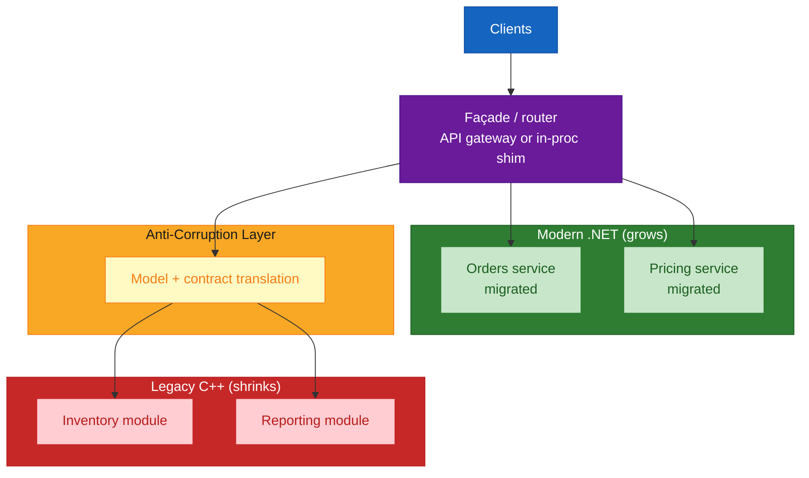
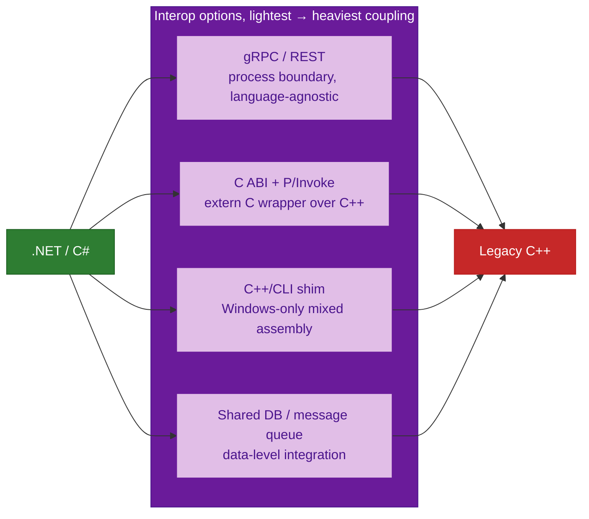
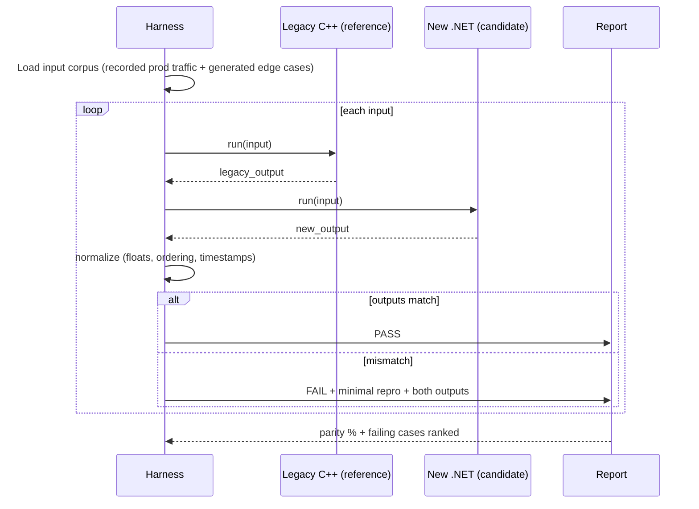

# Migrating a Legacy Application to a Modern Stack with AI Assistance — Comprehensive Guide

## Overview

This guide is a practical playbook for **modernising a legacy application with an AI coding agent** (GitHub Copilot, Claude Code, Amazon Q Developer, and similar) in the loop. The running example is a **C++ desktop/service application migrating to a modern .NET stack** (C# / ASP.NET Core / EF Core), but the strategy applies to most cross-stack migrations: VB6 → .NET, .NET Framework → modern .NET, Java EE → Spring Boot / Quarkus, PL/SQL → services, or a monolith → modular services.

**The single most important framing:** an AI agent does not "port" a legacy app. It accelerates a **disciplined, spec-driven, test-anchored rewrite**. There is no turnkey C++ → C# transpiler that produces maintainable code; the mature automated tools (GitHub Copilot app modernization, AWS Transform, .NET Upgrade Assistant) target *same-language* framework and version upgrades. Cross-language migration stays a guided reimplementation — AI makes each step faster and each translation more idiomatic, but the engineering discipline is what keeps behaviour identical.

**Audience:** engineering leads, architects, and senior developers planning or running a modernisation.

## Quick Start

The golden path, in order — never skip a step:

1. **Freeze understanding.** Generate a dependency map, an architecture description, and a public-behaviour inventory of the legacy app. AI is good at this; verify it.
2. **Pin behaviour with characterization tests** against the *legacy* system before changing anything. These are your oracle.
3. **Carve the first slice.** Pick the smallest module with a clean seam (a bounded context, a library, a service endpoint).
4. **Write a specification** for that slice — requirements, contracts, acceptance criteria — from the legacy behaviour, not from memory.
5. **Translate with AI in two passes:** first a faithful translation, then an idiomatic-.NET rewrite.
6. **Validate with differential testing:** run legacy and new side by side on the same inputs; outputs must match.
7. **Integrate behind an anti-corruption layer** so the new slice coexists with the legacy app (Strangler Fig).
8. **Cut over** the slice behind a feature flag; monitor; then delete the legacy code.
9. **Repeat** slice by slice until the legacy app is gone.

## Visual Summary

```mermaid
graph LR
    L[Legacy C++ app] --> A[Assess &amp; map]
    A --> CH[Characterize<br/>golden-master tests]
    CH --> SL[Slice: pick a seam]
    SL --> SP[Specify the slice]
    SP --> TR[AI translate<br/>faithful → idiomatic]
    TR --> DT[Differential test<br/>legacy vs new]
    DT --> IN[Integrate behind ACL<br/>Strangler Fig]
    IN --> CO[Cut over<br/>feature flag]
    CO -->|next slice| SL
    CO --> M[Modern .NET app]

    style L fill:#c62828,stroke:#b71c1c,color:#fff
    style A fill:#1565c0,stroke:#0d47a1,color:#fff
    style CH fill:#1565c0,stroke:#0d47a1,color:#fff
    style SL fill:#6a1b9a,stroke:#4a148c,color:#fff
    style SP fill:#6a1b9a,stroke:#4a148c,color:#fff
    style TR fill:#e65100,stroke:#bf360c,color:#fff
    style DT fill:#f9a825,stroke:#f57f17,color:#1a1a1a
    style IN fill:#2e7d32,stroke:#1b5e20,color:#fff
    style CO fill:#2e7d32,stroke:#1b5e20,color:#fff
    style M fill:#2e7d32,stroke:#1b5e20,color:#fff
```

## Architecture

### Choosing a migration strategy

The industry frame is the **"6 Rs"** (from AWS / Gartner). For an *application-code* modernisation the meaningful choices are the last three:

| Strategy | What it means | AI leverage | When |
|----------|---------------|-------------|------|
| **Retain / Retire** | Leave it, or switch it off | — | Low business value, or a replacement exists |
| **Rehost** ("lift &amp; shift") | Move the binary unchanged (e.g. containerise) | Low | Buys time; no modernisation |
| **Replatform** | Minor changes to run on a modern runtime | Medium | e.g. .NET Framework → modern .NET |
| **Refactor / Re-architect** | Restructure into modern services and idioms | **High** | The real modernisation — and where a cross-language rewrite lives |
| **Repurchase** | Replace with SaaS / COTS | — | A commodity capability |

For **C++ → .NET**, you are in **Refactor / Re-architect** territory: a reimplementation, done incrementally.

### The incremental pattern: Strangler Fig + Anti-Corruption Layer

Never "big bang." Route traffic through a façade; migrate one capability at a time; the new and old systems coexist for months. An **anti-corruption layer (ACL)** translates between the legacy model and the new domain model so neither leaks into the other.

### The AI-assisted migration pipeline

Each slice runs the same loop. The columns show where an agent helps and where a human must own the outcome.

```mermaid
graph TB
    subgraph Assess["1 · Assess (AI-heavy)"]
        A1[Dependency graph]
        A2[Architecture description]
        A3[Behaviour &amp; contract inventory]
        A4[Risk &amp; effort estimate]
    end
    subgraph Anchor["2 · Anchor (human-owned)"]
        B1[Characterization / golden-master tests<br/>against the legacy system]
        B2[Test data sets, incl. edge &amp; failure cases]
    end
    subgraph Translate["3 · Translate (AI-heavy, human-reviewed)"]
        C1[Pass 1 — faithful translation]
        C2[Pass 2 — idiomatic .NET rewrite]
        C3[Dependency substitution]
    end
    subgraph Validate["4 · Validate (automated + human)"]
        D1[Differential testing: legacy vs new]
        D2["Unit + integration (Testcontainers)"]
        D3[Performance &amp; resource parity]
    end
    subgraph Cutover["5 · Cut over (human-owned)"]
        E1[Integrate behind ACL]
        E2[Feature flag + shadow traffic]
        E3[Monitor, then delete legacy code]
    end

    Assess --> Anchor --> Translate --> Validate --> Cutover

    style Assess fill:#1565c0,stroke:#0d47a1,color:#fff
    style Anchor fill:#c62828,stroke:#b71c1c,color:#fff
    style Translate fill:#e65100,stroke:#bf360c,color:#fff
    style Validate fill:#f9a825,stroke:#f57f17,color:#1a1a1a
    style Cutover fill:#2e7d32,stroke:#1b5e20,color:#fff
    style A1 fill:#bbdefb,stroke:#1565c0,color:#0d47a1
    style A2 fill:#bbdefb,stroke:#1565c0,color:#0d47a1
    style A3 fill:#bbdefb,stroke:#1565c0,color:#0d47a1
    style A4 fill:#bbdefb,stroke:#1565c0,color:#0d47a1
    style B1 fill:#ffcdd2,stroke:#c62828,color:#b71c1c
    style B2 fill:#ffcdd2,stroke:#c62828,color:#b71c1c
    style C1 fill:#ffe0b2,stroke:#e65100,color:#bf360c
    style C2 fill:#ffe0b2,stroke:#e65100,color:#bf360c
    style C3 fill:#ffe0b2,stroke:#e65100,color:#bf360c
    style D1 fill:#fff9c4,stroke:#f57f17,color:#f57f17
    style D2 fill:#fff9c4,stroke:#f57f17,color:#f57f17
    style D3 fill:#fff9c4,stroke:#f57f17,color:#f57f17
    style E1 fill:#c8e6c9,stroke:#2e7d32,color:#1b5e20
    style E2 fill:#c8e6c9,stroke:#2e7d32,color:#1b5e20
    style E3 fill:#c8e6c9,stroke:#2e7d32,color:#1b5e20
```

### Coexistence bridge for C++ ↔ .NET

While a slice is mid-migration, the two runtimes must talk. Pick the lightest bridge that fits:

**Recommendation:** prefer a **process boundary (gRPC/REST)** over in-process interop (P/Invoke, C++/CLI). It forces a clean contract, works cross-platform, is far easier to test, and the ACL has a natural home. Use P/Invoke only for a small, stable, pure-computation native library you plan to keep.

### Differential testing harness

The safety net for a rewrite: feed identical inputs to both systems and assert the outputs match, bit for bit where possible.

## Core Concepts

### 1 · Characterization tests before anything else

You cannot preserve behaviour you have not captured. A **characterization test** (Michael Feathers) records what the legacy system *actually does* — including its bugs — so any divergence in the new system is visible. **Golden-master / approval testing** is the practical technique: capture a large output artifact for a rich input, snapshot it, and diff on every change.

- Write these against the **legacy binary**, before touching it.
- Cover the boring paths *and* the weird ones: empty input, max sizes, locale, timezone, malformed data, concurrency.
- AI is excellent at generating input corpora and scaffolding the harness; a human decides what "correct" means.

### 2 · Semantic equivalence over literal translation

An AI will happily translate a C++ `for` loop into an identical C# `for` loop. That is rarely what you want. The target is **the same observable behaviour**, expressed in idiomatic .NET:

| C++ construct | Don't transliterate | Do target |
|---------------|---------------------|-----------|
| Manual `new` / `delete`, RAII | Manual dispose everywhere | GC + `using` / `IDisposable` only for unmanaged handles |
| Raw pointers, pointer arithmetic | `unsafe` C# | `Span<T>`, `Memory<T>`, arrays, references |
| Templates | — | Generics (with constraints); source generators for the rest |
| Multiple inheritance | — | Interfaces + composition |
| Preprocessor macros | `#if` everywhere | Config, DI, feature flags, constants |
| `char*` / manual encoding | `byte[]` juggling | `string` + explicit `Encoding`; be deliberate about UTF-8 vs UTF-16 |
| Undefined behaviour relied on | Reproduce it | Define the behaviour explicitly and test it |
| Platform ints, endianness | Assume | `BinaryPrimitives`, explicit widths, documented byte order |

### 3 · The two-pass translation

- **Pass 1 — faithful.** Prompt the agent for a line-by-line-faithful C# translation that compiles and passes the characterization tests. Ugly is fine. Goal: a green baseline.
- **Pass 2 — idiomatic.** Now refactor *with the tests as a guardrail*: LINQ, records, nullable reference types, async, DI, the .NET standard library. Every step stays green.

Splitting the passes keeps "did I change behaviour?" separate from "did I make it nicer?" — the same discipline as spec-driven development's generate-then-improve.

### 4 · Context engineering for a large legacy codebase

Legacy repos overflow any context window. Give the agent a **curated, structured view**, not the whole tree:

- A **dependency graph** and **module boundary map** so it knows what a slice touches.
- The **specific files** for the current slice, plus the **interfaces** of everything the slice calls.
- The **characterization tests** for the slice — they are the most compact behaviour spec available.
- Repository-level **custom instructions** encoding target conventions (naming, project layout, error handling, logging).
- For cross-slice knowledge, a **reusable context bundle** (GitHub Copilot Spaces, or a checked-in `MIGRATION.md` + ADRs).

### 5 · Spec-driven reimplementation

Treat each slice as a greenfield feature whose requirements come from the legacy system. Write `spec.md` (behaviour, contracts, acceptance criteria) → `plan.md` (target design) → `tasks.md` → implement → validate against the spec. GitHub Spec Kit or an OpenSpec-style folder makes this concrete and keeps the AI's translation anchored to explicit acceptance criteria rather than vibes.

### 6 · Incremental cutover

- **Feature flag** every migrated slice so you can flip back instantly.
- **Shadow / mirror traffic:** send real requests to the new slice, compare responses to the legacy one in production, but only *serve* the legacy response until parity is proven.
- **Data:** migrate schema and data with expand/contract (add new, dual-write, backfill, switch reads, drop old) — never a single cutover.
- **Delete aggressively.** A migrated slice that still has its legacy code path is technical debt with interest.

### 7 · Humans own the outcome

AI generates; a human reviews and is accountable. Non-negotiable review gates: the characterization test suite, the differential-test parity report, security review of any `unsafe`/interop code, and a licence/dependency check on substituted libraries. This is the same "review the agent-mode diff before accepting" rule from any governed AI workflow — brownfield migration just raises the stakes.

## Toolkits &amp; Frameworks

### AI coding assistants

| Tool | Best for in a migration | Notes |
|------|-------------------------|-------|
| **GitHub Copilot — agent mode / coding agent** | Multi-file translation of a slice, scaffolding the .NET project, generating tests | Review every diff; use repo custom instructions for target conventions |
| **GitHub Copilot app modernization (for .NET)** | *Same-language* upgrades: .NET Framework → modern .NET, dependency and API remediation, Azure readiness | Not a C++→C# tool; use it *after* the rewrite to keep the new code current |
| **Claude Code / Claude** | Large-context comprehension, planning a slice, idiomatic pass-2 refactors, differential-test triage | Strong at "explain this 4,000-line C++ file and its invariants" |
| **Amazon Q Developer / AWS Transform** | .NET Framework → cross-platform .NET, Java version/framework upgrades, mainframe (COBOL) modernisation | Same-language transformation; excellent if your legacy is .NET Framework or Java, not C++ |
| **Sourcegraph Cody + Batch Changes** | Codebase-wide search/comprehension; scripted repetitive edits across many files/repos | Batch Changes shines for mechanical follow-ups after a pattern is proven |

### .NET migration &amp; interop

| Tool | Purpose |
|------|---------|
| **.NET Upgrade Assistant** | Guided project-file, dependency, and code upgrades for .NET-family projects |
| **try-convert** | Converts old-style `.csproj` to SDK-style project files |
| **.NET Portability Analyzer / `Microsoft.DotNet.ApiCompat`** | Flags APIs unavailable on the target framework; checks binary/source compatibility of a contract |
| **CoreWCF** | Server-side WCF on modern .NET, for services that must keep a SOAP contract during coexistence |
| **P/Invoke &amp; native interop** | Calling a retained native C/C++ library from .NET |
| **C++/CLI** | Windows-only mixed managed/native assembly — a bridge of last resort |
| **gRPC for .NET / ASP.NET Core gRPC** | The recommended process-boundary contract between the shrinking C++ side and the growing .NET side |

### Legacy comprehension (C++)

| Tool | Purpose |
|------|---------|
| **clangd** | Accurate cross-references, call hierarchy, go-to-definition for large C++ — feed its output to the agent |
| **Doxygen** | Generate call graphs, class diagrams, and an API inventory from the source |
| **SciTools Understand** | Deep architecture / dependency analysis and metrics for legacy C/C++ |
| **include-what-you-use** | Untangle header dependencies to find clean module seams |
| **SonarQube / Semgrep** | Static analysis to surface risky patterns, dead code, and security issues before you carry them over |

### Testing &amp; parity

| Tool | Purpose |
|------|---------|
| **ApprovalTests / Verify** | Golden-master / snapshot testing — the characterization-test workhorse (both have .NET support; ApprovalTests is multi-language) |
| **Testcontainers** | Real, ephemeral databases and services for integration tests, identical in CI and locally |
| **Differential testing harness** | Custom: run legacy and new on the same corpus, normalise, diff (see the sequence diagram above) |

### Bulk transformation &amp; spec

| Tool | Purpose |
|------|---------|
| **OpenRewrite / Moderne** | Deterministic, recipe-based mass refactoring — Java/JVM-centric today; relevant if a Java tier is in scope |
| **GitHub Spec Kit** | The `spec → plan → tasks → implement` structure for each migration slice |

## Best Practices Checklist

- [ ] Business case and target architecture agreed **before** the first line — including which capabilities to *retire*, not migrate
- [ ] Characterization / golden-master tests written against the legacy system, reviewed by a domain expert
- [ ] Slices chosen along real seams (bounded contexts), smallest-viable first
- [ ] Each slice has a written spec with explicit acceptance criteria
- [ ] Two-pass translation: faithful (green) then idiomatic (still green)
- [ ] Differential testing on recorded production traffic + generated edge cases; parity target defined (e.g. 100% on core paths)
- [ ] Process-boundary interop (gRPC/REST) preferred over in-process; ACL between legacy and new models
- [ ] Data migrated with expand/contract, never a single cutover
- [ ] Every slice behind a feature flag; shadow traffic before serving
- [ ] Legacy code path deleted immediately after cutover
- [ ] Human review gates: characterization suite, parity report, security review of interop/`unsafe`, licence check on substituted deps
- [ ] AI usage governed: repo custom instructions, diff review, no unattended repository-wide changes
- [ ] Migration progress tracked as a metric (percent of legacy LOC / endpoints / traffic retired), reported to leadership

## Common Pitfalls

| Pitfall | Consequence | Avoid by |
|---------|-------------|----------|
| Big-bang rewrite | Multi-year project, no value until the end, high abandonment risk | Strangler Fig, slice by slice |
| Translating without characterization tests | Silent behaviour changes ship to production | Anchor first, always |
| Literal transliteration | Unidiomatic, unmaintainable C# that no one wants to own | Two-pass; semantic equivalence |
| Trusting AI's codebase summary | Plans built on a wrong mental model | Verify the dependency map and behaviour inventory against the code |
| In-process interop everywhere | Fragile, hard to test, platform-locked, memory-safety risk | Process boundary + grpc; P/Invoke only for stable pure-compute native libs |
| Carrying over dead code and old bugs | You modernised the liabilities too | Static analysis + "is this behaviour actually required?" per slice |
| No cutover plan / keeping both paths | Double maintenance forever | Feature flags + delete-on-cutover discipline |
| Floating-point / locale / timezone differences | Differential tests fail mysteriously; subtle prod bugs | Normalise in the harness; pin culture, rounding, and time explicitly |

## References

### Migration strategy &amp; patterns

- [Martin Fowler — Strangler Fig Application](https://martinfowler.com/bliki/StranglerFigApplication.html) — the canonical incremental-replacement pattern.
- [Martin Fowler — Patterns of Legacy Displacement](https://martinfowler.com/articles/patterns-legacy-displacement/) — a fuller pattern language: event interception, asset capture, feature parity vs improvement.
- [Azure Architecture Center — Strangler Fig pattern](https://learn.microsoft.com/en-us/azure/architecture/patterns/strangler-fig) and [Anti-Corruption Layer pattern](https://learn.microsoft.com/en-us/azure/architecture/patterns/anti-corruption-layer) — implementation guidance with diagrams.
- [AWS — 6 Strategies for Migrating Applications to the Cloud](https://aws.amazon.com/blogs/enterprise-strategy/6-strategies-for-migrating-applications-to-the-cloud/) — the "6 Rs" decision frame.
- [Martin Fowler — Domain-Driven Design](https://martinfowler.com/bliki/DomainDrivenDesign.html) — bounded contexts, the unit of a good migration slice.

### Legacy comprehension &amp; safe change

- [Understand Legacy Code](https://understandlegacycode.com/) — techniques for working safely in unfamiliar code; see the [Working Effectively with Legacy Code key points](https://understandlegacycode.com/blog/key-points-of-working-effectively-with-legacy-code/) summary of Michael Feathers' book (characterization tests, seams).
- [Wikipedia — Differential testing](https://en.wikipedia.org/wiki/Differential_testing) — the parity technique for validating a rewrite against a reference implementation.
- [SciTools Understand](https://scitools.com/) — architecture and dependency analysis for legacy C/C++/C#.
- [clangd](https://clangd.llvm.org/) · [Doxygen](https://www.doxygen.nl/) · [include-what-you-use](https://include-what-you-use.org/) — C++ navigation, call/class graphs, and header untangling.
- [SonarQube](https://www.sonarsource.com/products/sonarqube/) · [Semgrep](https://semgrep.dev/) — static analysis to find what not to carry over.

### AI assistants for modernisation

- [GitHub Copilot coding agent](https://docs.github.com/en/copilot/concepts/agents/coding-agent/about-coding-agent) · [agent mode in VS Code](https://code.visualstudio.com/docs/copilot/chat/chat-agent-mode) — multi-file, plan-and-execute translation of a slice.
- [GitHub Copilot custom instructions](https://docs.github.com/en/copilot/how-tos/custom-instructions) · [Copilot Spaces](https://docs.github.com/en/copilot/concepts/context/spaces) — encoding target conventions and bundling migration context.
- [GitHub Copilot app modernization / upgrade (for .NET)](https://learn.microsoft.com/en-us/dotnet/core/porting/github-copilot-app-modernization-overview) and the [broader app-modernization docs](https://learn.microsoft.com/en-us/azure/developer/github-copilot-app-modernization/) — AI-assisted *same-language* framework/version upgrades and dependency remediation.
- [Amazon Q Developer](https://aws.amazon.com/q/developer/) · [AWS Transform](https://aws.amazon.com/transform/) · [Q Developer code transformation docs](https://docs.aws.amazon.com/amazonq/latest/qdeveloper-ug/code-transformation.html) — automated .NET Framework → cross-platform .NET, Java upgrades, and mainframe modernisation.
- [Anthropic — Claude Code best practices](https://www.anthropic.com/engineering/claude-code-best-practices) — driving a large-context agent through comprehension and refactoring tasks.
- [Sourcegraph Cody](https://sourcegraph.com/docs/cody) · [Batch Changes](https://sourcegraph.com/docs/batch-changes) — codebase-wide comprehension and scripted large-scale edits.

### .NET target stack &amp; interop

- [.NET — Porting overview](https://learn.microsoft.com/en-us/dotnet/core/porting/) · [.NET Framework technologies unavailable on modern .NET](https://learn.microsoft.com/en-us/dotnet/core/porting/net-framework-tech-unavailable) · [Analyze third-party dependencies](https://learn.microsoft.com/en-us/dotnet/core/porting/third-party-deps).
- [.NET Upgrade Assistant](https://dotnet.microsoft.com/en-us/platform/upgrade-assistant) · [dotnet/upgrade-assistant](https://github.com/dotnet/upgrade-assistant) · [dotnet/try-convert](https://github.com/dotnet/try-convert).
- [.NET Portability Analyzer](https://learn.microsoft.com/en-us/dotnet/standard/analyzers/portability-analyzer) · [ApiCompat overview](https://learn.microsoft.com/en-us/dotnet/fundamentals/apicompat/overview) — contract-compatibility checking during coexistence.
- [.NET native interoperability](https://learn.microsoft.com/en-us/dotnet/standard/native-interop/) · [P/Invoke](https://learn.microsoft.com/en-us/dotnet/standard/native-interop/pinvoke) · [Native and .NET interoperability (C++/CLI)](https://learn.microsoft.com/en-us/cpp/dotnet/native-and-dotnet-interoperability).
- [gRPC](https://grpc.io/) · [gRPC for ASP.NET Core](https://learn.microsoft.com/en-us/aspnet/core/grpc/) — the recommended process-boundary contract.
- [CoreWCF](https://github.com/CoreWCF/CoreWCF) — WCF service contracts on modern .NET.
- [Porting existing ASP.NET apps to .NET (e-book)](https://learn.microsoft.com/en-us/dotnet/architecture/porting-existing-aspnet-apps/) · [Modernize with Azure containers](https://learn.microsoft.com/en-us/dotnet/architecture/modernize-with-azure-containers/) — Microsoft's architecture guidance.
- [dotnet/roslyn](https://github.com/dotnet/roslyn) — the compiler platform behind analyzers and source generators you'll use in the idiomatic pass.

### Testing &amp; parity tooling

- [ApprovalTests](https://approvaltests.com/) · [VerifyTests/Verify](https://github.com/VerifyTests/Verify) — golden-master / snapshot testing for characterization suites.
- [Testcontainers](https://testcontainers.com/) — real dependencies for integration parity tests.

### Spec-driven slices &amp; bulk transformation

- [GitHub Spec Kit](https://github.com/github/spec-kit) — `spec → plan → tasks → implement` for each migration slice.
- [OpenRewrite](https://docs.openrewrite.org/) · [Moderne](https://www.moderne.io/) — deterministic recipe-based mass refactoring (JVM-focused).
