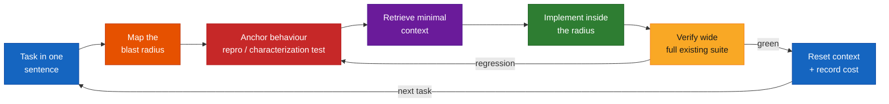
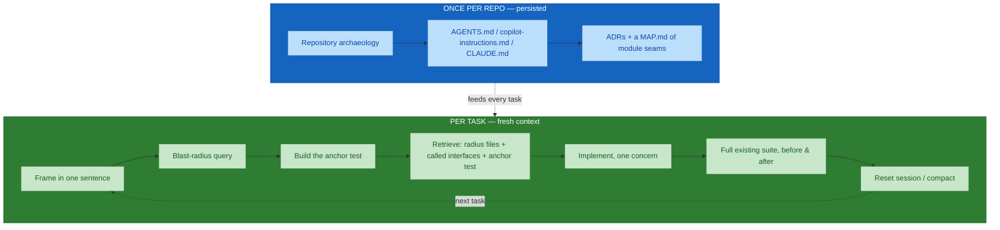
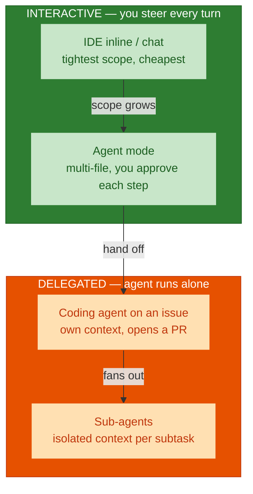
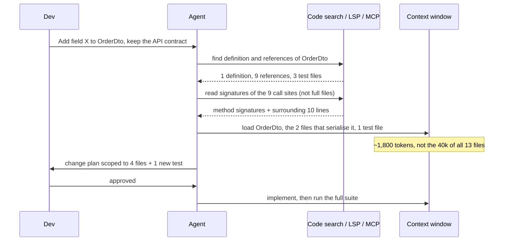
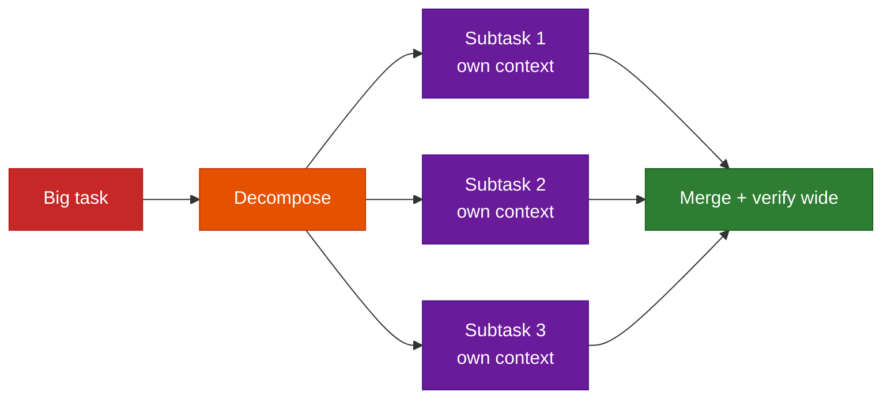

# Working with Brownfield Projects Using AI Coding Agents — Comprehensive Guide

## Overview

This guide is a practical playbook for **enhancing, fixing, and refactoring an existing
codebase with an AI coding agent** — GitHub Copilot (chat, agent mode, coding agent),
Claude Code, Cursor, Aider, Continue, Sourcegraph Amp, and similar tools — **without
letting context inflate and token cost run away**.

Two ideas run through the whole guide:

1. **Brownfield work is bounded work.** You are not free to build whatever is cleanest.
   Every change is constrained by the specification *and* by the blast radius — the code
   the change could reach — and validated against the existing test suite, not just new
   acceptance criteria.
2. **Context is a budget, not a container.** A model's context window is a finite
   attention budget. Filling it with "everything that might be relevant" makes output
   *worse* and every follow-up turn more expensive. The skill is retrieving the smallest
   sufficient context per task and resetting it when the task changes.

This is the sibling of [`legacy-to-modern-migration-with-ai.md`](./legacy-to-modern-migration-with-ai.md)
(cross-stack rewrites) and a deep-dive on the brownfield half of
[`module-05-sdd-complete-sdlc.md`](./module-05-sdd-complete-sdlc.md). The token-cost
framing extends [`module-03-prompt-context-engineering.md`](./module-03-prompt-context-engineering.md)
and [`module-11-roi-token-economics.md`](./module-11-roi-token-economics.md).

**Audience:** engineers, tech leads, and AI champions doing day-to-day feature work,
bug fixing, and refactoring in a codebase they intend to keep.

## Quick Start

The context-lean brownfield loop, in order:

1. **Archaeology once, persisted.** Understand architecture, dependencies, patterns,
   contracts, tests, and conventions — then write them into `AGENTS.md` /
   `.github/copilot-instructions.md` / `CLAUDE.md` so you never re-derive them.
2. **Frame the task in one sentence.** What should be true when it is done. Enhancement,
   bug fix, or refactor — the loop differs (see Architecture).
3. **Map the blast radius before code.** Ask the agent for callers, callees, and tests
   touched. This defines "minimal change" for *this* task.
4. **Anchor behaviour.** For a bug: a failing test that reproduces it. For a refactor:
   characterization tests over the code you will move. For an enhancement: the acceptance
   criteria.
5. **Retrieve, don't stuff.** Attach only the files/symbols in the blast radius plus the
   interfaces of what they call. Let the agent's code search pull the rest on demand.
6. **Implement inside the radius.** Follow existing patterns even if imperfect. One
   concern per change.
7. **Verify wide.** Run the *full* existing suite before and after. New test green,
   old tests still green.
8. **Reset context.** New task → new session (or `/clear` / `/compact`). Do not let one
   session accumulate three unrelated tasks.
9. **Record the cost.** Tokens or premium requests spent per accepted, merged change —
   the only number that makes AI spend comparable to value.

## Visual Summary



## Architecture

### The three brownfield jobs — and how each bends the loop

| Job | Primary risk | What anchors it | Where AI helps most | Where a human must own it |
|-----|--------------|-----------------|---------------------|---------------------------|
| **Enhancement** | Under-specifying; drifting from existing patterns | Acceptance criteria + existing patterns | Pattern-matching new code to old, wiring, tests from criteria | Deciding the design fits the architecture |
| **Bug fix** | Fixing the symptom, not the cause; new regression | A failing test that reproduces the bug | Localising the fault, proposing the minimal fix, adding the regression test | Confirming root cause, not just "tests pass now" |
| **Refactor** | Silent behaviour change; scope creep | Characterization tests over the moved code | Mechanical transformation, updating call sites, keeping tests green | Judging that behaviour is genuinely unchanged |

All three share the same skeleton (frame → blast radius → anchor → retrieve → implement →
verify wide → reset). The differences are which anchor you build and how tightly you cap
scope.

### The context-lean brownfield loop



### Context assembly: retrieval hierarchy, not a dump

A brownfield repo never fits a context window. Assemble context in rings, innermost
first, and stop as soon as the task is answerable.

```
┌─ THE REPO (millions of tokens) — never sent whole ───────────────────┐
│  ┌─ INDEXED / SEARCHABLE — agent pulls on demand ──────────────────┐ │
│  │  code search · symbol index · language server · MCP code server │ │
│  │  ┌─ PERSISTED REPO CONTEXT — small, always on ────────────────┐ │ │
│  │  │  AGENTS.md · path-scoped instructions · MAP.md · key ADRs  │ │ │
│  │  │  ┌─ TASK-SCOPED CONTEXT — the only large payload ────────┐ │ │ │
│  │  │  │  blast-radius files · called interfaces (signatures)  │ │ │ │
│  │  │  │  the anchor test · the spec/issue, summarised         │ │ │ │
│  │  │  │  ┌─ THE PROMPT ─────────────────────────────────────┐ │ │ │ │
│  │  │  │  │  one-sentence goal · constraints · done-criteria │ │ │ │ │
│  │  │  │  └─────────────────────────────────────────────────┘ │ │ │ │
│  │  │  └──────────────────────────────────────────────────────┘ │ │ │
│  │  └──────────────────────────────────────────────────────────────┘ │
│  └────────────────────────────────────────────────────────────────────┘
└──────────────────────────────────────────────────────────────────────┘
```

The select → layer → compress → scope pipeline from Module 03 is exactly the movement
from the outer ring to the inner one. Skipping it is how token inflation happens.

### Where the tokens actually go

```
Per-request token budget (illustrative, agent-mode turn)
├─ System + tool schemas ............ fixed overhead ......... cache it
├─ Persisted repo context .......... AGENTS.md, instructions .. cache it (stable)
├─ Conversation history ............ grows every turn ......... COMPACT / RESET
├─ Retrieved file contents ......... biggest variable cost .... SCOPE to blast radius
├─ Tool call results (search, test) . accumulate silently ..... prune stale results
└─ The actual instruction ........... tiny ..................... keep it sharp
```

Two of these six lines are where budgets are lost: **conversation history** that is
never reset, and **retrieved file contents** attached "just in case." Everything stable
above them should be behind a prompt cache so it is not re-billed at full rate each turn.

### Agent topology and its context cost



| Mode | Context behaviour | Best brownfield use | Token watch-out |
|------|-------------------|---------------------|-----------------|
| **Inline / chat** | Only what you `#`-mention plus the open file | A single-function fix, "explain this", a localised edit | Cheap; the risk is *too little* context, not too much |
| **Agent mode** | Explores files itself, history accumulates across the task | A feature or fix spanning a handful of files in one blast radius | History + self-retrieved files balloon on long sessions — compact between subtasks |
| **Coding agent** | Fresh, isolated context; researches, plans, implements, opens a PR | A well-specified, well-bounded change you can describe fully in the issue | You pay for its exploration; a vague issue = expensive wandering |
| **Sub-agents** | Each gets its own clean window; only the summary returns to the parent | Fan-out research ("find every caller of X"), parallel independent edits | Orchestration overhead; only worth it when subtasks are genuinely independent |

**Rule of thumb:** use the least-powerful mode that can do the task. Escalate only when
the smaller scope demonstrably cannot.

### Blast-radius retrieval — the sequence



## Core Concepts

### 1 · Repository archaeology — done once, written down

You cannot preserve behaviour, patterns, or contracts you have not captured. Before the
first change, understand — and then **persist** — six things:

| Dimension | The question | Where it lives afterwards |
|-----------|--------------|---------------------------|
| Architecture & dependencies | What are the modules and how do they depend on each other? | `MAP.md` + a dependency diagram |
| Existing design patterns | How does this codebase do repositories, services, error handling, DI? | `AGENTS.md` "Conventions" |
| API contracts | What promises do existing callers rely on? | `AGENTS.md` + contract tests |
| Existing tests | What is covered, how are tests run, what is the suite's runtime? | `AGENTS.md` "How to test" |
| Coding conventions | Naming, file layout, formatting, lint rules | Path-scoped instruction files |
| Historical decisions | Why is it this way? What was tried and rejected? | ADRs (`docs/adr/`) |

The payoff: this becomes small, stable, **cacheable** context that rides along on every
task without being re-derived — and without a human re-explaining the codebase each
session. AI is good at *drafting* all six from the code; a human verifies before it is
committed, because a wrong map produces wrong plans.

### 2 · Blast radius and the minimal-change strategy

The **blast radius** is the set of code a change can affect — directly (callers,
callees, shared state) and indirectly (transitive dependents, serialised contracts,
cached shapes). It, not the file you are editing, is the true scope of a "minimal"
change, and its outer edge is what the regression suite protects.

| Minimal-change strategy | Maximal disruption (avoid) |
|-------------------------|----------------------------|
| Change only what the task requires | "While I'm here" refactoring bundled into a feature |
| Stay inside the identified blast radius | Touching files outside the change's real scope |
| Follow existing patterns, even imperfect ones | Introducing a new pattern beside the old one |
| One concern per commit / PR | Mixed feature + reformat + rename in one diff |
| Re-run the full suite before and after | Running only the tests near your edit |

Ask the agent to **produce the blast radius as an artifact** ("list every caller,
every test, and every serialised contract that touches this symbol") before it writes
code. Review that list. It is both the scope contract and the regression checklist.

### 3 · Context inflation — the mechanisms

Inflation is not one mistake; it is several habits that each add tokens without adding
output quality:

| Mechanism | How it creeps in | The fix |
|-----------|------------------|---------|
| **Whole-file attachment** | Adding a 900-line file for one function | Attach the symbol / range; let search fetch the rest |
| **History accumulation** | One long session across many tasks | `/clear` or new session per task; `/compact` between subtasks |
| **Verbatim specs & threads** | Pasting an entire issue thread or spec doc | Summarise to the acceptance criteria and constraints |
| **Re-sending stable context** | Re-pasting conventions every turn | Put them in an instructions file; enable prompt caching |
| **Stale tool results** | Old search output, superseded file reads left in-window | Context editing / result pruning; re-retrieve fresh when needed |
| **"Big window so why not"** | Filling 200k tokens because it is available | Smaller, sharper context measurably beats bigger, vaguer context |
| **Speculative exploration** | Vague prompt → agent reads 30 files to guess intent | Give it the blast radius up front so it doesn't have to search blind |

### 4 · Token-optimal practices

- **Retrieve over stuff.** A code-search / symbol-index / language-server / MCP code
  server lets the agent pull exact snippets on demand. This beats pre-loading, because
  the agent fetches only what a step actually needs.
- **Signatures before bodies.** For call sites, the method signature plus a few lines of
  context is usually enough to make a change safe. Full bodies only when the logic
  matters.
- **Summarise inputs.** Specs, issues, and design docs go in as their decisions and
  constraints, not their prose.
- **Cache the stable layer.** System prompt, tool schemas, `AGENTS.md`, and conventions
  are identical across turns — prompt caching bills them at a fraction of the rate
  instead of re-charging full price each call.
- **Compact deliberately.** Compaction summarises history so far and drops the raw
  turns; do it at task boundaries, not mid-reasoning.
- **Right-size the model and window.** A larger context window and a higher reasoning
  level cost more per request. Use the small model for localised edits and mechanical
  refactors; reserve the large model + big window for genuine multi-file reasoning.
- **Prefer deterministic tools for mechanical change.** An AST codemod (OpenRewrite,
  jscodeshift, ast-grep) that renames a symbol across 200 files costs zero tokens and
  cannot hallucinate. Use the agent for the judgement, the codemod for the sweep.
- **Measure.** Log tokens / premium requests per *accepted, merged* change. A low
  per-turn cost with a high rejection rate is worse value than the reverse.

### 5 · Task decomposition and fresh context per subtask

A large brownfield task is several small ones. Break it into independently verifiable
steps, and give each step the **narrowest context it needs** — ideally a fresh window,
so step 3 is not paying to carry steps 1 and 2's file reads and dead ends.



### 6 · Bug fixing without context inflation

1. **Reproduce in a test first.** A failing test that captures the bug is the cheapest,
   most precise bug report you can give an agent — and it becomes the regression guard.
2. **Localise before loading.** Use search / stack traces / `git bisect` / `git blame`
   to narrow to the suspect region, *then* load that region — not the whole subsystem.
3. **Ask for root cause, not a patch.** "Explain why this fails" before "fix it."
   A confident patch over a misunderstood cause is a future bug.
4. **Minimal fix inside the radius.** Resist the urge to refactor the buggy area.
5. **Verify wide.** New test green; full existing suite still green; the reproduction
   steps from the original report re-checked by hand.

### 7 · Refactoring without behaviour change

1. **Characterization tests first.** Snapshot what the code *actually does* (including
   quirks) over the range you will change. ApprovalTests / Verify / golden-master
   snapshots are the workhorses. This is your oracle.
2. **Deterministic tools where they fit.** IDE rename/extract, OpenRewrite recipes,
   `ast-grep` / jscodeshift / tree-sitter codemods — these are safe and free. Use the
   agent for what needs judgement (splitting a class along the right seam) and the
   codemod for the mechanical sweep.
3. **One transformation at a time.** Rename, *then* extract, *then* move — each a green
   commit. Never a stack of transformations in one diff.
4. **Tests stay green at every step.** If a characterization test changes, you changed
   behaviour — stop and decide if that was intended.
5. **Scope cap.** State the file/module boundary up front and hold the agent to it.

### 8 · Grounding and verifying the agent's output

Agents hallucinate APIs, imagine helper methods that do not exist, and confidently
describe an architecture the repo does not have. Non-negotiable checks for brownfield:

- **Every referenced symbol exists.** Compile / type-check; do not trust the diff on
  sight.
- **The pattern matches the codebase.** New code should be indistinguishable in style
  from what surrounds it.
- **The full suite ran and passed** — you saw the output, not "should pass."
- **The blast-radius list was actually covered** — each caller and contract checked.
- **A human is accountable** for the merged change. AI generates; you own the outcome.

### 9 · Measuring — cost per accepted change

From [`module-11-roi-token-economics.md`](./module-11-roi-token-economics.md): raw token
spend is meaningless alone. Track **spend per output that actually merged at production
quality**. Rejected or heavily-reworked outputs cost tokens and produced little. This
number tells you whether a brownfield AI workflow should be **scaled, tuned, restricted,
or retired**.

## Toolkits & Frameworks

### Persisted-context surfaces (the "once, written down" layer)

| Surface | Tool | What it holds |
|---------|------|---------------|
| **`AGENTS.md`** | Cross-tool emerging standard (Amp, Cursor, others; Copilot & Claude Code read their own files) | Build/test commands, conventions, architecture summary, "don'ts" |
| **`.github/copilot-instructions.md`** + path-scoped `*.instructions.md` | GitHub Copilot | Repo-wide and per-directory conventions applied to every request |
| **Prompt files** (`*.prompt.md`) | GitHub Copilot / VS Code | Reusable task templates ("fix a bug", "add an endpoint") invoked as slash commands |
| **`CLAUDE.md`** (+ nested, + `@import`) | Claude Code | Same role; hierarchical, closest file wins |
| **Cursor rules** (`.cursor/rules/*.mdc`) | Cursor | Scoped, always-on or auto-attached instruction blocks |
| **Copilot Spaces** | GitHub Copilot | Bundled repos + docs + issues + notes as reusable, shareable context |
| **ADRs** (`docs/adr/`) | Tool-agnostic (MADR, adr-tools) | The "why" — decisions made and rejected |

### AI coding agents and their context controls

| Tool | Brownfield strengths | Context / token controls |
|------|----------------------|--------------------------|
| **GitHub Copilot — chat / inline** | Localised edits, explain-this, quick fixes | `#file` `#selection` `#codebase` `#sym` to scope precisely; smallest footprint |
| **GitHub Copilot — agent mode** | Multi-file changes in one blast radius | Instruction files; model picker; you approve each edit |
| **GitHub Copilot — coding agent** | Delegated, well-specified issues → PR | Isolated context; cost tracks issue clarity; premium-request billing |
| **Claude Code** | Large-repo comprehension, planning, idiomatic refactors | `/clear`, `/compact`, subagents with isolated windows, `CLAUDE.md`, context editing + memory |
| **Cursor** | IDE-native agent with codebase index | Rules, `@`-symbols/files, semantic codebase retrieval |
| **Aider** | Terminal pair-programming, tight diffs | Automatic **repo map** (a ranked, compressed symbol view) instead of full files; explicit `/add` `/drop` |
| **Continue** | Open-source, IDE, custom context providers | `@`-context providers; you compose exactly what is sent |
| **Sourcegraph Amp / Cody** | Codebase-wide search & comprehension at scale | Server-side retrieval over large/multi-repo code; `AGENTS.md` |

### Retrieval & comprehension (feed the agent, don't pre-load)

| Tool | Purpose |
|------|---------|
| **Language servers (LSP)** | Exact go-to-definition, find-references, call hierarchy — the blast-radius primitives |
| **`tree-sitter`** | Fast, syntax-aware parsing behind many agents' code maps and codemods |
| **Sourcegraph** | Cross-repo code search and navigation; precise "who calls this" at scale |
| **SciTools Understand** | Deep architecture / dependency analysis and metrics for legacy code |
| **MCP code servers** (filesystem, Git, GitHub, Sourcegraph) | Give the agent scoped, on-demand retrieval instead of a context dump |
| **Semgrep** | Pattern-based static analysis — surface risky patterns before carrying them over |

### Deterministic transformation (zero tokens, no hallucination)

| Tool | Purpose |
|------|---------|
| **OpenRewrite / Moderne** | Recipe-based mass refactoring, dependency & API migrations (JVM-centric, expanding) |
| **jscodeshift** | AST codemods for JS/TS — mechanical rename/replace across a repo |
| **ast-grep** | Language-agnostic structural search-and-rewrite from the CLI |
| **IDE refactorings** | Rename, extract, move, change-signature — safe and instantaneous |
| **`git bisect` / `git blame`** | Localise a regression before loading any code |

### Spec & change discipline

| Tool | Purpose |
|------|---------|
| **GitHub Spec Kit** | `spec → plan → tasks → implement` structure for a bounded brownfield change |
| **OpenSpec-style folder** | A checked-in `spec.md` / `plan.md` / `tasks.md` per change, kept in the PR |
| **ApprovalTests / Verify** | Golden-master / snapshot tests — the characterization-test workhorse |
| **Testcontainers** | Real ephemeral dependencies for regression-grade integration tests |

## Best Practices Checklist

- [ ] Repository archaeology done and **committed** as `AGENTS.md` / instructions / `MAP.md` / ADRs
- [ ] Stable context (system, schemas, conventions) behind a **prompt cache**
- [ ] Every task framed in one sentence with explicit done-criteria
- [ ] Blast radius produced as an artifact and reviewed **before** code
- [ ] An anchor built first: repro test (bug), characterization tests (refactor), acceptance criteria (enhancement)
- [ ] Context scoped to blast-radius files + called **signatures** + the anchor — not whole files
- [ ] Agent retrieval (search / LSP / MCP) enabled so the rest is pulled on demand
- [ ] One concern per commit / PR; scope cap stated and held
- [ ] Deterministic codemods used for mechanical sweeps; agent reserved for judgement
- [ ] Full existing test suite run **before and after**, output seen
- [ ] Every referenced symbol verified to exist; new code matches surrounding style
- [ ] Context reset (`/clear`, new session) or compacted at every task boundary
- [ ] Model + context window right-sized to the task, not maxed by default
- [ ] Cost per **accepted, merged** change logged and reviewed against value

## Common Pitfalls

| Pitfall | Consequence | Avoid by |
|---------|-------------|----------|
| Re-explaining the codebase every session | Wasted tokens; inconsistent assumptions | Persist archaeology in `AGENTS.md` / instructions |
| "Add the whole folder to context" | Window fills, output degrades, every turn costs more | Retrieval hierarchy: radius files + signatures only |
| One session, many unrelated tasks | History carries dead context into every later task | New session / `/clear` per task |
| Fixing the symptom | The bug returns in a new form | Reproduce in a test; ask for root cause first |
| Refactor bundled into a feature PR | Un-reviewable diff; regressions hide in the noise | One concern per PR; separate refactor commits |
| Trusting "tests should pass" | Broken main; regressions shipped | Run the full suite, read the output |
| Trusting the agent's architecture summary | Plans built on a codebase that doesn't exist | Verify `MAP.md` against the code before relying on it |
| Letting the agent explore a vague prompt | Pays for 30 speculative file reads | Hand it the blast radius up front |
| Maxing the model + window for every edit | Premium-request / token spend with no quality gain | Small model for localised work; escalate only when needed |
| Hand-writing a 200-file rename | Slow, error-prone, token-expensive | AST codemod (OpenRewrite / jscodeshift / ast-grep) |

## References

*Every link below was fetched and confirmed reachable (HTTP 200) on 2026-09-03.*

### Programme materials

- Course Outline: `courseOutline/NIIT_Honeywell_AI_Champions_GitHub_AgentPrism (Software_Engineering).pdf`
- [`module-03-prompt-context-engineering.md`](./module-03-prompt-context-engineering.md) — the select → layer → compress → scope pipeline and token-inflation anti-patterns
- [`module-05-sdd-complete-sdlc.md`](./module-05-sdd-complete-sdlc.md) — repository archaeology, blast radius, minimal-change strategy
- [`module-07-mcp-agentic-workflows.md`](./module-07-mcp-agentic-workflows.md) — MCP retrieval architecture and governed tool access
- [`module-11-roi-token-economics.md`](./module-11-roi-token-economics.md) — cost per accepted production-quality output
- [`legacy-to-modern-migration-with-ai.md`](./legacy-to-modern-migration-with-ai.md) — the cross-stack-rewrite sibling of this guide

### Context engineering & token cost

- [Anthropic — Effective context engineering for AI agents](https://www.anthropic.com/engineering/effective-context-engineering-for-ai-agents) — context as a finite attention budget to curate, not fill.
- [Anthropic — Context management on the Claude Developer Platform](https://claude.com/blog/context-management) — context editing (removing stale tool results) and the memory tool.
- [Anthropic — Claude Code best practices](https://www.anthropic.com/engineering/claude-code-best-practices) — driving a large-context agent through comprehension and change tasks; `/clear`, `/compact`, scoping.
- [Anthropic — Building effective agents](https://www.anthropic.com/engineering/building-effective-agents) — decomposition, routing, and orchestration patterns for multi-step work.
- [Anthropic — Prompt caching](https://platform.claude.com/docs/en/build-with-claude/prompt-caching) — bill stable, reused context at a fraction of the rate.
- [Anthropic — Token counting](https://platform.claude.com/docs/en/build-with-claude/token-counting) — measure context size before sending.
- [Anthropic — Context windows](https://platform.claude.com/docs/en/build-with-claude/context-windows) — how the window is consumed across turns.
- [GitHub — Prompt engineering for Copilot Chat](https://docs.github.com/en/copilot/concepts/prompting/prompt-engineering) — goal-first, specifics, examples, decomposition, iteration.
- [GitHub Copilot Chat Cookbook](https://docs.github.com/en/copilot/tutorials/copilot-chat-cookbook) — worked prompt patterns, including refactoring and debugging tasks.
- [Choosing AI models in Copilot — model comparison](https://docs.github.com/en/copilot/reference/ai-models/model-comparison) — larger windows and higher reasoning consume more premium requests.

### Persisted repo context

- [GitHub — Add repository custom instructions](https://docs.github.com/en/copilot/how-tos/configure-custom-instructions/add-repository-instructions) — `.github/copilot-instructions.md` and path-scoped `*.instructions.md`.
- [GitHub — Configure custom instructions for Copilot](https://docs.github.com/en/copilot/how-tos/custom-instructions) — the full set: repo, path, personal, and prompt files.
- [VS Code — Prompt files](https://code.visualstudio.com/docs/copilot/customization/prompt-files) — reusable `*.prompt.md` task templates as slash commands.
- [VS Code — Add context to chat](https://code.visualstudio.com/docs/copilot/chat/copilot-chat-context) — `#`-mentions and `@`-participants to scope each request.
- [GitHub Copilot Spaces](https://docs.github.com/en/copilot/concepts/context/spaces) — bundling repos, docs, issues, and notes into reusable, shareable context.
- [Claude Code — Memory (`CLAUDE.md`)](https://docs.anthropic.com/en/docs/claude-code/memory) — hierarchical project/user memory files and imports.
- [Cursor — Rules](https://cursor.com/docs/rules) — `.cursor/rules` system-level instructions for the agent.
- [AGENTS.md](https://agents.md/) — the emerging cross-tool convention for a single agent-instructions file.

### Agents, retrieval & MCP

- [GitHub Copilot coding agent](https://docs.github.com/en/copilot/concepts/agents/coding-agent/about-coding-agent) — delegate a bounded issue; the agent researches, plans, implements, and opens a PR.
- [VS Code — Agent mode](https://code.visualstudio.com/docs/copilot/chat/chat-agent-mode) — multi-file, plan-and-execute editing with per-step approval.
- [Claude Code — Subagents](https://docs.anthropic.com/en/docs/claude-code/sub-agents) — isolated context windows for fan-out and parallel work.
- [Aider — Repository map](https://aider.chat/docs/repomap.html) — a ranked, compressed symbol view sent instead of whole files.
- [Aider — Tips](https://aider.chat/docs/usage/tips.html) — `/add` `/drop`, small focused changes, managing what is in context.
- [Continue — documentation](https://docs.continue.dev/) — open-source IDE agent with composable `@`-context providers.
- [Sourcegraph Amp](https://ampcode.com/) — agent with server-side retrieval over large and multi-repo codebases.
- [Sourcegraph — documentation](https://sourcegraph.com/docs) — cross-repo code search and navigation to feed agents precise context.
- [Model Context Protocol](https://modelcontextprotocol.io/) — the standard for connecting agents to retrieval and tool servers.
- [modelcontextprotocol/servers](https://github.com/modelcontextprotocol/servers) — reference servers (filesystem, Git, and more).
- [VS Code — MCP servers](https://code.visualstudio.com/docs/copilot/customization/mcp-servers) — adding MCP servers to Copilot with trust and approval prompts.

### Brownfield engineering & safe change

- [Understand Legacy Code](https://understandlegacycode.com/) — techniques for repository archaeology, characterization tests, and safe incremental change.
- [Working Effectively with Legacy Code — key points](https://understandlegacycode.com/blog/key-points-of-working-effectively-with-legacy-code/) — Michael Feathers' seams and characterization tests, summarised.
- [Wikipedia — Characterization test](https://en.wikipedia.org/wiki/Characterization_test) — capturing existing behaviour before changing it.
- [Martin Fowler — Strangler Fig Application](https://martinfowler.com/bliki/StranglerFigApplication.html) — incremental replacement without a big-bang cutover.
- [Martin Fowler — Patterns of Legacy Displacement](https://martinfowler.com/articles/patterns-legacy-displacement/) — event interception, asset capture, feature parity vs improvement.
- [Azure Architecture Center — Anti-Corruption Layer pattern](https://learn.microsoft.com/en-us/azure/architecture/patterns/anti-corruption-layer) — isolating a new component from a legacy model.

### Deterministic transformation & analysis

- [OpenRewrite](https://docs.openrewrite.org/) — deterministic, recipe-based mass refactoring and dependency migration.
- [jscodeshift](https://github.com/facebook/jscodeshift) — AST codemod runner for JavaScript/TypeScript.
- [ast-grep](https://ast-grep.github.io/) — CLI structural search and rewrite across many languages.
- [tree-sitter](https://tree-sitter.github.io/tree-sitter/) — incremental, syntax-aware parsing behind many code maps and codemods.
- [SciTools Understand](https://scitools.com/) — architecture and dependency analysis for large legacy codebases.
- [Semgrep](https://semgrep.dev/) — pattern-based static analysis to surface risky patterns before carrying them over.

### Spec & test discipline

- [GitHub Spec Kit](https://github.com/github/spec-kit) — `spec → plan → tasks → implement` for a bounded change.
- [The GitHub Blog — Spec-driven development with AI](https://github.blog/ai-and-ml/generative-ai/spec-driven-development-with-ai-get-started-with-a-new-open-source-toolkit/) — the SDD approach and a worked example.
- [DORA — Impact of Generative AI on software development](https://dora.dev/ai/) — evidence on measuring AI's effect on delivery throughput and stability.
