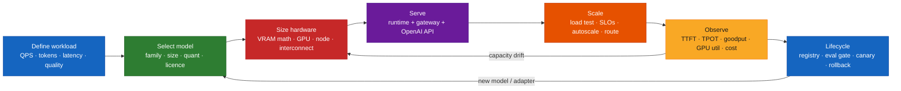
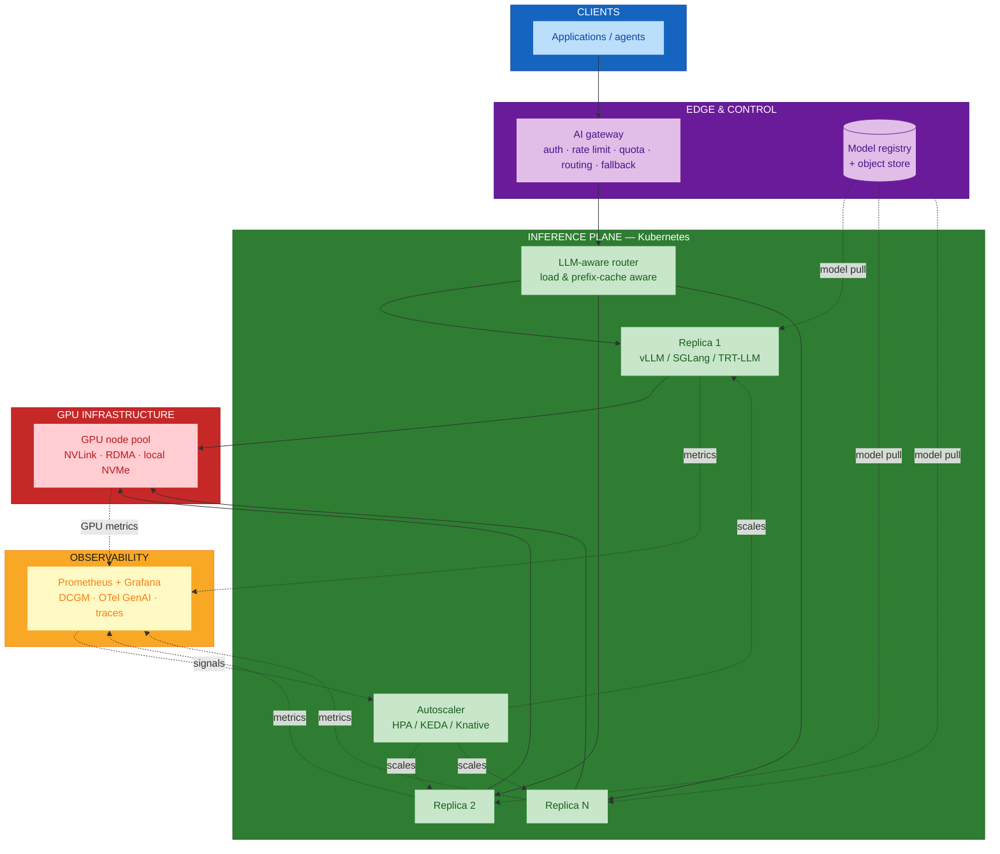
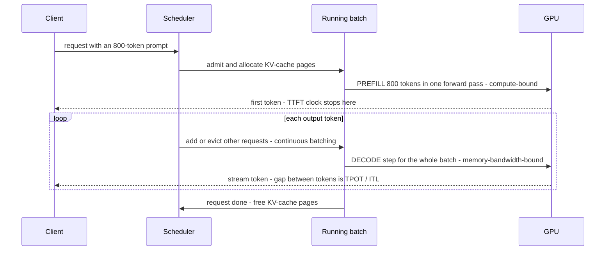
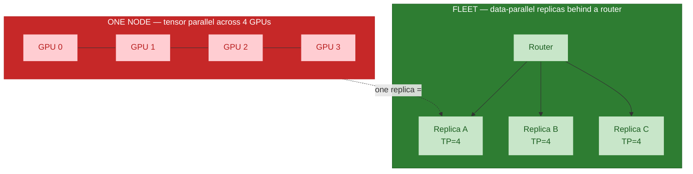
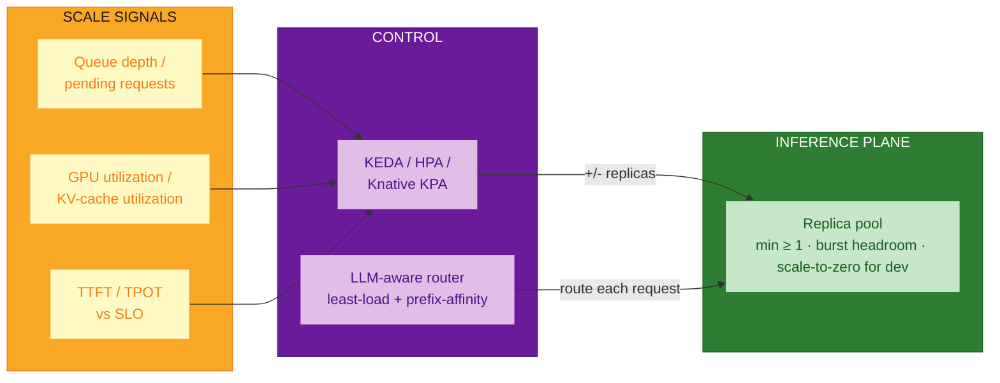
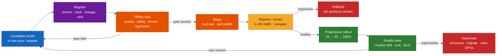

# Self-Hosting Language Models (SLM & LLM) — Comprehensive Guide

## Overview

This guide is a practical playbook for **running open-weight language models on
infrastructure you control** — from a single-GPU SLM behind an internal API to a
multi-node, autoscaled LLM fleet serving production traffic. It covers the full arc:

- **Model selection** — matching a model family, size, context length, quantization, and
  licence to the workload.
- **Hosting & serving** — the inference stack (runtime, orchestration, gateway), request
  lifecycle, and the optimizations that make it fast.
- **Scaling to production grade** — capacity planning, SLOs, autoscaling, routing,
  observability, and high availability.
- **Model lifecycle** — registry and versioning, evaluation gates, canary / shadow /
  blue-green rollout, rollback, adapter (LoRA) management, and deprecation.
- **Infrastructure & hardware** — GPU/accelerator selection, VRAM and node sizing,
  interconnect, and total cost of ownership.

**When self-hosting makes sense:** data residency or compliance requirements, sustained
high volume where per-token API cost dominates, strict latency or availability control, a
need for a customized/fine-tuned model, or air-gapped deployment.

**When it usually does not:** low or spiky volume, a need for frontier capability that
only closed models currently deliver, or a team without platform/MLOps capacity. Self-hosting
trades a per-token bill for a **fixed fleet cost plus operational burden** — the economics
only work at high, steady utilization.

**Audience:** platform engineers, MLOps/LLMOps teams, infrastructure architects, and
technical leads evaluating or operating self-hosted inference.

## Quick Start

The decision path, then the smallest thing that works:

1. **Define the workload.** Peak requests/sec, prompt and output token distributions,
   latency target (interactive chat vs batch), and the quality bar.
2. **Pick the smallest model that clears the quality bar.** Evaluate candidates on *your*
   tasks, not a leaderboard. An 8B model that passes is cheaper and faster than a 70B that
   also passes.
3. **Do the VRAM math.** `weights + KV cache + activations + overhead`. Choose quantization
   (BF16 → FP8 → INT4) to fit the target GPU with headroom.
4. **Choose a runtime.** vLLM or SGLang for throughput-oriented GPU serving; TensorRT-LLM
   + Triton for maximum NVIDIA performance; TGI for a managed-feel HF stack; llama.cpp /
   Ollama for CPU or edge.
5. **Serve behind a real API.** OpenAI-compatible endpoint, health checks, metrics, an
   auth layer.
6. **Load-test before launch.** Find the knee of the throughput/latency curve; set replica
   count and autoscaling from measured numbers.
7. **Wrap it in lifecycle.** Model in a registry, an eval suite as a merge gate, canary
   rollout, a rollback path, dashboards with SLOs.

A minimal single-GPU serve with vLLM (OpenAI-compatible):

```bash
# One 8B model, BF16, on a single 24-48 GB GPU
pip install vllm
vllm serve meta-llama/Llama-3.1-8B-Instruct \
  --max-model-len 8192 \
  --gpu-memory-utilization 0.90 \
  --enable-prefix-caching

# Client — identical shape to the OpenAI API
curl http://localhost:8000/v1/chat/completions \
  -H "Content-Type: application/json" \
  -d '{"model":"meta-llama/Llama-3.1-8B-Instruct",
       "messages":[{"role":"user","content":"Explain KV cache in one paragraph."}]}'
```

## Visual Summary



## Architecture

### Reference production serving architecture



### The serving stack, layer by layer

```
┌──────────────────────────────────────────────────────────────────────┐
│  APPLICATION            chat · RAG · agents · batch pipelines         │
├──────────────────────────────────────────────────────────────────────┤
│  GATEWAY / ROUTING      OpenAI-compat API · authN/Z · quotas ·        │
│                         model routing · fallback · semantic cache     │
├──────────────────────────────────────────────────────────────────────┤
│  ORCHESTRATION          Kubernetes · KServe / Ray Serve / KubeAI ·    │
│                         llm-d · HPA·KEDA·Knative · Kueue · LWS        │
├──────────────────────────────────────────────────────────────────────┤
│  INFERENCE RUNTIME      vLLM · SGLang · TensorRT-LLM+Triton · TGI ·   │
│                         LMDeploy · llama.cpp — continuous batching,   │
│                         PagedAttention KV cache, spec decode, quant   │
├──────────────────────────────────────────────────────────────────────┤
│  MODEL / COMPILER       weights (safetensors/GGUF) · LoRA adapters ·  │
│                         CUDA graphs · TensorRT engines · FlashAttn    │
├──────────────────────────────────────────────────────────────────────┤
│  ACCELERATOR RUNTIME    CUDA / ROCm / Neuron · NCCL/RCCL · drivers ·  │
│                         GPU Operator · device plugin · MIG            │
├──────────────────────────────────────────────────────────────────────┤
│  HARDWARE               GPU (H100/H200/L40S/MI300X/…) · NVLink ·      │
│                         InfiniBand/RoCE · CPU · RAM · NVMe · network  │
└──────────────────────────────────────────────────────────────────────┘
```

### Request lifecycle: prefill, decode, and continuous batching

An LLM request has two phases with very different hardware profiles. **Prefill** processes
the whole prompt in parallel (compute-bound). **Decode** generates one token per forward
pass, reloading all weights each step (memory-bandwidth-bound). Continuous batching
interleaves many requests so the GPU is never idle waiting on one slow decode.



### Deployment & parallelism patterns

| Pattern | Fits a model of | Mechanism | Interconnect need | Notes |
|---------|-----------------|-----------|-------------------|-------|
| **Single GPU** | up to ~1 GPU's VRAM (e.g. ≤13B BF16 on 48 GB, ≤70B INT4 on 48 GB) | one process, one device | none | Simplest; start here |
| **Tensor parallel (TP)** | one node, 2–8 GPUs | split each layer's matmuls across GPUs | high — NVLink/NVSwitch strongly preferred | Lowers latency; chatty, keep within a node |
| **Pipeline parallel (PP)** | multi-node | split layers into stages across nodes | medium — tolerates Ethernet/RoCE better | Adds pipeline-bubble latency; raises throughput |
| **Expert parallel (EP)** | large MoE models | distribute experts across GPUs | high | For Mixtral / DeepSeek-style MoE |
| **Data parallel replicas** | any model that fits the above | N independent copies behind a router | none between replicas | The primary horizontal-scaling axis |
| **Disaggregated prefill/decode** | high-traffic, latency-sensitive | prefill pool and decode pool on separate GPUs, KV transferred between | high (KV transfer) | Removes prefill/decode interference; used by llm-d, Dynamo, DistServe |



### Scaling & autoscaling architecture



**Autoscaling truths for LLM serving:**

- **CPU utilization is the wrong signal.** Scale on queue depth, batch fullness, KV-cache
  utilization, or SLO headroom.
- **Cold starts are minutes, not seconds.** Pulling a 40 GB model, loading to VRAM, and
  building CUDA graphs takes time. Keep a warm minimum; pre-pull images and weights; use
  node-local NVMe caches.
- **Scale-to-zero** suits dev/internal/low-traffic models. Production interactive traffic
  needs a warm floor.
- **GPUs are scarce and lumpy.** You scale by whole GPUs (or whole nodes for TP). Plan
  capacity in those units and use a queue (Kueue) for burst/batch jobs.

## Core Concepts

### 1 · SLM vs LLM — the size spectrum

There is no hard boundary, but the operational distinction is real:

| | Small language model (SLM) | Large language model (LLM) |
|--|----------------------------|-----------------------------|
| Rough size | ~0.5B–15B params | ~30B–700B+ params (dense or MoE) |
| Fits on | 1 GPU (often a cheap one), sometimes CPU/edge | multi-GPU, sometimes multi-node |
| Latency / cost | low | higher |
| Best for | classification, extraction, routing, RAG answer synthesis, well-scoped agents, on-prem/edge | open-ended reasoning, broad knowledge, hard coding/agentic tasks |
| Strategy | **default to the smallest that passes your eval**; fine-tune to close gaps | reserve for tasks an SLM demonstrably cannot do; route to it selectively |

A common production shape is a **cascade**: an SLM handles most traffic, escalating only
hard cases to an LLM.

### 2 · Model selection

| Dimension | What to check | Why it matters |
|-----------|---------------|----------------|
| **Capability on your tasks** | Run your own eval set (accuracy, format adherence, refusal rate, tool-call correctness) | Leaderboards do not predict your workload |
| **Licence** | Commercial use, redistribution, output/training restrictions, acceptable-use terms, monthly-active-user thresholds | Some "open" weights carry real constraints (e.g. Llama's MAU clause); Apache-2.0/MIT are cleanest |
| **Context length** | Advertised vs *effective* (quality often degrades well before the max) | KV-cache cost scales with context; long context is expensive to serve |
| **Architecture** | Dense vs MoE; GQA/MQA (smaller KV cache); tokenizer efficiency for your languages | Drives VRAM, throughput, and parallelism choice |
| **Quantization availability** | Are there trusted FP8/INT4 (GPTQ/AWQ/GGUF) builds, or must you make them? | Determines the GPU you need |
| **Ecosystem support** | Is it a first-class citizen in your runtime (vLLM/TRT-LLM/SGLang)? | Day-1 support vs waiting for a kernel |
| **Provenance & safety** | Publisher reputation, model card, safety tuning, known jailbreaks | Supply-chain and reputational risk |

### 3 · Quantization

Trading numeric precision for memory and speed. Decode is memory-bandwidth-bound, so
smaller weights are also *faster*.

| Format | Bits | Typical quality loss | Use when |
|--------|------|----------------------|----------|
| **BF16 / FP16** | 16 | none (reference) | You have the VRAM; training/fine-tune baseline |
| **FP8** (E4M3) | 8 | negligible on H100/H200/MI300 with calibration | Modern datacenter GPUs; near-lossless 2× memory win |
| **INT8** (SmoothQuant, W8A8) | 8 | small | Broad hardware support |
| **INT4** (GPTQ, AWQ, W4A16) | 4 (weights) | modest; task-dependent, always re-evaluate | Fit a big model on one GPU; latency-bound single-stream |
| **GGUF** (llama.cpp, Q4_K_M etc.) | 2–8 | varies by level | CPU / Apple Silicon / edge; Ollama |

Rule: **quantize, then re-run your eval suite.** A 4-bit model that fails your format or
reasoning checks is not a saving.

### 4 · Hardware selection and sizing

**VRAM budget (per replica):**

```
Total VRAM  ≈  Weights  +  KV cache  +  Activations/workspace  +  Runtime overhead

Weights      = params × bytes_per_param
               70B × 2 (BF16)  = 140 GB      → needs 2×80 GB or 4×48 GB (TP)
               70B × 1 (FP8)   =  70 GB      → fits 1×80 GB tightly, 2×48 GB comfortably
               8B  × 2 (BF16)  =  16 GB      → fits a 24 GB GPU

KV cache     ≈ 2 × n_layers × n_kv_heads × head_dim × bytes × seq_len × concurrency
               (GQA/MQA shrink n_kv_heads dramatically)
               A rough Llama-3.1-8B figure: ~0.12 GB per 1K tokens of context (FP16 KV)
               → 50 concurrent requests × 4K context ≈ 24 GB of KV cache alone

Overhead     ≈ 1–3 GB (CUDA context, NCCL buffers, fragmentation, activation peaks)
```

Two consequences: (1) **KV cache, not weights, is often the capacity limit** at high
concurrency — it decides how many parallel requests a GPU holds; (2) leave 10–15% VRAM
headroom (`--gpu-memory-utilization 0.85–0.92`) or you will hit OOM under load spikes.

**GPU shortlist (datacenter inference, 2024–2025 generation):**

| GPU | Memory | Rough fit | Notes |
|-----|--------|-----------|-------|
| **NVIDIA H200** | 141 GB HBM3e | 70B FP8 on one GPU; 8B/13B with huge batch | Highest memory bandwidth in class; best single-GPU LLM host |
| **NVIDIA H100** | 80 GB | 70B FP8 (tight) or across 2; strong all-rounder | FP8 support; NVLink for TP |
| **NVIDIA A100** | 40 / 80 GB | 70B across 2–4; 8–34B comfortably | No FP8; still capable and widely available |
| **NVIDIA L40S** | 48 GB | ≤34B, or 70B INT4; great throughput/$ | No NVLink — prefer single-GPU replicas |
| **NVIDIA L4** | 24 GB | SLMs (≤8–13B), quantized | Low power, dense racking, cost-efficient for small models |
| **AMD Instinct MI300X** | 192 GB | 70B+ on one GPU; large batches | ROCm + vLLM support; huge memory a real advantage |
| **AWS Inferentia2 / Trainium** | device-specific | via Neuron SDK / TGI-Neuron | Lower $/token on AWS for supported models |
| **Google TPU v5e/v6** | device-specific | via JetStream / vLLM-TPU | GCP-native economics |

**Beyond the GPU — size the rest of the node:**

| Resource | Guidance |
|----------|----------|
| **GPU count per replica** | Smallest TP that fits with KV headroom; keep TP inside one NVLink domain |
| **Interconnect** | NVLink/NVSwitch for intra-node TP; InfiniBand or RoCE (≥100–400 Gb/s) for multi-node PP/EP and KV transfer |
| **CPU** | ~4–8 vCPU per GPU for tokenization, scheduling, request handling; more for heavy pre/post-processing |
| **System RAM** | ≥1.5–2× total VRAM (model staging, page cache, CPU-offload buffers) |
| **Local disk** | Fast NVMe, 2–5× model size, for a weights cache so restarts/scale-ups don't re-download |
| **Network egress** | Streaming tokens is light; model pulls are heavy — cache registries regionally |
| **MIG (Multi-Instance GPU)** | Partition an A100/H100 into isolated slices for many small models or tenants |

### 5 · KV cache & PagedAttention

The KV cache stores attention keys/values for every token so decode doesn't recompute
them. Naive allocation reserves the max sequence length per request and wastes 60–80% of
it. **PagedAttention** (vLLM) manages the cache in fixed-size pages like virtual memory —
near-zero waste, and it enables **prefix caching** (shared system-prompt/RAG-context pages
reused across requests) and copy-on-write for parallel sampling.

### 6 · Batching

| Strategy | Behaviour | Verdict |
|----------|-----------|---------|
| **Static batching** | Wait for N requests, run together, all finish before the next batch | Wastes GPU on mixed-length outputs; avoid for serving |
| **Dynamic batching** | Time-window batching (Triton classic) | OK for fixed-shape models, weak for autoregressive LLMs |
| **Continuous / in-flight batching** | Add and evict requests every decode step; the batch never drains | **The standard** for LLM serving (vLLM, TGI, TRT-LLM, SGLang) |

### 7 · Throughput & latency optimizations

| Technique | Helps | Cost / caveat |
|-----------|-------|---------------|
| **Continuous batching** | throughput | already default; tune max batch / max tokens |
| **PagedAttention + prefix caching** | throughput, TTFT on shared prefixes | needs cache-aware routing to pay off across replicas |
| **Quantization (FP8/INT4)** | memory, decode speed, cost | re-evaluate quality |
| **Chunked prefill** | smooths TTFT vs TPOT trade-off under load | slight throughput cost |
| **Speculative decoding** (draft model / n-gram / EAGLE / Medusa) | latency (fewer target-model steps) | extra VRAM for a draft; gains shrink at high batch sizes |
| **Tensor parallel** | latency for a big model | needs NVLink; communication overhead |
| **Pipeline parallel** | throughput across nodes | pipeline-bubble latency |
| **Disaggregated prefill/decode** | tail latency, predictable TPOT | operational complexity; KV-transfer bandwidth |
| **CUDA graphs / compiled kernels / FlashAttention** | latency, throughput | usually on by default in mature runtimes |

**The core trade-off:** throughput (tokens/sec/GPU, i.e. cost) and latency (TTFT, TPOT)
pull against each other via batch size. Larger batches = more throughput, worse per-request
latency. Pick the operating point from your SLO, then size the fleet.

### 8 · Serving runtimes compared

| Runtime | Strengths | Consider when |
|---------|-----------|---------------|
| **vLLM** | PagedAttention origin, broad model + hardware support, OpenAI-compatible server, large community, production-stack Helm charts | Default choice for GPU serving |
| **SGLang** | RadixAttention (aggressive prefix reuse), fast structured output, strong on agent/multi-turn | Heavy shared-prefix or structured-decoding workloads |
| **TensorRT-LLM + Triton** | Best raw NVIDIA performance, FP8/INT4 kernels, in-flight batching, enterprise features | Max performance on NVIDIA, you can invest in engine builds |
| **Hugging Face TGI** | Turnkey, multi-backend (now can use vLLM/TRT-LLM under the hood), tight HF integration | Want an HF-native managed feel |
| **LMDeploy** | High throughput, TurboMind engine, good quantization | Alternative high-perf GPU runtime |
| **llama.cpp / Ollama** | CPU, Apple Silicon, edge; GGUF; trivial local setup | Edge, desktop, dev, small models; not for high-concurrency GPU serving |
| **NVIDIA NIM** | Prebuilt, optimized, supported containers with an OpenAI-compatible API | Want a vendor-supported drop-in and have NVIDIA AI Enterprise |

### 9 · Capacity planning & SLOs

**Metrics that matter:**

| Metric | Definition | Typical interactive target |
|--------|------------|----------------------------|
| **TTFT** (time to first token) | request arrival → first token | p95 < 200–800 ms |
| **TPOT / ITL** (time per output token / inter-token latency) | steady-state gap between tokens | p95 < 20–50 ms (≈ faster than reading speed) |
| **End-to-end latency** | arrival → last token | depends on output length |
| **Throughput** | output tokens/sec/GPU, and requests/sec | maximize at fixed SLO |
| **Goodput** | requests/sec that *also meet* the SLO | the number that actually matters |
| **KV-cache utilization** | fraction of cache pages in use | > 90% sustained → scale out |
| **Queue wait time** | time admitted-but-not-started | near zero at target load |
| **Cost per 1M tokens** | fleet $/hr ÷ (tokens/hr ÷ 1M) | compare vs API pricing |

**Sizing sketch:**

```
Required output tokens/sec  = peak_RPS × avg_output_tokens
Per-replica sustainable T/s  = measured at your SLO on a load test  (do NOT guess)
Replicas (steady)            = ceil(required_T/s ÷ per_replica_T/s)
Replicas (provisioned)       = steady ÷ target_utilization (e.g. 0.7)  + N for HA
GPUs                         = provisioned_replicas × GPUs_per_replica
```

Always derive `per-replica sustainable T/s` from a **load test that ramps concurrency
until p95 TTFT/TPOT breaches the SLO** — the knee of that curve is your operating point.

### 10 · Routing & gateways

A plain round-robin load balancer is wrong for LLMs: requests have wildly different costs,
and prefix cache locality matters. Use an **LLM-aware router / gateway** that does:

- **Least-load / least-queue** routing (not round-robin).
- **Prefix-cache-aware** routing (send requests sharing a system prompt / conversation to
  the replica that already has those KV pages).
- **Model multiplexing** — one endpoint, many models/adapters, routed by `model` field.
- **Fallback & retries** across replicas or to a hosted API on overflow.
- **Auth, rate limits, per-team quotas, spend caps, audit logging**.
- Optional **semantic caching** of full responses for repeated queries.

Examples: Kubernetes Gateway API **Inference Extension**, **Envoy AI Gateway**,
**LiteLLM** proxy, **Kong AI Gateway**, **Portkey**, and the routers inside **llm-d** /
**NVIDIA Dynamo** / **KubeAI**.

### 11 · Observability

```
        ┌─ REQUEST/BUSINESS ─┐   ┌─ SERVING ────────────┐   ┌─ HARDWARE ───────┐
        │ TTFT, TPOT, e2e    │   │ batch size, running  │   │ GPU util, SM %,  │
        │ tokens in/out      │   │ + waiting counts     │   │ VRAM used, temp, │
        │ goodput, errors    │   │ KV-cache util, evict  │   │ power, ECC, NVLink│
        │ cost per 1M tokens │   │ preemptions, prefix  │   │ throttling        │
        │ per team / model  │   │ cache hit rate       │   │ (DCGM exporter)   │
        └───────────────────┘   └──────────────────────┘   └──────────────────┘
                    │                      │                        │
                    └──────────────► Prometheus + Grafana ◄─────────┘
                    OpenTelemetry GenAI semantic conventions for traces/spans
                    (prompt/response as events, token counts, model, params)
```

Runtimes like vLLM and TGI expose Prometheus metrics natively; NVIDIA **DCGM exporter**
covers the GPU layer; **OpenTelemetry GenAI semantic conventions** standardize spans so
tracing tools (Langfuse, Grafana Tempo, etc.) agree on field names.

### 12 · Model lifecycle management



| Lifecycle concern | Practice |
|-------------------|----------|
| **Versioning** | Immutable version IDs; record base model, adapter, quantization, runtime version, and weight hash. Never overwrite `latest` in place |
| **Registry & artifacts** | Weights in object storage + a registry (HF Hub private, MLflow, OCI artifacts). Sign and checksum |
| **Evaluation gate** | A CI eval suite (task accuracy + safety + output format + latency budget) that must pass before promotion. Keep a frozen regression set |
| **Rollout** | Shadow first (mirror traffic, don't serve), then canary %, then progressive. Compare quality and SLOs against the incumbent |
| **Rollback** | One command / one config change to re-pin the previous version. Keep the previous version warm during a rollout |
| **Adapters (LoRA)** | Serve many LoRA adapters on one base model (vLLM/TGI multi-LoRA) instead of N full deployments. Version adapters independently |
| **Fine-tuning loop** | Curate data → PEFT/LoRA or full SFT → eval → register → roll out. Keep data lineage |
| **Drift & feedback** | Log inputs/outputs (with privacy controls), sample for human review, watch eval-set scores and user signals over time |
| **Deprecation** | Announce timelines, provide a migration guide, keep the old version until traffic drains, then reclaim GPUs |

### 13 · Security & governance

| Area | Controls |
|------|----------|
| **Network** | Private cluster, no public model endpoints; gateway is the only ingress; mTLS between services |
| **AuthN/Z** | Per-application API keys or OIDC; scope models/quotas per team; full audit log of prompts and metadata |
| **Tenant isolation** | Namespace/replica isolation for sensitive tenants; MIG or dedicated nodes; never share a KV cache across trust boundaries |
| **Input/output safety** | Guardrail models or classifiers for prompt-injection, PII, toxicity, jailbreak; policy enforced at the gateway |
| **Data handling** | Decide and document prompt/response retention; redact PII before logging; honor data-residency requirements |
| **Supply chain** | Verify model provenance and licence; scan containers; pin runtime versions; checksum weights; watch for poisoned/backdoored weights |
| **Abuse & cost** | Rate limits, spend caps, anomaly alerts on token volume per key |
| **Frameworks** | Map controls to the **OWASP Top 10 for LLM Applications** and the **NIST AI Risk Management Framework** |

### 14 · Cost & build-vs-buy

**TCO of a self-hosted fleet** (monthly):

```
GPU compute (on-demand or reserved/owned amortized)
  + CPU / RAM / storage / network
  + Kubernetes + platform + observability overhead
  + Engineering time (build + on-call + upgrades)
  + Idle capacity (provisioned − used)
  ─────────────────────────────────────────────────
  ÷ tokens served  →  effective $ / 1M tokens
```

- **Utilization is everything.** A reserved H100 at 25% utilization can cost more per token
  than a frontier API. Break-even for self-hosting typically needs **sustained 40–70%+ GPU
  utilization**.
- **Reserved/committed pricing or owned hardware** beats on-demand only above a high, steady
  baseline.
- **Right-size the model first** — moving a workload from 70B to a fine-tuned 8B often saves
  more than any serving optimization.
- **Mixed strategy is normal:** self-host the high-volume, latency-sensitive, or
  sensitive-data workloads; use an API for spiky, low-volume, or frontier-capability needs.

## Toolkits & Frameworks

### Inference runtimes

| Tool | Role |
|------|------|
| [vLLM](https://docs.vllm.ai/en/latest/) | High-throughput GPU serving; PagedAttention; OpenAI-compatible server |
| [SGLang](https://github.com/sgl-project/sglang) | RadixAttention prefix reuse; fast structured/JSON decoding |
| [TensorRT-LLM](https://github.com/NVIDIA/TensorRT-LLM) + [Triton](https://github.com/triton-inference-server/server) | Peak NVIDIA performance; compiled engines; in-flight batching |
| [Hugging Face TGI](https://huggingface.co/docs/text-generation-inference/en/index) | Turnkey server, multi-backend, HF-native |
| [LMDeploy](https://lmdeploy.readthedocs.io/en/latest/) | TurboMind high-throughput engine + quantization |
| [llama.cpp](https://github.com/ggml-org/llama.cpp) / [Ollama](https://github.com/ollama/ollama) | CPU / Apple Silicon / edge; GGUF; local dev |
| [MLC-LLM](https://llm.mlc.ai/docs/) | Compile-and-run across many backends incl. mobile/WebGPU |
| [NVIDIA NIM](https://docs.nvidia.com/nim/index.html) | Prebuilt optimized, supported inference containers |

### Orchestration & platform

| Tool | Role |
|------|------|
| [KServe](https://kserve.github.io/website/) | Kubernetes model-serving CRDs; autoscaling; canary; the vLLM/HF runtimes |
| [Ray Serve — LLM](https://docs.ray.io/en/latest/serve/llm/quick-start.html) | Python-native serving, multi-model, composition, autoscaling |
| [llm-d](https://llm-d.ai/) | Kubernetes-native distributed inference: disaggregation, cache-aware routing, well-lit paths |
| [KubeAI](https://www.kubeai.org/) | Kubernetes operator for LLMs: OpenAI API, autoscaling incl. scale-to-zero |
| [KAITO](https://github.com/kaito-project/kaito) | Kubernetes AI Toolchain Operator for model deployment/tuning |
| [BentoML](https://docs.bentoml.com/en/latest/) / [OpenLLM](https://github.com/bentoml/OpenLLM) | Package and deploy models as services |
| [Seldon Core](https://github.com/SeldonIO/seldon-core) | General ML serving on Kubernetes |
| [NVIDIA Dynamo](https://github.com/ai-dynamo/dynamo) | Datacenter-scale disaggregated serving framework |
| [SkyPilot](https://skypilot.readthedocs.io/en/latest/) | Run/scale inference across clouds and regions, chasing GPU availability/price |

### Scheduling, scaling & GPU on Kubernetes

| Tool | Role |
|------|------|
| [Horizontal Pod Autoscaler](https://kubernetes.io/docs/tasks/run-application/horizontal-pod-autoscale/) | Baseline autoscaling on custom/GPU metrics |
| [KEDA](https://keda.sh/docs/latest/) | Event/metric-driven autoscaling (queue depth, Prometheus queries) |
| [Knative Serving](https://knative.dev/docs/serving/autoscaling/) | Request-based autoscaling, scale-to-zero |
| [Kueue](https://kueue.sigs.k8s.io/) | Job queueing and quota for burst/batch GPU workloads |
| [LeaderWorkerSet](https://github.com/kubernetes-sigs/lws) | Multi-node (TP/PP) inference deployments as a unit |
| [NVIDIA GPU Operator](https://github.com/NVIDIA/gpu-operator) / [device plugin](https://github.com/NVIDIA/k8s-device-plugin) | Drivers, runtime, GPU scheduling |
| [Dynamic Resource Allocation](https://kubernetes.io/docs/concepts/scheduling-eviction/dynamic-resource-allocation/) | Fine-grained accelerator requests (fractional/MIG/topology) |
| [MIG](https://docs.nvidia.com/datacenter/tesla/mig-user-guide/index.html) | Partition one GPU into isolated instances |

### Gateways & routing

| Tool | Role |
|------|------|
| [Gateway API Inference Extension](https://gateway-api-inference-extension.sigs.k8s.io/) | Kubernetes-standard inference routing (load- and model-aware) |
| [Envoy AI Gateway](https://aigateway.envoyproxy.io/) | Envoy-based gateway for LLM traffic: auth, rate limit, provider routing |
| [LiteLLM](https://docs.litellm.ai/) | Proxy/SDK unifying 100+ model backends behind the OpenAI API; keys, budgets, fallback |
| [Kong AI Gateway](https://docs.konghq.com/gateway/latest/ai-gateway/) | AI plugins on Kong: routing, guardrails, semantic cache |
| [Portkey](https://portkey.ai/docs) | AI gateway + observability + guardrails |

### Quantization & optimization

| Tool | Role |
|------|------|
| [llm-compressor](https://github.com/vllm-project/llm-compressor) | Produce FP8/INT8/INT4 checkpoints for vLLM (GPTQ, SmoothQuant, SparseGPT) |
| [AutoAWQ](https://github.com/casper-hansen/AutoAWQ) / [AutoGPTQ](https://github.com/AutoGPTQ/AutoGPTQ) | 4-bit weight quantization |
| [bitsandbytes](https://github.com/bitsandbytes-foundation/bitsandbytes) | 8-bit / 4-bit (QLoRA) quantization in Transformers |
| [NVIDIA Model Optimizer](https://github.com/NVIDIA/TensorRT-Model-Optimizer) | Quantization, sparsity, distillation for TensorRT-LLM |
| [FlashAttention](https://github.com/Dao-AILab/flash-attention) | Fused, memory-efficient attention kernels |
| [Hugging Face Optimum](https://github.com/huggingface/optimum) | Hardware-specific export/optimization (ONNX, TensorRT, Neuron, OpenVINO) |

### Fine-tuning

| Tool | Role |
|------|------|
| [PEFT](https://huggingface.co/docs/peft/en/index) | LoRA / QLoRA / adapters in the HF ecosystem |
| [Axolotl](https://github.com/axolotl-ai-cloud/axolotl) | Config-driven fine-tuning wrapper |
| [torchtune](https://github.com/pytorch/torchtune) | Native PyTorch fine-tuning library |
| [Unsloth](https://docs.unsloth.ai/) | Faster, lower-memory fine-tuning |

### Evaluation, registry & observability

| Tool | Role |
|------|------|
| [lm-evaluation-harness](https://github.com/EleutherAI/lm-evaluation-harness) | Standard academic/task benchmark runner; build your own task set on it |
| [LMArena](https://lmarena.ai/leaderboard) / [Open LLM Leaderboard](https://huggingface.co/spaces/open-llm-leaderboard/open_llm_leaderboard) | Directional model comparison (not a substitute for your eval) |
| [Hugging Face Hub](https://huggingface.co/docs/hub/en/index) | Model artifacts, private repos, model cards |
| [MLflow](https://mlflow.org/docs/latest/index.html) | Experiment tracking, model registry, [LLM eval/tracing](https://mlflow.org/docs/latest/llms/index.html) |
| [Prometheus](https://prometheus.io/docs/introduction/overview/) + [Grafana](https://grafana.com/docs/grafana/latest/) | Metrics and dashboards for serving + hardware |
| [NVIDIA DCGM Exporter](https://github.com/NVIDIA/dcgm-exporter) | GPU telemetry to Prometheus |
| [OpenTelemetry GenAI semantic conventions](https://opentelemetry.io/docs/specs/semconv/gen-ai/) | Standard span/metric names for LLM traces |
| [Langfuse](https://langfuse.com/docs) | LLM tracing, evals, and cost analytics |
| [vLLM production-stack](https://github.com/vllm-project/production-stack) | Reference Helm charts + Grafana dashboards for a vLLM fleet |

### Accelerator platforms

| Platform | Entry point |
|----------|-------------|
| NVIDIA data-center GPUs | [H100](https://www.nvidia.com/en-us/data-center/h100/) · [H200](https://www.nvidia.com/en-us/data-center/h200/) · [L40S](https://www.nvidia.com/en-us/data-center/l40s/) · [A100](https://www.nvidia.com/en-us/data-center/a100/) |
| AMD Instinct | [ROCm docs](https://rocm.docs.amd.com/en/latest/) · [ROCm + vLLM blog](https://rocm.blogs.amd.com/artificial-intelligence/vllm/README.html) |
| AWS | [Inferentia](https://aws.amazon.com/ai/machine-learning/inferentia/) · [Trainium](https://aws.amazon.com/ai/machine-learning/trainium/) |
| Google Cloud | [Cloud TPU](https://cloud.google.com/tpu/docs/intro-to-tpu) |
| Intel | [Gaudi 3](https://habana.ai/products/gaudi3/) |

## Best Practices Checklist

- [ ] Workload characterized with real numbers — peak RPS, token distributions, latency SLO, quality bar
- [ ] Smallest model that passes **your** eval suite selected; SLM-first, LLM by exception
- [ ] Licence reviewed for commercial use, redistribution, and usage thresholds
- [ ] Quantization chosen and **re-evaluated** for quality (not assumed lossless)
- [ ] VRAM budgeted: weights + KV cache (at target concurrency) + activations + 10–15% headroom
- [ ] Tensor parallelism kept inside one NVLink domain; multi-node only when unavoidable
- [ ] Continuous batching + PagedAttention + prefix caching enabled
- [ ] OpenAI-compatible API behind an LLM-aware gateway (auth, quotas, routing, fallback)
- [ ] Per-replica sustainable throughput measured by a ramped load test, not estimated
- [ ] Autoscaling on queue depth / KV-cache utilization / SLO headroom — never CPU
- [ ] Warm minimum replicas for interactive traffic; scale-to-zero only for dev/internal
- [ ] Weights cached on node-local NVMe; images and models pre-pulled
- [ ] Dashboards for TTFT, TPOT, goodput, KV-cache util, GPU util, and cost per 1M tokens
- [ ] Model in a registry with immutable versions, weight hashes, and lineage
- [ ] CI evaluation gate (quality + safety + format + latency) blocks promotion
- [ ] Shadow → canary → progressive rollout with a one-step rollback and the previous version kept warm
- [ ] Multi-LoRA serving instead of N full deployments where adapters suffice
- [ ] Private networking, mTLS, audit logging; guardrails at the gateway
- [ ] Controls mapped to OWASP LLM Top 10 and NIST AI RMF
- [ ] TCO model maintained; break-even utilization tracked vs API alternative

## Common Pitfalls

| Pitfall | Consequence | Avoid by |
|---------|-------------|----------|
| Picking the model from a leaderboard | Over-paying for capability the workload never uses | Evaluate candidates on your own task set |
| Sizing VRAM for weights only | OOM under concurrency; tiny effective batch | Budget KV cache at target concurrency — it's often the real limit |
| Assuming quantization is free | Silent quality regressions in production | Re-run the full eval suite after quantizing |
| Round-robin load balancing | Wasted prefix cache, uneven latency, hot replicas | LLM-aware router: least-load + prefix affinity |
| Autoscaling on CPU utilization | Scales at the wrong time; SLO breaches | Scale on queue depth / KV-cache util / SLO headroom |
| Ignoring cold-start time | Autoscale-up arrives minutes late; user-visible outage | Warm floor, pre-pulled weights, node-local cache |
| Multi-node tensor parallel over Ethernet | Communication-bound, poor latency | Keep TP in an NVLink domain; use PP across nodes |
| Provisioning for peak, running at 20% | Cost per token worse than an API | Track utilization; reserved pricing only above steady baseline; mixed strategy |
| One full deployment per fine-tune | GPU sprawl, ops burden | Multi-LoRA on a shared base model |
| No eval gate or rollback path | A bad model version ships and can't be pulled fast | CI eval gate + one-step version re-pin + previous version warm |
| Logging raw prompts without controls | Privacy/compliance breach | Redact PII, set retention, honor residency before logging |
| Treating the model card's context length as usable | Quality collapse on long inputs; KV blowup | Test effective context; cap `max-model-len` to what's proven |

## References

*Every link below was fetched and confirmed reachable (HTTP 200, following redirects) on 2026-09-03.*

### Serving runtimes

- [vLLM documentation](https://docs.vllm.ai/en/latest/) — PagedAttention, continuous batching, the OpenAI-compatible server, distributed serving.
- [vLLM — parallelism & scaling](https://docs.vllm.ai/en/latest/serving/parallelism_scaling/) · [optimization & tuning](https://docs.vllm.ai/en/latest/configuration/optimization/) · [automatic prefix caching](https://docs.vllm.ai/en/latest/features/automatic_prefix_caching/) · [speculative decoding](https://docs.vllm.ai/en/latest/features/spec_decode/) · [disaggregated prefilling](https://docs.vllm.ai/en/latest/features/disagg_prefill/).
- [vLLM — original blog post](https://blog.vllm.ai/2023/06/20/vllm.html) and [2024 performance update](https://blog.vllm.ai/2024/09/05/perf-update.html).
- [vLLM production-stack](https://github.com/vllm-project/production-stack) — reference Helm charts and dashboards for a fleet.
- [SGLang](https://github.com/sgl-project/sglang) · [SGLang docs](https://docs.sglang.ai/) — RadixAttention, structured decoding.
- [TensorRT-LLM](https://github.com/NVIDIA/TensorRT-LLM) · [TensorRT-LLM docs](https://docs.nvidia.com/tensorrt-llm/index.html) — compiled NVIDIA inference.
- [Triton Inference Server](https://github.com/triton-inference-server/server) · [docs](https://docs.nvidia.com/deeplearning/triton-inference-server/user-guide/docs/index.html).
- [Hugging Face Text Generation Inference](https://huggingface.co/docs/text-generation-inference/en/index) · [multi-backend blog](https://huggingface.co/blog/tgi-multi-backend) · [PagedAttention concept](https://huggingface.co/docs/text-generation-inference/en/conceptual/paged_attention).
- [LMDeploy](https://lmdeploy.readthedocs.io/en/latest/) · [llama.cpp](https://github.com/ggml-org/llama.cpp) · [Ollama](https://github.com/ollama/ollama) · [MLC-LLM](https://llm.mlc.ai/docs/).
- [NVIDIA NIM documentation](https://docs.nvidia.com/nim/index.html) · [build.nvidia.com](https://build.nvidia.com/).

### Serving techniques & research

- [Efficient Memory Management for LLM Serving with PagedAttention](https://arxiv.org/abs/2309.06180) (Kwon et al., SOSP 2023) — the vLLM paper.
- [Orca: A Distributed Serving System for Transformer-Based Generative Models](https://www.usenix.org/conference/osdi22/presentation/yu) (OSDI 2022) — continuous / iteration-level batching.
- [How continuous batching enables 23x throughput in LLM inference](https://www.anyscale.com/blog/continuous-batching-llm-inference) — Anyscale explainer.
- [SARATHI / chunked prefill](https://arxiv.org/abs/2308.16369) — decoupling prefill and decode for balanced throughput/latency.
- [DistServe: prefill/decode disaggregation](https://www.usenix.org/conference/osdi24/presentation/zhong-yinmin) (OSDI 2024).
- [Splitwise: efficient generative LLM inference using phase splitting](https://arxiv.org/abs/2311.18677).
- [NVIDIA — Mastering LLM techniques: inference optimization](https://developer.nvidia.com/blog/mastering-llm-techniques-inference-optimization/).
- [Databricks — LLM inference performance engineering: best practices](https://www.databricks.com/blog/llm-inference-performance-engineering-best-practices).
- [Hugging Face — Optimizing LLMs for speed and memory](https://huggingface.co/docs/transformers/en/llm_tutorial_optimization).
- [PyTorch — FlexAttention](https://pytorch.org/blog/flexattention/) · [FlashAttention](https://github.com/Dao-AILab/flash-attention).

### Orchestration, scaling & GPU infrastructure

- [KServe](https://kserve.github.io/website/) — Kubernetes model serving with autoscaling and canary.
- [Ray Serve — serving LLMs](https://docs.ray.io/en/latest/serve/llm/quick-start.html) · [Ray Serve](https://docs.ray.io/en/latest/serve/index.html).
- [llm-d](https://llm-d.ai/) · [llm-d on GitHub](https://github.com/llm-d/llm-d) — distributed, disaggregated Kubernetes-native inference.
- [KubeAI](https://www.kubeai.org/) · [KAITO](https://github.com/kaito-project/kaito) · [BentoML](https://docs.bentoml.com/en/latest/) / [OpenLLM](https://github.com/bentoml/OpenLLM) · [Seldon Core](https://github.com/SeldonIO/seldon-core).
- [NVIDIA Dynamo](https://developer.nvidia.com/dynamo) · [on GitHub](https://github.com/ai-dynamo/dynamo).
- [SkyPilot](https://skypilot.readthedocs.io/en/latest/) — multi-cloud GPU orchestration.
- [Kubernetes — HPA](https://kubernetes.io/docs/tasks/run-application/horizontal-pod-autoscale/) · [scheduling GPUs](https://kubernetes.io/docs/tasks/manage-gpus/scheduling-gpus/) · [Dynamic Resource Allocation](https://kubernetes.io/docs/concepts/scheduling-eviction/dynamic-resource-allocation/).
- [KEDA](https://keda.sh/docs/latest/) · [Knative autoscaling](https://knative.dev/docs/serving/autoscaling/) · [Kueue](https://kueue.sigs.k8s.io/) · [LeaderWorkerSet](https://github.com/kubernetes-sigs/lws).
- [NVIDIA GPU Operator](https://github.com/NVIDIA/gpu-operator) · [GPU Operator docs](https://docs.nvidia.com/datacenter/cloud-native/gpu-operator/latest/index.html) · [k8s device plugin](https://github.com/NVIDIA/k8s-device-plugin) · [MIG user guide](https://docs.nvidia.com/datacenter/tesla/mig-user-guide/index.html).
- [NCCL](https://github.com/NVIDIA/nccl) — collective communication for multi-GPU/multi-node.

### Gateways & routing

- [Kubernetes Gateway API Inference Extension](https://gateway-api-inference-extension.sigs.k8s.io/) — inference-aware routing on the Gateway API.
- [Envoy AI Gateway](https://aigateway.envoyproxy.io/) · [Envoy Gateway](https://gateway.envoyproxy.io/docs/tasks/quickstart/).
- [LiteLLM](https://docs.litellm.ai/) · [LiteLLM on GitHub](https://github.com/BerriAI/litellm).
- [Kong AI Gateway](https://docs.konghq.com/gateway/latest/ai-gateway/) · [Portkey](https://portkey.ai/docs).

### Quantization, optimization & fine-tuning

- [llm-compressor](https://github.com/vllm-project/llm-compressor) · [AutoAWQ](https://github.com/casper-hansen/AutoAWQ) · [AutoGPTQ](https://github.com/AutoGPTQ/AutoGPTQ) · [bitsandbytes](https://github.com/bitsandbytes-foundation/bitsandbytes) · [NVIDIA Model Optimizer](https://github.com/NVIDIA/TensorRT-Model-Optimizer).
- [Hugging Face Optimum](https://github.com/huggingface/optimum) — hardware-targeted export/optimization.
- [PEFT](https://huggingface.co/docs/peft/en/index) · [Axolotl](https://github.com/axolotl-ai-cloud/axolotl) · [torchtune](https://github.com/pytorch/torchtune) · [Unsloth](https://docs.unsloth.ai/).

### Evaluation, registry & observability

- [lm-evaluation-harness](https://github.com/EleutherAI/lm-evaluation-harness) — task benchmark runner.
- [LMArena leaderboard](https://lmarena.ai/leaderboard) · [Open LLM Leaderboard](https://huggingface.co/spaces/open-llm-leaderboard/open_llm_leaderboard).
- [Hugging Face Hub docs](https://huggingface.co/docs/hub/en/index) · [MLflow](https://mlflow.org/docs/latest/index.html) · [MLflow for LLMs](https://mlflow.org/docs/latest/llms/index.html).
- [Model memory estimator](https://huggingface.co/docs/accelerate/en/usage_guides/model_size_estimator) · [model memory usage Space](https://huggingface.co/spaces/hf-accelerate/model-memory-usage).
- [Prometheus](https://prometheus.io/docs/introduction/overview/) · [Grafana](https://grafana.com/docs/grafana/latest/) · [NVIDIA DCGM Exporter](https://github.com/NVIDIA/dcgm-exporter).
- [OpenTelemetry GenAI semantic conventions](https://opentelemetry.io/docs/specs/semconv/gen-ai/) · [Langfuse](https://langfuse.com/docs).

### Hardware

- NVIDIA: [H100](https://www.nvidia.com/en-us/data-center/h100/) · [H200](https://www.nvidia.com/en-us/data-center/h200/) · [L40S](https://www.nvidia.com/en-us/data-center/l40s/) · [A100](https://www.nvidia.com/en-us/data-center/a100/) · [GH200 inference blog](https://developer.nvidia.com/blog/nvidia-gh200-superchip-accelerates-inference-by-2x-in-multiturn-interactions-with-llama-models/).
- AMD: [ROCm documentation](https://rocm.docs.amd.com/en/latest/) · [ROCm + vLLM guide](https://rocm.blogs.amd.com/artificial-intelligence/vllm/README.html).
- AWS: [Inferentia](https://aws.amazon.com/ai/machine-learning/inferentia/) · [Trainium](https://aws.amazon.com/ai/machine-learning/trainium/).
- Google Cloud: [Introduction to Cloud TPU](https://cloud.google.com/tpu/docs/intro-to-tpu).
- Intel: [Gaudi 3](https://habana.ai/products/gaudi3/).

### Model families & licences

- [Meta Llama on Hugging Face](https://huggingface.co/meta-llama) · [Llama licence](https://ai.meta.com/llama/license/).
- [Qwen](https://huggingface.co/Qwen) · [Mistral AI](https://huggingface.co/mistralai) · [Google Gemma](https://huggingface.co/google/gemma-2-9b) · [Microsoft Phi](https://huggingface.co/microsoft/Phi-3.5-mini-instruct).

### Security & governance

- [OWASP Top 10 for LLM Applications](https://genai.owasp.org/llm-top-10/) · [project page](https://owasp.org/www-project-top-10-for-large-language-model-applications/).
- [NIST AI Risk Management Framework](https://www.nist.gov/itl/ai-risk-management-framework).

### Related guides in this repo

- [`module-11-roi-token-economics.md`](./module-11-roi-token-economics.md) — cost-per-accepted-output framing that the TCO section builds on.
- [`module-10-agent-prism-observability.md`](./module-10-agent-prism-observability.md) — observability and drift concepts for models in production.
- [`module-07-mcp-agentic-workflows.md`](./module-07-mcp-agentic-workflows.md) — connecting a self-hosted model endpoint into agentic workflows.
