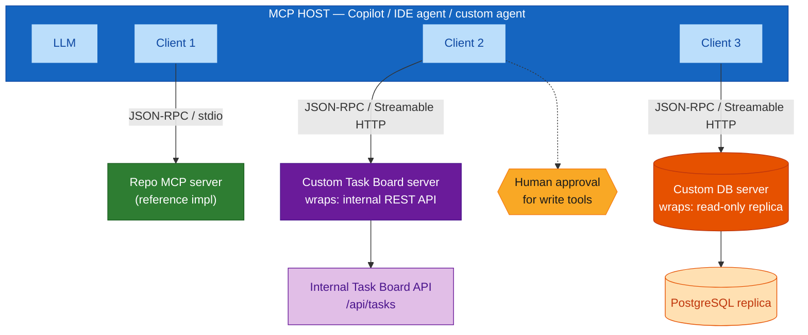
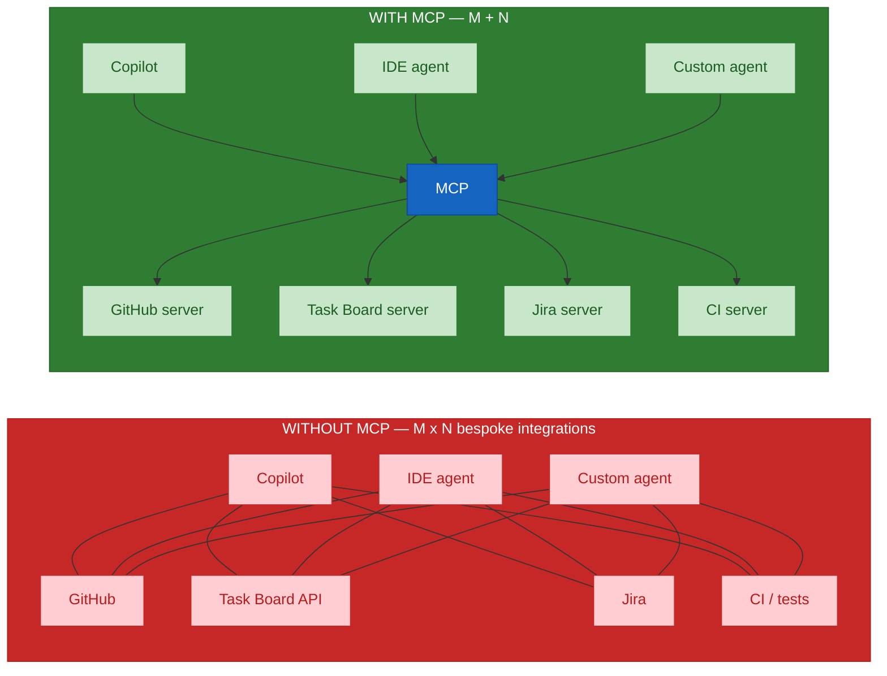
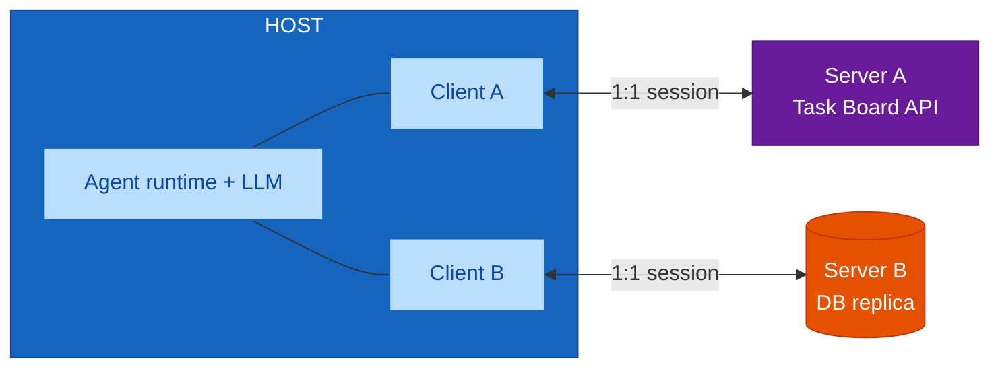
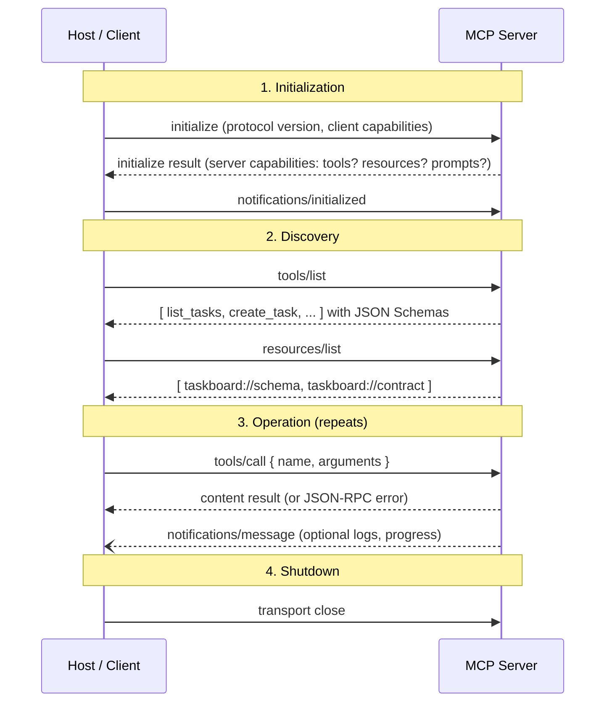
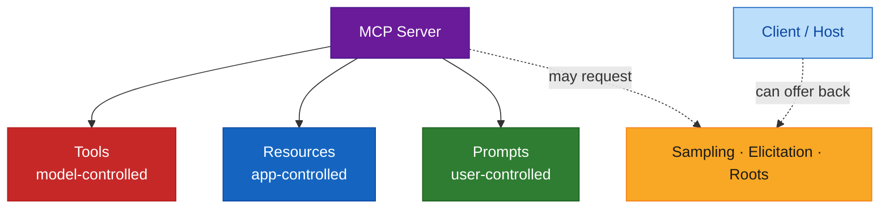
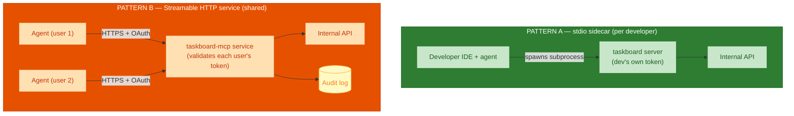
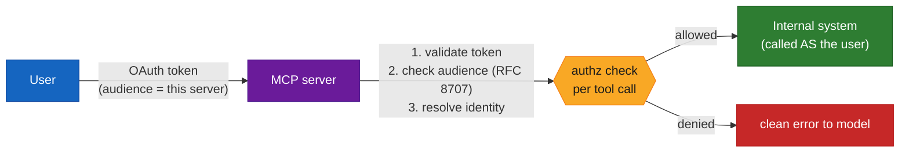

# Model Context Protocol — Building Custom MCP Servers for Internal Enterprise Applications — Comprehensive Guide

## Overview

This guide is a build-focused companion to
[`module-07-mcp-agentic-workflows.md`](./module-07-mcp-agentic-workflows.md). Where
that guide walks the Module 07 agenda, this one goes deep on one thing: **how a
Honeywell engineering team wraps an internal application — a REST API, a
database, a CI system, an internal knowledge base — in a custom MCP server that
agents can use safely.**

It covers:

- **What MCP is** and the problem it removes (the M × N integration explosion).
- **The architecture** — host, client, server; transports; JSON-RPC; the
  connection lifecycle; the server primitives (tools, resources, prompts).
- **Building a custom server** — working Python and TypeScript examples that
  wrap the Module 01 "Engineering Task Board" API, plus testing, packaging, and
  deployment.
- **Best practices** — tool design, security and identity, governance,
  reliability, observability, and versioning — with an anti-pattern table and an
  enterprise rollout checklist.

> **Scope note.** MCP moves fast. The concepts here (host/client/server,
> transports, JSON-RPC, the three primitives, the initialization handshake) are
> stable. SDK API surface changes between major versions — the code examples
> target the **v2 SDKs aligned to the 2026-07-28 spec revision**, and every
> example points at the SDK docs for the parts (auth, request context, structured
> output) whose API you should confirm against your installed version before
> relying on it.

**Audience:** engineers and architects who will design, build, review, or
operate an internal MCP server. Assumes familiarity with REST APIs, JSON, and
either Python or TypeScript.

---

## Quick Start

**MCP in one paragraph.** The Model Context Protocol is an open standard that
lets an AI application (the *host*) call external tools and read external data
through a uniform interface. Instead of every agent needing bespoke integration
code for every system, you build **one MCP server per system**, and every
MCP-compatible host can use it. A server exposes **tools** (functions the model
can call), **resources** (data the host can read), and **prompts** (templates a
user can invoke). Messages are **JSON-RPC 2.0** over one of two transports:
**stdio** (local subprocess) or **Streamable HTTP** (remote service).

**The smallest possible server (Python):**

```python
# uv add "mcp[cli]"   (installs the 2.x SDK; pin deliberately — see Building a Custom Server)
from mcp.server import MCPServer

mcp = MCPServer("demo")

@mcp.tool()
def add(a: int, b: int) -> int:
    """Add two numbers."""
    return a + b

if __name__ == "__main__":
    mcp.run(transport="stdio")
```

`a: int, b: int` *is* the input schema — the SDK generates the JSON Schema, parses
the request, validates arguments, and handles the protocol. You write the
function.

**Test it without an agent:**

```bash
uv run mcp dev server.py      # opens the MCP Inspector in a browser
```

**What to decide before you build (the rest of this guide expands each):**

| Decision | Options | Default for an internal app |
|----------|---------|-----------------------------|
| What system does it wrap? | one API / DB / service | one — keep servers single-purpose |
| Transport | stdio · Streamable HTTP | stdio for a dev-machine sidecar; Streamable HTTP for a shared service |
| Identity | inherit developer's · service account · per-user OAuth | per-user OAuth for a shared HTTP server; developer's own creds for stdio |
| Write access | read-only · read + guarded writes | start read-only; add writes behind approval |
| Ownership | a named team | required before it leaves your machine |

---

## Visual Summary



The custom servers (`S2`, `S3`) are what this guide teaches you to build. Each is
a thin, governed wrapper around exactly one internal system.

---

## Architecture

### Why MCP exists: from M × N to M + N

Without a shared protocol, connecting *M* AI applications to *N* tools needs
*M × N* bespoke integrations — every agent re-implements auth, pagination, error
handling, and schema for every system. MCP makes it *M + N*: each host speaks MCP
once, each system is wrapped once.



For an enterprise the payoff is governance, not just line count: the wrapper is
**one place** to enforce scoping, auth, rate limits, and audit for that system —
and one place to review.

### Host, client, server

| Role | What it is | Example |
|------|-----------|---------|
| **Host** | The AI application the user interacts with. Coordinates the LLM and one or more clients. Enforces user consent and approval. | GitHub Copilot, an IDE agent, a custom agent runtime |
| **Client** | A connector *inside* the host. Holds a dedicated **1:1** session with exactly one server. | The Copilot connector for your Task Board server |
| **Server** | A program that exposes tools/resources/prompts, wrapping one system. Runs locally or remotely. | The custom Task Board server you build in this guide |



The agent's total reach is exactly the **union of the servers it has been
given** — nothing more. That property is what makes MCP governable: you grant
capability by granting servers.

### Transports and JSON-RPC

Two transports, one message format.

| | **stdio** | **Streamable HTTP** |
|--|-----------|---------------------|
| Where the server runs | local subprocess of the host | remote service, reached over HTTP(S) |
| Channel | stdin / stdout | HTTP POST, with server-sent streaming for responses/notifications |
| Network exposure | none — process to process | yes — needs TLS, auth, and network governance |
| Identity | inherits the launching user's environment | explicit: OAuth 2.1 bearer tokens |
| Best for | dev-machine tools: local repo, CLI wrappers, a personal API client | shared internal services: a team database, an internal API, a hosted knowledge base |
| Scaling | one process per user | one service, many users |

> **SSE (HTTP+SSE) is the legacy transport.** New servers use stdio or
> Streamable HTTP. If you inherit an SSE server, plan its migration.

Every message on either transport is **JSON-RPC 2.0** — requests (with an `id`,
expecting a response), responses, and notifications (no `id`, fire-and-forget):

```json
// request: the agent calls a tool
{ "jsonrpc": "2.0", "id": 42, "method": "tools/call",
  "params": { "name": "list_tasks", "arguments": { "status": "in-progress" } } }

// response: the server's result
{ "jsonrpc": "2.0", "id": 42, "result": {
  "content": [ { "type": "text", "text": "[{\"id\":7,\"title\":\"...\"}]" } ] } }

// notification: no id, no reply expected
{ "jsonrpc": "2.0", "method": "notifications/message",
  "params": { "level": "info", "data": "fetched 3 tasks" } }
```

The SDK builds and parses these for you. You will still read them when debugging
with the Inspector.

### The connection lifecycle

Every session begins with a capability negotiation, then settles into normal
operation.



Key point for builders: **the client learns what your server can do from
`tools/list` / `resources/list` / `prompts/list`** — the tool names, descriptions,
and schemas you write *are* the API contract the model sees. They are prompt
engineering, not just metadata.

### Server primitives — and who controls each



| Primitive | Controlled by | What it is | Task Board example |
|-----------|--------------|------------|--------------------|
| **Tool** | the model | A function the LLM chooses to call. May have side effects. | `list_tasks`, `create_task`, `move_task` |
| **Resource** | the host app | Read-only data the host attaches as context. Identified by URI. | `taskboard://schema` (the DB schema), `taskboard://contract` (the API contract doc) |
| **Prompt** | the user | A reusable templated interaction a person selects from a menu. | `/triage-stale-tasks`, `/weekly-status` |
| **Sampling** | server → client | The server asks the host's LLM to complete a sub-step. Inverts control; needs user consent. | summarising a long task history inside a tool |
| **Elicitation** | server → client | The server asks the *user* for a missing input mid-call. | "which project should this task go in?" |
| **Roots** | client → server | The client tells the server which filesystem/URI boundaries it may operate within. | limiting a repo server to one workspace folder |

For an internal API wrapper you will mostly build **tools**, add a few
**resources** (schema, contract, glossary), and optionally a **prompt** or two
for recurring workflows.

### Where a custom enterprise server sits

```
        ┌──────────────────────────────────────────────────────────────┐
        │                        MCP HOST                              │
        │   Copilot / IDE agent / custom agent runtime + LLM           │
        │   • user consent  • per-tool approval  • audit of tool calls │
        └───────────────────────────┬──────────────────────────────────┘
                                    │  JSON-RPC (stdio or Streamable HTTP)
        ┌───────────────────────────▼──────────────────────────────────┐
        │                CUSTOM MCP SERVER  (you build this)           │
        │  ┌────────────┐  ┌─────────────┐  ┌──────────────────────┐  │
        │  │  Tools     │  │  Resources  │  │  Prompts             │  │
        │  │  list/get/ │  │  schema,    │  │  triage, status      │  │
        │  │  create/…  │  │  contract   │  │                      │  │
        │  └─────┬──────┘  └──────┬──────┘  └──────────────────────┘  │
        │  ┌─────▼───────────────────────────────────────────────┐    │
        │  │  GOVERNANCE LAYER                                    │    │
        │  │  • identity / token validation  • scope enforcement  │    │
        │  │  • input validation  • rate limiting  • audit log    │    │
        │  │  • output filtering (PII, secrets)                   │    │
        │  └─────┬───────────────────────────────────────────────┘    │
        │  ┌─────▼───────────────────────────────────────────────┐    │
        │  │  ADAPTER  → internal system's own SDK / REST / SQL   │    │
        │  └─────┬───────────────────────────────────────────────┘    │
        └────────┼─────────────────────────────────────────────────────┘
                 │  the internal system's native protocol (HTTPS, TCP)
        ┌────────▼─────────────────────────────────────────────────────┐
        │  INTERNAL APPLICATION                                        │
        │  Task Board API · PostgreSQL replica · CI system · wiki      │
        └──────────────────────────────────────────────────────────────┘
```

The **governance layer** is the reason to build a custom server rather than point
an agent at a generic HTTP tool: it is the single, reviewable choke point where
identity, scope, and audit are enforced for that system.

---

## Core Concepts

### Concept: a tool is a typed, described function

**Definition.** A tool is a named function with a JSON Schema for its inputs, a
human/model-readable description, and a structured result. The model reads the
name, description, and schema to decide *whether* and *how* to call it.

**Analogy.** A tool is a labelled button on a well-designed control panel. The
label (`move_task`) and the sub-label (description) must tell an operator exactly
what the button does and when to press it — because the "operator" (the model)
cannot see the wiring behind it.

**Example — a good tool definition:**

```python
@mcp.tool()
def move_task(task_id: int, to_status: str) -> dict:
    """Move a task to a new status column on the board.

    Use this to progress work, e.g. from "todo" to "in-progress". This is a
    write operation and will be shown to the user for approval.

    Args:
        task_id: numeric id of an existing task (see list_tasks)
        to_status: one of "todo", "in-progress", "done"

    Returns the updated task. Raises if the task does not exist (404) or the
    status is not one of the three allowed values (422).
    """
```

What makes it good: the description says *what*, *when to use it*, *that it
writes*, and *how it fails*; the argument docs name the allowed values; the
return is documented.

### Concept: a resource is addressable, read-only context

**Definition.** A resource is data the host can fetch by URI and attach to the
model's context — a file, a schema, a document, a query result. The *host*
decides when to include it; the model does not "call" it.

**Why it matters for an enterprise wrapper.** Ship the things the model always
needs to reason correctly as resources so they don't have to be pasted into every
prompt: the database schema, the API contract, the domain glossary, the list of
valid enum values.

```python
@mcp.resource("taskboard://contract")
def api_contract() -> str:
    """The Task Board REST contract: routes, status codes, JSON shapes."""
    return (PROJECT_ROOT / "usecase.md").read_text()
```

### Concept: a prompt is a user-invoked workflow template

**Definition.** A prompt is a named, parameterised message template the *user*
picks from a menu (in Copilot, a slash command). It is not model-controlled.

```python
@mcp.prompt()
def triage_stale_tasks(days: int = 14) -> str:
    """Draft a triage summary of tasks with no update in N days."""
    return (
        f"List every task not updated in {days} days using list_tasks. "
        "Group by assignee. For each, suggest: nudge, reassign, or close. "
        "Do not change anything — output a table only."
    )
```

### Concept: progressive trust — read, then write, then autonomous

| Stage | What the server exposes | Approval model | When to advance |
|-------|------------------------|----------------|-----------------|
| 1 · Read-only | `list_*`, `get_*`, `search_*` | none needed — no side effects | immediately useful; ship this first |
| 2 · Guarded writes | `create_*`, `update_*`, `move_*` | host shows each call for human approval | after read-only has proven the schema and descriptions are right |
| 3 · Scoped autonomy | same writes, pre-approved for a bounded scope | policy: e.g. "may move tasks within project X" | only with an owner, an audit trail, and observability (Module 10) |

Most internal servers should live at stage 1 or 2. Stage 3 is a governance
decision, not an engineering one.

### Analogy: an MCP server is an embassy

An internal system is a country with its own language (its API), laws (its auth
model), and customs (its data conventions). An MCP server is an embassy: a small,
official building on the border where visitors (agents) present credentials, make
requests in a common diplomatic language (JSON-RPC), and are granted exactly the
access their visa allows. The embassy staff (your governance layer) check every
request, keep a visitor log, and never let anyone wander into the country
unescorted. You would not give every visitor a passport to roam freely — and you
would not give an agent raw database credentials.

---

## Building a Custom MCP Server

The running example: wrap the **Engineering Task Board** API (Module 01 —
`GET/POST /api/tasks`, statuses `todo` / `in-progress` / `done`, error contract
404/422) so an agent can query and update the board without direct API access.

### Step 0 — Decide the shape

| Question | This example | Your rule of thumb |
|----------|-------------|--------------------|
| One system per server? | yes — Task Board API only | never wrap two systems in one server |
| Transport | stdio for local dev; Streamable HTTP for the team instance | stdio unless it must be shared |
| Read or write | read tools + `create_task` + `move_task` behind approval | read-only first release |
| Identity | dev's own API token via env var (stdio); per-user OAuth (HTTP) | never a shared god token |
| Resources | `taskboard://schema`, `taskboard://contract` | ship the "always needed" context |

### Step 1 — Python server (v2 SDK)

**Install.** `pip install mcp` now installs the **2.x** line. Pin deliberately:

```bash
uv add "mcp[cli]"                 # or: pip install "mcp[cli]"
# in pyproject.toml / requirements: mcp>=2,<3
# staying on v1 for now? pin  mcp>=1.28,<2  and use the v1 API (FastMCP)
```

**`server.py`:**

```python
import os
from typing import Literal

import httpx
from mcp.server import MCPServer

API_BASE = os.environ["TASKBOARD_API_BASE"]          # e.g. https://taskboard.internal/api
API_TOKEN = os.environ["TASKBOARD_API_TOKEN"]        # the *calling user's* token, not a shared one
TIMEOUT = httpx.Timeout(10.0)

mcp = MCPServer("taskboard")

Status = Literal["todo", "in-progress", "done"]


def _client() -> httpx.Client:
    return httpx.Client(
        base_url=API_BASE,
        headers={"Authorization": f"Bearer {API_TOKEN}"},
        timeout=TIMEOUT,
    )


# ---- Resources: the "always needed" context -------------------------------

@mcp.resource("taskboard://contract")
def api_contract() -> str:
    """The Task Board REST contract: routes, status codes, JSON field names."""
    with _client() as c:
        return c.get("/contract").text          # or read a bundled usecase.md


# ---- Read tools: safe, no approval needed ---------------------------------

@mcp.tool()
def list_tasks(status: Status | None = None, assignee: str | None = None) -> list[dict]:
    """List tasks on the board, optionally filtered by status or assignee.

    Read-only. Returns an array of task objects: id, title, description,
    status, assignee, createdAt, updatedAt.
    """
    params = {k: v for k, v in {"status": status, "assignee": assignee}.items() if v}
    with _client() as c:
        r = c.get("/tasks", params=params)
        r.raise_for_status()
        return r.json()


@mcp.tool()
def get_task(task_id: int) -> dict:
    """Get one task by its numeric id. Read-only. Raises if it does not exist."""
    with _client() as c:
        r = c.get(f"/tasks/{task_id}")
        if r.status_code == 404:
            raise ValueError(f"No task with id {task_id}")
        r.raise_for_status()
        return r.json()


# ---- Write tools: the host will surface these for approval ----------------

@mcp.tool()
def create_task(title: str, description: str = "", assignee: str | None = None) -> dict:
    """Create a new task in the "todo" column.

    WRITE operation — the user will be asked to approve. `title` is required
    (1-200 chars). Returns the created task including its new id.
    """
    if not 1 <= len(title) <= 200:
        raise ValueError("title must be 1-200 characters")
    body = {"title": title, "description": description, "assignee": assignee, "status": "todo"}
    with _client() as c:
        r = c.post("/tasks", json=body)
        if r.status_code == 422:
            raise ValueError(f"Rejected by the API: {r.text}")
        r.raise_for_status()
        return r.json()


@mcp.tool()
def move_task(task_id: int, to_status: Status) -> dict:
    """Move a task to a different status column.

    WRITE operation — the user will be asked to approve. Raises if the task
    does not exist (404) or the status is invalid (422).
    """
    with _client() as c:
        r = c.patch(f"/tasks/{task_id}", json={"status": to_status})
        if r.status_code == 404:
            raise ValueError(f"No task with id {task_id}")
        if r.status_code == 422:
            raise ValueError(f"Invalid status transition: {r.text}")
        r.raise_for_status()
        return r.json()


if __name__ == "__main__":
    mcp.run(transport="stdio")          # local sidecar
    # for a shared service:  mcp.run(transport="streamable-http")
```

Notes:

- **Type hints are the schema.** `status: Status | None = None` becomes an
  optional enum in the generated JSON Schema. No hand-written schema.
- **Errors:** raising an exception in a tool is returned to the model as a tool
  error it can read and react to. Make the message actionable
  (`"No task with id 7"`, not `"HTTPStatusError"`).
- **Auth, request context, structured output, lifespan/startup hooks:** these
  have SDK-version-specific APIs. Check
  [the Python SDK docs](https://py.sdk.modelcontextprotocol.io/) for your
  installed version before wiring per-request identity into a Streamable HTTP
  server.

### Step 2 — TypeScript server (v2 SDK)

**Install:**

```bash
npm install @modelcontextprotocol/server
npm install zod            # or any Standard Schema library (Valibot, ArkType)
```

**`server.ts`:**

```typescript
import { McpServer } from '@modelcontextprotocol/server';
import { StdioServerTransport } from '@modelcontextprotocol/server/stdio';
import * as z from 'zod/v4';

const API_BASE = process.env.TASKBOARD_API_BASE!;
const API_TOKEN = process.env.TASKBOARD_API_TOKEN!;

const server = new McpServer({ name: 'taskboard', version: '1.0.0' });

const Status = z.enum(['todo', 'in-progress', 'done']);

async function api(path: string, init?: RequestInit): Promise<Response> {
  return fetch(`${API_BASE}${path}`, {
    ...init,
    headers: { Authorization: `Bearer ${API_TOKEN}`, 'content-type': 'application/json', ...(init?.headers ?? {}) },
    signal: AbortSignal.timeout(10_000),
  });
}

server.registerTool(
  'list_tasks',
  {
    description:
      'List tasks on the board, optionally filtered by status or assignee. ' +
      'Read-only. Returns id, title, description, status, assignee, createdAt, updatedAt.',
    inputSchema: z.object({
      status: Status.optional(),
      assignee: z.string().optional(),
    }),
  },
  async ({ status, assignee }) => {
    const qs = new URLSearchParams();
    if (status) qs.set('status', status);
    if (assignee) qs.set('assignee', assignee);
    const r = await api(`/tasks?${qs}`);
    if (!r.ok) throw new Error(`Task Board API ${r.status}: ${await r.text()}`);
    return { content: [{ type: 'text', text: JSON.stringify(await r.json()) }] };
  },
);

server.registerTool(
  'move_task',
  {
    description:
      'Move a task to a different status column. WRITE operation — the user ' +
      'will be asked to approve. Raises if the task does not exist or the status is invalid.',
    inputSchema: z.object({ task_id: z.number().int(), to_status: Status }),
  },
  async ({ task_id, to_status }) => {
    const r = await api(`/tasks/${task_id}`, { method: 'PATCH', body: JSON.stringify({ status: to_status }) });
    if (r.status === 404) throw new Error(`No task with id ${task_id}`);
    if (!r.ok) throw new Error(`Task Board API ${r.status}: ${await r.text()}`);
    return { content: [{ type: 'text', text: JSON.stringify(await r.json()) }] };
  },
);

const transport = new StdioServerTransport();
await server.connect(transport);
```

For a **Streamable HTTP** server in Node, use one of the middleware packages
(`@modelcontextprotocol/express`, `@modelcontextprotocol/fastify`,
`@modelcontextprotocol/hono`, or `@modelcontextprotocol/node`) — they wire the
transport into a web framework and add the Host-header validation you need for a
network-exposed server. See the
[TypeScript SDK v2 docs](https://ts.sdk.modelcontextprotocol.io/v2/) and the
[`examples/`](https://github.com/modelcontextprotocol/typescript-sdk/tree/main/examples)
folder.

### Step 3 — Test with the MCP Inspector

The [Inspector](https://github.com/modelcontextprotocol/inspector) is a local UI
that connects to your server as a client — list tools, call them with arbitrary
arguments, read the raw JSON-RPC, inspect resources. Test here before you connect
an agent.

```bash
# Python
uv run mcp dev server.py

# TypeScript / any stdio server
npx @modelcontextprotocol/inspector node build/server.js
```

Check: every tool appears with the right schema; a bad argument produces a clean
error; a write tool's description clearly says it writes; resources return what
you expect.

### Step 4 — Connect it to a host

This repo's convention (from Module 02) is a workspace `.vscode/mcp.json`:

```jsonc
// .vscode/mcp.json
{
  "servers": {
    "taskboard": {
      "command": "uv",
      "args": ["run", "--directory", "${workspaceFolder}/tools/taskboard-mcp", "server.py"],
      "env": { "TASKBOARD_API_BASE": "https://taskboard.internal/api" }
    }
  },
  "inputs": [
    {
      "type": "promptString",
      "id": "taskboard_token",
      "description": "Your Task Board API token",
      "password": true
    }
  ]
}
```

The **`inputs`** block keeps the token out of the file — the host prompts for it
and injects it. `.vscode/mcp.json` must contain **no secrets**; it is committed.

A **remote** Streamable HTTP server is referenced by URL instead of `command`,
and the host runs its OAuth flow against it:

```jsonc
{
  "servers": {
    "taskboard": { "type": "http", "url": "https://taskboard-mcp.internal/mcp" }
  }
}
```

### Step 5 — Package and distribute

| Distribution | How | Use when |
|--------------|-----|----------|
| **In-repo sidecar** | server code under `tools/<name>-mcp/`, config in `.vscode/mcp.json` | the server is specific to one repo |
| **Internal package** | publish to your private PyPI / npm registry; teams `uvx` / `npx` it | reused across repos |
| **Hosted service** | deploy the Streamable HTTP server behind your SSO; teams add the URL | a shared system (DB, central API) with per-user identity |
| **MCP registry entry** | list it in your org's catalogue (see the [MCP registry](https://github.com/modelcontextprotocol/registry)) | you have several servers and want discoverability |

Whatever the channel, ship: a README (what it wraps, every tool, the auth model),
a `CHANGELOG.md`, a version, and a named owner (see *Best Practices → Versioning*).

### Deployment patterns



**Pattern A** is the default for developer tools: no network surface, identity is
the developer's own. **Pattern B** is for shared systems: one deployment, but now
you own an authenticated, audited, rate-limited service.

---

## Best Practices

### Tool design

| Do | Don't |
|----|-------|
| One clear job per tool (`move_task`) | A `manage_task` tool with an `action` parameter switching between create/move/delete |
| Names a human would recognise: `list_tasks`, `create_task` | `exec`, `do`, `handler1`, `tb_op` |
| Descriptions that say *what*, *when to use*, *side effects*, *failure modes* | "Lists tasks." (the model can't tell when to prefer it) |
| Constrain inputs with enums, ranges, formats — the schema is a guardrail | `status: str` when only three values are valid |
| Return structured, minimal data; paginate large results | Dumping 5,000 rows into the context on one call |
| Mark write tools plainly in the description and (if the SDK supports it) with a destructive/read-only hint | Letting a write tool look identical to a read tool |
| Make errors actionable: `"No task with id 7 — call list_tasks first"` | Re-raising `HTTPStatusError: 404` |
| 10–20 well-chosen tools | 60 tools that flood the model's context and slow selection |

### Security and identity

The [MCP security best practices](https://modelcontextprotocol.io/specification/2026-07-28/basic/security_best_practices)
and [authorization spec](https://modelcontextprotocol.io/specification/2026-07-28/basic/authorization)
are the normative reference. The essentials for an internal server:

- **Least privilege at the wrapper.** The server's own credentials to the
  internal system should grant only what its tools need. A read-only server uses
  a read-only DB role. Do not wrap admin credentials.
- **Propagate the user's identity; never share a god token.** For a Streamable
  HTTP server, validate the incoming OAuth 2.1 bearer token, check the **audience
  / resource indicator** (RFC 8707) so a token minted for another service can't
  be replayed at yours, and call the internal system *as that user* (token
  exchange or a downstream user assertion). For a stdio sidecar, the identity is
  the developer's own env credential — fine, because there's no multi-tenancy.
- **Guard against the confused deputy.** Your server acts on behalf of a user but
  holds its own trust with the backend. Never let tool arguments widen scope
  (e.g. a `project` argument that bypasses the user's project membership).
  Enforce authorization *after* resolving identity, on every call.
- **Treat tool arguments and returned data as untrusted.** The model can be
  steered by prompt injection in data it has read. Validate and sanitise inputs;
  filter outputs for secrets, credentials, and PII before returning them.
  Parameterise every SQL query. Allow-list, don't block-list.
- **Secrets stay out of config and logs.** Tokens come from `inputs` prompts,
  environment, or a secrets manager — never `.vscode/mcp.json`, never a tool
  argument, never an info log.
- **Network posture for HTTP servers:** TLS only; validate the `Host` header
  (DNS-rebinding defence — the framework middleware packages do this);
  bind to localhost if it's actually local; put it behind your SSO / gateway.
- **Pin your dependencies** and watch the SDK's security advisories. A
  compromised MCP server is a foothold with the union of its users' access.



### Governance (ties to Module 07)

Reuse the Module 07 `mcp-governance-checklist.md` for every server you publish.
Minimum:

| Control | Implementation |
|---------|----------------|
| Scoped access | server wraps one system; tools expose a deliberate subset; write tools separated from read |
| Human approval | write/destructive tools flagged so the host prompts; document which tools are pre-approvable and in what scope |
| Auditability | every tool call logged: who, tool, arguments (redacted), result status, timestamp, correlation id |
| Failure handling | tools catch backend errors and return a clean, model-readable message; the server never crashes the session |
| Ownership | a named team in `OWNERS`; an on-call path for a misbehaving server |
| Change control | versioned; breaking changes are a major bump with a migration note |

### Reliability

- **Timeouts on every backend call.** A hung tool hangs the agent.
- **Idempotency for writes** where the backend allows it — the model may retry.
- **Pagination, not truncation.** Return a page plus a cursor; add a
  `next_page` argument. Truncating silently makes the model reason on partial
  data.
- **Rate-limit per identity** inside the server; return a clear "slow down"
  error, not a 500.
- **Degrade gracefully.** If an optional enrichment call fails, return the core
  result with a note, don't fail the whole tool.

### Observability (ties to Module 10)

- Emit structured logs (JSON) for every call: `tool`, `duration_ms`,
  `result` (`ok` / `error`), `identity`, `correlation_id`.
- Surface MCP **logging notifications** (`notifications/message`) for progress on
  long calls so the host can show them.
- Export traces so **Agent Prism** (Module 10) can tie a tool call to the agent
  run that made it, the tokens it cost, and the engineering outcome. The server
  is a span in that trace, not a black box.

### Versioning and lifecycle

```
tools/taskboard-mcp/
├── server.py              # or server.ts
├── README.md              # what it wraps, every tool, the auth model
├── CHANGELOG.md           # v1.2.0 — added move_task; v1.1.0 — added assignee filter
├── VERSION                # 1.2.0  (SemVer)
├── OWNERS                  # @honeywell/taskboard-platform
└── tests/                 # Inspector-driven or SDK client tests per tool
```

- **SemVer against the *tool contract*, not the code.** Renaming a tool,
  removing an argument, tightening a schema, or changing a return shape is a
  **major** bump — agents and prompts depend on those names.
- **Deprecate, don't delete.** Keep an old tool working for one major cycle;
  mark it deprecated in the description.
- **Test every tool.** A cheap suite: an SDK client that calls each tool with a
  known input and asserts the result shape. Run it in CI.

### Anti-patterns

| Anti-pattern | Why it hurts | Instead |
|--------------|--------------|---------|
| One server wrapping five systems | can't scope, review, or own it; blast radius is huge | one server per system |
| A generic `sql_query(query: str)` tool | hands the model arbitrary DB access; injection; no scope | specific tools: `get_task`, `tasks_by_assignee` |
| Shared service-account token for all users | no per-user audit; confused deputy; over-broad access | per-user OAuth; user identity propagated to the backend |
| Secrets in `.vscode/mcp.json` | committed to git, shared, leaked | `inputs` prompts / env / secrets manager |
| Vague tool descriptions | model picks the wrong tool or misuses it | say what, when, side effects, failures |
| Returning whole result sets | context blow-out, cost, truncation bugs | paginate with a cursor |
| No owner | nobody fixes it when it breaks or misbehaves | `OWNERS` before it ships |
| Building writes before read-only has proven the schema | you debug schema *and* side effects at once | ship read-only first |
| Ignoring SDK major versions | v1→v2 API changes break the build silently | pin the version; read the migration guide |

---

## Enterprise Rollout Checklist

**Before it leaves your machine:**

- [ ] Wraps exactly one internal system.
- [ ] Read-only tools first; write tools clearly marked and separated.
- [ ] Every tool: recognisable name, description with *what / when / side
      effects / failures*, constrained input schema.
- [ ] Resources ship the always-needed context (schema, contract, glossary).
- [ ] No secrets in any committed file; token via `inputs` / env / secrets
      manager.
- [ ] Every backend call has a timeout; every tool returns a clean error, never
      crashes the session.
- [ ] Tested end-to-end in the MCP Inspector.

**Before a shared (HTTP) deployment:**

- [ ] OAuth 2.1 bearer validation with audience / resource-indicator checks.
- [ ] User identity propagated to the backend; authorization enforced per call.
- [ ] TLS; Host-header validation; behind SSO / gateway.
- [ ] Per-identity rate limiting.
- [ ] Structured audit log: who, tool, args (redacted), result, timestamp,
      correlation id.
- [ ] Traces exported for Agent Prism (Module 10).

**Governance:**

- [ ] `OWNERS`, `VERSION` (SemVer), `CHANGELOG.md`, README.
- [ ] Module 07 `mcp-governance-checklist.md` completed and signed.
- [ ] Listed in the org MCP catalogue / registry.
- [ ] Write tools: documented which are pre-approvable and in what scope.
- [ ] CI runs a per-tool contract test.

---

## References

### Programme materials

- Course Outline: `courseOutline/NIIT_Honeywell_AI_Champions_GitHub_AgentPrism (Software_Engineering).pdf`, section 7 (MCP-Enabled Agentic Engineering Workflows)
- [`module-07-mcp-agentic-workflows.md`](./module-07-mcp-agentic-workflows.md) — the Module 07 guide this document expands
- [`module-10-agent-prism-observability.md`](./module-10-agent-prism-observability.md) — where tool-call telemetry is monitored
- Module 02 lab `labs/module-02/lab-05-agent-mode-and-mcp.md` — the `.vscode/mcp.json` convention used above
- Module 07 lab `labs/module-07/templates/mcp-governance-checklist.md` — the governance checklist referenced throughout

### Model Context Protocol — the standard

*Every link below was fetched and returned HTTP 200 on 2026-09-03.*

- [Model Context Protocol — official site](https://modelcontextprotocol.io/) — introduction, quickstarts, concept docs, and the ecosystem.
- [MCP specification (latest revision, 2026-07-28)](https://modelcontextprotocol.io/specification/2026-07-28) — the normative protocol definition; revisions are dated.
- [MCP specification — 2025-06-18 revision](https://modelcontextprotocol.io/specification/2025-06-18) — the prior revision, still widely deployed.
- [Architecture overview](https://modelcontextprotocol.io/docs/learn/architecture) — host, client, server roles; data and transport layers.
- [Server concepts](https://modelcontextprotocol.io/docs/learn/server-concepts) — tools, resources, and prompts in depth.
- [Transports (spec)](https://modelcontextprotocol.io/specification/2026-07-28/basic/transports) — stdio and Streamable HTTP, normatively.
- [Authorization (spec)](https://modelcontextprotocol.io/specification/2026-07-28/basic/authorization) — MCP as an OAuth 2.1 resource server.
- [Security best practices (spec)](https://modelcontextprotocol.io/specification/2026-07-28/basic/security_best_practices) — confused-deputy, token passthrough, and session hijacking risks and mitigations.
- [Anthropic — Introducing the Model Context Protocol](https://www.anthropic.com/news/model-context-protocol) — the original announcement and rationale.
- [JSON-RPC 2.0 specification](https://www.jsonrpc.org/specification) — the message format underneath every MCP transport.
- [RFC 8707 — Resource Indicators for OAuth 2.0](https://datatracker.ietf.org/doc/html/rfc8707) — the audience-restriction mechanism the auth spec requires.

### SDKs and tooling

- [modelcontextprotocol/python-sdk](https://github.com/modelcontextprotocol/python-sdk) — the Python SDK (v2 on `main`; v1.x on the `v1.x` branch).
- [Python SDK documentation](https://py.sdk.modelcontextprotocol.io/) — get-started, API reference, and the [v2 migration guide](https://py.sdk.modelcontextprotocol.io/migration/).
- [modelcontextprotocol/typescript-sdk](https://github.com/modelcontextprotocol/typescript-sdk) — the TypeScript SDK (`@modelcontextprotocol/server` / `@modelcontextprotocol/client` in v2).
- [TypeScript SDK v2 documentation](https://ts.sdk.modelcontextprotocol.io/v2/) — including a ten-minute server tutorial.
- [modelcontextprotocol/inspector](https://github.com/modelcontextprotocol/inspector) — the local UI for testing a server without an agent.
- [Build an MCP server (tutorial)](https://modelcontextprotocol.io/docs/develop/build-server) — the official weather-server walkthrough.
- [Debugging MCP servers](https://modelcontextprotocol.io/docs/tools/debugging) — Inspector, logs, and common failures.
- [modelcontextprotocol/servers](https://github.com/modelcontextprotocol/servers) — reference server implementations to read before writing your own.
- [modelcontextprotocol/quickstart-resources](https://github.com/modelcontextprotocol/quickstart-resources) — complete runnable example servers and clients.
- [modelcontextprotocol/registry](https://github.com/modelcontextprotocol/registry) — the open server registry (a model for an internal catalogue).
- [Standard Schema](https://standardschema.dev/) — the schema interface the v2 TypeScript SDK accepts (Zod, Valibot, ArkType).

### Host integration

- [VS Code — MCP servers](https://code.visualstudio.com/docs/copilot/customization/mcp-servers) — adding servers to Copilot, with the trust and approval prompts.
- [GitHub Docs — Extend Copilot Chat with MCP](https://docs.github.com/en/copilot/how-tos/provide-context/use-mcp/extend-copilot-chat-with-mcp) — configuring MCP servers for Copilot across IDEs and GitHub.com.
- [Anthropic — Model Context Protocol docs](https://docs.anthropic.com/en/docs/mcp) — using MCP with Claude and the Claude Developer Platform.

### Related reading

- [Anthropic — Building Effective Agents](https://www.anthropic.com/engineering/building-effective-agents) — workflow patterns (chaining, routing, orchestration) that compose MCP tools.
- [OAuth 2.1](https://oauth.net/2/) — the authorization framework MCP's auth model is built on.
