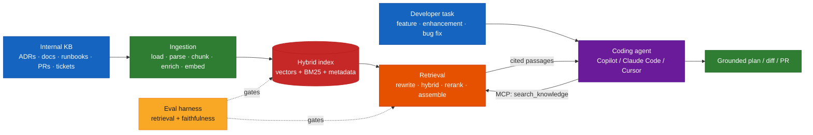
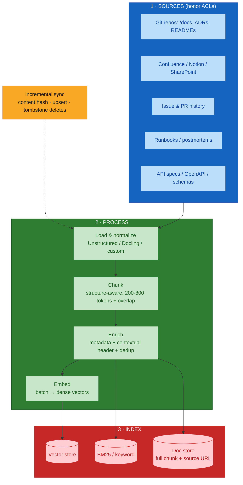
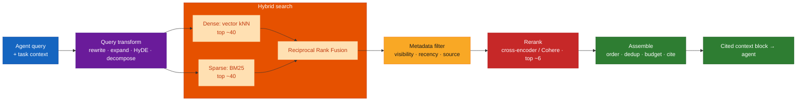
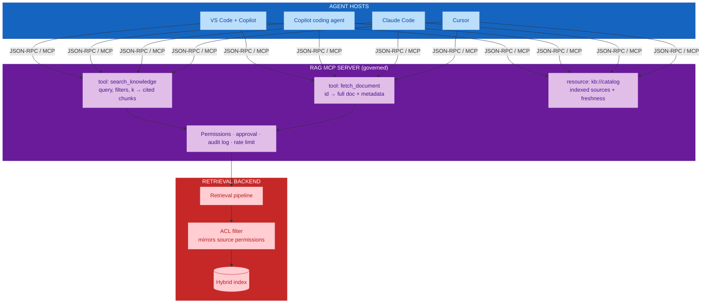
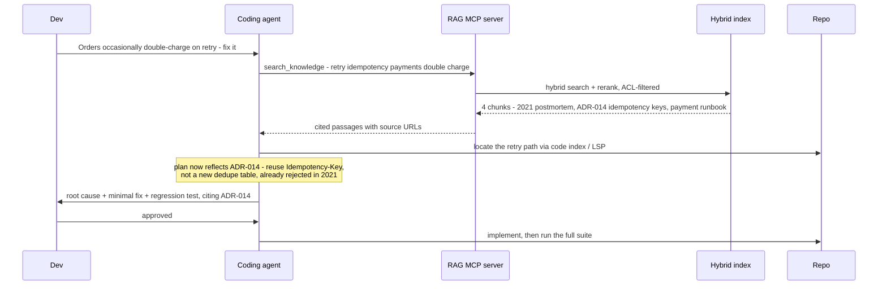
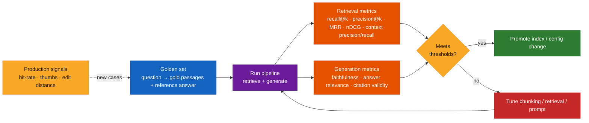
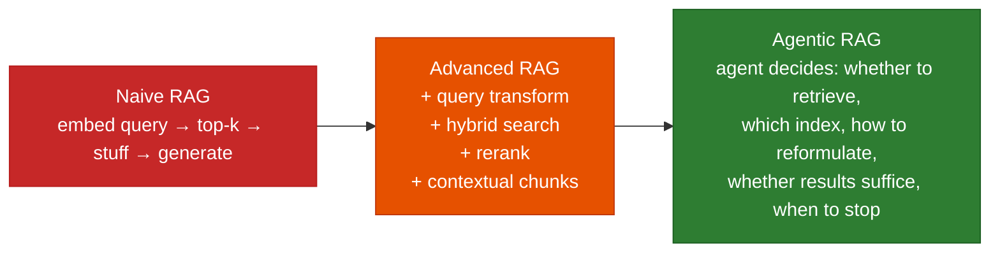

# RAG for Coding Agents — Grounding GitHub Copilot and Other Agents in Your Internal Knowledge

## Overview

An AI coding agent can read your code. It cannot read **why the code is the way it is** —
the architecture decisions, the constraints a previous incident taught you, the "we do it
this way here" conventions that live in design docs, runbooks, wikis, past pull requests,
and people's heads. **Retrieval-Augmented Generation (RAG)** closes that gap: it indexes
your internal knowledge base and retrieves the few passages relevant to the task at hand,
injecting them into the agent's context so its plan, its code, and its bug fixes reflect
*your* system, not a generic one.

This guide covers:

- **RAG overview** — the mental model, and when RAG beats long-context stuffing, fine-tuning,
  or plain agentic search.
- **The ingestion pipeline** — sources, parsing, chunking, enrichment, embeddings, indexing,
  and keeping the index fresh.
- **The retrieval pipeline** — query transformation, hybrid (dense + keyword) search,
  reranking, context assembly, and citations.
- **Evaluation** — retrieval metrics, generation/faithfulness metrics, golden datasets, and
  gating changes in CI.
- **Applying RAG to an existing repo** — how grounded context makes features, enhancements,
  and bug fixes measurably better.
- **Integrating with GitHub Copilot and other coding agents via MCP** — wrapping retrieval
  as a Model Context Protocol server so any agent can call it under governance.

> **Relationship to the course.** [`module-07-mcp-agentic-workflows.md`](./module-07-mcp-agentic-workflows.md)
> deliberately excludes RAG from the *core* programme and teaches MCP as the way agents
> reach approved systems. This guide treats RAG as an **optional capability delivered
> through that same MCP boundary** — the retrieval service is just another governed server.
> It also extends the context-engineering discipline from
> [`module-03-prompt-context-engineering.md`](./module-03-prompt-context-engineering.md)
> and the brownfield retrieval-hierarchy idea from
> [`APPENDIX04:brownfield-ai-assisted-engineering.md`](./APPENDIX04:brownfield-ai-assisted-engineering.md).

**Audience:** platform / developer-experience engineers and AI champions building an
internal knowledge-retrieval capability for engineering teams.

## Quick Start

1. **Inventory the knowledge.** ADRs, design docs, RFCs, runbooks, postmortems, API specs,
   onboarding wikis, style guides, merged-PR discussions, ticket history. Note the access
   controls on each source — the index must honor them.
2. **Ingest.** Load → parse to clean text → chunk (structure-aware) → enrich each chunk with
   metadata and a short context header → embed.
3. **Index for hybrid search.** Store vectors *and* a keyword (BM25) index, plus filterable
   metadata (source, path, date, team, visibility).
4. **Build retrieval.** Query rewrite → hybrid search (top ~50) → rerank (top ~5–8) →
   assemble with citations.
5. **Build an eval set before you ship.** 50–200 real engineering questions with known-good
   source passages and reference answers. Measure retrieval recall and answer faithfulness.
6. **Wrap it as an MCP server.** Expose `search_knowledge` and `fetch_document` tools with
   tight schemas; return chunks *with source URLs*.
7. **Wire it to the agents.** Register the MCP server in VS Code / GitHub Copilot, the
   Copilot coding agent, Claude Code, Cursor. Scope permissions; log every call.
8. **Close the loop.** Track retrieval hit-rate and answer quality in CI and in production;
   re-index on a freshness SLA; expand the eval set from real misses.

## Visual Summary



## Architecture

### The two-index model

A coding agent working in a brownfield repo needs two different retrieval systems. Keep
them separate — they have different content, different freshness needs, and different
tools.

```
┌─────────────────────────────────────────────────────────────────────────┐
│  CODE INDEX  — "what the code is"          (often already available)     │
│  ───────────────────────────────────────────────────────────────────    │
│  language server (LSP) · symbol index · grep/ripgrep · GitHub code       │
│  search · Sourcegraph · aider-style repo map                             │
│  → exact: definitions, references, call sites, current signatures        │
├─────────────────────────────────────────────────────────────────────────┤
│  KNOWLEDGE INDEX  — "why the code is that way, and how we work"          │
│  ───────────────────────────────────────────────────────────────────    │
│  RAG over: ADRs · design docs / RFCs · runbooks · postmortems ·          │
│  API contracts · style guides · onboarding wiki · merged-PR threads ·    │
│  ticket history · Slack/Confluence exports                               │
│  → fuzzy: rationale, constraints, prior art, known gotchas, conventions  │
└─────────────────────────────────────────────────────────────────────────┘
        both surfaced to the agent as MCP tools; the agent chooses per step
```

### Ingestion pipeline



### Retrieval pipeline



### MCP integration architecture

The retrieval service is exposed as an MCP server. Every agent reaches it the same way —
the M×N → M+N argument from Module 07 applies exactly.



### End-to-end: a bug fix, grounded



### Evaluation harness



## Core Concepts

### 1 · The RAG mental model

**Retrieve → Augment → Generate.** Given a query, find the most relevant passages from a
corpus, place them in the model's context with instructions to answer *from them and cite
them*, then generate. The model's parametric knowledge is supplemented — not replaced — by
fresh, private, attributable text.

Why not just...

| Alternative | Why RAG usually wins for an internal KB |
|-------------|----------------------------------------|
| **Stuff everything into a long context** | Cost scales with tokens every call; quality degrades ("lost in the middle"); most of the KB is irrelevant to any one task; the KB is bigger than any window |
| **Fine-tune the model on the KB** | Expensive to keep current; no citations; knowledge gets baked in and blurred; hard to enforce access control; poor at exact recall of specific facts |
| **Plain agentic keyword search** | Great for code; weak for concept queries where wording differs ("idempotency" vs "don't process twice"); no ranking quality, no dedup, no citations |
| **RAG** | Fresh (re-index, don't re-train); attributable (every claim links to a source); access-controllable at retrieval time; cheap per query; combines with agentic search rather than replacing it |

The modern answer is often **all three combined**: RAG for the knowledge index, agentic
code search for the code index, long context to hold the retrieved results.

### 2 · Naive vs Advanced vs Agentic RAG



For coding agents, **agentic RAG is the natural fit**: the agent is already a loop. Give it
a `search_knowledge` tool and let it decide when the task needs rationale/convention
context, iterate on the query, and judge sufficiency — rather than forcing a retrieval on
every turn.

### 3 · Ingestion — building the knowledge index

**Sources worth indexing for a codebase KB:**

| Source | What the agent gains |
|--------|----------------------|
| **ADRs / RFCs / design docs** | The *why*: options considered, decisions made, what was explicitly rejected |
| **Runbooks / operational docs** | How the system is operated, deployed, recovered |
| **Postmortems / incident reports** | Known failure modes and the fixes that stuck — gold for bug fixing |
| **API contracts / OpenAPI / schema docs** | The promises callers depend on |
| **Style guides / engineering handbook** | "How we do it here" — naming, error handling, testing norms |
| **Onboarding wiki / architecture overviews** | The map a new engineer would be given |
| **Merged-PR descriptions & review threads** | Rationale for specific changes; reviewer objections |
| **Ticket / issue history** | Prior attempts, constraints discovered, linked discussions |

**Do not index:** secrets, credentials, customer data, or documents known to be stale.
Prefer a curated `/docs` tree and reviewed wikis over scraping everything.

**Parsing.** Convert every format to clean, structured text (headings preserved). Tools:
Unstructured, Docling, Firecrawl (for web/wikis). Bad parsing (broken tables, lost
headings, PDF soup) is the most common silent quality killer.

**Chunking strategies:**

| Strategy | How | Best for |
|----------|-----|----------|
| **Fixed-size + overlap** | N tokens, ~10–20% overlap | Baseline; uniform prose |
| **Structure-aware** | Split on headings / Markdown sections / code blocks; keep a section intact | Docs, ADRs, runbooks — **the default for a KB** |
| **Recursive** | Try paragraph → sentence → token boundaries in order | Mixed content |
| **Semantic** | Split where embedding similarity between adjacent sentences drops | Long unstructured text; higher ingest cost |
| **Parent–child (small-to-big)** | Embed small chunks, but return the enclosing section | Precision of match + context of answer |
| **Late chunking** | Embed the whole doc with a long-context model, then pool per-chunk | Preserves cross-chunk context; needs a supporting model |

Aim for **200–800 tokens** per chunk. Too small loses context; too large dilutes the
embedding and wastes the agent's context budget.

**Enrichment — the highest-leverage step:**

- **Metadata** on every chunk: source system, document title, URL/anchor, path, author,
  last-modified date, team, visibility/ACL group, doc type. Powers filtering and citations.
- **Contextual retrieval** (Anthropic): prepend a 1–2 sentence, LLM-generated description
  situating the chunk in its document ("This section of ADR-014 explains why idempotency
  keys were chosen over a dedupe table…"). Reported to cut retrieval failures substantially.
- **Deduplication**: near-duplicate docs (copy-pasted runbooks) crowd out results — collapse
  them.

**Embeddings:**

| Consideration | Guidance |
|---------------|----------|
| Model choice | Check the **MTEB** leaderboard for retrieval, then test on *your* queries. Strong options: OpenAI `text-embedding-3-large`, Voyage, Cohere Embed, open `bge-*` / `e5-*` |
| Dimensions | Higher = better recall, more storage/compute. Matryoshka models let you truncate |
| Domain fit | Code-and-docs mixed corpora benefit from code-aware embedding models |
| Consistency | The **same** model must embed both documents and queries; re-embed everything on a model change |
| Cost | Batch; cache by content hash; only re-embed changed chunks |

**Indexing & incremental sync:**

- Store dense vectors, a BM25/keyword index, the full chunk text, and metadata (often one
  hybrid-capable store does all of it).
- **Incremental updates**: track a content hash per source unit; upsert changed chunks;
  write **tombstones** for deleted source docs so retracted knowledge stops surfacing.
- Set a **freshness SLA** per source (e.g. ADRs within 24 h, wiki within 1 h) and monitor
  index lag.

### 4 · Retrieval — getting the right few passages

**Query transformation.** The agent's raw query is often a poor search query.

| Technique | What it does |
|-----------|--------------|
| **Rewrite / expand** | Turn a conversational ask into keyword-rich search text; add synonyms/acronyms |
| **HyDE** (Hypothetical Document Embeddings) | Have an LLM draft a hypothetical answer, embed *that*, search with it — closes the question/answer vocabulary gap |
| **Multi-query / RAG-Fusion** | Generate several query variants, search each, fuse results |
| **Decomposition** | Break a compound question into sub-questions, retrieve per sub-question |

**Hybrid search.** Dense (vector) retrieval captures meaning; sparse (BM25) retrieval nails
exact terms — error codes, function names, config keys, acronyms. Run both, fuse with
**Reciprocal Rank Fusion (RRF)**. Hybrid consistently beats either alone on technical
corpora.

**Metadata filtering.** Apply `visibility ∈ user's groups`, recency windows, source
inclusion/exclusion *as filters*, not post-hoc — this is also where **access control** is
enforced.

**Reranking.** First-stage retrieval favors recall (get ~40–80 candidates). A **cross-encoder
reranker** (Cohere Rerank, `bge-reranker`, a sentence-transformers cross-encoder) then scores
each candidate against the query jointly and keeps the top ~5–8. This is usually the single
biggest precision win after hybrid search.

**Context assembly.**

- **Order matters**: models attend best to the start and end of context ("lost in the
  middle") — put the strongest passages at the edges.
- **Dedup and budget**: cap total retrieved tokens; drop near-duplicates; trim to the
  relevant span.
- **Always attach citations**: each passage carries its source title + URL so the agent can
  cite, and a human can verify.

### 5 · Evaluation

You cannot tune what you cannot measure. Build the eval set **before** shipping and grow it
from real misses.

**Golden dataset.** 50–200 real engineering questions ("How do we handle idempotency on
payment retries?", "What's our convention for feature flags?"). For each: the known-good
source passage(s) and a reference answer. Synthetic generation (Ragas, promptfoo) bootstraps
it; humans curate.

**Retrieval metrics** (do the right chunks come back?):

| Metric | Meaning |
|--------|---------|
| **Recall@k** | Fraction of gold passages found in the top *k* — the metric that matters most; if it's not retrieved, generation can't use it |
| **Precision@k / MRR / nDCG** | How high the relevant passages rank |
| **Context precision / context recall** (Ragas) | Proportion of retrieved context that is relevant / proportion of the answer's needed info that was retrieved |

**Generation metrics** (is the answer grounded?):

| Metric | Meaning |
|--------|---------|
| **Faithfulness / groundedness** | Every claim in the answer is supported by the retrieved context — catches hallucination |
| **Answer relevance** | The answer actually addresses the question |
| **Citation validity** | Cited sources exist and support the cited claim |
| **The RAG triad** (TruLens) | Context relevance + groundedness + answer relevance, together |

**Practices:** gate index and config changes in CI on threshold regressions; keep a frozen
regression subset; treat **LLM-as-judge scores as noisy** — calibrate against human labels
periodically; track **online** signals too (retrieval hit-rate, thumbs, how much the
developer edited the agent's output).

### 6 · Why this makes brownfield work better

| Task type | Without KB context | With retrieved KB context |
|-----------|--------------------|---------------------------|
| **New feature / enhancement** | Agent invents a plausible design; may re-introduce a rejected approach; ignores conventions | Agent finds the established pattern, the ADR that constrains the design, prior art in a similar feature — its plan matches how the team actually builds |
| **Bug fix** | Fixes the symptom; unaware the class of bug has a postmortem and a prescribed fix | Retrieves the incident report and the runbook; roots the fix in the known cause; adds the regression test the postmortem asked for |
| **Refactor** | May violate an intentional design decision that looks like a smell | Retrieves the "this is deliberate because…" note before changing it |
| **Code review / PR description** | Generic summary | Cites the ADR/spec the change implements; flags deviations from the style guide |

The mechanism is the same in every row: the agent's context now includes the
**institutional memory** a senior engineer would bring, with citations a reviewer can check.

### 7 · Integrating with Copilot and other agents via MCP

**Why MCP.** Build the retrieval integration **once** as an MCP server and every
MCP-capable agent can use it — the M×N → M+N argument from Module 07. The server is also the
natural place for governance: permissions, human approval for sensitive actions, failure
handling, and an audit trail.

**Designing the RAG MCP server:**

| Primitive | Use for | Example |
|-----------|---------|---------|
| **Tool** (model-controlled) | Actions the agent decides to invoke | `search_knowledge(query, filters?, k?)`, `fetch_document(id)` |
| **Resource** (app-controlled) | Data the host attaches as context | `kb://catalog` — what's indexed, freshness per source |
| **Prompt** (user-controlled) | Reusable templated retrieval flows a person picks | "Ground this task in our ADRs" |

Tool-design rules that matter for retrieval quality and token cost:

- **Return chunks *with* source URL, title, and date** — never bare text.
- **Keep results tight**: default `k` small (5–8); let the agent ask again rather than
  dumping 30 chunks.
- **Expose filters** (source, recency, doc type) so the agent can scope.
- **Describe the tool precisely** in its schema so the agent calls it at the right moments
  (concept/rationale/convention questions — not for code navigation).
- **Enforce the caller's ACLs** inside the server; pass through identity.

Minimal server sketch (Python MCP SDK):

```python
from mcp.server.fastmcp import FastMCP
from retrieval import hybrid_search, rerank   # your pipeline

mcp = FastMCP("internal-knowledge")

@mcp.tool()
def search_knowledge(query: str, sources: list[str] | None = None, k: int = 6) -> list[dict]:
    """Search internal engineering knowledge (ADRs, design docs, runbooks,
    postmortems, PR history) for rationale, constraints, conventions, and prior art.
    Use for 'why', 'how do we', and 'has this been tried' questions — not for code navigation."""
    candidates = hybrid_search(query, sources=sources, limit=60)      # ACL-filtered inside
    top = rerank(query, candidates, k=k)
    return [
        {"text": c.text, "title": c.title, "url": c.url,
         "source": c.source, "last_modified": c.last_modified}
        for c in top
    ]

@mcp.tool()
def fetch_document(document_id: str) -> dict:
    """Fetch a full internal document by id, with metadata, when a search result needs full context."""
    ...
```

**Wiring it to agents:**

| Agent | How to register the MCP server |
|-------|-------------------------------|
| **VS Code + GitHub Copilot** | Add to `.vscode/mcp.json` (or user settings); Copilot agent mode picks up the tools with trust prompts |
| **GitHub Copilot coding agent** | Configure MCP in the repository/organization Copilot settings so the delegated agent can retrieve during autonomous work |
| **GitHub Copilot Enterprise** | Org-level MCP configuration and policy; combine with repository custom instructions |
| **Claude Code** | `claude mcp add` / `.mcp.json`; the server's tools appear alongside built-ins |
| **Cursor** | `.cursor/mcp.json`; tools available to the agent |

**Native Copilot alternatives / complements** (no custom server needed):

- **Repository custom instructions** (`.github/copilot-instructions.md`) — bake the *stable*
  conventions in directly; RAG covers the long tail that changes.
- **Copilot Spaces** — bundle specific repos, docs, and free-text notes as reusable context
  for a task area. Good for curated, slow-moving knowledge; less so for a large, freshly
  indexed corpus.
- **GitHub code search / Sourcegraph** — the *code* index half of the two-index model.

### 8 · Governance, security, and freshness

| Concern | Control |
|---------|---------|
| **Access control** | Retrieval filters by the caller's identity/groups; never return a chunk the user couldn't open at the source. Re-check on every query (permissions change) |
| **Data classification** | Exclude secret/PII/customer-data sources at ingest; scan chunks; redact before indexing |
| **Index poisoning** | Only index reviewed sources; treat wiki/ticket text as untrusted content, not instructions; watch for prompt-injection strings in retrieved chunks |
| **Staleness** | Freshness SLA per source; show `last_modified` in results; tombstone deletes; periodically re-embed |
| **Auditability** | Log every MCP call: who, query, which chunks returned, which document IDs. Feed into the same observability stack as other agent tools (Module 10) |
| **Cost** | Cache embeddings by hash; cache frequent query results; cap `k` and reranker calls; monitor $/query and index storage |
| **Attribution** | Require the agent to cite retrieved sources in its output so humans can verify |

## Toolkits & Frameworks

### RAG frameworks

| Tool | Role |
|------|------|
| [LlamaIndex](https://developers.llamaindex.ai/python/framework/) | Data framework for RAG: loaders, node parsers, indices, retrievers, query engines; [production RAG guide](https://developers.llamaindex.ai/python/framework/optimizing/production_rag/) |
| [LangChain](https://docs.langchain.com/oss/python/langchain/knowledge-base) | RAG chains/graphs, retrievers, integrations; [RAG from scratch](https://github.com/langchain-ai/rag-from-scratch) |
| [Haystack](https://docs.haystack.deepset.ai/docs/intro) | Composable pipelines for retrieval + generation, production-oriented |
| [Microsoft GraphRAG](https://github.com/microsoft/graphrag) | Build a knowledge graph from the corpus for global/thematic questions |

### Vector & hybrid search stores

| Tool | Notes |
|------|-------|
| [pgvector](https://github.com/pgvector/pgvector) | Vectors in PostgreSQL; pair with `tsvector`/`ParadeDB` for hybrid — simplest if you already run Postgres |
| [Qdrant](https://qdrant.tech/documentation/) | Vector DB with native [hybrid search](https://qdrant.tech/articles/hybrid-search/), filtering, quantization |
| [Weaviate](https://docs.weaviate.io/weaviate) | Vector DB with [built-in hybrid](https://weaviate.io/blog/hybrid-search-explained) (BM25 + vector + fusion) |
| [Milvus](https://github.com/milvus-io/milvus) | Scalable vector DB, hybrid and multi-vector |
| [Elasticsearch — kNN](https://www.elastic.co/guide/en/elasticsearch/reference/current/knn-search.html) / [OpenSearch vector search](https://opensearch.org/docs/latest/vector-search/) | Mature BM25 + vector in one engine |
| [Pinecone](https://docs.pinecone.io/guides/get-started/overview) | Managed vector DB |
| [Redis vector search](https://redis.io/docs/latest/develop/interact/search-and-query/advanced-concepts/vectors/) | Vectors + filters in Redis |
| [Vespa](https://docs.vespa.ai/en/getting-started.html) | Search engine with tightly integrated ranking, tensors, and retrieval |
| [Chroma](https://docs.trychroma.com/docs/overview/introduction) | Lightweight, good for prototyping and small corpora |

### Embeddings & reranking

| Tool | Role |
|------|------|
| [MTEB leaderboard](https://huggingface.co/spaces/mteb/leaderboard) / [MTEB](https://github.com/embeddings-benchmark/mteb) | Compare embedding models on retrieval tasks |
| [OpenAI embeddings](https://developers.openai.com/api/docs/guides/embeddings) · [Voyage](https://docs.voyageai.com/docs/embeddings) · [Cohere Rerank](https://docs.cohere.com/docs/reranking) | Hosted embedding + rerank APIs |
| [BAAI bge-reranker-v2-m3](https://huggingface.co/BAAI/bge-reranker-v2-m3) | Open cross-encoder reranker |
| [Sentence-Transformers — retrieve & re-rank](https://www.sbert.net/examples/applications/retrieve_rerank/README.html) | Bi-encoder + cross-encoder patterns |
| [Matryoshka embeddings](https://huggingface.co/blog/matryoshka) | Truncatable dimensions for storage/latency trade-offs |

### Ingestion & parsing

| Tool | Role |
|------|------|
| [Unstructured](https://github.com/Unstructured-IO/unstructured) | Parse PDFs, HTML, Office docs, wikis into clean elements |
| [Docling](https://github.com/docling-project/docling) | High-fidelity document → structured Markdown/JSON (tables, layout) |
| [Firecrawl](https://docs.firecrawl.dev/introduction) | Crawl and convert web/wiki content to Markdown for ingestion |
| [LlamaIndex node parsers](https://developers.llamaindex.ai/python/framework/module_guides/loading/node_parsers/) | Structure-aware, semantic, and hierarchical chunkers |

### Evaluation

| Tool | Role |
|------|------|
| [Ragas](https://docs.ragas.io/en/stable/) | RAG-specific metrics ([available metrics](https://docs.ragas.io/en/stable/concepts/metrics/available_metrics/)): faithfulness, context precision/recall, answer relevance; synthetic test-set generation |
| [TruLens](https://www.trulens.org/) | Instrumentation + the [RAG triad](https://www.trulens.org/getting_started/core_concepts/rag_triad/) |
| [DeepEval](https://deepeval.com/docs/getting-started) | Pytest-style LLM/RAG eval assertions for CI |
| [promptfoo](https://www.promptfoo.dev/docs/intro/) | Declarative eval configs; [RAG evaluation guide](https://www.promptfoo.dev/docs/guides/evaluate-rag/) |
| [BEIR](https://github.com/beir-cellar/beir) | Zero-shot IR benchmark suite — methodology reference for retrieval eval |
| [ARES](https://arxiv.org/abs/2311.09476) | Automated RAG evaluation framework (paper) |

### MCP integration

| Resource | Role |
|----------|------|
| [Model Context Protocol](https://modelcontextprotocol.io/) | Spec, SDKs, concepts ([tools](https://modelcontextprotocol.io/docs/concepts/tools), [resources](https://modelcontextprotocol.io/docs/concepts/resources)) |
| [modelcontextprotocol/servers](https://github.com/modelcontextprotocol/servers) | Reference servers (filesystem, fetch, Git) to model your retrieval server on |
| [github/github-mcp-server](https://github.com/github/github-mcp-server) | Official GitHub MCP server — repo/issue/PR context alongside your KB server |
| [Extend Copilot Chat with MCP](https://docs.github.com/en/copilot/how-tos/provide-context/use-mcp/extend-copilot-chat-with-mcp) | Register MCP servers for GitHub Copilot across IDEs and GitHub.com |
| [VS Code — MCP servers](https://code.visualstudio.com/docs/copilot/customization/mcp-servers) | `mcp.json`, trust prompts, tool approval |
| [Claude Code — MCP](https://docs.anthropic.com/en/docs/claude-code/mcp) | Adding MCP servers to Claude Code |
| [Cursor — MCP](https://cursor.com/docs/context/mcp) | MCP configuration in Cursor |
| [GitHub Copilot Spaces](https://docs.github.com/en/copilot/concepts/context/spaces) · [repository custom instructions](https://docs.github.com/en/copilot/how-tos/configure-custom-instructions/add-repository-instructions) | Native context surfaces that complement a RAG server |

## Best Practices Checklist

- [ ] Two indexes kept separate: code index (LSP / code search) and knowledge index (RAG)
- [ ] KB sources curated and reviewed; secrets / PII / customer data / stale docs excluded
- [ ] Every source's access controls mapped to a `visibility` filter enforced at retrieval
- [ ] Documents parsed to clean structured text; parsing quality spot-checked
- [ ] Structure-aware chunking, 200–800 tokens, with overlap; parent–child where precision matters
- [ ] Each chunk enriched with metadata + a contextual header; near-duplicates collapsed
- [ ] Same embedding model for documents and queries; re-embed on model change
- [ ] Hybrid search (dense + BM25 + RRF), not vector-only
- [ ] Cross-encoder reranking to top ~5–8 before the context is assembled
- [ ] Retrieved passages carry source title + URL + date; the agent is instructed to cite
- [ ] Strongest passages placed at the edges of the context block
- [ ] Golden eval set (50–200 real questions) built before launch; grown from production misses
- [ ] CI gate on retrieval recall@k and answer faithfulness thresholds; frozen regression subset
- [ ] LLM-judge scores calibrated against human labels periodically
- [ ] Retrieval exposed as an MCP server with tight tool schemas and small default `k`
- [ ] MCP server enforces caller ACLs, rate limits, and full audit logging
- [ ] Incremental sync with content hashes and tombstone deletes; freshness SLA per source, monitored
- [ ] Cost tracked: $/query, embedding/rerank calls, index storage; caches by content hash
- [ ] Retrieved wiki/ticket text treated as untrusted data, not instructions (prompt-injection watch)

## Common Pitfalls

| Pitfall | Consequence | Avoid by |
|---------|-------------|----------|
| Indexing everything, unreviewed | Stale/contradictory/secret content surfaces with authority | Curate sources; exclude by classification; tombstone deletes |
| Vector-only retrieval | Misses exact terms — error codes, function names, config keys | Hybrid search with BM25 + RRF |
| No reranker | Top-k full of near-misses; the agent grounds on the wrong passage | Add a cross-encoder rerank stage |
| Chunks with no metadata or citations | Agent can't attribute; humans can't verify; no filtering | Metadata + source URL on every chunk |
| Chunk too large / too small | Diluted embeddings / lost context | 200–800 tokens, structure-aware, parent–child |
| Query embedded as-is | Question/answer vocabulary mismatch; poor recall | Query rewrite / HyDE / multi-query |
| Shipping without an eval set | No way to tell if a change helped or hurt | Golden set + CI gate before launch |
| Trusting LLM-judge scores blindly | Silent metric drift; false confidence | Calibrate against human labels; track online signals |
| Ignoring access control at retrieval | Data exposure across teams/tenants | Filter by caller identity every query |
| Re-training/fine-tuning to "add" knowledge | Expensive, un-citable, quickly stale | RAG: re-index, don't re-train |
| Forcing retrieval on every agent turn | Token waste; irrelevant context degrades output | Agentic RAG — the agent decides when to retrieve |
| Index never refreshed | Agent confidently cites last year's design | Freshness SLA + incremental sync + monitoring |
| One giant MCP tool returning 30 chunks | Context inflation, higher cost, worse answers | Small default `k`; let the agent call again |

## References

*Every link below was fetched and confirmed reachable (HTTP 200, following redirects) on 2026-09-03.*

### RAG overview & foundational papers

- [Retrieval-Augmented Generation for Knowledge-Intensive NLP Tasks](https://arxiv.org/abs/2005.11401) (Lewis et al., 2020) — the original RAG paper.
- [Retrieval-Augmented Generation for Large Language Models: A Survey](https://arxiv.org/abs/2312.10997) — naive → advanced → modular RAG taxonomy.
- [Lost in the Middle: How Language Models Use Long Contexts](https://arxiv.org/abs/2307.03172) — why context ordering matters.
- [Databricks — What is retrieval-augmented generation?](https://www.databricks.com/glossary/retrieval-augmented-generation-rag)
- [AWS — RAG options and architectures](https://docs.aws.amazon.com/prescriptive-guidance/latest/retrieval-augmented-generation-options/introduction.html)
- [Google Cloud — Build a RAG-capable gen AI app with Vertex AI](https://cloud.google.com/architecture/rag-capable-gen-ai-app-using-vertex-ai)
- [OpenAI — Retrieval guide](https://platform.openai.com/docs/guides/retrieval) · [Optimizing LLM accuracy](https://platform.openai.com/docs/guides/optimizing-llm-accuracy) (RAG vs fine-tuning decision).
- [Pinecone — RAG learning series](https://www.pinecone.io/learn/series/rag/)
- [Eugene Yan — Patterns for building LLM systems](https://eugeneyan.com/writing/llm-patterns/)

### Ingestion, chunking & retrieval technique

- [Anthropic — Contextual Retrieval](https://www.anthropic.com/news/contextual-retrieval) — contextual chunk headers + hybrid + rerank, with measured gains.
- [Anthropic — Effective context engineering for AI agents](https://www.anthropic.com/engineering/effective-context-engineering-for-ai-agents)
- [Chroma — Evaluating chunking strategies for retrieval](https://research.trychroma.com/evaluating-chunking)
- [Jina AI — Late chunking in long-context embedding models](https://jina.ai/news/late-chunking-in-long-context-embedding-models/)
- [LlamaIndex — Node parsers / chunking](https://developers.llamaindex.ai/python/framework/module_guides/loading/node_parsers/) · [Production RAG](https://developers.llamaindex.ai/python/framework/optimizing/production_rag/)
- [HyDE — Precise Zero-Shot Dense Retrieval without Relevance Labels](https://arxiv.org/abs/2212.10496)
- [Self-RAG](https://arxiv.org/abs/2310.11511) · [Corrective RAG (CRAG)](https://arxiv.org/abs/2401.15884) · [Adaptive-RAG](https://arxiv.org/abs/2403.14403) — retrieval decisions driven by the model.
- [Reciprocal Rank Fusion paper (Cormack et al., SIGIR 2009)](https://plg.uwaterloo.ca/~gvcormac/cormacksigir09-rrf.pdf)
- [Azure AI Search — Hybrid search overview](https://learn.microsoft.com/en-us/azure/search/hybrid-search-overview) · [Weaviate — Hybrid search explained](https://weaviate.io/blog/hybrid-search-explained) · [Qdrant — Hybrid search](https://qdrant.tech/articles/hybrid-search/)
- [Sentence-Transformers — Retrieve & Re-Rank](https://www.sbert.net/examples/applications/retrieve_rerank/README.html) · [Cohere — Reranking](https://docs.cohere.com/docs/reranking)
- [OpenAI — Embeddings guide](https://developers.openai.com/api/docs/guides/embeddings) · [MTEB leaderboard](https://huggingface.co/spaces/mteb/leaderboard) · [Matryoshka embeddings](https://huggingface.co/blog/matryoshka)
- [LangChain — Deconstructing RAG](https://blog.langchain.com/deconstructing-rag/) · [RAG from scratch](https://github.com/langchain-ai/rag-from-scratch)
- [Weaviate — What is Agentic RAG](https://weaviate.io/blog/what-is-agentic-rag)
- [Microsoft GraphRAG](https://microsoft.github.io/graphrag/) · [STORM (knowledge-curation agent)](https://github.com/stanford-oval/storm)

### Evaluation

- [Ragas documentation](https://docs.ragas.io/en/stable/) · [available metrics](https://docs.ragas.io/en/stable/concepts/metrics/available_metrics/)
- [TruLens — the RAG triad](https://www.trulens.org/getting_started/core_concepts/rag_triad/)
- [DeepEval](https://deepeval.com/docs/getting-started) · [promptfoo — evaluate RAG](https://www.promptfoo.dev/docs/guides/evaluate-rag/)
- [BEIR benchmark](https://github.com/beir-cellar/beir) · [ARES: Automated RAG Evaluation System](https://arxiv.org/abs/2311.09476)
- [Hamel Husain — Your AI product needs evals](https://hamel.dev/blog/posts/evals/)

### Frameworks & stores

- [LlamaIndex](https://developers.llamaindex.ai/python/framework/) · [LangChain](https://docs.langchain.com/oss/python/langchain/knowledge-base) · [Haystack](https://docs.haystack.deepset.ai/docs/intro)
- [pgvector](https://github.com/pgvector/pgvector) · [Qdrant](https://qdrant.tech/documentation/) · [Weaviate](https://docs.weaviate.io/weaviate) · [Milvus](https://github.com/milvus-io/milvus) · [Chroma](https://docs.trychroma.com/docs/overview/introduction)
- [Elasticsearch kNN](https://www.elastic.co/guide/en/elasticsearch/reference/current/knn-search.html) · [OpenSearch vector search](https://opensearch.org/docs/latest/vector-search/) · [Pinecone](https://docs.pinecone.io/guides/get-started/overview) · [Redis vector search](https://redis.io/docs/latest/develop/interact/search-and-query/advanced-concepts/vectors/) · [Vespa](https://docs.vespa.ai/en/getting-started.html)
- [Unstructured](https://github.com/Unstructured-IO/unstructured) · [Docling](https://github.com/docling-project/docling) · [Firecrawl](https://docs.firecrawl.dev/introduction)

### MCP & coding-agent integration

- [Model Context Protocol](https://modelcontextprotocol.io/) · [Tools](https://modelcontextprotocol.io/docs/concepts/tools) · [Resources](https://modelcontextprotocol.io/docs/concepts/resources)
- [modelcontextprotocol/servers](https://github.com/modelcontextprotocol/servers) · [github/github-mcp-server](https://github.com/github/github-mcp-server)
- [Extend GitHub Copilot Chat with MCP](https://docs.github.com/en/copilot/how-tos/provide-context/use-mcp/extend-copilot-chat-with-mcp) · [VS Code — MCP servers](https://code.visualstudio.com/docs/copilot/customization/mcp-servers)
- [GitHub Copilot coding agent](https://docs.github.com/en/copilot/concepts/agents/coding-agent/about-coding-agent) · [Copilot Spaces](https://docs.github.com/en/copilot/concepts/context/spaces) · [repository custom instructions](https://docs.github.com/en/copilot/how-tos/configure-custom-instructions/add-repository-instructions)
- [Claude Code — MCP](https://docs.anthropic.com/en/docs/claude-code/mcp) · [Cursor — MCP](https://cursor.com/docs/context/mcp)
- [GitHub code search](https://docs.github.com/en/search-github/github-code-search/about-github-code-search) · [Sourcegraph docs](https://sourcegraph.com/docs) — the code-index half of the two-index model.

### Related guides in this repo

- [`module-07-mcp-agentic-workflows.md`](./module-07-mcp-agentic-workflows.md) — MCP architecture, governance, and why RAG sits behind the same boundary.
- [`module-03-prompt-context-engineering.md`](./module-03-prompt-context-engineering.md) — the select → layer → compress → scope context pipeline.
- [`APPENDIX04:brownfield-ai-assisted-engineering.md`](./APPENDIX04:brownfield-ai-assisted-engineering.md) — the retrieval hierarchy and blast-radius discipline this guide plugs into.
- [`module-10-agent-prism-observability.md`](./module-10-agent-prism-observability.md) — observability for agent tool calls, including retrieval.
