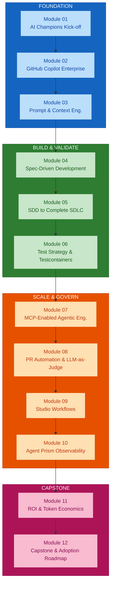
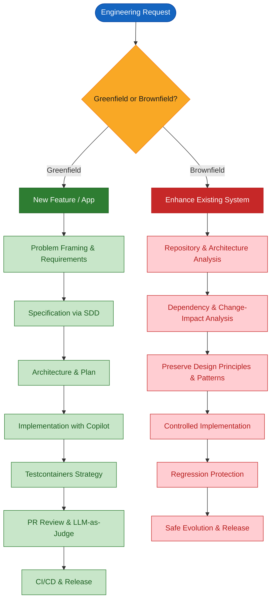
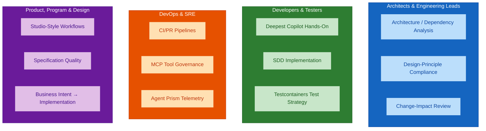
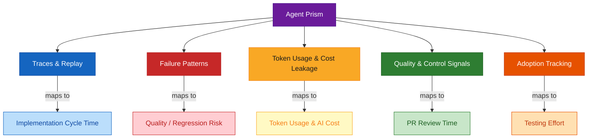

# Module 01 — AI Champions Kick-off and Enterprise Context

## Overview

Module 01 frames **why Honeywell software engineering teams need AI Champions**, maps today's delivery pain points, and introduces the AI-assisted engineering lifecycle the programme builds toward. It is the foundation module — every subsequent module assumes the shared vocabulary, role expectations, and success metrics established here.

**Duration:** 2 hours (workshop format)
**Delivered for:** Honeywell Engineering Teams

## Quick Start

The programme drives a shift from **isolated AI experimentation** to **disciplined enterprise adoption**:

| Today | Target |
|-------|--------|
| Individual engineers try Copilot ad hoc, no shared workflow | Common AI-assisted engineering lifecycle, adopted by role |
| Prompt-only development, inconsistent results | Specification-led development, validated by test strategy |
| No visibility into token usage, AI cost, or output quality | Agent Prism tracks traces, cost, and quality from day one |
| Brownfield changes risk violating architecture unnoticed | Change-impact analysis protects patterns and contracts |
| AI adoption measured by anecdote | Adoption measured against baselined cycle-time and quality metrics |

## Visual Summary



## Architecture

### Module 01 Agenda (120 minutes)

| # | Topic | Time |
|---|-------|------|
| 01 | Why AI Champions, Why Now | 15 min |
| 02 | The AI Champion Role, By Function | 15 min |
| 03 | Risks of Unmanaged AI & Agent Usage | 15 min |
| 04 | The AI-Assisted Software Engineering Lifecycle | 20 min |
| 05 | Agent Prism: The Monitoring Lens | 15 min |
| 06 | Workshop: Current-State vs Target-State Workflow | 40 min |

### The 12-Module Journey

This programme is an incremental engineering journey, not a collection of AI tool topics.

```
FOUNDATION              BUILD & VALIDATE          SCALE & GOVERN              CAPSTONE
─────────────           ─────────────────         ──────────────              ────────
1  AI Champions         4  SDD                    7  MCP-Enabled              11 ROI & Token
   Kick-off             5  SDD to SDLC               Agentic Eng.               Economics
2  GitHub Copilot       6  Test Strategy          8  PR Automation           12 Capstone &
   Enterprise              & Testcontainers          & LLM-as-Judge              Adoption
3  Prompt &                                                    9  Studio Workflows
   Context Eng.                                                 10 Agent Prism
```

Every later module assumes the shared vocabulary, role expectations, and success metrics this session establishes — from Copilot foundations through SDD, testing, MCP, PR quality, observability, and the final capstone.

### The AI-Assisted Software Engineering Lifecycle

The incremental journey the next eleven modules build, one capability at a time:


**The throughline:** Every stage is measured against the same success metrics — implementation cycle time, quality/regression risk, PR review time, testing effort, token usage, and AI cost.

### Greenfield vs Brownfield Paths



### Module-to-Capability Mapping

| Module | Capability | Lifecycle Stage |
|--------|-----------|-----------------|
| 01 | AI Champions Kick-off & Enterprise Context | Foundation |
| 02 | GitHub Copilot Enterprise | Copilot Foundations |
| 03 | Prompt & Context Engineering | Context Engineering |
| 04 | Spec-Driven Development | SDD |
| 05 | SDD to Complete SDLC | Greenfield Full Cycle |
| 06 | Test Strategy & Testcontainers | Test & PR Quality |
| 07 | MCP-Enabled Agentic Engineering | MCP Workflows |
| 08 | PR Automation & LLM-as-Judge | Test & PR Quality |
| 09 | Studio Workflows (Rovo Studio) | MCP Workflows |
| 10 | Agent Prism Observability | Observe, Measure, Scale |
| 11 | ROI & Token Economics | Observe, Measure, Scale |
| 12 | Capstone & Adoption Roadmap | Capstone |

## Core Concepts

### The AI Champion Role

One shared foundation, then role-specific depth as the programme progresses. Each function area owns a distinct part of the AI-assisted engineering lifecycle.



| Role | Primary Ownership |
|------|-------------------|
| **Architects & Engineering Leads** | Architecture/dependency analysis, design-principle compliance, change-impact review across greenfield and brownfield work |
| **Developers & Testers** | Deepest hands-on Copilot, SDD, and Testcontainers-based test-strategy skill in the programme |
| **DevOps & SRE** | CI/PR pipelines, MCP tool governance, connecting Agent Prism telemetry to operational review |
| **Product, Program & Design** | Studio-style workflows, specification quality, translating business intent into implementation-ready work |

### Business & Engineering Risks of Unmanaged AI

The problems this programme exists to solve, grouped by where they show up.

| Business Risk | Impact |
|---------------|--------|
| Slow feature and application implementation cycles | Delays in delivery, missed market windows |
| Limited visibility into AI usage, quality, and measurable ROI | Cannot justify investment or optimise spend |
| Inconsistent results when teams rely on prompts alone | Unpredictable quality, rework, wasted effort |

| Engineering Risk | Impact |
|------------------|--------|
| AI-generated changes disrupting brownfield architecture or patterns | Broken contracts, architectural drift |
| Manual, inconsistent PR review creating bottlenecks | Slower throughput, missed defects |
| Excessive token consumption from weak context discipline | Unnecessary AI cost, lower quality outputs |

### Current State vs Target State

The workshop maps today's engineering pain points against the target workflow this programme builds toward.

**Pain points identified:**
- Feature implementation cycles — slow, repetitive analysis and coding
- Brownfield enhancement — risk of violating existing architecture
- PR cycles — manual review bottlenecks
- Review latency — inconsistent validation
- Testing effort — manual, incomplete regression coverage
- AI usage blind spots — no visibility into what's working

**Target workflow:**


### Agent Prism — The Monitoring Lens

Observability is connected from Module 01 onward, not added later. Agent Prism provides five monitoring capabilities that map directly to programme success metrics.



| Capability | What It Tracks | Programme Metric |
|------------|----------------|------------------|
| **Traces & Replay** | Full execution traces of AI interactions | Implementation cycle time |
| **Failure Patterns** | Repeated error modes and regressions | Quality / regression risk |
| **Token Usage & Cost Leakage** | Token consumption per task, cost anomalies | Token usage & AI cost |
| **Quality & Control Signals** | Specification compliance, design adherence | PR review time |
| **Adoption Tracking** | Who is using AI, how often, which workflows | Testing effort & ROI |

### Workshop Output

The 40-minute hands-on activity closes this module. Participants walk away with:

**You'll map:**
- Pain points across feature implementation, brownfield enhancement, PR cycles, review latency, and testing effort
- Today's engineering workflow, stage by stage
- Current AI usage blind spots

**You'll walk away with:**
- A mapped target-state engineering workflow
- Greenfield and brownfield use cases identified for this cohort
- Baseline measures set for cycle time, quality/regression risk, PR review time, testing effort, token usage, and AI cost

### Module 01 Outcomes

- The shift from isolated AI experimentation to disciplined adoption is understood
- Role-based AI Champion expectations are mapped for your function
- Business and engineering risks of unmanaged AI usage are identified
- The end-to-end AI-assisted software engineering lifecycle is introduced
- Agent Prism's role as the monitoring lens is understood
- A target-state workflow and baseline success metrics are drafted

### Key Terminology

| Term | Definition |
|------|------------|
| **AI Champion** | An engineer who drives disciplined AI adoption within their team, owning both capability building and governance |
| **SDD** | Spec-Driven Development — using structured specifications to drive precise, traceable implementation |
| **MCP** | Model Context Protocol — connecting AI agents to approved tools, repositories, and enterprise workflows |
| **LLM-as-Judge** | Using a language model to evaluate output quality against defined criteria |
| **Agent Prism** | The observability platform for monitoring AI agent behaviour, traces, cost, and quality |
| **Context Engineering** | Selecting, structuring, and compressing the right context for AI instead of relying on raw prompts |
| **Brownfield** | Enhancing existing systems while preserving architecture, patterns, and contracts |
| **Greenfield** | Building new features or applications from scratch |

## References

### Programme Materials

- Module 01 Presentation: `presentations/Module01_AI_Champions_Kickoff_Enterprise_Context.pdf`
- Course Outline: `courseOutline/NIIT_Honeywell_AI_Champions_GitHub_AgentPrism (Software_Engineering).pdf`

### Further Reading — External References

**Industry evidence for disciplined AI adoption**
- [DORA — 2024 Accelerate State of DevOps Report](https://dora.dev/research/2024/dora-report/) — the data behind "AI is not a panacea": AI raises individual throughput but can reduce delivery stability when batch size and testing discipline slip.
- [DORA — Impact of Generative AI on Software Development](https://dora.dev/ai/) — DORA's consolidated guidance on measuring and capturing the ROI of AI-assisted development.
- [GitHub — Research: Quantifying GitHub Copilot's impact on developer productivity](https://github.blog/news-insights/research/research-quantifying-github-copilots-impact-on-developer-productivity-and-happiness/) — baseline productivity study referenced across the programme's metrics.
- [Anthropic — Building Effective Agents](https://www.anthropic.com/engineering/building-effective-agents) — vocabulary for agentic workflows the later modules depend on.

**The AI-assisted engineering lifecycle**
- [Anthropic — Effective Context Engineering for AI Agents](https://www.anthropic.com/engineering/effective-context-engineering-for-ai-agents) — context engineering as the successor to prompt engineering (Module 03).
- [GitHub — Spec-driven development with AI: get started with a new open-source toolkit](https://github.blog/ai-and-ml/generative-ai/spec-driven-development-with-ai-get-started-with-a-new-open-source-toolkit/) — the SDD approach introduced in Module 04.
- [Model Context Protocol — official site and specification](https://modelcontextprotocol.io/) and [Anthropic — Introducing the Model Context Protocol](https://www.anthropic.com/news/model-context-protocol) — the open standard behind Module 07.
- [Evidently AI — LLM-as-a-judge: a complete guide](https://www.evidentlyai.com/llm-guide/llm-as-a-judge) — evaluation patterns used in Module 08.

**Governance and risk**
- [GitHub Copilot Trust Center](https://copilot.github.trust.page/) — security, privacy, IP, and compliance posture for enterprise Copilot adoption.
- [Responsible use of GitHub Copilot features](https://docs.github.com/en/copilot/responsible-use) — GitHub's per-feature limitations and responsible-use guidance.
- [NIST AI Risk Management Framework](https://www.nist.gov/itl/ai-risk-management-framework) — a reference frame for the business and engineering risks catalogued in this module.

**Agent Prism — the monitoring lens**
- [OpenTelemetry — GenAI semantic conventions](https://opentelemetry.io/docs/specs/semconv/gen-ai/) — the trace schema Agent Prism and similar tools consume.
- [Arize Phoenix](https://github.com/Arize-ai/phoenix) — a complementary open-source LLM/agent tracing and evaluation platform.

### Next Module

Module 02 — GitHub Copilot Enterprise Features and Engineering Workflows (2 hours). Hands-on with chat, inline assist, agent mode, and repository-aware Copilot capabilities across real engineering tasks.
