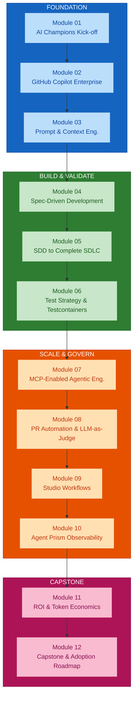
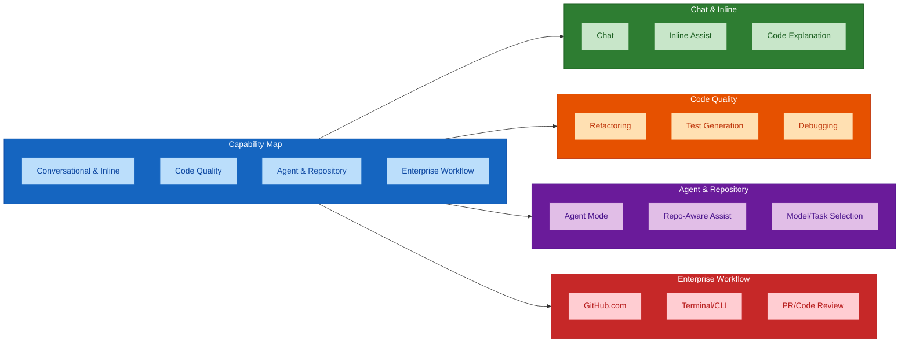
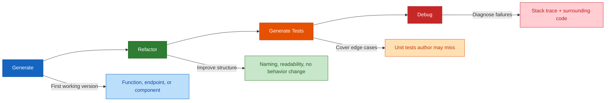
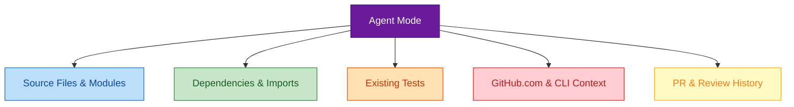

# Module 02 — GitHub Copilot Enterprise Features and Engineering Workflows

## Overview

Module 02 builds **practical Copilot fluency** across every capability the programme will draw on — chat, inline assistance, agent mode, and repository-aware workflows. This is the hands-on foundation: fluency here means less friction in every later module, from prompt engineering (Module 03) through SDD (Module 04) and beyond.

**Duration:** 2 hours (hands-on lab format)
**Delivered for:** Honeywell Engineering Teams

## Quick Start

Module 02 is six connected moves — from the full capability map to a hands-on speed-and-quality comparison:

| # | Topic | Time | What You'll Do |
|---|-------|------|----------------|
| 01 | The Copilot Enterprise Capability Map | 15 min | Guided tour of every capability grouped into four categories |
| 02 | Chat, Inline Assist & Code Explanation | 15 min | Conversational entry points — where most engineers start |
| 03 | Refactoring, Test Generation & Debugging | 20 min | Copilot across a realistic code-quality workflow |
| 04 | Agent Mode & Repository-Aware Assistance | 20 min | How agent mode reasons across multiple files and dependencies |
| 05 | Model/Task Selection & Enterprise Workflows | 15 min | Choosing the right model and task mode, safe usage practices |
| 06 | Hands-On Lab: Manual vs. Copilot-Assisted | 35 min | Same task worked both ways — compare speed and quality |

## Visual Summary

Copilot fluency is the practical tool foundation every later engineering method is built on. Module 03 recaps prompt engineering and moves into context engineering; Module 04 builds spec-driven development on top of the same Copilot capabilities practiced here.

## Architecture

### Module 02 Agenda (120 minutes)

### The Copilot Enterprise Capability Map

Four categories of capability — everything this module and later modules will draw on:

| Category | Capabilities | Primary Use |
|----------|-------------|-------------|
| **Conversational & Inline** | Chat, Inline Code Assistance, Code Explanation, Reusable Instructions & Skills | Everyday, conversational entry points |
| **Code Quality** | Refactoring, Test Generation, Debugging | Moving beyond first-draft generation |
| **Agent & Repository** | Agent Mode, Repository-Aware Assistance, Model/Task Selection | Multi-file, dependency-aware reasoning |
| **Enterprise Workflow** | GitHub.com Workflows, Terminal/CLI, PR/Code Review | Governed, team-consistent workflows |

### The Code-Quality Workflow

Copilot applied across the moves that come after the first version of the code exists:

Each stage is compared for speed and quality in this module's hands-on lab — the same discipline the programme later applies to full specification-driven features.

### Agent Mode: Where Copilot Touches Your Repository

Agent mode reasons across more than the file currently open:

This is the same repository-aware reasoning that Module 05's brownfield workflow and Module 07's MCP-enabled agents build on — agent mode is the foundation, not a separate topic.

### Module 02 in the 12-Module Journey

## Core Concepts

### Chat, Inline Assist & Code Explanation

The conversational entry points most engineers reach for first:

| Capability | What It Does | When to Use |
|-----------|-------------|-------------|
| **Chat / Conversation** | Ask questions, request changes, and reason about code in natural language, scoped to the open workspace or repository | Planning, reasoning, requesting multi-step changes |
| **Inline Code Assistance** | Suggestions generated directly in the editor as you type — completions, boilerplate, small edits | Writing new code, filling in boilerplate, quick edits |
| **Code Explanation** | Walk through unfamiliar or legacy code — especially useful before any brownfield change | Onboarding to a new codebase, understanding legacy code |

### Refactoring, Test Generation & Debugging

Copilot applied across the code-quality workflow that comes after the first draft:

| Activity | What Copilot Does | Value |
|----------|-------------------|-------|
| **Generate** | Produce a first working version from a natural-language description | Reduces time from intent to working code |
| **Refactor** | Improve structure, naming, readability without changing behavior — proposing the diff | Cleaner code without manual rewrite effort |
| **Generate Tests** | Create unit tests covering new or refactored code, including edge cases the author may miss | Broader test coverage, fewer missed scenarios |
| **Debug** | Diagnose a failing test or reported defect, reasoning from the stack trace and surrounding code | Faster root-cause identification |

### Agent Mode & Repository-Aware Assistance

Agent mode extends Copilot beyond the current file. It reasons across:

| Context Source | What Agent Mode Sees | Why It Matters |
|---------------|---------------------|----------------|
| **Source Files & Modules** | Existing code patterns, naming conventions, architecture | Suggestions match the codebase style |
| **Dependencies & Imports** | How modules connect, what's available | Avoids duplicating or breaking existing imports |
| **Existing Tests** | Current test patterns and coverage | New code follows existing test conventions |
| **GitHub.com & CLI Context** | PR history, issues, discussions | Grounds suggestions in project decisions |
| **PR & Review History** | Past review feedback, accepted patterns | Learns from what the team has approved before |

### Model/Task Selection & Safe Enterprise Usage

Choosing the right mode for the task, and the habits that keep Copilot usage governed:

| Do This | Not That |
|---------|----------|
| Match model/task selection to the task's size and risk | Use one model/mode for every task, regardless of fit |
| Review agent-mode diffs before accepting, especially in brownfield code | Let agent mode run unattended on repository-wide changes |
| Follow enterprise data-handling policy for any prompt or context | Paste sensitive data into chat without checking policy |
| Use GitHub.com and terminal/CLI workflows consistently with team conventions | Treat GitHub.com and CLI workflows as separate, ungoverned tools |

### Hands-On Lab: Manual vs. Copilot-Assisted

The 35-minute activity that closes this module — the same task, worked both ways:

| Task | Manual Approach | Copilot-Assisted Approach |
|------|----------------|--------------------------|
| Generate / explain / refactor code | Write and reason through it unaided | Chat, inline assist, and code explanation |
| Create tests | Hand-write unit tests from scratch | Generate tests, then review for coverage gaps |
| Debug a defect | Trace the stack manually | Debug with Copilot reasoning from the failure |
| Repository-wide task | Search and edit files one by one | Agent mode, reviewed before accepting |

### Module 02 Outcomes

- The full Copilot Enterprise capability map is understood
- Chat, inline assist, and code explanation have been used hands-on
- Refactoring, test generation, and debugging workflows are practiced
- Agent mode's repository-aware reasoning is understood
- Model/task selection and safe enterprise usage practices are clear
- Manual and Copilot-assisted approaches have been compared for speed and quality

### Key Terminology

| Term | Definition |
|------|------------|
| **Chat / Conversation** | Natural-language interaction with Copilot, scoped to the workspace or repository |
| **Inline Code Assistance** | Editor-generated suggestions as you type — completions, boilerplate, small edits |
| **Code Explanation** | Walking through unfamiliar or legacy code to understand structure and behavior |
| **Agent Mode** | Copilot capability that reasons across multiple files, dependencies, and repository context |
| **Repository-Aware Assistance** | Suggestions grounded in the full repository — source, tests, dependencies, and PR history |
| **Model/Task Selection** | Choosing the right Copilot model and task mode for the task's size and risk |
| **Reusable Instructions & Skills** | Enterprise-scoped instructions and custom skills that standardize Copilot behavior across teams |

## References

### Programme Materials

- Module 02 Presentation: `presentations/Module02_GitHub_Copilot_Enterprise_Engineering_Workflows.pdf`
- Course Outline: `courseOutline/NIIT_Honeywell_AI_Champions_GitHub_AgentPrism (Software_Engineering).pdf`

### Further Reading — External References

**Capability map and getting started**
- [GitHub Copilot features](https://docs.github.com/en/copilot/get-started/github-copilot-features) — the authoritative, current list of Copilot capabilities by plan (Free, Pro, Pro+, Business, Enterprise).
- [Best practices for using GitHub Copilot](https://docs.github.com/en/copilot/get-started/best-practices) — GitHub's own guidance on where Copilot helps and where to stay cautious.
- [GitHub Copilot Enterprise overview (Microsoft Learn)](https://learn.microsoft.com/en-us/training/modules/introduction-to-github-copilot-enterprise/) — knowledge bases, org-level custom instructions, and enterprise controls.

**Chat, inline assist, and code explanation**
- [Asking GitHub Copilot questions in your IDE](https://docs.github.com/en/copilot/using-github-copilot/asking-github-copilot-questions-in-your-ide) — chat participants (`@workspace`/`@project`), slash commands, and chat variables.
- [Copilot Chat cheat sheet](https://docs.github.com/en/copilot/reference/chat-cheat-sheet) — quick reference for chat commands and keywords.

**Refactoring, test generation, and debugging**
- [VS Code — Copilot Chat in VS Code](https://code.visualstudio.com/docs/copilot/chat/copilot-chat) — inline chat, `/fix`, `/tests`, and editor smart actions.
- [GitHub Copilot Cookbook](https://docs.github.com/en/copilot/tutorials/copilot-chat-cookbook) — worked recipes for refactoring, debugging, test generation, and documentation.

**Agent mode and repository-aware assistance**
- [The GitHub Blog — Agent mode and MCP rolling out to all VS Code users](https://github.blog/news-insights/product-news/github-copilot-agent-mode-activated/) — what agent mode is and how it differs from chat/edits.
- [VS Code — Use agent mode in chat](https://code.visualstudio.com/docs/copilot/chat/chat-agent-mode) — running agent mode, reviewing diffs, and approving terminal commands. Agent mode is generally available in VS Code and JetBrains.
- [About GitHub Copilot cloud agent](https://docs.github.com/en/copilot/concepts/agents/coding-agent/about-coding-agent) — assigning issues to Copilot to research, plan, and open PRs asynchronously on GitHub.com.

**Model/task selection and safe enterprise usage**
- [Supported AI models in GitHub Copilot](https://docs.github.com/en/copilot/reference/ai-models/supported-models) and [AI model comparison](https://docs.github.com/en/copilot/reference/ai-models/model-comparison) — matching model, context window, and reasoning level to task size and risk (and to AI-credit cost).
- [Best practices for GitHub Copilot CLI](https://docs.github.com/en/copilot/how-tos/copilot-cli/cli-best-practices) — the terminal/CLI workflow referenced in the capability map.
- [About GitHub Copilot code review](https://docs.github.com/en/copilot/concepts/agents/code-review) — automated PR review, effort levels, and how it fits team workflows.
- [Configure custom instructions for GitHub Copilot](https://docs.github.com/en/copilot/how-tos/custom-instructions) — `copilot-instructions.md`, path-scoped instructions, and prompt files that standardise Copilot behaviour.
- [GitHub Copilot Trust Center](https://copilot.github.trust.page/) and [Responsible use of GitHub Copilot features](https://docs.github.com/en/copilot/responsible-use) — data handling, IP, and content-exclusion policy for governed usage.

### Previous Module

Module 01 — AI Champions Kick-off and Enterprise Context (2 hours). Programme context, role expectations, business and engineering risks, and the AI-assisted software engineering lifecycle.

### Next Module

Module 03 — Prompt Engineering Recap and Context Engineering (2 hours). A practical recap of prompt engineering, then a move into selecting, structuring, and managing context to avoid token inflation.
