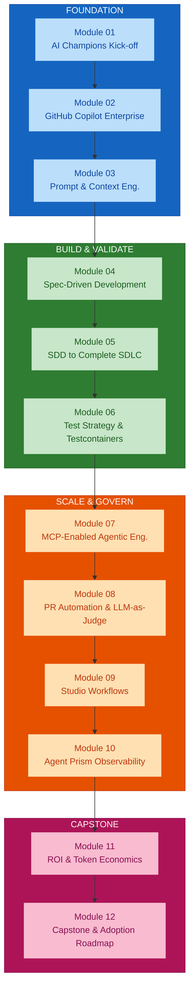
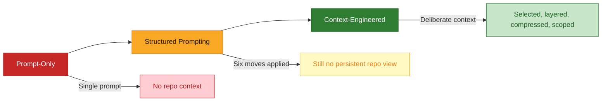
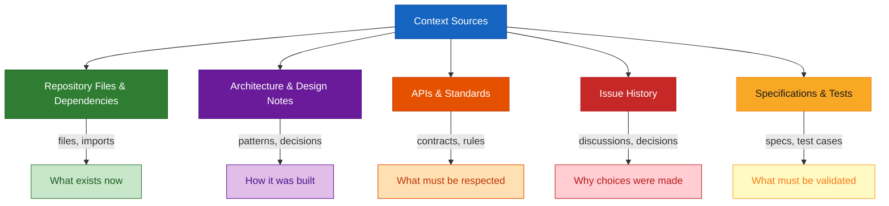
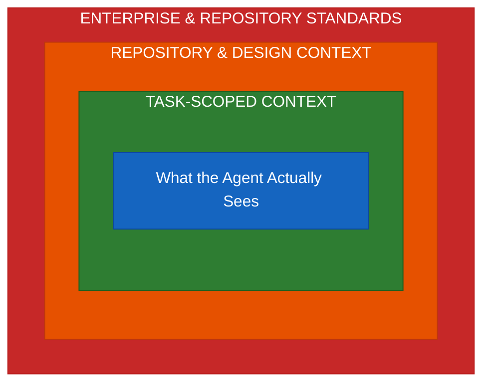

# Module 03 — Prompt Engineering Recap and Context Engineering

## Overview

Module 03 bridges **structured prompting and context engineering** — refreshing the six practical prompt moves, then moving into how to select, structure, layer, and compress the context supplied to AI without letting token usage inflate. This is the discipline Module 04's specifications and every later module's token economics depend on.

**Duration:** 2 hours (hands-on lab format)
**Delivered for:** Honeywell Engineering Teams

## Quick Start

Module 03 is six connected moves — from a prompting recap to a hands-on context-engineering comparison:

| # | Topic | Time | What You'll Do |
|---|-------|------|----------------|
| 01 | Prompt Engineering Recap: The Six Moves | 15 min | Task framing, role/instruction, constraints, examples, decomposition, iterative verification |
| 02 | From Prompt-Only to Context-Engineered | 10 min | Why structured prompting alone still isn't enough |
| 03 | The Context Sources Map | 15 min | Repository files, design notes, APIs, standards, issue history, specs and tests |
| 04 | The Context Engineering Architecture & Layering | 25 min | How raw context is selected, structured, compressed, and scoped |
| 05 | Context Boundaries: Avoiding Token Inflation | 20 min | Token-aware practices and habits that quietly inflate context |
| 06 | Hands-On Lab: Prompt-Only vs Context-Engineered | 35 min | Solve the same task both ways, compare quality, token usage, iterations, time |

## Visual Summary

Context discipline here is what Module 04's specifications and every later module's token economics depend on. Spec-Driven Development is only as precise as the context behind it — and every later module is measured in part on token usage and AI cost, both set by the habits this session builds.

## Architecture

### Module 03 Agenda (120 minutes)

| # | Topic | Time |
|---|-------|------|
| 01 | Prompt Engineering Recap: The Six Moves | 15 min |
| 02 | From Prompt-Only to Context-Engineered | 10 min |
| 03 | The Context Sources Map | 15 min |
| 04 | The Context Engineering Architecture & Layering | 25 min |
| 05 | Context Boundaries: Avoiding Token Inflation | 20 min |
| 06 | Hands-On Lab: Prompt-Only vs Context-Engineered | 35 min |

### Prompt Engineering Recap: The Six Moves

The practical sequence behind any well-formed prompt, before context engineering is added on top:

```mermaid
graph LR
    A[Frame the Task] --> B[Set Role &amp; Instruction]
    B --> C[Add Constraints]
    C --> D[Give Examples]
    D --> E[Decompose]
    E --> F[Iterate &amp; Verify]

    style A fill:#1565c0,stroke:#0d47a1,color:#fff
    style B fill:#2e7d32,stroke:#1b5e20,color:#fff
    style C fill:#e65100,stroke:#bf360c,color:#fff
    style D fill:#6a1b9a,stroke:#4a148c,color:#fff
    style E fill:#c62828,stroke:#b71c1c,color:#fff
    style F fill:#f9a825,stroke:#f57f17,color:#1a1a1a
    style A fill:#bbdefb,stroke:#1565c0,color:#0d47a1
    style B fill:#c8e6c9,stroke:#2e7d32,color:#1b5e20
    style C fill:#ffe0b2,stroke:#e65100,color:#bf360c
    style D fill:#e1bee7,stroke:#6a1b9a,color:#4a148c
    style E fill:#ffcdd2,stroke:#c62828,color:#b71c1c
    style F fill:#fff9c4,stroke:#f9a825,color:#f57f17
```

| Move | What It Does |
|------|-------------|
| **Frame the Task** | State the goal in one clear sentence — what should exist when the task is done |
| **Set Role & Instruction** | Tell the model what perspective to take and how to approach the task |
| **Add Constraints** | Name the limits — language, style, performance, or interfaces that must be respected |
| **Give Examples** | Show, don't just tell — a short example anchors format and quality expectations |
| **Decompose** | Break a large task into smaller, independently verifiable steps |
| **Iterate & Verify** | Check the output against the goal, and refine the prompt rather than accepting the first pass |

These six moves are necessary but not sufficient — they shape how you ask, but say nothing about what the model actually knows about your repository. That's what context engineering adds next.

### From Prompt-Only to Context-Engineered

Three maturity stages — this module moves the room from left to right:

| Stage | Description | Limitation |
|-------|-------------|-----------|
| **Prompt-Only** | A single well-worded prompt, with no repository context attached | Works for small, self-contained tasks; breaks down on anything that touches existing code |
| **Structured Prompting** | The six recap moves applied consistently — role, constraints, examples, decomposition | Better and more repeatable, but still no persistent view of the repository |
| **Context-Engineered** | Repository, design, API, and spec context deliberately selected, layered, compressed, and scoped to the task before the prompt is ever sent | The target state for enterprise engineering |

### The Context Sources Map

Everything a task's context could draw from — before any selection happens:

Every one of these sources is a candidate for context — the discipline this module teaches is choosing which of them actually belong in a given task's prompt.

### The Context Engineering Pipeline

Raw sources narrow, stage by stage, into exactly what the task needs — and nothing more:

Selection, layering, and compression aren't optional polish — skipping them is exactly how context inflation and avoidable token cost happen at scale.

### Context Boundaries: What Actually Reaches the Agent

Everything outside the innermost box is available, but deliberately not sent:

Drawing this boundary deliberately, task by task, is what keeps token usage predictable — the opposite of letting context grow by default.

### Anti-Patterns: How Context Inflation Happens

The habits that quietly grow token usage without improving output quality:

| Do This | Not That |
|---------|----------|
| Select only the files/snippets the task actually touches | Attach whole files when only a few functions are relevant |
| Reuse or reference prior context instead of resending it | Re-send the same context on every follow-up turn |
| Summarize specs and issues to the parts that matter | Copy entire specs or issue threads verbatim into the prompt |
| Reset or scope context when the task changes | Let context accumulate across an unrelated multi-task session |
| Compress deliberately — a smaller, sharper context outperforms a bigger, vaguer one | Skip compression because the model "has a big context window" |

### Hands-On Lab: Prompt-Only vs Context-Engineered

The 35-minute activity that closes this module — the same task, worked both ways:

| Measure | Prompt-Only | Context-Engineered |
|---------|-------------|-------------------|
| **Output quality** | Assessed as-is, first pass | Assessed against the same rubric |
| **Token usage** | Logged from the worksheet | Logged from the worksheet |
| **Iteration count** | Counted to reach an acceptable result | Counted to reach an acceptable result |
| **Task completion time** | Timed end to end | Timed end to end |

Both passes use the token usage worksheet — this module's baseline for every later module's cost discussion.

### Module 03 Outcomes

- The six practical prompt engineering moves are refreshed and applied
- The gap between structured prompting and context engineering is clear
- The full context sources map is understood
- The select → layer → compress → scope pipeline is understood
- Context boundaries and anti-patterns for token inflation are identified
- Prompt-only and context-engineered approaches have been compared on real metrics

### Key Terminology

| Term | Definition |
|------|------------|
| **Prompt Engineering** | Crafting effective prompts using framing, role-setting, constraints, examples, decomposition, and iteration |
| **Context Engineering** | Deliberately selecting, structuring, layering, compressing, and scoping the context supplied to AI for a specific task |
| **Context Sources** | Repository files, architecture/design notes, APIs, standards, issue history, specifications, and tests |
| **Context Pipeline** | The select → layer → compress → scope sequence that narrows raw sources to task-relevant context |
| **Token Inflation** | The gradual growth of context size without proportional improvement in output quality |
| **Context Boundary** | The deliberate decision about what context reaches the agent vs. what stays available but unsent |
| **Structured Prompting** | Applying the six moves consistently — role, constraints, examples, decomposition — without repository context |
| **Task-Scoped Context** | The final, compressed set of context actually sent to the agent for a specific task |

## References

### Programme Materials

- Module 03 Presentation: `presentations/Module03_Prompt_Context_Engineering.pdf`
- Course Outline: `courseOutline/NIIT_Honeywell_AI_Champions_GitHub_AgentPrism (Software_Engineering).pdf`

### Further Reading — External References

**Prompt engineering — the six moves**
- [Prompt engineering for GitHub Copilot Chat](https://docs.github.com/en/copilot/concepts/prompting/prompt-engineering) — GitHub's own framing: goal-first, specifics, examples, decomposition, iteration.
- [GitHub Copilot Cookbook](https://docs.github.com/en/copilot/tutorials/copilot-chat-cookbook) — a cookbook of worked prompt patterns for real tasks.
- [Anthropic — Prompt engineering overview](https://platform.claude.com/docs/en/build-with-claude/prompt-engineering/overview) — model-agnostic techniques: role prompting, examples, chain-of-thought, output structure.
- [OpenAI — Prompt engineering guide](https://platform.openai.com/docs/guides/prompt-engineering) — a second reference for the same core moves.

**From prompt-only to context-engineered**
- [Anthropic — Effective context engineering for AI agents](https://www.anthropic.com/engineering/effective-context-engineering-for-ai-agents) — the primary reference for this module: context as a finite attention budget to be curated, not filled.
- [Anthropic — Managing context on the Claude Developer Platform](https://claude.com/blog/context-management) — compaction, context editing, and memory as first-class primitives.
- [Philipp Schmid — Context Engineering](https://www.philschmid.de/context-engineering) — a practitioner walkthrough of select → structure → compress.

**Context sources and repository grounding**
- [Configure custom instructions for GitHub Copilot](https://docs.github.com/en/copilot/how-tos/custom-instructions) — repository instructions, path-scoped instructions, and reusable prompt files.
- [About GitHub Copilot Spaces](https://docs.github.com/en/copilot/concepts/context/spaces) — bundling repositories, docs, issues, and free-text notes into reusable, shareable context (the successor to Copilot knowledge bases).
- [VS Code — Add context to chat](https://code.visualstudio.com/docs/copilot/chat/copilot-chat-context) — how the editor selects and scopes context (`#`-mentions, `@`-participants) for each request.
- [Model Context Protocol](https://modelcontextprotocol.io/) — the standard for connecting external context sources to agents (expanded in Module 07).

**Token boundaries and cost**
- [Anthropic — Token counting](https://platform.claude.com/docs/en/build-with-claude/token-counting) — measure context size before sending.
- [Choosing model, context window, and reasoning level in Copilot](https://docs.github.com/en/copilot/reference/ai-models/model-comparison) — larger context windows and higher reasoning consume more AI credits; use them only when the task needs it.
- [Anthropic — Prompt caching](https://platform.claude.com/docs/en/build-with-claude/prompt-caching) — how stable, reused context can be cached instead of re-sent.

### Previous Module

Module 02 — GitHub Copilot Enterprise Features and Engineering Workflows (2 hours). Hands-on with chat, inline assist, agent mode, and repository-aware Copilot capabilities across real engineering tasks.

### Next Module

Module 04 — Spec-Driven Development with GitHub Spec Kit / OpenSpec (2 hours). Using specification, architecture/plan, tasks, and acceptance criteria to drive traceable greenfield implementation.
