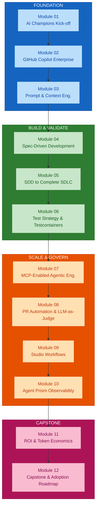
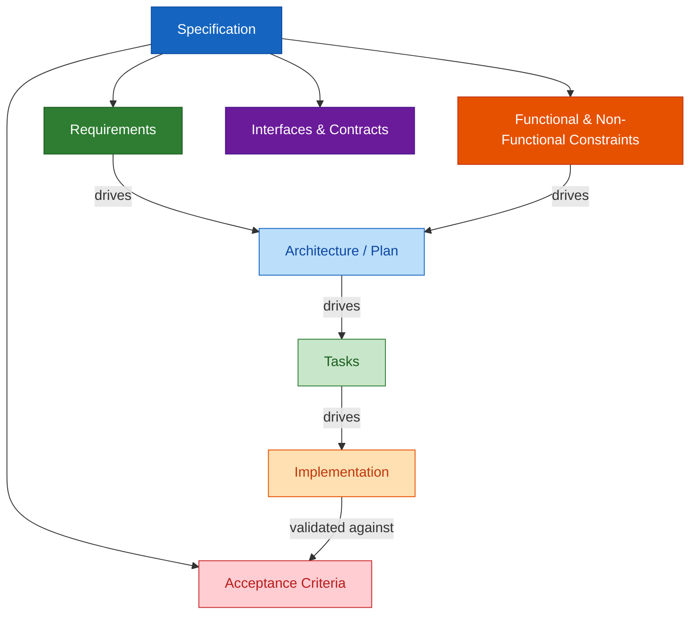
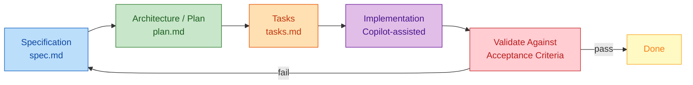
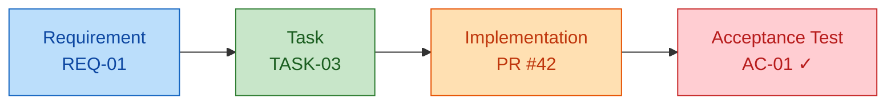

# Module 04 — Spec-Driven Development with GitHub Spec Kit / OpenSpec

## Overview

Module 04 moves from prompt-only development to **specification-driven engineering** — capturing requirements, architecture, tasks, and acceptance criteria as versioned artifacts that drive precise, traceable implementation for greenfield features. This is the first full engineering method the programme builds; everything since Module 01 has led here.

**Duration:** 2 hours (hands-on lab format)
**Delivered for:** Honeywell Engineering Teams

## Quick Start

Module 04 is six connected moves — from why specifications matter to a hands-on spec-driven build:

| # | Topic | Time | What You'll Do |
|---|-------|------|----------------|
| 01 | From Prompt-Only to Spec-Driven Development | 15 min | Why a persistent, structured specification changes what's possible |
| 02 | Anatomy & Quality of a Good Specification | 20 min | Requirements, constraints, interfaces/contracts, and acceptance criteria |
| 03 | The SDD Flow: Spec → Plan → Tasks → Implementation | 25 min | How a specification becomes architecture, tasks, and working code |
| 04 | Tooling the Workflow: GitHub Spec Kit / OpenSpec | 15 min | The versioned artifacts that carry the workflow end to end |
| 05 | Traceability & Change Control | 15 min | How every requirement stays linked — and what happens when a spec changes |
| 06 | Hands-On Lab: Spec-Driven vs Prompt-Only | 30 min | Build the same feature both ways, compare traceability and change resilience |

## Visual Summary

SDD is the first full engineering method this programme builds — everything since Module 01 has led here. Module 05 applies this same spec → plan → tasks flow across a complete SDLC and into brownfield code; Module 06's test strategy is derived directly from the acceptance criteria written here.

## Architecture

### Module 04 Agenda (120 minutes)

| # | Topic | Time |
|---|-------|------|
| 01 | From Prompt-Only to Spec-Driven Development | 15 min |
| 02 | Anatomy & Quality of a Good Specification | 20 min |
| 03 | The SDD Flow: Spec → Plan → Tasks → Implementation | 25 min |
| 04 | Tooling the Workflow: GitHub Spec Kit / OpenSpec | 15 min |
| 05 | Traceability & Change Control | 15 min |
| 06 | Hands-On Lab: Spec-Driven vs Prompt-Only | 30 min |

### From Prompt-Only to Spec-Driven Development

The same shift Module 03 introduced for context, now applied to the whole feature:

| Prompt-Only | Spec-Driven |
|-------------|------------|
| Requirements interpreted differently each time you ask | Requirements captured once, precisely, in a specification |
| No persistent artifact tying code back to intent | Every task traces back to the spec and its acceptance criteria |
| Acceptance criteria exist only in the requester's head | Acceptance criteria are explicit, written, and checkable |
| Any change means re-explaining the task from scratch | Changes flow through the spec — plan and tasks stay in sync |

### Anatomy of a Specification

Four parts, every one of them load-bearing for what comes next:

The plan is derived from requirements and constraints; the tasks are derived from the plan; and every task is only "done" when it satisfies its acceptance criteria. Weak input here weakens everything downstream.

### What Makes a Specification "Good Enough"?

Four qualities the hands-on lab will check your specification against:

| Quality | What It Means |
|---------|--------------|
| **Unambiguous** | One reasonable interpretation — no room for the model, or a teammate, to guess what was meant |
| **Testable** | Every acceptance criterion can be checked mechanically or by clear, repeatable manual verification |
| **Traceable** | Each requirement maps to specific tasks, code, and tests — nothing gets implemented that isn't specified |
| **Complete** | Functional and non-functional constraints are both captured — not just the happy path |

### The SDD Flow: Spec → Plan → Tasks → Implementation

A forward path from intent to working code, closed by a feedback loop back to the specification:

Nothing moves forward without what came before it, and nothing changes without flowing back through the spec — that discipline is what makes the output traceable, not just fast.

### Tooling the Workflow: GitHub Spec Kit / OpenSpec

The same four-stage flow, viewed through the versioned artifacts that carry it:

| Artifact | Contents | Role |
|----------|----------|------|
| **constitution.md** | Non-negotiable project principles — quality bars, tech constraints, conventions | Persistent guardrails every spec, plan, and task is checked against |
| **spec.md** | Requirements, constraints, acceptance criteria | The single source of truth — structured, versioned, never stale |
| **plan.md** | Architecture, technical approach, design decisions | Generated from the specification, reviewed before implementation |
| **tasks.md** | Small, independently implementable and verifiable units | The plan broken into work that can be validated individually |
| **Implementation + Validation** | Copilot-assisted code, checked against acceptance criteria | Every task's result verified against the original spec |

**GitHub Spec Kit** provides this structure concretely: the `specify` CLI bootstraps the artifact set, and slash commands drive the flow inside your coding agent — `/constitution`, `/specify`, `/clarify`, `/plan`, `/tasks`, `/analyze`, and `/implement`. It is agent-agnostic (GitHub Copilot, Claude Code, Gemini CLI, Cursor, and others). **OpenSpec** is a lighter-weight alternative built around per-change proposal folders (`proposal.md`, `specs/`, `design.md`, `tasks.md`) with no rigid phase gates.

Every artifact is versioned alongside the code — the specification isn't a document that goes stale, it's part of the traceable record.

### Traceability & Change Control

One requirement, followed all the way to a passing acceptance test:

**Change control:** When a requirement changes, the specification is updated first — the plan, tasks, and tests are then revised from that single source of truth, not edited ad hoc in code or in chat history.

### Hands-On Lab: Spec-Driven vs Prompt-Only

The 30-minute activity that closes this module — the same feature, built both ways:

| Measure | Prompt-Only Baseline | Spec-Driven Approach |
|---------|---------------------|---------------------|
| **Requirements capture** | Restated conversationally each time | Captured once in a versioned specification |
| **Traceability** | Not tracked | Requirement → task → implementation → test |
| **Acceptance validation** | Ad hoc, subjective review | Checked against explicit acceptance criteria |
| **Handling a spec change** | Re-explain the task from scratch | Update the spec; plan and tasks follow |

### Module 04 Outcomes

- The shift from prompt-only to spec-driven development is understood
- The four parts of a specification are identified and drafted
- Specification quality — unambiguous, testable, traceable, complete — is checked
- The spec → plan → tasks → implementation flow is understood, loop included
- GitHub Spec Kit / OpenSpec artifacts are mapped to each stage
- A feature has been built spec-driven and compared to a prompt-only baseline

### Key Terminology

| Term | Definition |
|------|------------|
| **Spec-Driven Development (SDD)** | An engineering method where requirements are captured as structured specifications that drive architecture, tasks, and validated implementation |
| **Specification (spec.md)** | A versioned artifact capturing requirements, constraints, interfaces/contracts, and acceptance criteria for a feature |
| **Plan (plan.md)** | The architecture and technical approach derived from the specification, reviewed before implementation |
| **Tasks (tasks.md)** | Small, independently implementable and verifiable units of work derived from the plan |
| **Acceptance Criteria** | Explicit, testable conditions that must be satisfied for a requirement to be considered implemented |
| **Traceability** | The linkage from each requirement to its corresponding task, implementation, and acceptance test |
| **Change Control** | The discipline of updating the specification first when requirements change, then propagating to plan, tasks, and tests |
| **Constitution** | The set of non-negotiable project principles (e.g. `constitution.md`) that every spec, plan, and task is validated against |
| **GitHub Spec Kit / OpenSpec** | Open-source toolkits for spec-driven development — a `specify` CLI plus agent slash commands (Spec Kit) or per-change proposal folders (OpenSpec) that carry versioned specs alongside code |

## References

### Programme Materials

- Module 04 Presentation: `presentations/Module04_Spec_Driven_Development.pdf`
- Course Outline: `courseOutline/NIIT_Honeywell_AI_Champions_GitHub_AgentPrism (Software_Engineering).pdf`

### Further Reading — External References

**GitHub Spec Kit**
- [github/spec-kit](https://github.com/github/spec-kit) — the toolkit itself: `specify` CLI, templates, and the `/constitution` → `/specify` → `/plan` → `/tasks` → `/implement` command flow.
- [Spec Kit documentation](https://github.github.com/spec-kit/) — installation, the full command reference, and workflow guidance.
- [spec-kit/spec-driven.md](https://github.com/github/spec-kit/blob/main/spec-driven.md) — the design rationale for spec-driven development.
- [The GitHub Blog — Spec-driven development with AI](https://github.blog/ai-and-ml/generative-ai/spec-driven-development-with-ai-get-started-with-a-new-open-source-toolkit/) — the launch announcement and worked example.
- [Microsoft for Developers — Diving into Spec-Driven Development with GitHub Spec Kit](https://developer.microsoft.com/blog/spec-driven-development-spec-kit/) — an end-to-end walkthrough.

**OpenSpec and the wider ecosystem**
- [Fission-AI/OpenSpec](https://github.com/Fission-AI/OpenSpec) — the lightweight, proposal-folder alternative for AI coding assistants.
- [speclib/awesome-openspec](https://github.com/speclib/awesome-openspec) — a curated list of OpenSpec and general spec-driven-development resources.
- [Kiro — Spec-driven development](https://kiro.dev/docs/specs/) — another take on the spec → design → tasks workflow, useful for contrast.

**Specification quality, traceability, and change control**
- [Architecture Decision Records (adr.github.io)](https://adr.github.io/) — a lightweight format for the design decisions captured in `plan.md`.
- [Writing good acceptance criteria / Gherkin](https://cucumber.io/docs/gherkin/reference/) — a structured way to make acceptance criteria testable.
- [IEEE / ISO/IEC/IEEE 29148 — Requirements engineering](https://en.wikipedia.org/wiki/ISO/IEC_29148) — the classic definition of a "good" requirement: unambiguous, verifiable, complete, traceable.
- [Anthropic — Effective context engineering for AI agents](https://www.anthropic.com/engineering/effective-context-engineering-for-ai-agents) — why a compact, structured spec outperforms a long conversational prompt as agent context.

### Previous Module

Module 03 — Prompt Engineering Recap and Context Engineering (2 hours). A practical recap of prompt engineering, then a move into selecting, structuring, and managing context to avoid token inflation.

### Next Module

Module 05 — SDD to Complete Software SDLC (4 hours). Taking this same specification through the full SDLC, greenfield and brownfield, including architecture analysis and change-impact review.
