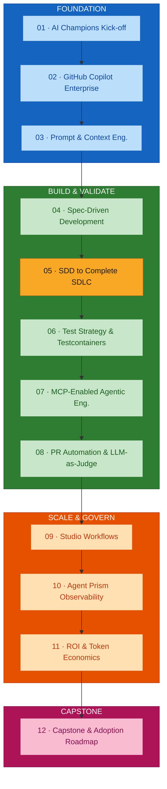
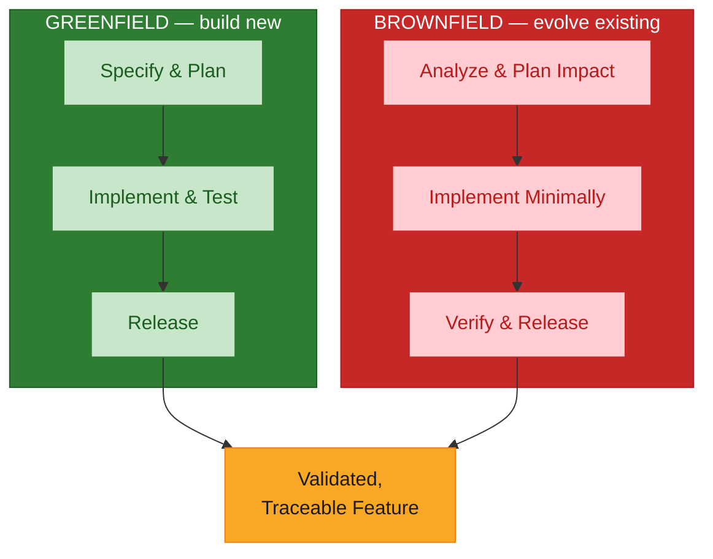
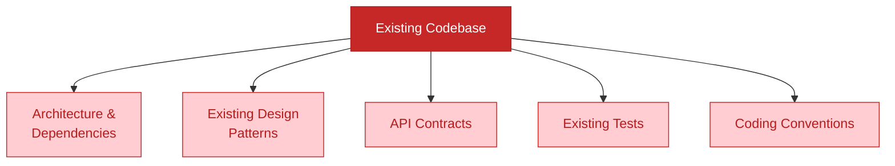

# Module 05 — Software Development: SDD to Complete Software SDLC

## Overview

Module 05 takes Module 04's specification through a **full greenfield SDLC** — architecture, conventions, implementation, test strategy, CI/quality checks, and release readiness — then applies the same SDD discipline to safely evolve an **existing brownfield application**. It is the longest module in the programme: where SDD stops being a technique and becomes a complete workflow, walked twice.

**Duration:** 4 hours (extended workshop format)
**Delivered for:** Honeywell Engineering Teams

## Quick Start

Module 05 is six connected moves — two full workflows, greenfield and brownfield, built on the same discipline:

| # | Topic | Time | What You'll Do |
|---|-------|------|----------------|
| 01 | Greenfield SDLC: Architecture, Conventions &amp; Release Readiness | 35 min | See how Copilot assists across the full SDLC, not just code generation |
| 02 | Greenfield Hands-On: Spec → Release-Ready Feature | 60 min | Take Module 04's spec through implementation, tests, CI, and PR/release readiness |
| 03 | Brownfield: Repository Archaeology &amp; Change-Impact Analysis | 35 min | Analyse an existing app's architecture, dependencies, and patterns before touching code |
| 04 | Brownfield Hands-On: Implementing Without Disruption | 60 min | Implement a feature in existing code with the minimal-change strategy; verify no regression |
| 05 | Greenfield vs Brownfield: Comparing the Two Workflows | 20 min | Where the two workflows start from the same discipline, and where they genuinely diverge |
| 06 | Module Wrap-Up &amp; Debrief | 30 min | Consolidate both tracks; preview how Module 06's test strategy builds on this |

## Visual Summary



Module 06 derives its test strategy directly from what gets built here; every module from Module 05 on assumes you can move comfortably between greenfield and brownfield work.

## Architecture

### Module 05 Agenda (240 minutes)

| # | Topic | Time |
|---|-------|------|
| 01 | Greenfield SDLC: Architecture, Conventions &amp; Release Readiness | 35 min |
| 02 | Greenfield Hands-On: Spec → Release-Ready Feature | 60 min |
| 03 | Brownfield: Repository Archaeology &amp; Change-Impact Analysis | 35 min |
| 04 | Brownfield Hands-On: Implementing Without Disruption | 60 min |
| 05 | Greenfield vs Brownfield: Comparing the Two Workflows | 20 min |
| 06 | Module Wrap-Up &amp; Debrief | 30 min |

### Two Tracks, One Discipline

Every stage of the SDLC, walked twice — once building new, once evolving existing code. Both tracks run on the same SDD foundation from Module 04; the difference is *what has to be true before you can safely start implementing.*



### The Greenfield SDLC Flow

Module 04's spec, carried all the way to a release-ready feature. Copilot assists at *every* stage — not just implementation — which is what turns "AI wrote some code" into "AI helped ship a validated feature."


**Four places Copilot contributes beyond writing the implementation itself:**

| Place | What Copilot does |
|-------|-------------------|
| Architecture &amp; planning | Drafts `plan.md` options, surfaces trade-offs, checks the approach against the spec's constraints |
| Test generation | Generates unit and integration tests directly from the specification's acceptance criteria |
| CI/CD &amp; quality gates | Drafts pipeline configuration and explains quality-gate failures with the surrounding context |
| PR &amp; release readiness | Writes PR descriptions, summarizes changes, checks release readiness against the original spec |

### Repository Archaeology: Before You Touch Brownfield Code

Five things worth understanding before the first line of a brownfield change is written. Every one of these shapes what "minimal change" means for *this specific* codebase — skipping this step is how well-intentioned changes become regressions.



### Change-Impact Analysis: Mapping the Blast Radius

Before writing code, know exactly how far a change could reach. The **blast radius** — not the file you are editing — defines the scope of "minimal change," and the outer ring is exactly what regression testing exists to protect.

```
┌─ UNAFFECTED CODE — protected by regression tests ───────────┐
│  ┌─ INDIRECTLY AFFECTED AREAS ────────────────────────────┐ │
│  │  ┌─ DIRECTLY DEPENDENT MODULES ───────────────────────┐│ │
│  │  │  ┌─ THE CHANGE ──────────────────────────────────┐ │││
│  │  │  │  what we're actually modifying                 │ │││
│  │  │  └───────────────────────────────────────────────┘ │││
│  │  └────────────────────────────────────────────────────┘│ │
│  └────────────────────────────────────────────────────────┘ │
└────────────────────────────────────────────────────────────┘
```

### The Minimal-Change Strategy

Once the blast radius is known, discipline is what keeps it small:

| Minimal-Change Strategy | Maximal Disruption (avoid) |
|-------------------------|----------------------------|
| Change only what the feature actually requires | Refactor broadly while implementing the feature |
| Stay within the identified blast radius | Touch files outside the change's actual scope |
| Follow the codebase's existing patterns, even if imperfect | Introduce new patterns alongside existing ones |
| Re-run the full existing test suite before and after | Skip re-running the existing test suite |

### The Brownfield Safe-Evolution Flow

The same rigor as the greenfield flow, shaped by what already exists. Every brownfield stage exists to answer one question before code changes: *what could this break, and how do we know it didn't?*


### Greenfield vs Brownfield: Where the Workflows Diverge

Same discipline, different starting constraints:

| Dimension | Greenfield | Brownfield |
|-----------|-----------|------------|
| Starting point | A blank slate, guided by the spec | An existing codebase, guided by the spec + existing patterns |
| First step | Architecture &amp; conventions | Repository archaeology |
| Primary risk | Under-specifying requirements | Unintended regression |
| Change scope | Bounded by the spec | Bounded by the spec **and** the blast radius |
| Validation | Acceptance criteria | Acceptance criteria + full regression suite |

### Hands-On Labs

**Greenfield lab (60 min)** — carry Module 04's specification to a release-ready feature. Every row is checked against the specification before the feature is considered release-ready:

| Stage | What You'll Produce | Validated Against |
|-------|--------------------|--------------------|
| Architecture / Plan | `plan.md` | Requirements &amp; constraints |
| Implementation | Working code, task by task | `tasks.md` |
| Test Strategy | Unit + integration tests | Acceptance criteria |
| CI / Release | Passing pipeline, PR ready to review | The full specification |

**Brownfield lab (60 min)** — implement a feature in existing code without unnecessary disruption. Success means the feature works **and** every pre-existing test still passes:

| Stage | What You'll Produce | Validated Against |
|-------|--------------------|--------------------|
| Repository Archaeology | Notes on existing architecture &amp; patterns | The codebase itself |
| Change-Impact Analysis | A documented change plan | The identified blast radius |
| Minimal-Change Implementation | The feature, implemented in scope | The change plan |
| Regression Verification | Full existing test suite, passing | Pre-change behaviour, preserved |

### Module 05 Outcomes

- The greenfield SDLC flow — spec to release-ready feature — is understood
- Where Copilot assists across the full SDLC, not just code generation, is clear
- Repository archaeology and change-impact analysis are practiced on real brownfield code
- The minimal-change strategy and its do/don't boundaries are understood
- A feature has been implemented and validated in both a greenfield and a brownfield context
- The two workflows have been compared side by side

### Key Terminology

| Term | Definition |
|------|------------|
| **Greenfield track** | Building a new feature from a blank slate, guided only by the specification |
| **Brownfield track** | Evolving existing code, guided by the specification **and** the codebase's existing patterns |
| **Repository archaeology** | Understanding an existing codebase's architecture, dependencies, patterns, contracts, tests, and conventions before changing it |
| **Change-impact analysis** | Mapping how far a change could reach — directly and indirectly — before writing it |
| **Blast radius** | The set of directly and indirectly affected code; the true scope of a "minimal" change |
| **Minimal-change strategy** | Changing only what the feature requires, staying inside the blast radius, following existing patterns, and re-running the full suite before and after |
| **Regression protection** | Using the existing test suite to prove that pre-change behaviour is preserved |
| **Release readiness** | The state where a feature is implemented, tested, CI-passing, and reviewed against the original spec |
| **API compatibility** | Preserving the promises existing callers depend on when changing a shared interface |

## References

### Programme Materials

- Module 05 Presentation: `presentations/Module05_SDD_Complete_SDLC.pdf`
- Course Outline: `courseOutline/NIIT_Honeywell_AI_Champions_GitHub_AgentPrism (Software_Engineering).pdf`
- Phase guide: [`build-validate-phase-modules-05-08.md`](./build-validate-phase-modules-05-08.md)

### Further Reading — External References

*Every link below was fetched and confirmed (HTTP 200) on 2026-09-02.*

**Carrying a spec through a full SDLC**
- [github/spec-kit](https://github.com/github/spec-kit) — the `specify` CLI and the `/constitution` → `/specify` → `/plan` → `/tasks` → `/implement` flow used across the greenfield SDLC.
- [Spec Kit documentation](https://github.github.com/spec-kit/) — installation, the full command reference, and workflow guidance.
- [The GitHub Blog — Spec-driven development with AI](https://github.blog/ai-and-ml/generative-ai/spec-driven-development-with-ai-get-started-with-a-new-open-source-toolkit/) — the SDD approach and a worked example.
- [Microsoft for Developers — Diving into Spec-Driven Development with GitHub Spec Kit](https://developer.microsoft.com/blog/spec-driven-development-spec-kit/) — an end-to-end walkthrough across the SDLC.
- [About GitHub Copilot coding agent](https://docs.github.com/en/copilot/concepts/agents/coding-agent/about-coding-agent) — assigning an issue to Copilot to research, plan, implement, and open a PR — the asynchronous form of this flow.

**Brownfield engineering and change-impact analysis**
- [Understand Legacy Code](https://understandlegacycode.com/) — practical techniques for repository archaeology, characterization tests, and safe incremental change.
- [Configure custom instructions for GitHub Copilot](https://docs.github.com/en/copilot/how-tos/custom-instructions) — repository and path-scoped instructions that encode a codebase's existing conventions for brownfield work.
- [Anthropic — Effective context engineering for AI agents](https://www.anthropic.com/engineering/effective-context-engineering-for-ai-agents) — assembling the repository-archaeology context an agent needs before a brownfield change.

**CI, quality gates, and release readiness**
- [GitHub Actions documentation](https://docs.github.com/en/actions) — the CI platform the quality checks and pipeline run on.
- [About rulesets](https://docs.github.com/en/repositories/configuring-branches-and-merges-in-your-repository/managing-rulesets/about-rulesets) — branch protection and required checks that gate a PR before merge.

### Previous Module

Module 04 — Spec-Driven Development with GitHub Spec Kit / OpenSpec (2 hours). Requirements, constraints, interfaces/contracts, and acceptance criteria driving traceable greenfield implementation.

### Next Module

Module 06 — Test Strategy, Testcontainers and End-to-End Validation (2 hours). Deriving a test strategy from the SDD feature's acceptance criteria, validating against real service and database dependencies with Testcontainers, and proving the strategy catches a real defect.
