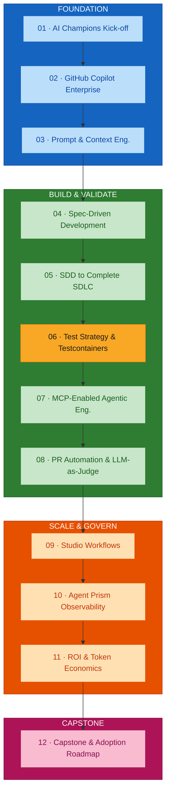
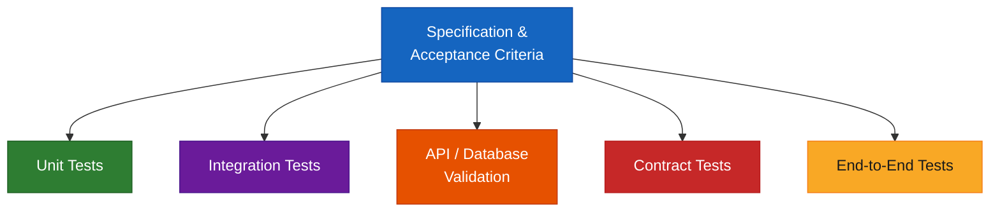
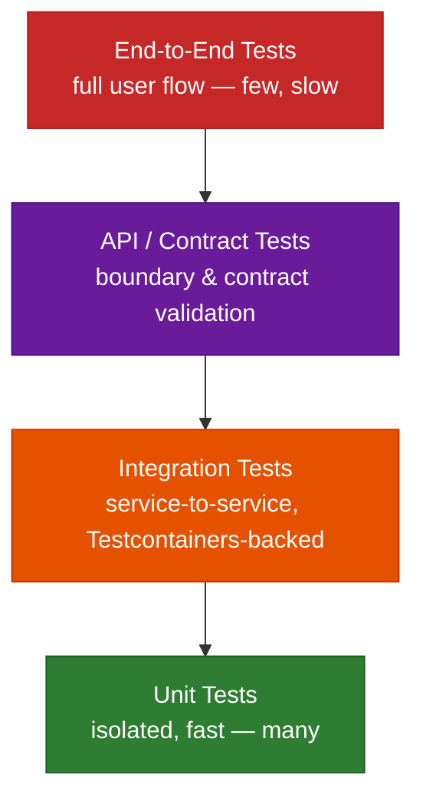
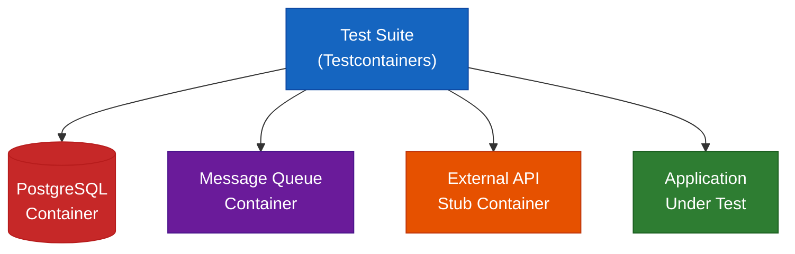
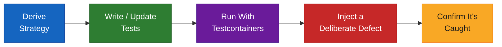

# Module 06 — Test Strategy, Testcontainers and End-to-End Validation

## Overview

Module 06 derives a test strategy **directly from the SDD feature's acceptance criteria**, validates it against real service and database dependencies using Testcontainers, and proves the strategy works by injecting a deliberate defect and confirming it is caught. A test strategy is only proven once it has caught something — this module is that proof, not a formality.

**Duration:** 2 hours (hands-on lab format)
**Delivered for:** Honeywell Engineering Teams

## Quick Start

Module 06 is six connected moves — from a spec-derived strategy to proof the strategy actually works:

| # | Topic | Time | What You'll Do |
|---|-------|------|----------------|
| 01 | Test Strategy, Derived From the Spec | 15 min | Turn Module 04/05's acceptance criteria into a concrete, traceable test strategy |
| 02 | The Test Pyramid for SDD Features | 20 min | Layer unit, integration, API/contract, and E2E tests so the right things run at the right cost |
| 03 | Testcontainers: Why Real Dependencies Matter | 25 min | Move from mocks and stubs to real, ephemeral service and database dependencies |
| 04 | Test Data &amp; Negative Scenarios | 15 min | Design test data covering the happy path, edge cases, and deliberate failures |
| 05 | Coverage &amp; Acceptance-Criteria Validation | 15 min | Confirm every acceptance criterion has a test, and every test maps back to a criterion |
| 06 | Hands-On Lab: Inject a Defect, Prove the Strategy Catches It | 30 min | Derive the strategy, build the tests, then deliberately break the feature |

## Visual Summary

Module 08's PR quality gates check for exactly this test evidence; Module 11's ROI model treats a defect caught here as *cost avoided*, not cost incurred later.

## Architecture

### Module 06 Agenda (120 minutes)

| # | Topic | Time |
|---|-------|------|
| 01 | Test Strategy, Derived From the Spec | 15 min |
| 02 | The Test Pyramid for SDD Features | 20 min |
| 03 | Testcontainers: Why Real Dependencies Matter | 25 min |
| 04 | Test Data &amp; Negative Scenarios | 15 min |
| 05 | Coverage &amp; Acceptance-Criteria Validation | 15 min |
| 06 | Hands-On Lab: Inject a Defect, Prove the Strategy Catches It | 30 min |

### From Acceptance Criteria to Test Strategy

The specification does not just describe the feature — it defines what "tested" means for it. A test strategy is not a checklist chosen independently; every layer exists because some part of the specification needs a specific kind of proof.

### The Test Pyramid for SDD Features

The right amount of each test type — not everything as an end-to-end test:

Higher layers are **fewer, slower, and more expensive**; lower layers are **more, faster, and cheaper**. Testcontainers is what makes the integration layer trustworthy — real dependencies, without paying full E2E cost for every scenario.

### Testcontainers vs Mocks &amp; Stubs

What changes when integration tests run against the real thing:

| Testcontainers | Mocks &amp; Stubs |
|----------------|-----------------|
| A real database / service, running in an ephemeral container | Database behaviour guessed at, not verified |
| The same behaviour in CI as in production | Passes in CI, fails against the real service |
| Versions pinned to match production dependencies | Config drift between mock and production accumulates silently |
| Integration coverage that is actually trustworthy | False confidence in integration coverage |

### Testcontainers Architecture, at a Glance

What the test suite actually talks to while it runs. Containers spin up fresh for each test run and tear down after — no shared state, no "works on my machine," no drift from production versions.

### Test Data &amp; Negative Scenarios

Four categories of input, because a feature is only as tested as its worst-case data:

| Category | What It Covers |
|----------|---------------|
| **Happy path** | Valid input, expected flow — confirms the feature does what the spec says it should |
| **Boundary &amp; edge cases** | Empty inputs, maximum sizes, off-by-one conditions — where bugs like to hide |
| **Negative &amp; invalid input** | Malformed, unauthorized, or out-of-contract input — confirms the feature fails *safely* |
| **Failure &amp; timeout scenarios** | A dependency unavailable, slow, or erroring — confirms graceful degradation, not a crash |

### Coverage &amp; Acceptance-Criteria Validation

The same traceability discipline from Module 04, now checked against running tests. The goal state: a specification with no unmapped acceptance criteria, and a test suite with no orphaned tests.

| Acceptance Criterion | Covered By | Status |
|----------------------|-----------|--------|
| AC-01: Valid order returns 201 | `test_create_order_valid` (unit) | ✓ Passing |
| AC-02: Duplicate order rejected | `test_duplicate_order` (integration) | ✓ Passing |
| AC-03: Payment service timeout handled | `test_payment_timeout` (Testcontainers) | ✓ Passing |
| AC-04: Full checkout flow completes | `test_checkout_e2e` (E2E) | ✓ Passing |

### Hands-On Lab: Inject a Defect, Prove the Strategy Catches It

The 30-minute activity that closes this module — a test suite tested against a real defect:

| Step | What Happens |
|------|-------------|
| Derive Strategy | Map the spec's acceptance criteria to test types across the pyramid |
| Write / Update Tests | Build or extend unit, integration, and E2E tests for the feature |
| Run With Testcontainers | Execute against real, ephemeral service and database dependencies |
| Inject a Deliberate Defect | Introduce a realistic bug into the implementation, on purpose |
| Confirm It's Caught | Re-run the suite and verify the defect is caught — not silently missed |

### Module 06 Outcomes

- A test strategy has been derived directly from the specification's acceptance criteria
- The test pyramid — unit, integration, API/contract, E2E — is understood
- Testcontainers is understood as real dependencies over mocks, and why that matters
- Test data covering happy path, edge cases, and negative scenarios has been designed
- Every acceptance criterion is traceable to a specific, passing test
- A deliberate defect has been injected and caught, proving the strategy works

### Key Terminology

| Term | Definition |
|------|------------|
| **Test strategy** | The set of test types and coverage rules derived from a specification's acceptance criteria |
| **Test pyramid** | Many fast unit tests, fewer integration tests, fewer API/contract tests, fewest E2E tests |
| **Testcontainers** | A library that runs real dependencies (databases, queues, services) in ephemeral Docker containers for integration tests |
| **Integration test** | A test exercising two or more components together, backed by real dependencies via Testcontainers |
| **Contract test** | A test that verifies a service honours the API contract its consumers depend on |
| **End-to-end (E2E) test** | A test exercising the full user flow through the running system |
| **Specification-to-test traceability** | Every acceptance criterion has a test; every test maps back to a criterion |
| **Negative scenario** | A test of malformed, unauthorized, or out-of-contract input, confirming the feature fails safely |
| **Defect injection** | Deliberately introducing a bug to verify the test strategy catches it |
| **Orphaned test** | A test not linked to any acceptance criterion — a signal the strategy or the spec is incomplete |

## References

### Programme Materials

- Module 06 Presentation: `presentations/Module06_Test_Strategy_Testcontainers.pdf`
- Course Outline: `courseOutline/NIIT_Honeywell_AI_Champions_GitHub_AgentPrism (Software_Engineering).pdf`
- Phase guide: [`build-validate-phase-modules-05-08.md`](./build-validate-phase-modules-05-08.md)

### Further Reading — External References

*Every link below was fetched and confirmed (HTTP 200) on 2026-09-02.*

**The test pyramid and test design**
- [Martin Fowler — The Practical Test Pyramid](https://martinfowler.com/articles/practical-test-pyramid.html) — the canonical explanation of unit / integration / E2E balance.
- [Martin Fowler — TestPyramid](https://martinfowler.com/bliki/TestPyramid.html) — the short reference version.
- [Martin Fowler — Testing Strategies in a Microservice Architecture](https://martinfowler.com/articles/microservice-testing/) — where contract, integration, and component tests fit for service-oriented systems.
- [Martin Fowler — TestDouble](https://martinfowler.com/bliki/TestDouble.html) — precise definitions of mocks, stubs, fakes, and spies, and where each is appropriate.

**Testcontainers**
- [Testcontainers — official site](https://testcontainers.com/) — real, ephemeral service and database dependencies for integration tests.
- [Testcontainers for Java](https://java.testcontainers.org/) — getting started, container lifecycle, and module list for the JVM stack.
- [Testcontainers for Node.js](https://node.testcontainers.org/) — the Node.js equivalent, used for the programme's JavaScript/TypeScript work.

**Contract testing and CI**
- [Martin Fowler — ContractTest](https://martinfowler.com/bliki/ContractTest.html) — what a contract test is and why it protects consumers.
- [Pact documentation](https://docs.pact.io/) — consumer-driven contract testing, the most widely used implementation.
- [GitHub Actions documentation](https://docs.github.com/en/actions) — running the test suite, including Testcontainers, in CI.

### Previous Module

Module 05 — Software Development: SDD to Complete Software SDLC (4 hours). Taking a specification through a full greenfield SDLC, then safely evolving an existing brownfield application with change-impact analysis.

### Next Module

Module 07 — MCP-Enabled Agentic Engineering Workflows and Reusable Engineering Skills (2 hours). Connecting agents to approved repositories, APIs, databases, and test infrastructure — including the Testcontainers-based tests just built — under clear governance.
