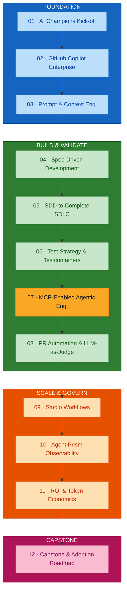
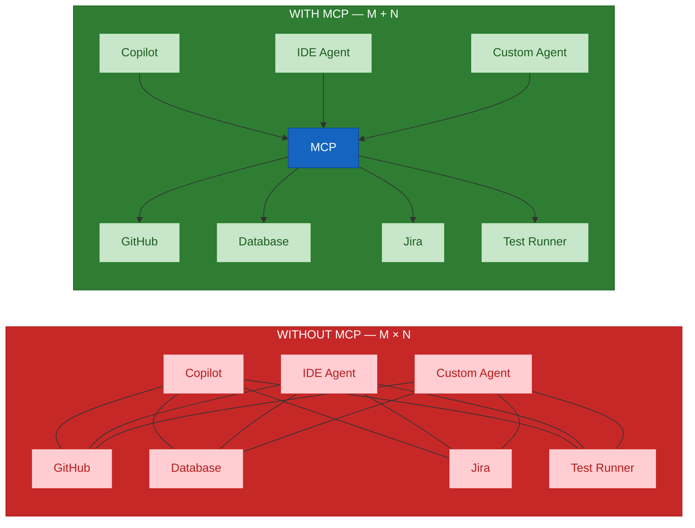
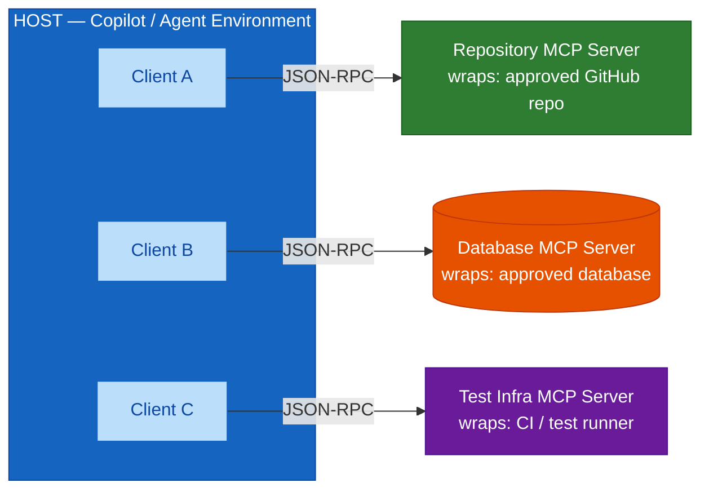
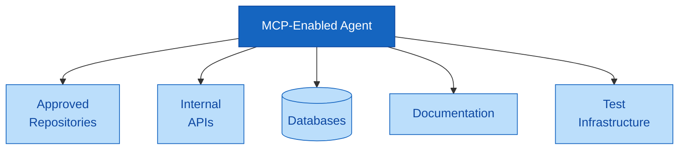
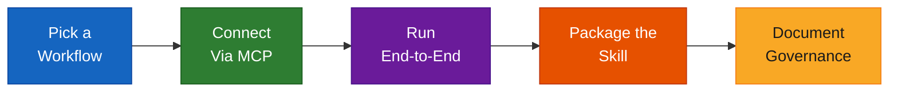

# Module 07 — MCP-Enabled Agentic Engineering Workflows and Reusable Engineering Skills

## Overview

Module 07 covers the **Model Context Protocol (MCP)** — its host/client/server architecture, transports, and JSON-RPC foundations — then uses it to connect agents to approved enterprise systems under clear governance, and packages what works into **reusable, versioned engineering skills**. MCP is treated as a key engineering capability, not a novelty: the standard way an agent reaches a repository, database, or test runner without bespoke integration code. RAG is intentionally excluded from the core programme.

**Duration:** 2 hours (hands-on lab format)
**Delivered for:** Honeywell Engineering Teams

## Quick Start

Module 07 is six connected moves — from MCP's core architecture to a governed, reusable workflow:

| # | Topic | Time | What You'll Do |
|---|-------|------|----------------|
| 01 | MCP Architecture: Host, Client, Server | 15 min | The foundational topology every MCP-enabled workflow is built on |
| 02 | Transports &amp; JSON-RPC: How Messages Actually Move | 15 min | Stdio and Streamable HTTP transports, and the JSON-RPC 2.0 messages underneath both |
| 03 | Key Concepts: Tools, Resources, Prompts &amp; Sampling | 15 min | The primitives a server exposes, and the one capability a server can ask of the client |
| 04 | Connecting Agents to Enterprise Systems | 15 min | Repositories, APIs, databases, documentation, and test infrastructure — through approved servers |
| 05 | Governance: Permissions, Approvals &amp; Failure Handling | 15 min | What separates a governed MCP workflow from an ungoverned one |
| 06 | Packaging Reusable Skills &amp; Hands-On Lab | 45 min | Build an MCP-enabled workflow end to end, then package it as a versioned, owned skill |

## Visual Summary



Module 08's PR automation and Module 09's studio workflows both assume agents already reach approved tools through governed MCP servers — this module is where that connection is built.

## Architecture

### Module 07 Agenda (120 minutes)

| # | Topic | Time |
|---|-------|------|
| 01 | MCP Architecture: Host, Client, Server | 15 min |
| 02 | Transports &amp; JSON-RPC: How Messages Actually Move | 15 min |
| 03 | Key Concepts: Tools, Resources, Prompts &amp; Sampling | 15 min |
| 04 | Connecting Agents to Enterprise Systems | 15 min |
| 05 | Governance: Permissions, Approvals &amp; Failure Handling | 15 min |
| 06 | Packaging Reusable Skills &amp; Hands-On Lab | 45 min |

### Why MCP Exists: From M × N to M + N

Without a shared protocol, every AI application needs custom integration code for every tool — 3 apps × 4 tools is 12 custom integrations. MCP standardizes the connection: build the server once, and every MCP-compatible host can use it (3 + 4 = 7 connections).



### MCP Architecture: Host, Client, Server

One host, one or more clients, each holding a dedicated 1:1 connection to a server. Every server the agent uses — repository, database, test infrastructure — is reached through this same pattern: a dedicated client, a stable protocol, a clear boundary.



### Transports &amp; JSON-RPC

Two ways a client reaches a server — one message format underneath both:

| Stdio Transport | Streamable HTTP Transport |
|-----------------|--------------------------|
| Server runs as a local subprocess | Server runs remotely, reached over HTTP |
| Communicates over standard input/output | Supports streaming responses back to the client |
| No network exposure — process-to-process only | Requires authentication and network governance |
| Ideal for: local repo access, file system, CLI tools | Ideal for: shared databases, internal APIs, services |

Every message, on either transport, is **JSON-RPC 2.0**:

```json
{
  "jsonrpc": "2.0",
  "id": 7,
  "method": "tools/call",
  "params": { "name": "run_tests", "arguments": { "suite": "checkout" } }
}
```

### Key Concepts: Tools, Resources, Prompts &amp; Sampling

Three things a server exposes, and one thing a server can ask of the client:

| Concept | Control | What It Is |
|---------|---------|-----------|
| **Tools** | Model-controlled | Functions the agent can invoke — run a test, query a database, open a PR. The AI decides when to call them. |
| **Resources** | Application-controlled | Data the host can read and attach as context — a file, a spec document, a log stream. |
| **Prompts** | User-controlled | Reusable templated interactions a person selects, not the model. |
| **Sampling** | Server → client | A server can ask the client's LLM to complete a step on its behalf — inverting the usual direction of control. |

### Connecting Agents to Enterprise Systems

Five categories of approved system an MCP-enabled agent can be connected to. Each connection is a separate, scoped MCP server — the agent's reach is exactly the union of the servers it has been given, nothing more.



### Governance: Permissions, Approvals &amp; Failure Handling

What separates a governed MCP workflow from an ungoverned one:

| Governed | Ungoverned |
|----------|-----------|
| Tools scoped to approved servers, with explicit permissions | Any tool available to any agent, no permission model |
| Sensitive actions require human approval before executing | No approval step before a tool call executes |
| Failures are caught, logged, and surfaced clearly | Failures fail silently or crash the whole workflow |
| Every tool call is auditable — what ran, with what result | No record of what a tool touched or changed |

### Packaging Reusable Engineering Skills

What worked once, turned into a versioned, owned, cross-project asset:

| Skill Component | What It Packages |
|-----------------|-----------------|
| **Specifications &amp; instructions** | The spec templates and reusable instructions behind a workflow, so the next project starts from them |
| **Prompt packs** | Proven prompt structures for a recurring task, bundled and versioned rather than reinvented each time |
| **Test / review heuristics** | The checks a spec validator or PR reviewer applies, documented as a reusable, improvable heuristic set |
| **Agent behaviors** | The tool sequence and decision logic an agent follows, packaged with clear ownership and a reuse model |

### Hands-On Lab: Build a Workflow, Package a Skill

The 45-minute activity that closes this module. A workflow that only works once isn't a skill — packaging and governance are what make it reusable across projects.



| Step | What Happens |
|------|-------------|
| Pick a Workflow | Repository analysis, spec validation, test execution, or PR evidence collection |
| Connect Via MCP | Wire the agent to the approved server(s) the workflow needs |
| Run End-to-End | Execute the workflow against real repository, test, or API data |
| Package the Skill | Turn what worked into a reusable, versioned skill asset |
| Document Governance | Record ownership, permissions, and the reuse model for the team |

A representative workflow: `repository analysis → specification validation → test execution → result analysis / PR evidence collection`.

### Module 07 Outcomes

- The M × N integration problem MCP solves, and its host/client/server architecture, are both understood
- Stdio and Streamable HTTP transports, and JSON-RPC 2.0 underneath both, are clear
- Tools, Resources, Prompts, and Sampling are identified as the core MCP concepts
- Agents have been connected to approved repositories, APIs, databases, and test infrastructure
- Governance practices — permissions, approvals, failure handling — are understood
- An MCP-enabled workflow has been built and packaged as a reusable, governed skill

### Key Terminology

| Term | Definition |
|------|------------|
| **MCP (Model Context Protocol)** | An open standard for connecting AI applications to external tools, data, and services |
| **Host** | The AI application (e.g. a Copilot / agent environment) that coordinates one or more clients |
| **Client** | A component inside the host holding a dedicated 1:1 connection to one MCP server |
| **Server** | A program that exposes tools, resources, and prompts, wrapping an approved system |
| **Transport** | How client and server exchange messages — stdio (local subprocess) or Streamable HTTP (remote) |
| **JSON-RPC 2.0** | The message format every MCP request and response uses, on either transport |
| **Tool** | A model-controlled function the agent can invoke through a server |
| **Resource** | Application-controlled data the host can read and attach as context |
| **Prompt** | A user-controlled, reusable templated interaction a server exposes |
| **Sampling** | A server request for the client's LLM to complete a step on the server's behalf |
| **Reusable engineering skill** | A versioned, owned, cross-project asset packaging specs, prompt packs, heuristics, or agent behaviours |
| **Governed workflow** | An MCP workflow with scoped permissions, human approval for sensitive actions, failure handling, and an audit trail |

## References

### Programme Materials

- Module 07 Presentation: `presentations/Module07_MCP_Agentic_Workflows.pdf`
- Course Outline: `courseOutline/NIIT_Honeywell_AI_Champions_GitHub_AgentPrism (Software_Engineering).pdf`
- Phase guide: [`build-validate-phase-modules-05-08.md`](./build-validate-phase-modules-05-08.md)

### Further Reading — External References

*Every link below was fetched and confirmed (HTTP 200) on 2026-09-02.*

**Model Context Protocol — the standard**
- [Model Context Protocol — official site](https://modelcontextprotocol.io/) — introduction, quickstarts, and the ecosystem.
- [MCP specification](https://modelcontextprotocol.io/specification) — the normative protocol definition, versioned by date.
- [MCP — Architecture overview](https://modelcontextprotocol.io/docs/learn/architecture) — host, client, and server roles, and the data and transport layers.
- [Anthropic — Introducing the Model Context Protocol](https://www.anthropic.com/news/model-context-protocol) — the original announcement and rationale.
- [JSON-RPC 2.0 specification](https://www.jsonrpc.org/specification) — the message format underneath every MCP transport.

**Building and connecting MCP servers**
- [modelcontextprotocol/servers](https://github.com/modelcontextprotocol/servers) — reference server implementations (filesystem, Git, Postgres, and more).
- [VS Code — MCP servers](https://code.visualstudio.com/docs/copilot/customization/mcp-servers) — adding MCP servers to Copilot, with the trust and approval prompts.
- [Extend Copilot Chat with the Model Context Protocol](https://docs.github.com/en/copilot/how-tos/provide-context/use-mcp/extend-copilot-chat-with-mcp) — configuring MCP servers for GitHub Copilot across IDEs and GitHub.com.

**Agentic workflow patterns and reusable skills**
- [Anthropic — Building Effective Agents](https://www.anthropic.com/engineering/building-effective-agents) — the workflow patterns (chaining, routing, orchestration, evaluator-optimizer) this module composes.
- [Configure custom instructions for GitHub Copilot](https://docs.github.com/en/copilot/how-tos/custom-instructions) — repository instructions and reusable prompt files, the packaging surface for reusable skills.

### Previous Module

Module 06 — Test Strategy, Testcontainers and End-to-End Validation (2 hours). Deriving a test strategy from the SDD feature's acceptance criteria and proving it catches a deliberately injected defect.

### Next Module

Module 08 — PR Process Automation, Quality Gates and LLM-as-Judge (1.5 hours). Configuring AI-assisted PR review against specification compliance, coding standards, and the test evidence built in Modules 06–07.
