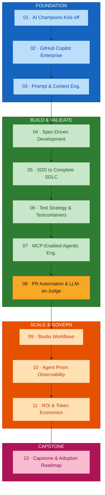
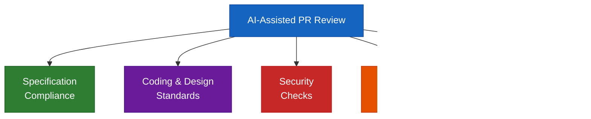
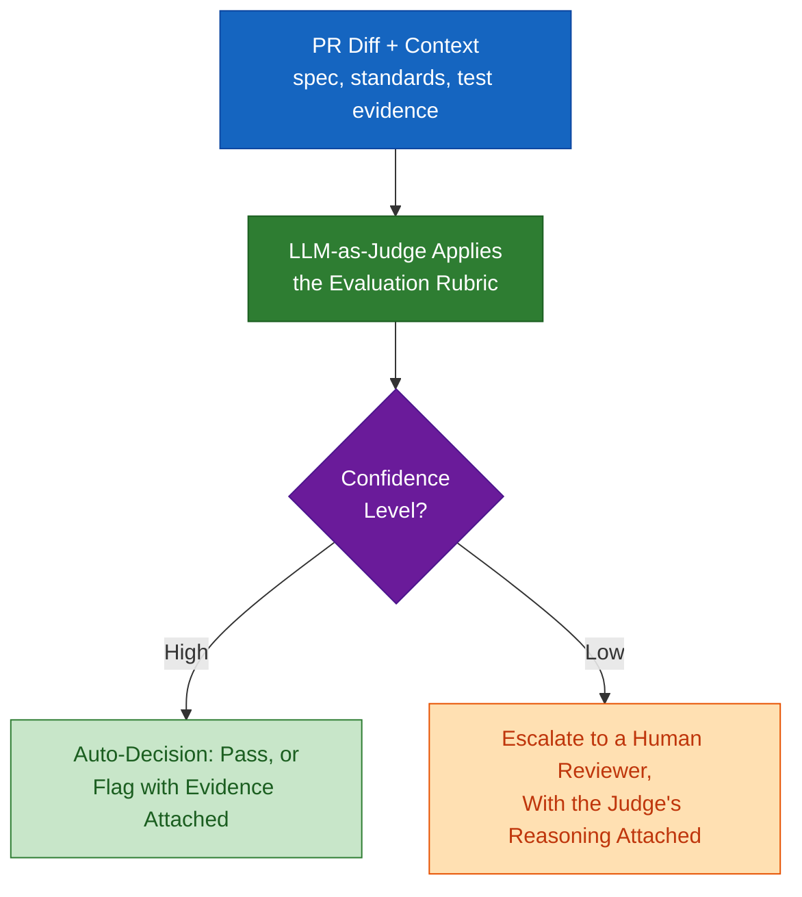
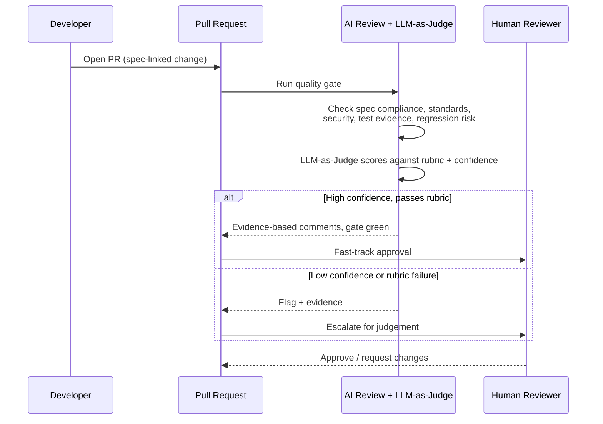
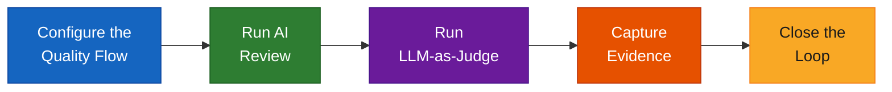

# Module 08 — PR Process Automation, Quality Gates and LLM-as-Judge

## Overview

Module 08 configures **AI-assisted pull-request review** against specification compliance, coding and design standards, security, test evidence, and regression risk — then adds an **LLM-as-Judge** layer that scores each change against an evaluation rubric, reports a confidence level, and escalates to a human when confidence is low. The measured outcome is *review-cycle reduction*: the savings come from narrowing full human review to the PRs that actually need it, not from skipping review.

**Duration:** 1.5 hours (hands-on lab format)
**Delivered for:** Honeywell Engineering Teams

## Quick Start

Module 08 is six connected moves — from what a PR review checks to a quality gate that has actually been tested:

| # | Topic | Time | What You'll Do |
|---|-------|------|----------------|
| 01 | From Test Evidence to PR Quality Gates | 10 min | See where Module 06 and 07's test evidence and governed tools actually get used |
| 02 | What AI-Assisted PR Review Checks | 20 min | Specification compliance, coding/design standards, security, test evidence, regression risk |
| 03 | LLM-as-Judge: Evaluation Rubrics &amp; Confidence | 20 min | How a PR diff becomes a scored verdict, and what happens when confidence is low |
| 04 | Evidence-Based Comments &amp; Human Escalation | 15 min | What separates a useful review comment from a vague one, and when a human steps in |
| 05 | Review-Cycle Reduction: Where Time Actually Goes | 10 min | Compare a manual review pass to an AI-assisted one, stage by stage |
| 06 | Hands-On Lab: Configure &amp; Run a PR Quality Flow | 15 min | Run the flow against a deliberately flawed change and close the loop with human approval |

## Visual Summary

Module 09's studio workflows and Module 10's Agent Prism both assume PRs already carry this kind of evidence trail — this module is where that trail starts.

## Architecture

### Module 08 Agenda (90 minutes)

| # | Topic | Time |
|---|-------|------|
| 01 | From Test Evidence to PR Quality Gates | 10 min |
| 02 | What AI-Assisted PR Review Checks | 20 min |
| 03 | LLM-as-Judge: Evaluation Rubrics &amp; Confidence | 20 min |
| 04 | Evidence-Based Comments &amp; Human Escalation | 15 min |
| 05 | Review-Cycle Reduction: Where Time Actually Goes | 10 min |
| 06 | Hands-On Lab: Configure &amp; Run a PR Quality Flow | 15 min |

### AI-Assisted PR Review: What Gets Checked

Five categories, checked consistently on every PR — not whichever the reviewer remembers this time. Every one of these traces back to earlier modules: the spec from Module 04, the standards from Module 05, the tests from Module 06.

### LLM-as-Judge: From PR Diff to Verdict

A scored evaluation against a rubric, branching on how confident the judge actually is:

### Evidence-Based Comments, Not Vague Ones

The difference isn't tone — it's whether the comment points to something specific and checkable:

| Evidence-Based | Vague |
|----------------|-------|
| "Line 42 violates AC-03 (timeout must return 503) — spec §4.2" | "This looks wrong." |
| "`test_duplicate_order` fails against Testcontainers Postgres — CI run #128" | "Please fix the tests." |
| "Duplicates retry logic in `PaymentClient.java:88` — consider extracting a helper" | "Consider refactoring this." |
| "No test covers the negative case in AC-05 — coverage gap" | "Not sure this is safe." |

### Review-Cycle Reduction: Where Time Actually Goes

Not "AI reviews faster" in the abstract — specific stages, specifically changed. The savings come from narrowing full human review to the PRs that actually need it, not from skipping review.

| Stage | Manual Review | AI-Assisted Review |
|-------|---------------|--------------------|
| Initial read-through | Human reads the full diff | AI summarizes the diff and flags key changes |
| Standards check | Manual checklist walk-through | Automated rubric check against coding/design standards |
| Test evidence check | Human verifies tests ran | Evidence auto-attached from CI and Testcontainers runs |
| Escalation | Every PR needs full human review | Only low-confidence or flagged PRs need full human review |

### The PR Quality Gate, as a Flow

### Hands-On Lab: Configure &amp; Run a PR Quality Flow

The 15-minute activity that closes this module. A quality gate that never flags anything hasn't been tested — this lab makes sure yours actually catches the flaw.

| Step | What Happens |
|------|-------------|
| Configure the Quality Flow | Wire up the PR template, quality checklist, and LLM-as-Judge rubric |
| Run AI Review | Against a deliberately flawed change, to see what it actually catches |
| Run LLM-as-Judge | Score the change against the rubric and assign a confidence level |
| Capture Evidence | Record what was checked, what passed, and what didn't |
| Close the Loop | Human approval on flagged items, comparing time and quality to a manual pass |

### Module 08 Outcomes

- What AI-assisted PR review checks — spec, standards, security, tests, regression risk — is understood
- LLM-as-Judge's evaluation flow, from PR diff to verdict, is clear, confidence branching included
- Evidence-based review comments, and what separates them from vague ones, are understood
- Where review-cycle time is actually saved, stage by stage, is clear
- A PR quality flow has been configured and run against a deliberately flawed change
- The loop has been closed with human approval on flagged items

### Key Terminology

| Term | Definition |
|------|------------|
| **AI-assisted PR review** | Automated review of a pull request against spec compliance, standards, security, test evidence, and regression risk |
| **Quality gate** | An automated PR check that must pass (or be human-approved) before merge |
| **LLM-as-Judge** | Using a model to score a change or a review against an explicit evaluation rubric |
| **Evaluation rubric** | The explicit criteria the judge scores against, derived from the spec and team standards |
| **Confidence level** | The judge's own estimate of how reliable its verdict is — the branch point for human escalation |
| **Human escalation** | Routing a low-confidence or rubric-failing PR to a human, with the judge's reasoning attached |
| **Evidence-based comment** | A review comment that points to a specific line, criterion, test, or CI run — not a vague impression |
| **Review-cycle reduction** | Faster reviews achieved by narrowing full human review to the PRs that need it |
| **Specification compliance** | Whether the change actually satisfies the acceptance criteria it claims to |
| **Regression risk** | The likelihood a change breaks existing behaviour, assessed against the blast radius and test suite |

## References

### Programme Materials

- Module 08 Presentation: `presentations/Module08_PR_Automation_LLM_Judge.pdf`
- Course Outline: `courseOutline/NIIT_Honeywell_AI_Champions_GitHub_AgentPrism (Software_Engineering).pdf`
- Phase guide: [`build-validate-phase-modules-05-08.md`](./build-validate-phase-modules-05-08.md)

### Further Reading — External References

*Every link below was fetched and confirmed (HTTP 200) on 2026-09-02.*

**AI-assisted PR review**
- [About Copilot code review](https://docs.github.com/en/copilot/concepts/code-review) — what automated PR review checks, effort levels, and how it fits team workflows.
- [Use Copilot code review](https://docs.github.com/en/copilot/how-tos/use-copilot-agents/request-a-code-review/use-code-review) — requesting a review, configuring automatic reviews, and interpreting the results.
- [About rulesets](https://docs.github.com/en/repositories/configuring-branches-and-merges-in-your-repository/managing-rulesets/about-rulesets) — branch protection and required status checks that make a quality gate blocking.
- [GitHub Actions documentation](https://docs.github.com/en/actions) — where the automated checks, test evidence, and quality gate run.

**LLM-as-Judge**
- [Evidently AI — LLM-as-a-judge: a complete guide](https://www.evidentlyai.com/llm-guide/llm-as-a-judge) — building evaluation rubrics, scoring, calibration, and pairwise vs pointwise judging.
- [Hamel Husain — Creating a LLM-as-a-Judge that drives business results](https://hamel.dev/blog/posts/llm-judge/) — a practitioner walkthrough of building a judge that correlates with human review.

**Evidence, standards, and context for review**
- [Configure custom instructions for GitHub Copilot](https://docs.github.com/en/copilot/how-tos/custom-instructions) — encoding coding and design standards so the review checks against them consistently.
- [Anthropic — Effective context engineering for AI agents](https://www.anthropic.com/engineering/effective-context-engineering-for-ai-agents) — assembling the spec, standards, and test-evidence context the judge needs to score a diff well.

### Previous Module

Module 07 — MCP-Enabled Agentic Engineering Workflows and Reusable Engineering Skills (2 hours). Connecting agents to approved repositories, APIs, databases, and test infrastructure under governance, and packaging reusable skills.

### Next Module

Module 09 — Studio-Style Workflows for Business and Engineering Collaboration (2 hours). How non-technical program and product roles author agent-assisted workflows in Atlassian Rovo Studio, grounded on the same governed MCP connections built in Module 07.
