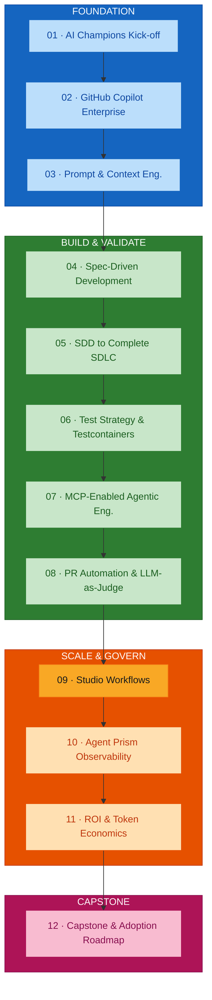
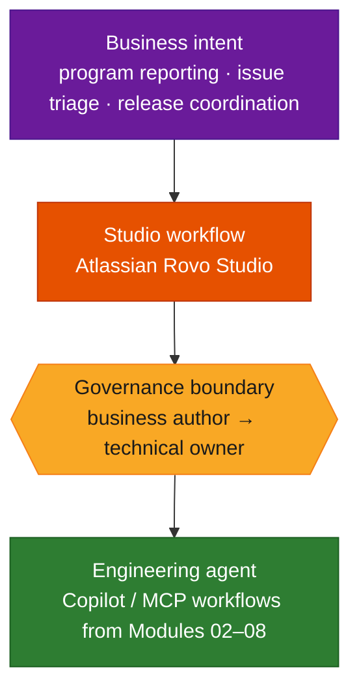
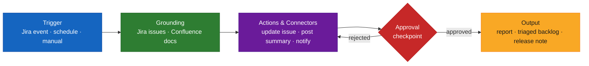
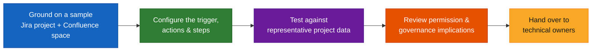

# Module 09 — Studio-Style Workflows for Business and Engineering Collaboration

## Overview

Module 09 is the **enterprise workflow-design layer** that sits alongside the Copilot and MCP engineering workflows built earlier. It covers how non-code and semi-technical users — program managers, product owners, TPOs, RTEs, Scrum roles — shape agent behaviour through **studio-style workflows in Atlassian Rovo Studio**: authoring agents, grounding them on Jira and Confluence, wiring triggers and actions, adding approval checkpoints, and handing finished workflows to technical owners without bypassing governance.

**Duration:** 2 hours (hands-on lab format)
**Delivered for:** Honeywell Engineering Teams — design/collaboration emphasis for Product Owners, Designers, TPOs, RTEs, and Scrum roles

> **Source note.** This guide is grounded in the **course outline** (`courseOutline/NIIT_Honeywell_AI_Champions_GitHub_AgentPrism (Software_Engineering).pdf`), section "9. Studio-Style Workflows for Business and Engineering Collaboration". A dedicated presentation deck was not available when this guide was written; the agenda and timings below are derived from the outline's sub-topic list and total duration.

## Quick Start

Module 09 moves from "what a studio workflow is" to a governed, handed-off workflow:

| # | Topic | Time | What You'll Do |
|---|-------|------|----------------|
| 01 | Studio Workflows vs Engineering Agents | 15 min | Where the boundary sits, and why business roles author here rather than in Copilot |
| 02 | Grounding Agents on Jira, Confluence &amp; Connected Sources | 20 min | Give an agent a permission-aware view of real project data |
| 03 | Triggers, Actions &amp; Connectors | 20 min | The trigger that starts a workflow and the steps it runs |
| 04 | Approval Flows &amp; Human-in-the-Loop Checkpoints | 20 min | Where a person confirms before the workflow proceeds |
| 05 | Permissions, Versioning &amp; Ownership | 20 min | Publishing a workflow the team can trust, and who owns it |
| 06 | Hands-On Lab: Author a Workflow, Hand It Over | 25 min | Build a program-reporting / triage / release workflow and hand it to a technical owner |

## Visual Summary

Module 09 is grounded on the same governed MCP connections built in Module 07. Module 10's Agent Prism monitors the workflows authored here the same way it monitors engineering agents.

## Architecture

### Module 09 Agenda (120 minutes, derived from the course outline)

| # | Topic | Time |
|---|-------|------|
| 01 | Studio Workflows vs Engineering Agents | 15 min |
| 02 | Grounding Agents on Jira, Confluence &amp; Connected Sources | 20 min |
| 03 | Triggers, Actions &amp; Connectors | 20 min |
| 04 | Approval Flows &amp; Human-in-the-Loop Checkpoints | 20 min |
| 05 | Permissions, Versioning &amp; Ownership | 20 min |
| 06 | Hands-On Lab: Author a Workflow, Hand It Over | 25 min |

### Where a Studio Workflow Sits

Business intent enters at the top; an engineering agent executes at the bottom. The studio workflow is the governed translation layer in between — and there is a deliberate boundary where a business-authored workflow hands off to a technical owner.

**Why business roles author here, not in Copilot:** a studio workflow is about *coordinating* engineering work — triage, reporting, release steps — not writing code. It reads project data, applies rules, and routes tasks; it does not open a PR itself.

### Anatomy of a Studio Workflow

| Element | What It Is |
|---------|-----------|
| **Trigger** | The event that starts the workflow — a Jira transition, a schedule, or a manual run |
| **Grounding** | The permission-aware view of project data the agent reasons over — Jira issues, Confluence design and release docs, other connected engineering sources |
| **Actions &amp; connectors** | The steps the workflow performs — updating an issue, posting a summary, calling a connected system |
| **Approval flow / human-in-the-loop checkpoint** | A point where a person must confirm before the workflow proceeds |
| **Output** | The deliverable — a program report, a triaged backlog, a release coordination summary |

### Permissions, Versioning &amp; Ownership

A published workflow is a shared asset, and it carries governance with it:

| Concern | How Module 09 handles it |
|---------|--------------------------|
| **Permission-aware access** | The workflow can only see and act on project data the running user (or service identity) is entitled to |
| **Business/technical collaboration** | Business users author and test; technical owners review and take implementation ownership — without the business user bypassing governance |
| **Versioning** | Published workflows are versioned, so a change is reviewable and reversible |
| **Ownership** | Every published workflow has a named owner accountable for it |

### Hands-On Lab: Author a Workflow, Hand It Over

Program and product users define an agent-assisted workflow in Atlassian Rovo Studio for **program reporting, issue triage, or release coordination**:

### Module 09 Outcomes

- The boundary between a studio workflow and an engineering agent is understood
- An agent has been grounded on a permission-aware view of Jira and Confluence data
- A trigger, actions, and steps have been configured in Atlassian Rovo Studio
- Approval flows and human-in-the-loop checkpoints have been placed appropriately
- Permission, versioning, and ownership implications of a published workflow are understood
- A workflow has been tested against representative data and handed to a technical owner

### Key Terminology

| Term | Definition |
|------|------------|
| **Studio-style workflow** | An agent-assisted workflow authored by a non-technical user in a visual studio, coordinating engineering or program work |
| **Atlassian Rovo Studio** | Atlassian's environment for authoring, testing, and publishing Rovo agents and workflows |
| **Grounding** | Giving an agent a permission-aware view of specific project data (Jira issues, Confluence pages) to reason over |
| **Trigger** | The event that starts a workflow — a Jira event, a schedule, or a manual invocation |
| **Connector** | An integration that lets a workflow read from or act on a connected system |
| **Human-in-the-loop checkpoint** | A required human confirmation before a workflow step proceeds |
| **Approval flow** | The routing and sign-off logic around sensitive workflow actions |
| **Permission-aware access** | The workflow's data visibility is bounded by the running identity's entitlements |
| **Workflow ownership** | The named person accountable for a published workflow's behaviour and maintenance |
| **Governance boundary** | The handoff point where a business-authored workflow is taken over by a technical owner for implementation |

## References

### Programme Materials

- Course Outline (primary source): `courseOutline/NIIT_Honeywell_AI_Champions_GitHub_AgentPrism (Software_Engineering).pdf`, section 9
- Phase context: [`build-validate-phase-modules-05-08.md`](./build-validate-phase-modules-05-08.md) — the engineering workflows this layer sits alongside
- Module 07 guide: [`module-07-mcp-agentic-workflows.md`](./module-07-mcp-agentic-workflows.md) — the governed connections Module 09 is grounded on

### Further Reading — External References

*Every link below was fetched and confirmed (HTTP 200) on 2026-09-02.*

**Atlassian Rovo and Rovo Studio**
- [Atlassian Rovo](https://www.atlassian.com/software/rovo) — the product overview: agents, search, and chat grounded on connected work data.
- [Rovo support documentation](https://support.atlassian.com/rovo/) — the canonical docs root for setting up and using Rovo.
- [What is Rovo Studio](https://support.atlassian.com/rovo/docs/what-is-rovo-studio/) — the environment for building and managing agents and workflows.
- [Rovo resources](https://support.atlassian.com/rovo/resources/) — templates, patterns, and getting-started material.

**Grounding data and automation**
- [Atlassian Confluence](https://www.atlassian.com/software/confluence) — the design and release documentation a workflow is grounded on.
- [Jira automation](https://www.atlassian.com/software/jira/features/automation) — triggers, conditions, and actions — the no-code automation model studio workflows extend.

**Agentic workflow patterns and governance**
- [Anthropic — Building Effective Agents](https://www.anthropic.com/engineering/building-effective-agents) — human-in-the-loop checkpoints, routing, and orchestration patterns.
- [Model Context Protocol](https://modelcontextprotocol.io/) — the governed connection layer (Module 07) that studio workflows are grounded on.

### Previous Module

Module 08 — PR Process Automation, Quality Gates and LLM-as-Judge (1.5 hours). AI-assisted PR review against spec compliance, standards, security, and test evidence, plus LLM-as-Judge scoring and human escalation.

### Next Module

Module 10 — Agent Prism for Monitoring, Observability and Enterprise Control (1.5 hours). Monitoring agent behaviour, traces, failures, drift, token usage, and cost — and connecting that telemetry to engineering outcomes.
