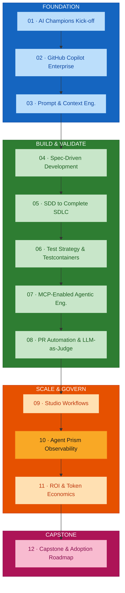
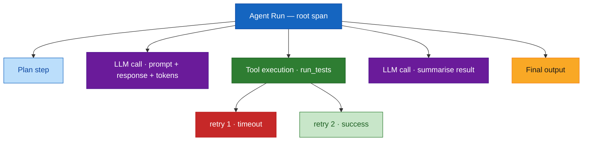
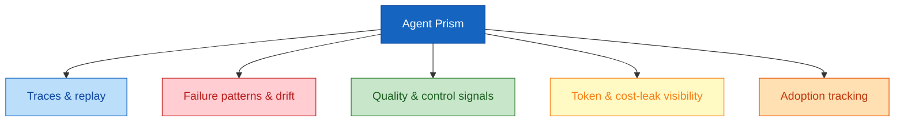
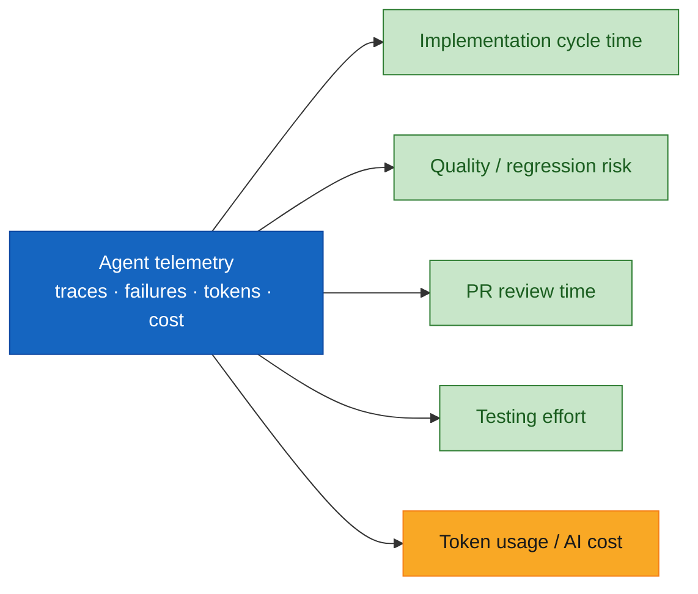
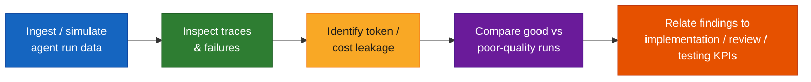

# Module 10 — Agent Prism for Monitoring, Observability and Enterprise Control

## Overview

Module 10 makes **observability of agentic engineering** concrete. Agent Prism is positioned as the live practice platform for monitoring agent behaviour: traces and replay, failure patterns, prompt/output drift, quality and control signals, token usage, cost-leak visibility, thresholds and alerts, and adoption tracking. The point the programme has made since Module 01 lands here — **AI telemetry is connected to engineering outcomes**, not treated as a separate tooling topic.

**Duration:** 1.5 hours (hands-on lab format)
**Delivered for:** Honeywell Engineering Teams

> **Source note.** This guide is grounded in the **course outline** (`courseOutline/NIIT_Honeywell_AI_Champions_GitHub_AgentPrism (Software_Engineering).pdf`), section "10. Agent Prism for Monitoring, Observability and Enterprise Control", plus Agent Prism's public documentation (see References). A dedicated presentation deck was not available when this guide was written; the agenda and timings below are derived from the outline's sub-topic list and total duration.

## Quick Start

Module 10 moves from "why monitor agents" to a scorecard connected to engineering KPIs:

| # | Topic | Time | What You'll Do |
|---|-------|------|----------------|
| 01 | Why Monitoring Agentic Engineering Matters | 10 min | The gap between "the agent ran" and "the agent did good work" |
| 02 | Traces &amp; Replay | 15 min | Read an agent run as a hierarchical timeline of LLM calls, tool executions, and retries |
| 03 | Failure Patterns &amp; Prompt/Output Drift | 15 min | Recognise recurring failure shapes and quality regression over time |
| 04 | Token Usage &amp; Cost-Leak Visibility | 15 min | Find where tokens and money are being spent without value |
| 05 | Thresholds, Alerts &amp; Adoption Tracking | 15 min | Set control signals and measure whether the workflow is actually being used |
| 06 | Hands-On Lab: Inspect Runs, Relate to KPIs | 20 min | Compare good and poor runs; connect findings to implementation, review, and testing KPIs |

## Visual Summary

Agent Prism has been referenced since Module 01 as the monitoring lens; this module operates it in depth. Module 11 converts these observations into an ROI and token-economics model.

## Architecture

### Module 10 Agenda (90 minutes, derived from the course outline)

| # | Topic | Time |
|---|-------|------|
| 01 | Why Monitoring Agentic Engineering Matters | 10 min |
| 02 | Traces &amp; Replay | 15 min |
| 03 | Failure Patterns &amp; Prompt/Output Drift | 15 min |
| 04 | Token Usage &amp; Cost-Leak Visibility | 15 min |
| 05 | Thresholds, Alerts &amp; Adoption Tracking | 15 min |
| 06 | Hands-On Lab: Inspect Runs, Relate to KPIs | 20 min |

### An Agent Run as a Trace

Agentic traces contain complete information about an agent's behaviour — every plan, action, and retry — but that information gets lost in a sea of JSON. A trace viewer turns it into a hierarchical timeline.

**Replay** re-runs a captured trace so a failure can be reproduced and inspected step by step, rather than guessed at from a log.

### The Monitoring Signals

Agent Prism watches one agent workflow across five signal categories, each mapping onto a programme success metric:

| Signal | What It Reveals |
|--------|----------------|
| **Traces &amp; replay** | Exactly what the agent did, step by step, and the ability to re-run a failure |
| **Failure patterns &amp; drift** | Recurring failure shapes, and prompt/output quality regressing over time |
| **Quality &amp; control signals** | Whether output meets the bar, and whether control conditions (approvals, boundaries) held |
| **Token &amp; cost-leak visibility** | Where tokens and spend go without producing value |
| **Adoption tracking** | Whether the workflow is actually being used, and by whom |

### From Telemetry to Engineering Outcomes

The reason this module is not a separate tooling topic: every signal above connects to an engineering KPI the programme has been measuring since Module 01.

### Thresholds, Alerts &amp; Operational Review

- **Thresholds** — a token budget, a failure-rate ceiling, a latency limit
- **Alerts** — fired when a threshold is crossed, so a drift or cost leak is caught early, not at month end
- **Operational review** — a recurring look at the scorecard, the same way a team reviews incident metrics

### Hands-On Lab: Inspect Runs, Relate to KPIs

### Module 10 Outcomes

- Why monitoring agentic engineering matters is understood
- An agent run can be read as a trace, and a failure reproduced by replay
- Failure patterns and prompt/output drift can be recognised
- Token and cost leakage can be located in a run
- Thresholds, alerts, and adoption tracking are set as control signals
- Findings have been connected to implementation, review, and testing KPIs

### Key Terminology

| Term | Definition |
|------|------------|
| **Agent Prism** | The monitoring / observability platform used in the programme to visualise agent traces and signals |
| **Trace** | A record of one agent run as a hierarchy of spans — plans, LLM calls, tool executions, retries |
| **Span** | A single timed operation within a trace (one LLM call, one tool execution) |
| **Replay** | Re-running a captured trace to reproduce and inspect a failure |
| **Failure pattern** | A recurring shape of failure across many runs (e.g. a tool timing out under load) |
| **Prompt/output drift** | Gradual change in prompt behaviour or output quality over time |
| **Quality / control signal** | A measurement of whether output meets the bar and control conditions held |
| **Cost leak** | Token spend that does not produce proportional value |
| **Threshold / alert** | A configured limit and the notification fired when it is crossed |
| **Adoption tracking** | Measuring whether and how much a workflow is actually being used |
| **OpenTelemetry** | The open standard whose GenAI trace schema tools like Agent Prism consume |

## References

### Programme Materials

- Course Outline (primary source): `courseOutline/NIIT_Honeywell_AI_Champions_GitHub_AgentPrism (Software_Engineering).pdf`, section 10
- Phase context: [`build-validate-phase-modules-05-08.md`](./build-validate-phase-modules-05-08.md) — the agents and workflows Agent Prism monitors
- Module 11 guide: [`module-11-roi-token-economics.md`](./module-11-roi-token-economics.md) — where these observations become an ROI model

### Further Reading — External References

*Every link below was fetched and confirmed (HTTP 200) on 2026-09-02.*

**Agent Prism**
- [evilmartians/agent-prism](https://github.com/evilmartians/agent-prism) — "React components for visualizing traces from AI agents": plug in OpenTelemetry data and see LLM calls, tool executions, and workflows in a hierarchical timeline.
- [Evil Martians — Debug AI fast: Agent Prism](https://evilmartians.com/chronicles/debug-ai-fast-agent-prism-open-source-library-visualize-agent-traces) — the introduction, rationale, and testimonials.
- [Agent Prism live demo](https://agent-prism.evilmartians.io/) — visualise and debug your own agent traces.

**Observability foundations**
- [OpenTelemetry — GenAI semantic conventions](https://opentelemetry.io/docs/specs/semconv/gen-ai/) — the standard trace schema for LLM and agent spans.
- [OpenTelemetry — Observability primer](https://opentelemetry.io/docs/concepts/observability-primer/) — traces, spans, metrics, and logs from first principles.

**Complementary agent/LLM observability platforms**
- [Arize Phoenix](https://github.com/Arize-ai/phoenix) and [Phoenix documentation](https://arize.com/docs/phoenix) — open-source LLM/agent tracing, evaluation, and drift monitoring.
- [LangSmith documentation](https://docs.smith.langchain.com/) — tracing, evaluation, and monitoring for LLM applications.
- [Traceloop / OpenLLMetry](https://www.traceloop.com/) — OpenTelemetry-native instrumentation for LLM apps.

### Previous Module

Module 09 — Studio-Style Workflows for Business and Engineering Collaboration (2 hours). Non-technical roles authoring agent-assisted workflows in Atlassian Rovo Studio, grounded on Jira and Confluence.

### Next Module

Module 11 — ROI, Token Economics and Deployment Governance (1 hour). Converting productivity, cost, and quality observations into a business-value model and governance decisions.
