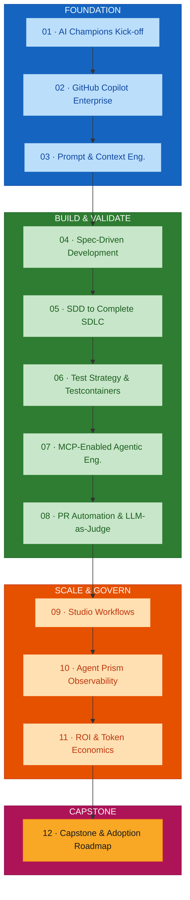
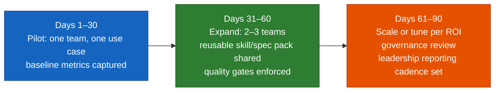

# Module 12 — Honeywell Software Engineering Capstone and Adoption Roadmap

## Overview

Module 12 integrates the **entire programme** into one realistic use case and one measurable adoption plan. Teams present a single software engineering use case carried end to end — solution blueprint, specification and plan, implementation approach, test strategy with evidence, MCP-enabled workflow, PR quality automation and LLM-as-Judge evidence, Agent Prism monitoring design, ROI model, and a **30/60/90-day adoption roadmap** — with a business case, governance controls, and an enterprise rollout plan.

**Duration:** 2 hours (capstone format)
**Delivered for:** Honeywell Engineering Teams

> **Source note.** This guide is grounded in the **course outline** (`courseOutline/NIIT_Honeywell_AI_Champions_GitHub_AgentPrism (Software_Engineering).pdf`), section "12. Honeywell Software Engineering Capstone and Adoption Roadmap", the Program Introduction, and the Delivery Recommendations. A dedicated presentation deck was not available when this guide was written; the agenda and timings below are derived from the outline and total duration.

## Quick Start

Module 12 is the assembly and defence of one complete engineering story:

| # | Topic | Time | What You'll Do |
|---|-------|------|----------------|
| 01 | Choose the Use Case &amp; Draft the Blueprint | 20 min | Pick a greenfield SDD or brownfield enhancement; sketch the solution blueprint |
| 02 | Assemble the Engineering Evidence | 35 min | Spec/plan, implementation, test strategy + evidence, MCP workflow, PR/LLM-Judge evidence |
| 03 | Design the Monitoring &amp; ROI Model | 25 min | Agent Prism monitoring design and an ROI model from before/after metrics |
| 04 | Build the 30/60/90-Day Adoption Roadmap | 20 min | Concrete adoption milestones with owners and success measures |
| 05 | Business Case &amp; Governance Controls | 10 min | The leadership-facing case and the controls that keep rollout safe |
| 06 | Present &amp; Review Against the Rubric | 10 min | Defend the capstone; peer and facilitator review |

## Visual Summary

Every prior module contributes one artifact to the capstone. Module 12 is where the incremental journey becomes a single, defensible story.

## Architecture

### Module 12 Agenda (120 minutes, derived from the course outline)

| # | Topic | Time |
|---|-------|------|
| 01 | Choose the Use Case &amp; Draft the Blueprint | 20 min |
| 02 | Assemble the Engineering Evidence | 35 min |
| 03 | Design the Monitoring &amp; ROI Model | 25 min |
| 04 | Build the 30/60/90-Day Adoption Roadmap | 20 min |
| 05 | Business Case &amp; Governance Controls | 10 min |
| 06 | Present &amp; Review Against the Rubric | 10 min |

### The Capstone as an Integration of the Whole Programme

```mermaid
graph TB
    UC[One software engineering use case]
    UC --> B[Solution blueprint]
    UC --> S["Specification &amp; plan<br/>(Modules 03–04)"]
    UC --> I["Implementation approach<br/>(Module 05, greenfield or brownfield)"]
    UC --> T["Test strategy + evidence<br/>(Module 06)"]
    UC --> MCP["MCP-enabled workflow + reusable skill<br/>(Module 07)"]
    UC --> PR["PR quality + LLM-as-Judge evidence<br/>(Module 08)"]
    UC --> MON["Agent Prism monitoring design<br/>(Module 10)"]
    UC --> ROI["ROI model + token discipline<br/>(Modules 03, 11)"]
    UC --> RM[30/60/90-day adoption roadmap]

    style UC fill:#ad1457,stroke:#880e4f,color:#fff
    style B fill:#f8bbd0,stroke:#ad1457,color:#880e4f
    style S fill:#bbdefb,stroke:#1565c0,color:#0d47a1
    style I fill:#c8e6c9,stroke:#2e7d32,color:#1b5e20
    style T fill:#c8e6c9,stroke:#2e7d32,color:#1b5e20
    style MCP fill:#c8e6c9,stroke:#2e7d32,color:#1b5e20
    style PR fill:#c8e6c9,stroke:#2e7d32,color:#1b5e20
    style MON fill:#ffe0b2,stroke:#e65100,color:#bf360c
    style ROI fill:#fff9c4,stroke:#f57f17,color:#f57f17
    style RM fill:#f9a825,stroke:#f57f17,color:#1a1a1a
```

### The Capstone Deliverable

| Component | Source module | What it demonstrates |
|-----------|---------------|----------------------|
| Solution blueprint | — | The use case, its shape, and the target outcome |
| Specification &amp; plan | 03, 04 | Requirements captured once, context engineered, a reviewed plan |
| Implementation approach | 05 | A full greenfield SDLC *or* a brownfield change with impact analysis |
| Test strategy &amp; evidence | 06 | Spec-derived tests, Testcontainers, a caught defect |
| MCP workflow + reusable skill | 07 | Governed agent access, packaged as a versioned skill |
| PR quality + LLM-as-Judge evidence | 08 | Automated quality gate, evidence-based comments, human escalation |
| Agent Prism monitoring design | 10 | Traces, thresholds, alerts, adoption tracking for the workflow |
| ROI model | 11 | Before/after metrics, cost per accepted output, a governance decision |
| 30/60/90-day adoption roadmap | 11, 12 | Concrete milestones, owners, and success measures |

### The 30/60/90-Day Adoption Roadmap

An evidence-based rollout, not an aspiration:

### Business Case &amp; Governance Controls

- **Business case** — the ROI model from Module 11, expressed for a decision-maker: value of saved effort, AI cost, cost per accepted output, and the recommended scale/tune/restrict/retire call.
- **Governance controls** — approved MCP servers and permissions (Module 07), PR quality gates and branch rulesets (Module 08), token budgets and thresholds (Modules 10–11), and named ownership for every reusable skill and published workflow.
- **Enterprise rollout roadmap** — the 30/60/90-day plan plus the longer-horizon view of which workflows scale across the organisation.

### Evaluation Rubric (dimensions)

The capstone is reviewed against, at minimum:

| Dimension | What "strong" looks like |
|-----------|--------------------------|
| Traceability | Requirement → task → implementation → test → PR evidence, unbroken |
| Test evidence | A spec-derived strategy with a demonstrably caught defect |
| Governance | Every agent connection, quality gate, and skill has scoped permissions and an owner |
| Measurement | Real before/after numbers, not estimates; a defensible cost-per-output |
| Adoption realism | A 30/60/90 plan with owners and measures, sized to the team's actual capacity |

### Module 12 Outcomes

- One software engineering use case has been carried through the entire journey
- A solution blueprint, specification, and implementation approach are documented
- Test strategy and evidence, an MCP workflow, and PR/LLM-Judge evidence are assembled
- An Agent Prism monitoring design and an ROI model are complete
- A 30/60/90-day adoption roadmap with owners and success measures is defined
- A business case and governance controls have been presented and reviewed against the rubric

### Key Terminology

| Term | Definition |
|------|------------|
| **Capstone** | The integrating exercise where one use case is carried through every capability the programme built |
| **Solution blueprint** | A concise description of the use case, its architecture shape, and the target outcome |
| **Reusable skill / spec pack** | The versioned, owned assets (Module 07) packaged for reuse across the organisation |
| **Adoption roadmap** | A time-boxed plan (30/60/90 days) for rolling a workflow out, with owners and measures |
| **Business case** | The leadership-facing argument for scaling, built on the Module 11 ROI model |
| **Governance controls** | The permissions, quality gates, budgets, and ownership that keep rollout safe |
| **Enterprise rollout** | Extending validated workflows beyond the pilot team across the organisation |
| **Evaluation rubric** | The explicit dimensions the capstone is scored against |

## References

### Programme Materials

- Course Outline (primary source): `courseOutline/NIIT_Honeywell_AI_Champions_GitHub_AgentPrism (Software_Engineering).pdf`, section 12, Program Introduction, and Delivery Recommendations
- Every prior guide feeds this module:
  - [`foundation-phase-modules-01-04.md`](./foundation-phase-modules-01-04.md)
  - [`build-validate-phase-modules-05-08.md`](./build-validate-phase-modules-05-08.md)
  - [`module-09-studio-workflows-rovo.md`](./module-09-studio-workflows-rovo.md) · [`module-10-agent-prism-observability.md`](./module-10-agent-prism-observability.md) · [`module-11-roi-token-economics.md`](./module-11-roi-token-economics.md)

### Further Reading — External References

*Every link below was fetched and confirmed (HTTP 200) on 2026-09-02.*

**The engineering method, end to end**
- [github/spec-kit](https://github.com/github/spec-kit) — the spec → plan → tasks → implement flow at the centre of the capstone.
- [Testcontainers](https://testcontainers.com/) — the integration-test backbone for the test-evidence component.
- [Model Context Protocol](https://modelcontextprotocol.io/) — the governed connection layer for the MCP-workflow component.
- [Anthropic — Building Effective Agents](https://www.anthropic.com/engineering/building-effective-agents) — the agentic-workflow patterns the capstone composes.

**Adoption, ROI, and rollout**
- [DORA — Impact of Generative AI on Software Development](https://dora.dev/ai/) — measuring AI's delivery impact for the business case.
- [DORA — Guides](https://dora.dev/guides/) — capability-improvement guides useful for structuring an adoption roadmap.
- [GitHub Copilot — Roll out at scale](https://docs.github.com/en/copilot/tutorials/roll-out-at-scale) — GitHub's own guidance on org-wide Copilot adoption, phased rollout, and measuring success.
- [METR — Measuring the impact of early-2025 AI on experienced open-source developer productivity](https://metr.org/blog/2025-07-10-early-2025-ai-experienced-os-dev-study/) — a caution against over-claiming productivity gains without measurement.

### Previous Module

Module 11 — ROI, Token Economics and Deployment Governance (1 hour). Converting productivity, cost, and quality observations into a business-value model and scale/tune/restrict/retire decisions.

### Programme Complete

Module 12 closes the AI Champions Programme. The output is a working engineering use case, a reusable skill/spec pack, monitoring and ROI models, and a 30/60/90-day adoption roadmap — ready to take to engineering leadership.
